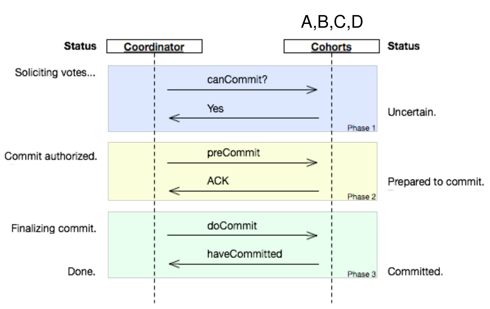
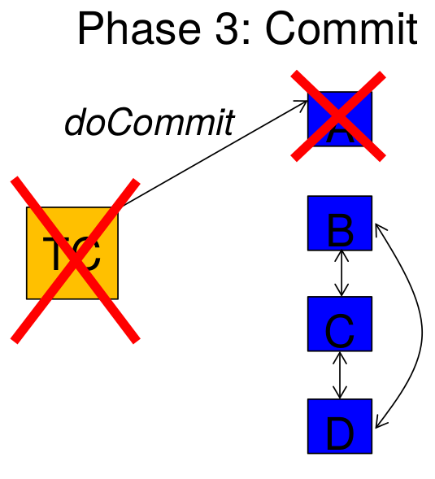
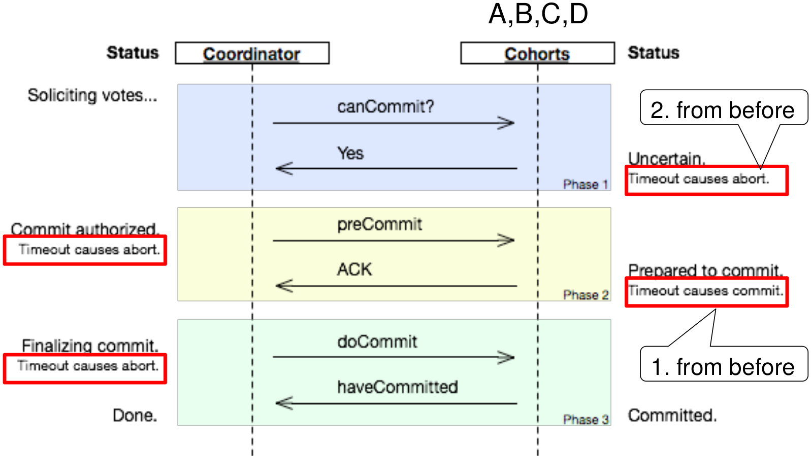

## Example Blocking Failure for 2PC
- Scenario:
   - TC sends commit decision to A, A gets it and commits, and then both TC and A crash
   - B, C, D, who voted Yes, now need to wait for TC or A to reappear

## 3PC

## Can 3PC Solve Blocking 2PC Ex.?
Assuming same scenario as before (TC, A crash), can B/C/D reach a safe decision when they time out?

1. If one of them has received preCommit, they can all commit
   -  This is safe if we assume that A is DEAD and after coming back it runs a recovery protocol in which it requires input from B/C/D to complete an uncommitted transaction
1. If none of them has received preCommit, they can all abort. This is safe, 
   - This is safe, because we know A couldn't have received a doCommit, so it couldn't have committed

## 3PC: Timeout Handling Specs

If, after a cohort member receives a preCommit message, the coordinator fails or times out, the cohort member goes forward with the commit.

## 3PC with Network Partitions
- One example scenario:
   - A receives preCommit from TC
   - Then, A gets partitioned from B/C/D and TC crashes
   - None of B/C/D have received prepareCommit, hence they all abort upon timeout
   - A is prepared to commit, hence, according to protocol, after it times out, it unilaterally decides to commit