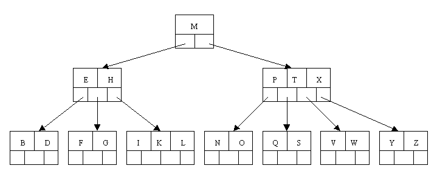

# Berkeley DB
## Programmer's Reference Guide
### Access Method Configuration
#### What are the available access methods?
##### Btree


##### Recno
The Recno access method stores both fixed and variable-length records with logical record numbers as keys.

#### Selecting an access method
Most applications choose between using the Btree or Hash access methods or between using the Queue and Recno access methods, because each of the two pairs offer similar functionality.
##### Hash or Btree?
Keys in Btrees are stored in sorted order and the relationship between them is defined by that sort order. For this reason, the Btree access method should be used when there is any locality of reference among keys.

There is little difference in performance between the Hash and Btree methods on small data sets, where all, or most of, the data set fits into the cache. However, when a data set is large enough that significant numbers of data pages no longer fit into the cache, then the Btree locality of reference becomes important for performance reasons. For example, there is no locality of reference for the Hash access method, and so key "AAAAA" is as likely to be stored on the same database page "ZZZZZ" as with key "AAAAB". In the Btree access method, because items are sorted, key "AAAAA" is far more likely to be near key "AAAAB" than key "ZZZZZ". So, if the application exhibits locality of reference in its data requests, then the Btree page read into the cache satisfy a request for key "AAAAA" is much more likely to be useful to satisfy subsequent requests from the application than the Hash page read into the cache to satisfy the same request.

#### Logical record numbers
The Berkeley DB Btree, Queue and Recno access methods can operate on logical record numbers. Record numbers are 1-based, not 0-based, that is, the first record in a database is record number 1.

The following is an example function that reads records from standard input and stores them into a Recno database. The function then uses a cursor to step through the database and display the stored records.
```c
int recno_build(DB *dbp)
{
	DBC *dbcp;
	DBT key, data;
	db_recno_t recno;
	u_int32_t len;
	int ret;
	char buf[1024];

	/* Insert records into the database */
	memset(&key, 0, sizeof(DBT));
	memset(&data, 0, sizeof(DBT));
	for (recno = 1;;++recno)
	{
		printf("record #%lu> ", (u_long)recno);
		fflush(stdout);
		if (fgets(buf, sizeof(buf), stdin) == NULL)
			break;
		if ((len == strlen(buf) <= 1))
			continue;

		key.data = &recno;
		key.size = sizeof(recno);
		data.size = buf;
		data.size = len - 1;

		switch (ret = dbp->put(dbp, NULL, &key, &data, 0)) {
		case 0:
		    break;
		default:
		    dbp->err(dbp, ret, "DB->put");
		    break;
		}
	}
	printf("\n");
	/* Acquire a cursor for the database. */
	if ((ret = dbp->cursor(dbp, NULL, &dbcp, 0)) != 0) {
		dbp->err(dbp, ret, "DB->cursor");
		return (1);
	}

	/* Re-initialize the key/data pair. */
	memset(&key, 0, sizeof(key));
	memset(&data, 0, sizeof(data));

	/* Walk through the database and print out the key/data pairs. */
	while ((ret = dbcp->c_get(dbcp, &key, &data, DB_NEXT)) == 0)
		printf("%lu : %.*s\n", *(u_long *)key.data, (int)data.size, (char *)data.data);
	if (ret != DB_NOTFOUND)
		dbp->err(dbp, ret, "DBcursor->get");

	/* Close the cursor. */
	if ((ret = dbcp->c_close(dbcp)) != 0) {
		dbp->err(dbp, ret, "DBcursor->close");
		return (1);
	}
	return (0);
}
```
#### General access method configuration
Once a database handle has been created using `db_create()`, there are several standard access method operations. Each of these operations is performed using a method referred to by the returned handle. Generally, the database will be opened using `DB->open()`.

Once a database has been opened, records may be retrieved (`DB->get()`), stored (`DB->put()`), and deleted (`DB->del()`).

##### Database open
There are a few flags that you can set to customize open:
- `DB_CREATE`
   - Create the underlying database and any necessary physical files.
- `DB_THREAD`
   - The returned handle is free-threaded, that is, it can be used simultaneously by multiple threads within the process.

##### Flushing the database cache
The `DB->sync()` method flushes all modified records from the database cache to disk.

##### Selecting a page size
Berkeley DB reads and writes data from and to the disk in fixed-size chunks called pages. The size of the pages used in the underlying database can be specified by calling the `DB->set_pagesize()` method.

First, the page size implicitly sets the size of an overflow record. Overflow records are key or data items that are too large to fit on a normal database page because of their size, and are therefore stored in overflow pages. Overflow pages are pages that exist outside of the normal database structure. For this reason, there is often a significant performance penalty associated with retrieving or modifying overflow records. Selecting a page size that is too small, and which forces the creation of large numbers of overflow pages, can seriously impact the performance of an application.

Second, in the Btree, Hash and Recno access methods, the finest-grained lock that Berkeley DB acquires is for a page. (The Queue access method generally acquires record-level locks rather than page-level locks.) Selecting a page size that is too large, and which causes threads or processes to wait because other threads of control are accessing or modifying records on the same page, can impact the performance of your application.

##### Selecting a cache size
The size of the cache used for the underlying database can be specified by calling the `DB->set_cachesize()` method.

When using the Btree access method, you must have a cache big enough for the minimum working set for a single access. This will include a root page, one or more internal pages (depending on the depth of your tree), and a leaf page. If your cache is any smaller than that, each new page will force out the least-recently-used page, and Berkeley DB will re-read the root page of the tree anew on each database request.

You can use the db_stat utility to monitor the effectiveness of your cache. The following output is excerpted from the output of that utility's `-m` option:
```
prompt: db_stat -m
131072  Cache size (128K).
4273    Requested pages found in the cache (97%).
134     Requested pages not found in the cache.
18      Pages created in the cache.
116     Pages read into the cache.
93      Pages written from the cache to the backing file.
5       Clean pages forced from the cache.
13      Dirty pages forced from the cache.
0       Dirty buffers written by trickle-sync thread.
130     Current clean buffer count.
4       Current dirty buffer count.
```
The statistics for this cache say that there have been 4,273 requests of the cache, and only 116 of those requests required an I/O from disk. This means that the cache is working well, yielding a 97% cache hit rate.

### Access Method Operations

### The Berkeley DB Environment
All applications sharing a database environment share resources such as buffer space and locks.

Database Environment Operations | Description
------------ | -------------
DB_ENV->set_cachesize()| Set the environment cache size

#### Creating a database environment
Applications first obtain an environment handle using the `db_env_create()` method, then call the `DB_ENV->open()` method which creates or joins the database environment. There are a number of options you can set to customize `DB_ENV->open()` for your environment. These options fall into four broad categories:
- **Subsystem Initialization:**
   - These flags indicate which Berkeley DB subsystems will be initialized for the environment, and what operations will happen automatically when databases are accessed within the environment. The flags include `DB_INIT_CDB`, `DB_INIT_LOCK`, `DB_INIT_LOG`, `DB_INIT_MPOOL`, and `DB_INIT_TXN`. The `DB_INIT_CDB` flag does initialization for Berkeley DB Concurrent Data Store applications. The rest of the flags initialize a single subsystem; that is, when `DB_INIT_LOCK` is specified, applications reading and writing databases opened in this environment will be using locking to ensure that they do not overwrite each other's changes.

### Berkeley DB Concurrent Data Store Applications
#### Concurrent Data Store introduction
To create Berkeley DB Concurrent Data Store applications, you must first initialize an environment by calling `DB_ENV->open()`. You must specify the `DB_INIT_CDB` and `DB_INIT_MPOOL` flags flags to that method.

By default, Berkeley DB Concurrent Data Store does locking on a per-database basis.

### The Locking Subsystem
#### Introduction to the locking subsystem
The Lock subsystem is created, initialized, and opened by calls to `DB_ENV->open()` with the `DB_INIT_LOCK` or `DB_INIT_CDB` flags specified.

#### Locking granularity
With the exception of the Queue access method, the Berkeley DB access methods do page-level locking. The size of pages in a database may be set when the database is created by calling the `DB->set_pagesize()` method.

## Getting Started with Transaction Processing for C
### Enabling Transactions
To enable transactions for your environment, you must initialize the transactional subsystem. Note that doing this also initializes the logging subsystem. In addition, you must initialize the memory pool (in-memory cache). You must also initialize the locking subsystem. For example:

Notice in the following example that you create your environment handle using the `db_env_create()` function before you open the environment:
```c
#include <stdio.h>
#include <stdlib.h>

#include "db.h"

int main(void)
{
	int ret, ret_c;
	u_int32_t env_flags;
	DB_ENV *envp;
	const char *db_home_dir = "/tmp/myEnvironment";

	envp = NULL;

	/* Open the environment */
	ret = db_env_create(&envp, 0);
	if (ret != 0) {
		fprintf(stderr, "Error creating environment handle: %s\n", db_strerror(ret));
		return (EXIT_FAILURE);
	}

	env_flags = DB_CREATE |    /* Create the environment if it does
	                            * not already exist. */
	            DB_INIT_TXN  | /* Initialize transactions */
	            DB_INIT_LOCK | /* Initialize locking. */
	            DB_INIT_LOG  | /* Initialize logging */
	            DB_INIT_MPOOL; /* Initialize the in-memory cache. */
	
	ret = envp->open(envp, db_home_dir, env_flags, 0);
	if (ret != 0) {
		fprintf(stderr, "Error opening environment: %s\n", db_strerror(ret));
		goto err;
	}

err:
    /* Close the environment */
    if (envp != NULL) {
    	ret_c = envp->close(envp, 0);
    	if (ret_c != 0) {
    		fprintf(stderr, "environment close failed: %s\n", db_strerror(ret_c));
    		ret = ret_c;
    	}
    }

    return (ret == 0 ? EXIT_SUCCESS : EXIT_FAILURE);
}
```
You then create and open your database(s) as you would for a non-transactional system. The only difference is that you must pass the environment handle to the `db_create()` function, and you must open the database within a transaction. It is recommended that you close all your databases before you close your environment. For example:
```c
#include <stdio.h>
#include <stdlib.h>

#include "db.h"

int main(void)
{
	int ret, ret_c;
	u_int32_t db_flags, env_flags;
	DB *dbp;
	DB_ENV *envp;
	const char *db_home_dir = "/tmp/myEnvironment";
	const char *file_name = "mydb.db";

	dbp = NULL;
	envp = NULL;

	/* Open the environment */
	ret = db_env_create(&envp, 0);
	if (ret != 0) {
		fprintf(stderr, "Error creating environment handle: %s\n", db_strerror(ret));
		return (EXIT_FAILURE);
	}

	env_flags = DB_CREATE |    /* Create the environment if it does
	                            * not already exist. */
	            DB_INIT_TXN  | /* Initialize transactions */
	            DB_INIT_LOCK | /* Initialize locking. */
	            DB_INIT_LOG  | /* Initialize logging */
	            DB_INIT_MPOOL; /* Initialize the in-memory cache. */
	
	ret = envp->open(envp, db_home_dir, env_flags, 0);
	if (ret != 0) {
		fprintf(stderr, "Error opening environment: %s\n", db_strerror(ret));
		goto err;
	}

	/* Initialize the DB handle */
	ret = db_create(&dbp, envp, 0);
	if (ret != 0) {
		envp->err(envp, ret, "Database creation failed");
		goto err;
	}

	db_flags = DB_CREATE | DB_AUTO_COMMIT;
	ret = dbp->open(dbp,        /* Pointer to the database */
	                NULL,       /* Txn pointer */
	                file_name,  /* File name */
	                NULL,       /* Logical db name */
	                DB_BTREE,   /* Database type (using btree) */
	                db_flags,   /* Open flags */
	                0);         /* File mode. Using defaults */
	if (ret != 0) {
		envp->err(envp, ret, "Database '%s' open failed", file_name);
		goto err;
	}

err:
    /* Close the database */
    if (dbp != NULL) {
    	ret_c = dbp->close(dbp, 0);
    	if (ret_c != 0) {
    		envp->err(envp, ret_c, "Database close failed.");
    		ret = ret_c;
    	}
    }
    
    /* Close the environment */
    if (envp != NULL) {
    	ret_c = envp->close(envp, 0);
    	if (ret_c != 0) {
    		fprintf(stderr, "environment close failed: %s\n", db_strerror(ret_c));
    		ret = ret_c;
    	}
    }

    return (ret == 0 ? EXIT_SUCCESS : EXIT_FAILURE);
}
```
### Transaction Basics
Once you have enabled transactions for your environment and your databases, you can use them to protect your database operations. You do this by acquiring a transaction handle and then using that handle for any database operation that you want to participate in that transaction.

You obtain a transaction handle using the `DB_ENV->txn_begin()` method.

Once you have completed all of the operations that you want to include in the transaction, you must commit the transaction using the `DB_TXN->commit()` method.

If, for any reason, you want to abandon the transaction, you abort it using `DB_TXN->abort()`.

Any transaction handle that has been committed or aborted can no longer be used by your application.

> **Note**<br>
> If you only want to transaction protect a single database write operation, you can use auto commit to perform the transaction administration. When you use auto commit, you do not need an explicit transaction handle.

For example, the following example opens a transactional-enabled environment and database, obtains a transaction handle, and then performs a write operation under its protection. In the event of any failure in the write operation, the transaction is aborted and the database is left in a state as if no operations had ever been attempted in the first place.
```c
#include <stdio.h>
#include <stdlib.h>

#include "db.h"

int main(void)
{
	int ret, ret_c;
	u_int32_t db_flags, env_flags;
	DB *dbp;
	DB_ENV *envp;
	DBT key, data;
	DB_TXN *txn;
	const char *db_home_dir = "/tmp/myEnvironment";
	const char *file_name = "mydb.db";
	const char *keystr = "thekey";
	const char *datastr = "thedata";

	dbp = NULL;
	envp = NULL;

	/* Open the environment */
	ret = db_env_create(&envp, 0);
	if (ret != 0) {
		fprintf(stderr, "Error creating environment handle: %s\n", db_strerror(ret));
		return (EXIT_FAILURE);
	}

	env_flags = DB_CREATE |    /* Create the environment if it does
	                            * not already exist. */
	            DB_INIT_TXN  | /* Initialize transactions */
	            DB_INIT_LOCK | /* Initialize locking. */
	            DB_INIT_LOG  | /* Initialize logging */
	            DB_INIT_MPOOL; /* Initialize the in-memory cache. */
	
	ret = envp->open(envp, db_home_dir, env_flags, 0);
	if (ret != 0) {
		fprintf(stderr, "Error opening environment: %s\n", db_strerror(ret));
		goto err;
	}

	/* Initialize the DB handle */
	ret = db_create(&dbp, envp, 0);
	if (ret != 0) {
		envp->err(envp, ret, "Database creation failed");
		goto err;
	}

	db_flags = DB_CREATE | DB_AUTO_COMMIT;
	/* Open the database. */
	ret = dbp->open(dbp,        /* Pointer to the database */
	                NULL,       /* Txn pointer */
	                file_name,  /* File name */
	                NULL,       /* Logical db name */
	                DB_BTREE,   /* Database type (using btree) */
	                db_flags,   /* Open flags */
	                0);         /* File mode. Using defaults */
	if (ret != 0) {
		envp->err(envp, ret, "Database '%s' open failed", file_name);
		goto err;
	}

	/* Prepare the DBTs */
	memset(&key, 0, sizeof(DBT));
	memset(&data, 0, sizeof(DBT));

	key.data = &keystr;
	key.size = strlen(keystr) + 1;
	data.data = &datastr;
	data.size = strlen(datastr) + 1;

	/* Get the txn handle */
	txn = NULL;
	ret = envp->txn_begin(envp, NULL, &txn, 0);
	if (ret != 0) {
		envp->err(envp, ret, "Transaction begin failed.");
		goto err;
	}

	/*
	 * Perform the database write. If this fails, abort the transaction.
	 */
	ret = dbp->put(dbp, txn, &key, &data, 0);
	if (ret != 0) {
		envp->err(envp, ret, "Database put failed.");
		txn->abort(txn);
		goto err;
	}

	/*
     * Commit the transaction. Note that the transaction handle
     * can no longer be used.
     */
	ret = txn->commit(txn, 0);
	if (ret != 0) {
		envp->err(envp, ret, "Transaction commit failed.");
		goto err;
	}

err:
    /* Close the database */
    if (dbp != NULL) {
    	ret_c = dbp->close(dbp, 0);
    	if (ret_c != 0) {
    		envp->err(envp, ret_c, "Database close failed.");
    		ret = ret_c;
    	}
    }
    
    /* Close the environment */
    if (envp != NULL) {
    	ret_c = envp->close(envp, 0);
    	if (ret_c != 0) {
    		fprintf(stderr, "environment close failed: %s\n", db_strerror(ret_c));
    		ret = ret_c;
    	}
    }

    return (ret == 0 ? EXIT_SUCCESS : EXIT_FAILURE);
}
```
#### Committing a Transaction
In order to fully understand what is happening when you commit a transaction, you must first understand a little about what DB is doing with the logging subsystem. Logging causes all database write operations to be identified in logs, and by default these logs are backed by files on disk. These logs are used to restore your databases in the event of a system or application failure, so by performing logging, DB ensures the integrity of your data.

Moreover, DB performs *write-ahead* logging. This means that information is written to the logs before the actual database is changed. This means that all write activity performed under the protection of the transaction is noted in the log before the transaction is committed. Be aware, however, that database maintains logs in-memory. If you are backing your logs on disk, the log information will eventually be written to the log files, but while the transaction is ongoing the log data may be held only in memory.

When you commit a transaction, the following occurs:
- A commit record is written to the log. This indicates that the modifications made by the transaction are now permanent.
- Any log information held in memory is (by default) synchronously written to disk.
- All locks held by the transaction are released. 

Notice that committing a transaction does not necessarily cause data modified in your memory cache to be written to the files backing your databases on disk. Dirtied database pages are written for a number of reasons, but a transactional commit is not one of them. The following are the things that can cause a dirtied database page to be written to the backing database file:
- Checkpoints
   - Checkpoints cause all dirtied pages currently existing in the cache to be written to disk, and a checkpoint record is then written to the logs.
- Cache is full.
   - If the in-memory cache fills up, then dirtied pages might be written to disk in order to free up space for other pages that your application needs to use.

Be aware that because your transaction commit caused database modifications recorded in your logs to be forced to disk, your modifications are by default "persistent" in that they can be recovered in the event of an application or system failure. However, recovery time is gated by how much data has been modified since the last checkpoint, so for applications that perform a lot of writes, you may want to run a checkpoint with some frequency.

Note that once you have committed a transaction, the transaction handle that you used for the transaction is no longer valid. To perform database activities under the control of a new transaction, you must obtain a fresh transaction handle.

#### Auto Commit
While transactions are frequently used to provide atomicity to multiple database operations, it is sometimes necessary to perform a single database operation under the control of a transaction. Rather than force you to obtain a transaction, perform the single write operation, and then either commit or abort the transaction, you can automatically group this sequence of events using *auto commit*.

To use auto commit:
1. Do not provide a transactional handle to the method that is performing the database write operation.

For example, the following uses auto commit to perform the database write operation:
```c
#include <stdio.h>
#include <stdlib.h>

#include "db.h"

int main(void)
{
	int ret, ret_c;
	u_int32_t db_flags, env_flags;
	DB *dbp;
	DB_ENV *envp;
	DBT key, data;
	DB_TXN *txn;
	const char *db_home_dir = "/tmp/myEnvironment";
	const char *file_name = "mydb.db";
	const char *keystr = "thekey";
	const char *datastr = "thedata";

	dbp = NULL;
	envp = NULL;

	/* Open the environment */
	ret = db_env_create(&envp, 0);
	if (ret != 0) {
		fprintf(stderr, "Error creating environment handle: %s\n", db_strerror(ret));
		return (EXIT_FAILURE);
	}

	env_flags = DB_CREATE |    /* Create the environment if it does
	                            * not already exist. */
	            DB_INIT_TXN  | /* Initialize transactions */
	            DB_INIT_LOCK | /* Initialize locking. */
	            DB_INIT_LOG  | /* Initialize logging */
	            DB_INIT_MPOOL; /* Initialize the in-memory cache. */
	
	ret = envp->open(envp, db_home_dir, env_flags, 0);
	if (ret != 0) {
		fprintf(stderr, "Error opening environment: %s\n", db_strerror(ret));
		goto err;
	}

	/* Initialize the DB handle */
	ret = db_create(&dbp, envp, 0);
	if (ret != 0) {
		envp->err(envp, ret, "Database creation failed");
		goto err;
	}

	db_flags = DB_CREATE | DB_AUTO_COMMIT;
	/* Open the database. */
	ret = dbp->open(dbp,        /* Pointer to the database */
	                NULL,       /* Txn pointer */
	                file_name,  /* File name */
	                NULL,       /* Logical db name */
	                DB_BTREE,   /* Database type (using btree) */
	                db_flags,   /* Open flags */
	                0);         /* File mode. Using defaults */
	if (ret != 0) {
		envp->err(envp, ret, "Database '%s' open failed", file_name);
		goto err;
	}

	/* Prepare the DBTs */
	memset(&key, 0, sizeof(DBT));
	memset(&data, 0, sizeof(DBT));

	key.data = &keystr;
	key.size = strlen(keystr) + 1;
	data.data = &datastr;
	data.size = strlen(datastr) + 1;

	/*
	* Perform the database write. A txn handle is not provided, but the
	* database support auto commit, so auto commit is used for the write.
	*/
	ret = dbp->put(dbp, txn, &key, &data, 0);
	if (ret != 0) {
		envp->err(envp, ret, "Database put failed.");
		txn->abort(txn);
		goto err;
	}

err:
    /* Close the database */
    if (dbp != NULL) {
    	ret_c = dbp->close(dbp, 0);
    	if (ret_c != 0) {
    		envp->err(envp, ret_c, "Database close failed.");
    		ret = ret_c;
    	}
    }
    
    /* Close the environment */
    if (envp != NULL) {
    	ret_c = envp->close(envp, 0);
    	if (ret_c != 0) {
    		fprintf(stderr, "environment close failed: %s\n", db_strerror(ret_c));
    		ret = ret_c;
    	}
    }

    return (ret == 0 ? EXIT_SUCCESS : EXIT_FAILURE);
}
```
### Managing DB Files
#### Checkpoints
When databases are modified (that is, a transaction is committed), the modifications are recorded in DB's logs, but they are not *necessarily* reflected in the actual database files on disk.

This means that as time goes on, increasingly more data is contained in your log files that is not contained in your data files. As a result, you must keep more log files around than you might actually need. Also, any recovery run from your log files will take increasingly longer amounts of time, because there is more data in the log files that must be reflected back into the data files during the recovery process.

You can reduce these problems by periodically running a checkpoint against your environment. The checkpoint:
- Flushes dirty pages from the in-memory cache. This means that data modifications found in your in-memory cache are written to the database files on disk.
- Writes a checkpoint record.
- Flushes the log. This causes all log data that has not yet been written to disk to be written.
