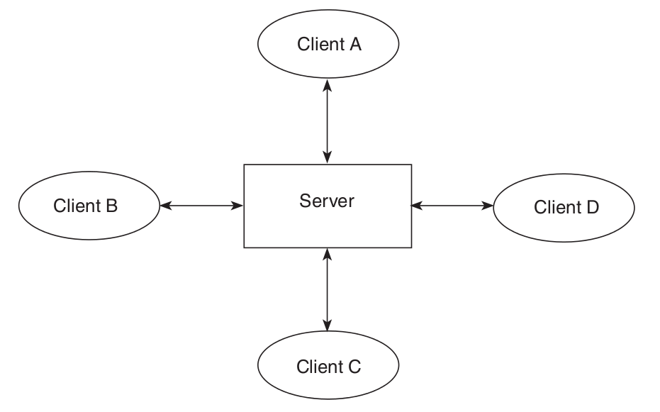
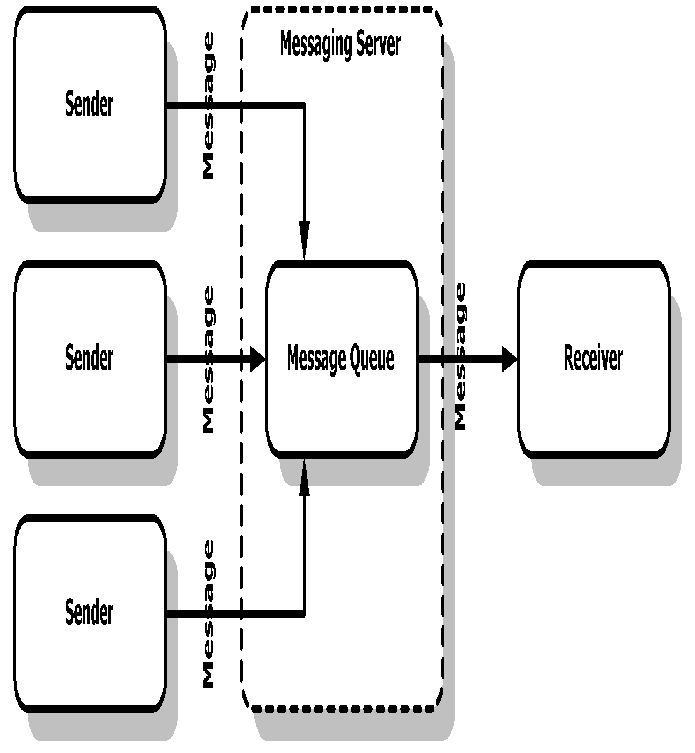
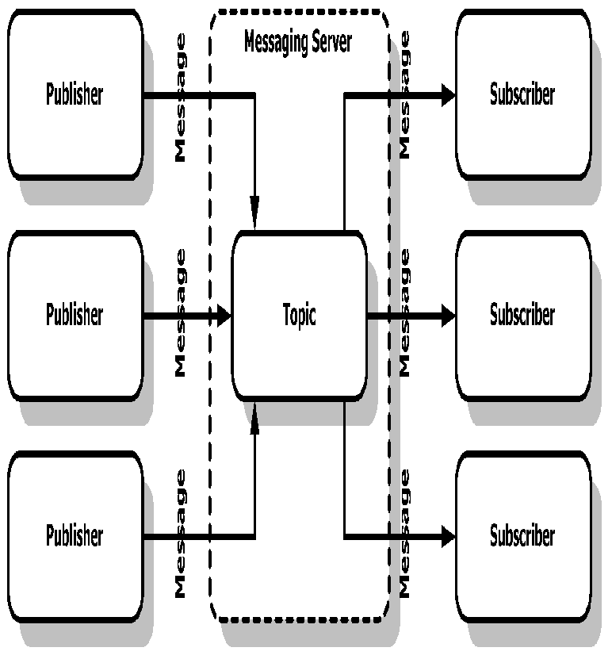

## Tutor 5: JMS
### What Is a Messaging System or Service?
A messaging system has three major features:
- A messaging system is loosely coupled. This is the most important feature of a messaging system and might be an advantage compared to other systems such as RMI. An application or program, called a *sender* or *publisher*, sends a message to a destination, not directly to another client. Another application or program, called a *receiver* or *subscriber*, receives the message from a destination. Senders and receivers do not have to be aware of each other.
- A messaging system isolates clients from each other. Neither sender nor receiver needs to know about each other. They only need to know the message format and destination.

In the messaging service (or system), there is a server, and clients connect to this server to communicate with each other.



The server provides some essential services such as message persistence, load balancing, and security.

### Basic JMS API Concepts
#### Messaging Domains
##### Point-to-Point Messaging Domain
A point-to-point (PTP) product or application is built around the concept message queues, senders, and receivers. Each message is addressed to a specific queue, and receiving clients extract messages from the queue(s) established to hold their messages. Queues retain all messages sent to them until the messages are consumed or expire.

PTP messaging has the following characteristics:



- Each message has only one consumer.
- A sender and a receiver of a message have no timing dependencies. The receiver can fetch the message whether or not it was running when the client sent the message.

Use PTP messaging when every message you need must be processed successfully by one consumer.

##### Publish/Subscribe Messaging Domain
In a publish/subscribe (pub/sub) product or application, clients need address messages to a topic. The system takes care of distributing the messages arriving from a topic's multiple publishers to its multiple subscribers. Topics retain messages only long enough to distribute them to their current subscribers.



Use pub/sub messaging when each message can be processed by zero, one, or many consumers.

### The JMS API programming Model
The basic building blocks of a JMS application consist of 
- Administered objects: connection factory and destinations
- Connections
- Sessions
- Message producers
- Message consumers
- Messages

### Administered Objects
##### Connection Factories
A ConnectionFactory creates customized Connections, with some predefined initial parameters, like host, port or even login. It is usually stored in an enterprise directory like LDAP, and retrieved using JNDI.
```
Context jndiContext = new InitialContext();
ConnectionFactory connectionFactory = (ConnectionFactory)jndiContext.lookup("jms/TestConnectionFactory");
```

##### Destinations
A *destination* is the object a client uses to specify the target of messages it produces and the source of messages it consumes. A Destination can also be stored in JDNI.
```
Queue queue = (Queue)jndiContext.lookup("jms/TestQueue");
Topic topic = (Topic)jndiContext.lookup("jms/TestTopic");
```

### Connections
A connection encapsulates a virtual connection with a JMS provider. A connection could represent an open TCP/IP socket between a client and a provider service daemon. You use a connection to create one or more sessions.
```
Connection connection = connectionFactory.createConnection();
connection.start();
```

### Sessions
A *session* is a single-threaded context for producing and consuming messages. You use sessions to create message producers, message consumers, and messages.

The Session provides several capabilities: temporaryQueues, transactions, serial order of messages, synchronous/asynchronous reception. For example, the second argument below means that the session automatically acknowledges messages when they have been received successfully.
```
Session session = connection.createSession(false, Session.AUTO_ACKNOWLEDGE);
```

### Message Producers
A *message producer* is an object created by a session and is used for sending messages to a destination
```
MessageProducer queueSender = session.createProducer(queue);
```
Once you have created a message producer, you can use it to send messages. (You have to create the messages first)
```
queueSender.send(message);
```

### Message Consumers
A *message consumer* is an object created by a session and is used for receiving messages sent to a destination. A message consumer allows a JMS client to register interest in a destination with a JMS provider. The JMS provider manages the deliv- ery of messages from a destination to the registered consumers of the destination.
```
MessageConsumer queueReader = session.createConsumer(queue);
```
Once you have created a message consumer, it becomes active, and you can use it to receive messages. With a traditional `receive` command a Consumer is blocked on reception from the JMS Server.

```
Message jmsMessage = queueReader.receive();
```
A *message listener* is an object that acts as an asynchronous event handler for messages. This object implements the `MessageListener` interface, which contains one method, `onMessage`. In the `onMessage` method, you define the actions to be taken when a message arrives.

```
public class ChatClient implements MessageListener {
    
    private MessageConsumer topicReceiver;
    
    private String name;
    
    private void init() throws JMSException {
        //...
        topicReceiver = session.createConsumer(name);
        topicReceiver.setMessageListener(this);
    }
}
```

### Messages
A JMS message has three parts:
- A header
- Properties (optional)
- A body (optional)

#### Message Headers
A JMS message header contains a number of predefined fields that contain values that both clients and providers use to identify and to route messages. For example, every message has a unique identifier, represented in the header field `JMSMessageID`. The value of another header field, `JMSDestination`, represents the queue or topic to which the message is sent.

#### Message Properties
You can create and set properties for messages if you need values in addition to those provided by the header fields.
```
jmsMessage.setStringProperty("privateMessageTo", chatMessage.to);
jmsMessage.setStringProperty("privateMessageFrom", chatMessage.from);
}
```

#### Message Selectors
If your messaging application needs to filter the messages it receives, you can use a JMS API message selector, which allows a message consumer to specify the messages it is interested in. Message selectors assign the work of filtering messages to the JMS provider rather than to the application.

A message selector is a `String` that contains an expression. The `createConsumer` method has a form that allows you to specify a message selector as an argument when you create a consumer.
```
// Selector is like the where clause of a SQL query
String selector = "(privateMessageFrom IS NULL AND privateMessageTo IS NULL) OR "+
                   "privateMessageTo = '"+name+"' OR privateMessageFrom = '"+name+"'";
        
session.createConsumer(topic, selector);
```

The message consumer then receives only messages whose headers and properties match the selector. A message selector cannot select messages on the basis of the content of the message body.

## Tutor 7: How to integrate you own Java project

### Tutorial: Hello World with Apache Ant
#### Preparing the project
We have to create only the `src` directory. (Because I am working on Windows, here is the win-syntax - translate to your shell):
```
md src
```
The following simple Java class just prints a fixed message out to STDOUT, so just write this code into `src\oata\HelloWorld.java`.
```
package oata;

public class HelloWorld {
    public static void main(String[] args) {
        System.out.println("Hello World");
    }
}
```
Now just try to compile and run that:
```
md build\classes
javac -sourcepath src -d build\classes src\oata\HelloWorld.java
java -cp build\classes oata.HelloWorld
```
which will result in 
```
Hello World
```
Creating a jar-file is not very difficult. But creating a *startable* jar-file needs more steps: create a manifest-file containing the start class, creating the target directory and archiving the files.
```
echo Main-Class: oata.HelloWorld>myManifest
md build\jar
jar cfm build\jar\HelloWorld.jar myManifest -C build\classes .
java -jar build\jar\HelloWorld.jar
```

#### Four steps to a running application
After finishing the java-only step we *have* to think about our build process. We have to compile our code, otherwise we couldn't start the program. Oh - "start" - yes, we could provide a target for that. We should package our application. Now it's only one class - but if you want to provide a download, no one would download several hundreds files ... (think about a complex Swing GUI - so let us create a jar file. A startable jar file would be nice ... And it's a good practise to have a "clean" target, which deletes all the generated stuff. Many failures could be solved just by a "clean build".

By default Ant uses `build.xml` as the name for a buildfile, so our `.\build.xml` would be:
```
<project>

    <target name="clean">
        <delete dir="build"/>
    </target>

    <target name="compile">
        <mkdir dir="build/classes"/>
        <javac srcdir="src" destdir="build/classes"/>
    </target>

    <target name="jar">
        <mkdir dir="build/jar"/>
        <jar destfile="build/jar/HelloWorld.jar" basedir="build/classes">
            <manifest>
                <attribute name="Main-Class" value="oata.HelloWorld"/>
            </manifest>
        </jar>
    </target>

    <target name="run">
        <java jar="build/jar/HelloWorld.jar" fork="true"/>
    </target>

</project>
```
Now you can compile, package and run the application via
```
ant compile
ant jar
ant run
```

#### Enhance the build file
Now we have a working buildfile we could do some enhancements: many time you are referencing the same directories, main-class and jar-name are hard coded, and while invocation you have to remember the right order of build steps.

The first and second point would be addressed with *properties*, the third with a special property - an attribute of the \<project\>-tag and the fourth problem can be solved using dependencies.
```
<project name="HelloWorld" basedir="." default="main">

    <property name="src.dir"     value="src"/>

    <property name="build.dir"   value="build"/>
    <property name="classes.dir" value="${build.dir}/classes"/>
    <property name="jar.dir"     value="${build.dir}/jar"/>

    <property name="main-class"  value="oata.HelloWorld"/>


    <target name="clean">
        <delete dir="${build.dir}"/>
    </target>

    <target name="compile">
        <mkdir dir="${classes.dir}"/>
        <javac srcdir="${src.dir}" destdir="${classes.dir}"/>
    </target>

    <target name="jar" depends="compile">
        <mkdir dir="${jar.dir}"/>
        <jar destfile="${jar.dir}/${ant.project.name}.jar" basedir="${classes.dir}">
            <manifest>
                <attribute name="Main-Class" value="${main-class}"/>
            </manifest>
        </jar>
    </target>

    <target name="run" depends="jar">
        <java jar="${jar.dir}/${ant.project.name}.jar" fork="true"/>
    </target>

    <target name="clean-build" depends="clean,jar"/>

    <target name="main" depends="clean,run"/>

</project>
```
Now it's easier, just do a `ant` and you will get
```
Buildfile: build.xml

clean:

compile:
    [mkdir] Created dir: C:\...\build\classes
    [javac] Compiling 1 source file to C:\...\build\classes

jar:
    [mkdir] Created dir: C:\...\build\jar
      [jar] Building jar: C:\...\build\jar\HelloWorld.jar

run:
     [java] Hello World

main:

BUILD SUCCESSFUL
```
### Class Loader
class files are not loaded into memory all at once, but rather are loaded on demand, as needed by the program. The class loader is the part of the JVM that loads classes into memory.

By default, Java application typically has the following class loaders:
- Bootstrap class loader
  - Loads internal classes (e.g. the application class loader)
  - Loads basic classes in package java.*
  - Path can be set by JVM options
    - sets the path, `-Xbootclasspath:<directories and/or jars>`
    - appends to the path, `-Xbootclasspath/a:<directories and/or jars>`
    - prepends to the path, `-Xbootclasspath/p:<directories and/or jars>`
- Extension class loader
  - loads extension classes
  - Path can be set by JVM option `-Djava.ext.dirs=<directory/directories>`
- System (Application) Class Loader
  - Loads the application's classes
  - Path can be set by JVM option
    - `-cp <directories and or jars>`
    - `-classpath <directories and or jars>`
    - `-Djava.class.path=<directories and or jars>`
    - the `CLASSPATH` environment variable

In addition, an application may install one or more user-defined (custom) class loaders, e.g. `MyClassLoader`.

By convention, when a class loader is asked to load a class, it first asks the class that loaded it to load that class. I.e. the following delegation model exists:
```
-------------      -----------------       -----------------       ----------------
| bootstrap |<----| :ExtClassLoader |<----| :AppClassLoader |<----| :MyClassLoader |
-------------      -----------------       -----------------       ----------------
```

## Tutor 4: JNDI
### Naming and Directory Concepts
**Naming Concepts**

A fundamental facility in any computing system is the *naming service* - the means by which names are associated with objects and objects are found based on their names. A naming service allows you to look up an object given its name.

**Names**

To look up an object in a naming system, you supply it the *name* of the object. A name is made up components. A name’s representation consist of a component separator making the components of the name.

Naming System | Component Separator | Names
------------ | ------------- | -------------
LDAP | "," and "=" | cn=Rosanna Lee, o=Sun, c=US

The Lightweight Directory Access Protocol (LDAP) naming convention orders components from *right to left*, delimited by the comma character (","). Thus the LDAP name `cn=Rosanna Lee, o=Sun, c=US` names an LDAP entry `cn=Rosanna Lee`, relative to the entry `o=Sun`, which in turn, is relative to `c=us`.

**Bindings**

The association of a name with an object is called a *binding*.

**References and Addresses**

Depending on the naming service, some objects cannot be stored directly by the naming service; that is, a copy of the object cannot be placed inside the naming service. Instead, they must be stored by reference; that is, a *pointer* or *reference* to the object is placed inside the naming service. A reference represents information about how to access an object.

For example, an airplane object might contain a list of the airplane’s passengers and crew, its flight plan, and fuel and instrument status, and its flight number and departure time. By contrast, an airplane object reference might contain only its flight number and departure time.

### JNDI Overview
#### Naming Package

**The Initial Context**

In the JNDI, all naming and directory operations are performed relative to a context. There are no absolute roots. Therefore the JNDI defines an `InitialContext`, which is the starting point for any JNDI lookup. Once you have an initial context, you can use it to look up other contexts and objects.

### Naming and Directory Operations

**Step2: Supply the Information Needed by the Initial Context**

The examples assume that a server has been set up on the local machine at port 389 with the root-distinguished name of `"o=JNDITutorial"`. They include the following code for setting up the environment.
```
env.put(Context.PROVIDER_URL, "ldap://localhost:389/o=JNDITutorial");
```

**Step3: Creating the Initial Context**

You are now ready to create the initial context. To do that, you pass to the `InitialContext constructor` the environment properties that you created previously:
```
Context ctx = new InitialContext(env);
```
Now that you have a reference to a `Context` object, you can begin to access the naming service.

#### Adding, Replacing, and Removing a Binding 
**Adding or Replacing a Binding**

`rebind()` is used to add or replace a binding. It accepts the same arguments as `bind()`, but the semantics are such that if the name is already bound, then it will be unbound and the newly given object will be bound.
```
// Create the object to be bound
Fruit fruit = new Fruit("lemon");

// Perform the bind
ctx.rebind("favorite", fruit);
```

When you run this example, it will replace the binding created by the `bind()` example.


```
import javax.naming.*;
import java.io.File;
import java.util.Hashtable;

/**
  * Demonstrates how to overwrite an existing binding.
  * (Use after Bind example; Use Unbind to remove binding).
  *
  * usage: java Rebind
  */
class Rebind {
    public static void main(String[] args) {

	// Set up the environment for creating the initial context
	Hashtable env = new Hashtable(11);
	env.put(Context.INITIAL_CONTEXT_FACTORY, 
	    "com.sun.jndi.fscontext.RefFSContextFactory");
	env.put(Context.PROVIDER_URL, "file:/tmp/tutorial");

	try {
	    // Create the initial context
	    Context ctx = new InitialContext(env);

	    // Create the object to be bound
	    Fruit fruit = new Fruit("lemon");

	    // Perform the bind
	    ctx.rebind("favorite", fruit);

	    // Check that it is bound
	    Object obj = ctx.lookup("favorite");
	    System.out.println(obj);

	    // Close the context when we're done
	    ctx.close();
	} catch (NamingException e) {
	    System.out.println("Operation failed: " + e);
	}
    }
}
```

## Assignment 2: JDBC
```
./mysql-install/libexec/mysqld --defaults-file=./my.cnf &
mysql-install/bin/mysql -u root -S /tmp/mysql.sock -e 'GRANT ALL PRIVILEGES ON *.* TO "root"@"%"';
mysql-install/bin/mysql -u root -S /tmp/mysql.sock -e 'FLUSH PRIVILEGES;'
mysql-install/bin/mysql -u root -S /tmp/mysql.sock -e 'CREATE DATABASE c0402;'
mysql-install/bin/mysql -u root -S /tmp/mysql.sock
mysql> GRANT ALL ON c0402.* TO 'c0402'@'localhost' IDENTIFIED BY 'c0402PASS';
```
This account has a user name of c0402 and a password of c0402PASS. It can be used only when connecting from the local host.
```
mysql> USE c0402;
mysql> CREATE TABLE c0402_2017_t4 (name varchar(32) NOT NULL, birthday date NOT NULL, PRIMARY KEY name (name));
```
You can check it by the command `DESCRIBE c0402_2017_t4;`
```
/* javac JDBCDemo.java; java -classpath mysql-connector-java-5.1.34-bin.jar:. JDBCDemo */
import java.sql.Connection;
import java.sql.DriverManager;
import java.sql.SQLException;
import java.util.Scanner;

import java.sql.Statement;
import java.sql.PreparedStatement;
import java.sql.ResultSet;

public class JDBCDemo {
    private static final String DB_HOST = "localhost";
    private static final String DB_USER = "c0402";
    private static final String DB_PASS = "c0402PASS";
    private static final String DB_NAME = "c0402";
    
    public static void main(String[] args) {
        try {
            new JDBCDemo().go();
        } catch (InstantiationException | IllegalAccessException
                | ClassNotFoundException | SQLException e) {
            System.err.println("Connection failed: "+e);
        }
    }
    private Connection conn;
    public JDBCDemo() throws SQLException, InstantiationException, IllegalAccessException, ClassNotFoundException {
        Class.forName("com.mysql.jdbc.Driver").newInstance();
        conn = DriverManager.getConnection("jdbc:mysql://"+DB_HOST+"/"+DB_NAME+"?user="+DB_USER+"&password="+DB_PASS);
        System.out.println("Database connection successful.");
    }
    public void go() {
        
        Scanner keyboard = new Scanner(System.in);
        String line;
        System.out.print("> ");
        while(!(line = keyboard.next()).equals("exit")) {
            if(line.equals("create")) {
                insert(keyboard.next(), keyboard.next());
            } else if(line.equals("read")) {
                read(keyboard.next());
            } else if(line.equals("list")) {
                list();
            } else if(line.equals("update")) {
                update(keyboard.next(), keyboard.next());
            } else if(line.equals("delete")) {
                delete(keyboard.next());
            }
            System.out.print("> ");
        }
        keyboard.close();
        
    }
    private void insert(String name, String birthday) {
        try {
            PreparedStatement stmt = 
                    conn.prepareStatement("INSERT INTO c0402_2017_t4 (name, birthday) VALUES (?, ?)");

            stmt.setString(1, name);
            stmt.setDate(2, java.sql.Date.valueOf(birthday));
            stmt.execute();

            System.out.println("Record created");

        } catch (SQLException | IllegalArgumentException e) {
            System.err.println("Error inserting record: "+e);
        }       
    }
    private void read(String name) {
        
    }
    private void list() {
        try {
            Statement stmt = conn.createStatement();
            ResultSet rs = stmt.executeQuery("SELECT name, birthday FROM c0402_2017_t4");
            while(rs.next()) {
                System.out.println("Birthday of "+rs.getString(1)+" is on "+rs.getDate(2).toString());
            }
        } catch (SQLException e) {
            System.err.println("Error listing records: "+e);
        }       
    }
    private void update(String name, String birthday) {
        try {
            PreparedStatement stmt = conn.prepareStatement("UPDATE c0402_2017_t4 SET birthday = ? WHERE name = ?");
            stmt.setDate(1, java.sql.Date.valueOf(birthday));
            stmt.setString(2, name);
                    
            int rows = stmt.executeUpdate();
            if(rows > 0) {
                System.out.println("Birthday of "+name+" updated");
            } else {
                System.out.println(name+" not found!");
            }
        } catch (SQLException e) {
            System.err.println("Error reading record: "+e);
        }       
    }
    private void delete(String name) {
        
    }
}
```
