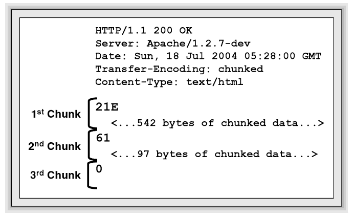

## Chunked encoding
It is important for a Web client to know when it has received a complete server response. HTTP/1.0 allows servers to indicate the size of a response message through the `Content-Length` header field. The message length can easily be determined for static resources. For dynamic resources, however, a server has to wait until the response is fully generated before being able to compute its length. As a result, if the server wants to keep the underlying TCP connection open, it cannot start sending a response until the resource has been created in its entirety. This is not a problem for short response messages, but it introduces noticeable delay and memory exhaustion for long responses. For these reasons, HTTP/1.0 servers did not use the `Content-Length` header for dynamic content. Instead, a server indicated the end of a dynamically generated message by closing the underlying TCP connection. Since this mechanism does not allow use of persistent connections, an alternative way for indicating the end of a message was required in HTTP/1.1.

The problem is solved in HTTP/1.1 by introducing *chunked transfer encoding*, which allows the sender to break a message body into arbitrary-sized chunks and to transmit them separately. Since the chunks themselves can contain as little as one byte of content, their length can easily be determined and precedes the chunk. The end of the entire message is indicated by adding a zero-length chunk. Receipt of the zero-length chunk indicates to a receiver that the entire message has been transmitted and no more chunks for this message are expected to arrive. Thus, the receiver is ensured that the entire message has successfully been received. Chunked encoding can be used for both HTTP requests and HTTP responses, though it is more commonly used for dynamically created response messages.

As an illustration, consider the message in Figure 2.6, which is divided into separate chunks. The `Transfer-Encoding: chunked` header indicates that the message is transmitted in several chunks, requiring the receiver to reassemble the full message from separate pieces. In the example, the message is split into three chunks, with the first chunk having a length of 542 bytes (21E in hex), the second one having a length of 97 bytes, and a zero-length chunk to indicate the message end. Each chunk is preceded by a number indicating its size.

