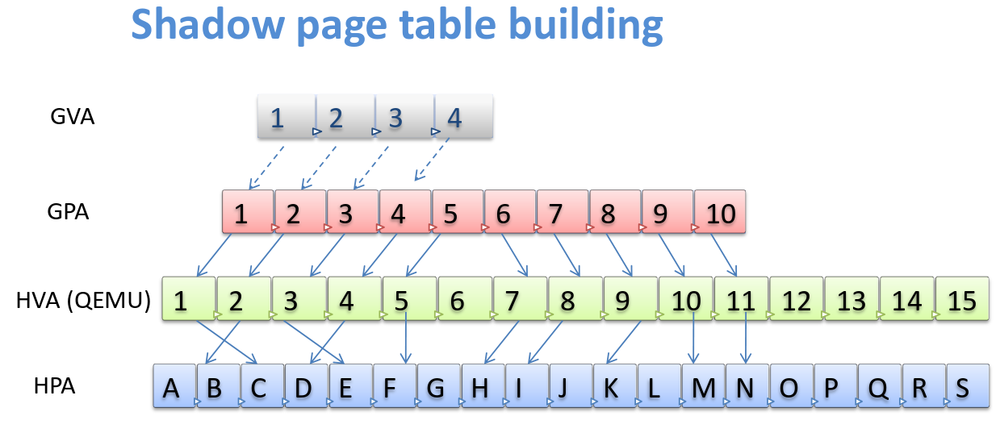
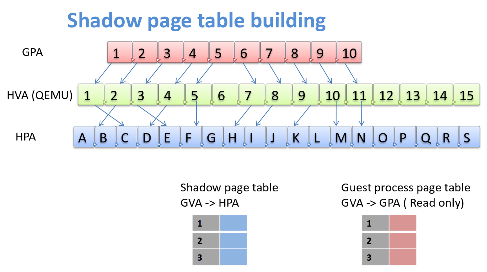

## KVM and QEMU
QEMU is inherently a hardware emulator. It existed before the release of KVM and can operate without KVM.

Given that QEMU is a software-based emulator, it interprets and executes CPU instructions one at a time in software, which means its performance is limited. However, it is possible to greatly improve QEMU performance while also achieving a VM function if three conditions are met.
1. A target instruction can be directly by the CPU
2. That instruction can be given without modification to the CPU for direct execution in VMX non-root operation mode.
3. A target instruction that cannot be directly executed can be identified and given to QEMU for emulator processing.

The development of KVM was based on this idea.

## Using the KVM API
### Definition of the sample virtual machine
A full virtual machine using KVM typically emulates a variety of virtual hardware devices and firmware functionality, as well as a potentially complex initial state and initial memory contents. For our sample virtual machine, we'll run the following 16-bit x86 code:
```
    mov $0x3f8, %dx
    add %bl, %al
    add $'0', %al
    out %al, (%dx)
    mov $'\n', %al
    out %al, (%dx)
    hlt
```
Rather than reading code from an object file or executable, we'll pre-assemble these instructions (via `gcc` and `objdump`) into machine code stored in a static array:
```
    const uint8_t code[] = {
	    0xba, 0xf8, 0x03, /* mov $0x3f8, %dx */
	    0x00, 0xd8,       /* add %bl, %al */
	    0x04, '0',        /* add $'0', %al */
	    0xee,             /* out %al, (%dx) */
	    0xb0, '\n',       /* mov $'\n', %al */
	    0xee,             /* out %al, (%dx) */
	    0xf4,             /* hlt */
    };
```
### Building a virtual machine
First, we'll need to open `/dev/kvm`:
```
    kvm = open("/dev/kvm", O_RDWR | O_CLOEXEC);
```
Next, we need to create a virtual machine (VM), which represents everything associated with one emulated system, including memory and one or more CPUs. KVM gives us a handle to this VM in the form of a file descriptor:
```
    vmfd = ioctl(kvm, KVM_CREATE_VM, (unsigned long)0);
```
The VM will need some memory, which we provide in pages. This corresponds to the "physical" address space as seen by the VM.

For our simple example, we'll allocate a single page of memory to hold our code, using `mmap()` directly to obtain page-aligned zero-initialized memory:
```
    mem = mmap(NULL, 0x1000, PROT_READ | PROT_WRITE, MAP_SHARED | MAP_ANONYMOUS, -1, 0);
```
We then need to copy our machine code into it:
```
    memcpy(mem, code, sizeof(code));
```
And finally tell the KVM virtual machine about its spacious new 4096-byte memory:
```
    struct kvm_userspace_memory_region region = {
	    .slot = 0,
	    .guest_phys_addr = 0x1000,
	    .memory_size = 0x1000,
	    .userspace_addr = (uint64_t)mem,
    };
    ioctl(vmfd, KVM_SET_USER_MEMORY_REGION, &region);
```
`guest_phys_addr` specifies the base "physical" address as seen from the guest, and `userspace_addr` points to the backing memory in our process that we allocated with `mmap()`.

Now that we have a VM, with memory containing code to run, we need to create a virtual CPU to run that code. A KVM virtual CPU represents the state of one emulated CPU, including processor registers and other execution state. Again, KVM gives us a handle to this VCPU in the form of a file descriptor:
```
    vcpufd = ioctl(vmfd, KVM_CREATE_VCPU, (unsigned long)0);
```
Each virtual CPU has an associated `struct kvm_run` data structure, used to communicate information about the CPU between the kernel and user space. In particular, whenever hardware virtualization stops (called a "vmexit"), such as to emulate some virtual hardware, the `kvm_run` structure will contain information about why it stopped.

> When the guest is about to execute a sensitive instruction, a "vmexit" is performed, and KVM identifies the reason for the exit. If QEMU intervention is needed to execute an I/O task, control is transferred to the QEMU process, and QEMU executes the task. On execution completion, QEMU again makes an ioctl() system call and requests the KVM to continue guest processing.

We map this structure into user space using `mmap()`, but first, we need to know how much memory to map, which KVM tells us with the `KVM_GET_VCPU_MMAP_SIZE ioctl()`:
```
    mmap_size = ioctl(kvm, KVM_GET_VCPU_MMAP_SIZE, NULL);
```
Now that we have the size, we can `mmap()` the `kvm_run` structure:
```
    run = mmap(NULL, mmap_size, PROT_READ | PROT_WRITE, MAP_SHARED, vcpufd, 0);
```
The VCPU also includes the processor's register state, broken into two sets of registers: standard registers and "special" registers.

For the standard registers, we set most of them to 0, other than our initial instruction pointer (pointing to our code at 0x1000, relative to `cs` at 0), our addends (2 and 2), and the initial state of the flags (specified as 0x2 by the x86 architecture; starting the VM will fail with this not set):
```
    struct kvm_regs regs = {
	    .rip = 0x1000,
	    .rax = 2,
	    .rbx = 2,
	    .rflags = 0x2,
    };
    ioctl(vcpufd, KVM_SET_REGS, &regs);
```
With our VM and VCPU created, our memory mapped and initialized, and our initial register states set, we can now start running instructions with the VCPU, using the `KVM_RUN ioctl()`. That will return successfully each time virtualization stops, such as for us to emulate hardware, so we'll run it in a loop:
```
    while (1) {
	    ioctl(vcpufd, KVM_RUN, NULL);
	    switch (run->exit_reason) {
	    /* Handle exit */
	    }
    }
```
Note that `KVM_RUN` runs the VM in the context of the current thread and doesn't return until emulation stops. To run a multi-CPU VM, the user-space process must spawn multiple threads, and call `KVM_RUN` for different virtual CPUs in different threads.

To handle the exit, we check `run->exit_reason` to see why we exited. This can contain any of several dozen exit reasons, which correspond to different branches of the union in `kvm_run`.

## Shadow page table
- Problems in memory virtualization
  - 3 levels of indirection, MMU can translate 1 level
  - GVA -> GPA -> HVA -> HPA must be achieved
- Solution - Shadow page table
  - Contains GVA -> HPA. MMU will use this instead of guest page table



- Guest wants to create a linear mapping for a process
- Guest does pure demand
- QEMU knows GPA -> HVA mapping ( malloc())


Step 1:
- Guest tries to map GVA 1 -> GPA 1
- Page fault (because of RO) causes VM exit
- KVM sees GPA as 1 by instruction emulation /using register contents



Step 2:
- GPA 1 -> HVA 1 is obtained
- This possible because GPA -> HVA mapping is known to QEMU/KMV


Step 3:
- KVM does lookup on QEMU's page table to find out HVA -> HPA
- KVM finds out HVA 1 -> HPA C


Step 4:
- KVM updates shadow page table with GVA 1 -> HPA C
- KVM also updates guest page table - by emulating the instruction which tried to map GVA 1 -> GPA 1
- GVA -> GPA -> HVA -> HPA is done


Step 5:
- Similarly other entries are update as and when page fault happens
- GVA 2 -> GPA 2 -> HVA 2 -> HPA B
- GVA 3 -> GPA 3 -> HVA 3 -> HPA E
