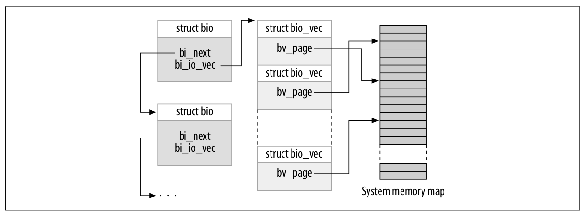
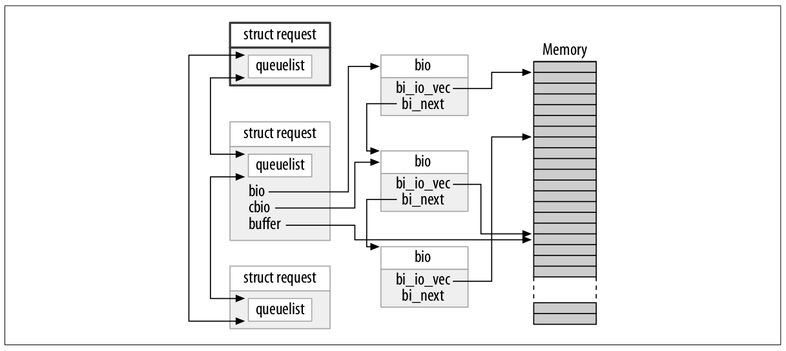

## An Introduction to Device Drivers
Device drivers take on a special role in the Linux kernel. They are distinct "black boxes" that make a particular piece of hardware respond to a well-defined internal programming interface; they hide completely the details of how the device works. User activities are performed by means of a set of standardized calls that are independent of the specific driver; mapping those calls to device-specific operations that act on real hardware is then the role of the device driver. This programming interface is such that drivers can be built separately from the rest of the kernel and "plugged in" at runtime when needed.

### The Role of the Device Driver
The role of a device is providing *mechanism*, not *policy*.

The distinction between mechanism and policy is one of the best ideas behind the Unix design. Most programming problems can indeed be split into two parts: "what capabilities are to be provided" (the mechanism) and "how those capabilities can be used" (the policy).

Where drivers are concerned, the same separation of mechanism and policy applies. The floppy driver is policy free - its role is only to show the diskette as a continuous array data blocks. Higher levels of the system provides policies, such as who may access the floppy drive, whether the drive is accessed directly or via a filesystem, and whether users may mount filesystems on the drive.

### Splitting the Kernel
#### Loadable Modules
One of the good features of Linux is the ability to extend at runtime the set of features offered by the kernel. This means that you can add functionality to the kernel (and remove functionality as well) while the system is up and running.

Each piece of code that can be added to the kernel at runtime is called a *module*. The Linux kernel offers support for quite a few different types (or classes) of modules, including, but not limited to, device drivers. Each module is made up object code that can be dynamically linked to the running kernel by the *insmod* program can be unlinked by the *rmmod* program.

### Classes of Devices and Modules
The three classes are:
- *Character devices*

  A character (char) device is one that can be accessed as a stream of bytes (like a file); a char driver is in charge of implementing this behavior. Such a driver usually implements at least the *open*, *close*, *read*, and *write* system calls. The text console (*/dev/console*) and the serial ports (/dev/ttyS0 and friends) are examples of char devices, as they are well represented by the stream abstraction. Char devices are accessed by means of filesystem nodes, such as */dev/tty1* and */dev/lp0*. The only relevant difference between a char device and a regular file is that you can always move back and forth in the regular file, whereas most char devices are just data channels, which you can only access sequentially.

- *Block devices*

  Like char devices, block devices are accessed by filesystem nodes in the */dev* directory. A block device is a device (e.g., disk) that can host a filesystem. In most Unix systems, a block device can only handle I/O operations that transfer one or more whole blocks, which are usually 512 bytes in length. Linux, instead, allows the application to read and write a block device like a char device - it permits the transfer of any number of bytes at a time. As a result, block and char devices differ only in the way data is managed internally by the kernel, and thus in the kernel/driver software interface. Like a char device, each block device is accessed through a filesystem node, and the difference between them is transparent to the user. Block drivers have a completely different interface to the kernel than char devices.

- *Network interfaces*

  Any network transaction is made through an interface, that is, a device that is able to exchange data with other hosts. A network device, interface is in charge of sending and receiving data packets, driven by the network subsystem of the kernel, without knowing individual transactions map to the actual actual packets being transmitted. Many network connections (especially those using TCP) are stream-oriented, but network devices are, usually, designed around the transmission and reception of packets. A network driver knows nothing about individual connections; it only handles packets.

  Not being a stream-oriented device, a network interface isn't easily mapped to a node in the filesystem, as */dev/tty1* is. The Unix way to provide interfaces is still by assigning a unique name to them (such as `eth0`), but that name doesn't have a corresponding entry in the filesystem. Communication between the kernel and a network device driver is completely different from that used with char and block drivers. Instead of *read* and *write*, the kernel calls functions related to packet transmission.

## Char Drivers
The goal of this chapter is to write a complete char device driver.

Throughout the chapter, we present code fragments extracted from a real device driver: *scull* (Simple Character Utility for Loading Localities). *scull* is a char driver that acts on a memory area as though it were a device. In this chapter, because of that peculiarity of *scull*, we use the word *device* interchangeably with the "the memory used by *scull*".

### Some Important Data Structures
The following list introduces all the operations that an application can invoke on a device.
- `ssize_t (*read) (struct file *, char __user *, size_t, loff_t);`

  Used to retrieve data from the device.

- `ssize_t (*write) (struct file *, const char __user *, size_t, loff_t *);`

  Sends data to the device.

- `unsigned int (*poll) (struct file *, struct poll_table_struct *);`

  The *poll* method is the back end of three system calls: *poll*, *epoll*, and *select*, all of which are used to query whether a read or write to one or more file descriptors would block. The *poll* method should return a bit mask indicating whether non-blocking reads or writes are possible, and possibly, provide the kernel with information that can be used to put the calling process to sleep until I/O becomes possible.

- `int (*ioctl) (struct inode *, struct file *, unsigned int, unsigned long);`

  The *ioctl* system call offers a way to issue device-specific commands (such as for- matting a track of a floppy disk, which is neither reading nor writing).

- `int (*open) (struct inode *, struct file *);`

  Though this is always the first operation performed on the device file, the driver is not required to declare a corresponding method.

- `int (*release) (struct inode *, struct file *);`

  This operation is invoked when the file structure is being released.

- `int (*fsync) (struct file *, struct dentry *, int);`

  This method is the back end of the *fsync* system call, which a user calls to flush any pending data.

The *scull* device driver implements only the most important device methods. Its `file_operations` structure is initialized as follows:
```
struct file_operations scull_fops = {
    .owner = THIS_MODULE,
    .llseek  = scull_llseek,
    .read    = scull_read,
    .write   = scull_write,
    .ioctl   = scull_ioctl,
    .open    = scull_open,
    .release = scull_release,
};
```

## Debugging Techniques
### Debugging by Querying
#### Using the /proc Filesystem
The /proc filesystem is a special, software-created filesystem that is used by the kernel to export information to the world. Each file under */proc* is tied to a kernel function that generates the file's "contents" on the fly when the file is read.

*/proc* is heavily used in the Linux system. Many utilities on a modern Linux distribution, such as *ps*, *top*, and *uptime*, get their information from */proc*. Some device drivers also export information via */proc*, and yours can do so as well. The */proc* filesystem is dynamic, so your module can add or remove entries at any time.

Fully featured */proc* entries can be complicated beasts; among other things, they can be written to as well as read from. Most of the time, however, */proc* entries are read-only files. This section concerns itself with the simple read-only case.

##### Implementing files in /proc
All modules that work with */proc* should include *<linux/proc_fs.h>* to define the proper functions.

To create a read-only */proc* file, your driver must implement a function to produce the data when the file is read. When some process reads the file (using the *read* system call), the request reaches your module by means of this function.

When a process reads from your */proc* file, the kernel allocates a page of memory (i.e., `PAGE_SIZE` bytes) where the driver can write data to be returned to user space. That buffer is passed to your function, which is a method called *read_proc*:
```
int (*read_proc)(char *page, char **start, off_t offset, int count,
                 int *eof, void *data);
```
The `page` pointer is the buffer where you'll write your data;

### Debugging by Watching
The *strace* command is a powerful tool that shows all the system calls issued by a user-space program. *strace* has many command-line options: the most useful of which are *-t* to display the time *when* each call is executed, *-T* to display the time spent in the call.

## Concurrency and Race Conditions
### Semaphore and Mutexes
#### The Linux Semaphore Implementation
```
void down(struct semaphore *sem);
int down_interruptible(struct semaphore *sem);
```
*down* decrements the value of the semaphore and waits as long as need be. *down_interruptible* does the same, but the operation is interruptible. The interruptible is almost always the one you will want; it allows a user-space that is waiting on a semaphore to be interrupted by the user. You do not, as a general rule, want to use noninterruptible operations unless there truly is no alternative. Noninterruptible operations are a good way to create unkillable process (the dreaded "D state" seen in *ps*), and annoy your users. Using *down_interruptible* requires some extra care, however, if the operation is interrupted, the function returns a nonzero value, and the caller does *not* hold the semaphore. Proper use of *down_interruptible* requires always checking the return value and responding accordingly.

## Communicating with Hardware


### I/O Ports and I/O Memory
Every peripheral device is controlled by writing and reading its registers. Most of the time a device has several registers, and they are accessed at consecutive addresses, either in the memory address space or in the I/O address space.

At the hardware level, there is no conceptual difference between memory regions and I/O regions: both of them are accessed by asserting electrical signals on the address bus and control bus (i.e., the *read* and *write* signals) and by reading from or writing to the data bus.

While some manufactures implement a single address space in their chips, others decided that peripheral devices are different from memory and, therefore, deserve a separate address space. Some processors (most notably the x86 family) have separate *read* and *write* electrical lines for I/O ports and special CPU instructions to access ports.

## Advanced Char Driver Operations
### ioctl
Most drivers need - in addition to the ability to read and write the device - the ability to perform various types of hardware control via the device driver. Most devices can perform operations beyond simple data transfers; user space must often be able to request, for example, that the device lock its door, eject its media, report error information, change a baud rate, or self destruct. These operations are usually supported via the *ioctl* method, which implements the system call by the same name.

### Blocking I/O
Back in Chapter 3, we looked at how to implement the *read* and *write* driver methods. At that point, we skipped over one important issue: how does a driver respond if it cannot immediately satisfy the request? A call to *read* may come when no data is available, but more is expected in the future. Or a process could attempt to *write*, but your device is not ready to accept the data, because your output buffer is full. The calling process usually does not care about such issues: the programmer simply expects to call *read* or *write* and have the call return after the necessary work has been done. So, in such cases, your driver should block (by default) *block* the process, putting it to sleep until the request can proceed.

#### Introduction to Sleeping
What does it mean for a process to "sleep"? When a process is put to sleep, it is marked as being in a special state and removed from the scheduler's run queue. Until something comes along to change that state, the process will not be scheduled on ant CPU, and therefore, will not run. A sleeping process has been shunted off to the side of the system, waiting for some future event to happen.

Causing a process to sleep is an easy thing for a Linux device driver to do. There are, however, a couple of rules that you must keep in mind to be able to code sleeps in a safe manner.

Another thing to remember with sleeping is that, when you wake up, you never know how long your process may have been out of the CPU or what may have changed in the mean time. You also do not usually know if another process may have been sleeping for the same event; that process may wake before you and grab whatever resource you were waiting for. The end result is that you can make no assumptions about the state of the system after you wake up, and you must check to ensure that the condition you were waiting for is, indeed, true.

On other relevant point, of course, is that your process cannot sleep unless it is assured that somebody else, somewhere, will wake it up. The code doing the awakening must also be able to find your process to be able to do its job. Making it possible for your sleeping process to be found is, instead, accomplished through a data structure called a *wait queue*. A wait queue is just what it sounds like: a list of processes all waiting for a specific event.

In Linux, a wait queue is managed by means of a "wait queue head," a structure of type `wait_queue_head_t`, which is defined in *<linux/wait.h>*. A wait queue head can be initialized dynamically with:
```
wait_queue_head_t my_queue;
init_waitqueue_head(&my_head);
```
#### Simple Sleeping
When a process sleeps, it does so in expectation that some condition will becomes true in the future. As we noted before, any process that sleeps must check to be sure that the condition it was waiting for is really true when it wakes up again. The simplest way of sleeping in the Linux kernel is a macro called `wait_event`; it combines handling the details of sleeping with a check on the condition a process is waiting for. The forms of `wait_event` are:
```
wait_event(queue, condition)
wait_event_interruptible(queue, condition)
```
In all of the above forms, `queue` is the wait queue head to use. The `condition` is an arbitrary boolean expression that is evaluated by the macro before and after sleeping; until condition evaluates to a true value, the process continues to sleep.

If you use *wait_event*, your process is put into an uninterruptible sleep which, as we have mentioned before, is usually not what you want. The preferred alternative is *wait_event_interruptible*, which can be interrupted by signals. This version returns an integer value that you should check; a nonzero value means your sleep was interrupted by some sort of signal, and your driver should probably return `-ERESTARTSYS`.

The other half of the picture, of course, is waking up. Some other thread of execution (a different process, or an interrupt handler, perhaps) has to perform the wakeup for you, since your process is, of course, asleep. The basic function that wakes up sleeping processes is called *wake_up*. It comes in several forms:
```
void wake_up(wait_queue_head_t *queue);
```
*wake_up* wakes up all processes waiting on the given queue.

We now know enough to look at a simple example of sleeping and waking up. In the sample source, you can find a module called *sleepy*. It implements a device with simple behavior: any process that attempts to read from the device is put to sleep. Whenever a process writes to the device, all sleeping processes are awakened. This behavior is implemented with the following *read* and *write* methods:
```
static DECLARE_WAIT_QUEUE_HEAD(wq);
static int flag = 0;

ssize_t sleepy_read (struct file *filp, char __user *buf, size_t count, loff_t *pos)
{
    printk(KERN_DEBUG "process %i (%s) going to sleep\n", current->pid, current->comm);
    wait_event_interruptible(wq, flag != 0);
    flag = 0;
    printk(KERN_DEBUG "awoken %i (%s)\n", current->pid, current->comm);
    return 0; /* EOF */
}

ssize_t sleepy_write (struct file *filp, const char __user *buf, size_t count, loff_t *pos)
{
    printk(KERN_DEBUG "process %i (%s) awakening the readers...\n", current->pid, current->comm);
    flag = 1;
    wake_up_interruptible(&wq);
    return count; /* succeed, to avoid retrial */
}
```
#### Blocking and Nonblocking Operations
One last point we need to touch on before we look at the implementation of full-featured *read* and *write* methods is deciding when to put a process to sleep. There are times when implementing proper Unix semantics requires that an operation not block, even if it cannot be completely carried out.

In the case of a blocking operation, which is the default, the following behavior should be implemented in order to adhere to the standard semantics:
- If a process calls *read* but no data is (yet) available, the process must block. The process is awakened as soon as some data arrives, and that data is returned to the caller, even if there is less than the amount requested in the `count` argument to the method.
- If a process calls *write* and there is no space in the buffer, the process must block, and it must be on a different wait queue from the one used for reading. When some data has been written to the hardware device, and space becomes free in the output buffer, the process is awakened and the *write* call succeeds, although the data may be only partially written if there isn't room in the buffer for the `count` bytes that were requested.

Both these statements assume that there are both input and output buffers; in practice, almost every device driver has them. The input buffer is required to avoid losing data that arrives when nobody is reading. In contrast, data can't be lost on *write*, because if the system call doesn't accept data bytes, they remain in the user-space buffer. Even so, the output buffer is almost always useful for squeezing more performance out of the hardware.

The performance gain of implementing an output buffer in the driver results from the reduced number of context switches and user-level/kernel-level transitions. Without an output buffer (assuming a slow device), only one or a few characters are accepted by each system call, and while one process sleeps in *write*, another process runs (that's one context switch). When the first process is awakened, it resumes (another context switch), *write* returns (kernel/user transition), and the process reiterates the system call to write more data (user/kernel transition); the call blocks and the loop continues. The addition of an output buffer allows 

#### A Blocking I/O Example
Within a driver, a process blocked in a *read* call is awakened when data arrives; usually the hardware issues an interrupt to signal such an event, and the driver awakens waiting processes as part of handling the interrupt.

#### Advanced sleeping
##### How a process sleeps
If you look inside *<linux/wait.h>*, you see that the data structure behind the `wait_queue_head_t` is quite simple; it consists of a spinlock and a linked list. What goes on to that list is a wait queue entry, which is declared with the type *wait_queue_t*. This structure contains information about the sleeping process and exactly how it would like to be woken up.

The first step in putting a process to sleep is usually the allocation and initialization of a `wait_queue_t` structure, followed by its addition to the proper wait queue.

The next step is to set the state of the process to mark it as being asleep. In the 2.6 kernel, it is not normally necessary for driver code to manipulate the process state directly. However, should you need to do so, the call to use is:
```
void set_current_state(int new_state)
```
In older code, you often see something like this instead:
```
current->state = TASK_INTERRUPTIBLE;
```
The above code does show, however, that changing the current state of a process does not, by itself, put it to sleep. By changing the current state, you have changed the way the scheduler treats a process, but you have not yet yielded the processor.
```
if (!condition)
    schedule()
```
The call to *schedule* is, of course, the way to invoke the scheduler and yield the CPU. Whenever you call this function, you are telling the kernel to consider which process should be running and to switch control to that process if necessary.

### poll and select
Applications that use nonblocking I/O often use the *poll*, *select*, and *epoll* system calls as well. *poll*, *select*, and *epoll* have essentially the same functionality: each allow a process to determine whether it can read from or write to one or more open files without blocking. These calls can also block a process until any of a given set of file descriptors become available for reading or writing. Therefore, they are often used in applications that use multiple input or output streams without getting stuck on any one of them.

Support for any of these calls requires support from the device driver. This support (for all three calls) is provided through the driver's *poll* method. This method has the following prototype:
```
unsigned int (*poll) (struct file *flip, poll_table *wait);
```
The driver method is called whenever the user-space program performs a *poll*, *select*, or *epoll* system call involving a file descriptor associated with the driver.

The `poll_table` structure, the second argument to the poll method, is used within the kernel to implement the *poll*, *select*, and *epoll* calls; it is declared in *<linux/poll.h>*, which must be included by the driver source. Driver writers do not need to know anything about its internals and must use it as an opaque object; it is passed to the driver method so that the driver can load it with every wait queue that could wake up the process and change the status of the *poll* operation. The driver adds a wait queue to the `poll_table` structure by calling the function *poll_wait*:
```
void poll_wait (struct file *, wait_queue_head_t *, poll_table *);
```
The second task performed by the *poll* method is returning the bit mask describing which operations could be completed immediately; this is also straightforward. For example, if the device has data available, a *read* would complete without sleeping; the *poll* method should indicate this state of affairs. Several flags are used to indicate the possible operations:
- `POLLIN`
   
   This bit must be set if the device can be read without blocking.

#### Interaction with read and write
The purpose of the poll and select calls is to determine in advance if an I/O operation will block. In that respect, they complement *read* and *write*.

##### Reading data from the device

- If there is data in the input buffer, the *read* call should return immediately, with no noticeable delay, even if less data is available than the application requested, and the driver is sure the remaining data will arrive soon. You can always return less data than you're asked for if this is convenient for any reason, provided you return at least one byte. In this case, *poll* should return `POLLIN|POLLRDNORM`.
- If there is no data in the input buffer, by default *read* must block until at least one byte is there. If `O_NONBLOCK` is set, on the other hand, *read* returns immediately with a return value of `-EAGAIN`. In these cases, *poll* must report that the device is unreadable until at least one byte arrives.

##### Writing to the device

- If there is space in the output buffer, *write* should return without delay. It can accept less data than the call requested, but it must accept at least one byte. In this case, *poll* reports that the device is writable by returning `POLLOUT|POLLWRNORM`.
- If the output buffer is full, by default *write* blocks until some space is freed. If `O_NONBLOCK` is set, *write* returns immediately with a return value of `-EAGAIN`. In these cases, *poll* should report that the file is not writable.
- Never make a *write* call wait for data transmission before returning, even if `O_NONBLOCK` is clear. This is because many applications use *select* to find out whether a *write* will block. If the device is reported as writable, the call must not block. If the program using the device wants to ensure that the data it enqueues in the output buffer is actually transmitted, the driver must provide an *fsync* method. For instance, a removable device should have an *fsync* entry point.

##### Flushing pending output
We've seen how the *write* method by itself doesn't account for all data output needs. The *fsync* function, invoked by the system call of the same name, fills the gap. This method's prototype is
```
int (*fsync) (struct file *file, struct dentry *dentry, int datasync);
```
If some application ever needs to be assured that data has been sent to the device, the *fsync* method must be implemented regardless of whether `O_NONBLOCK` is set. A call to *fsync* should return only when the device has been completely flushed (i.e., the out-put buffer is empty), even if that takes some time.

Most of the time, char drivers just have a `NULL` pointer in their `fops`. Block devices, on the other hand, always implement the method with the general purpose *block_fsync*, which, in turn, flushes all the blocks of the device, waiting for I/O to complete.

#### The Underlying Data Structure
Whenever a user application calls *poll*, *select*, or *epoll_ctl*, the kernel invokes the *poll* method of all files referenced by the system call, passing the same `poll_table` to each of them. The `poll_table` structure is just a wrapper around a function that builds the actual data structure. That structure, for *poll* and *select*, is a linked list of memory pages containing `poll_table_entry` structures. Each `poll_table_entry` holds the `struct file` and `wait_queue_head_t` pointers passed to *poll_wait*, along with an associated wait queue entry. The whole structure must be maintained by the kernel so that the process can be removed from all of those queues before *poll* or *select* returns.

If none of the drivers being polled indicates that I/O can occur without blocking, the *poll* call simply sleeps until one of the (perhaps many) wait queues it is on wakes it up.

## Block Drivers
So far, our discussion has been limited to char drivers.

A block driver provides access to devices that transfer randomly accessible data in fixed-size blocks - disk drives, primarily. The Linux kernel sees block devices as being fundamentally different from char devices; as a result, block drivers have a distinct interface and their own particular challenges.

The discussion of this chapter, is as one would expect, centered on an example driver that implements a block-oriented, memory-based device. It is, essentially, a ramdisk. The kernel already contains a far superior ramdisk implementation, but our driver (called *subll*) lets us demonstrate the creation of a block driver while minimizing unrelated complexity.

Before getting into the details, let's define a couple of terms precisely. A *block* is a fixed-size chunk of data, the size being determined by the kernel. Blocks are often 4096 bytes, but that value can vary depending on the architecture and the exact filesystem being used. A *sector*, in contrast, is a small block whose size is usually determined by the underlying hardware. The kernel expects to be dealing with devices that implement 512-byte sectors. If your device uses a different size, the kernel adapts and avoids generating I/O requests that the hardware cannot handle.

### Registration
Block drivers, like char drivers, must use a set of registration interfaces to make their devices available to the kernel.

#### Initialization in sbull
It is time to get down to some examples. The *sbull* driver implements a set of in-memory virtual disk drives. For each drive, *sbull* allocates (with *vmalloc*, for simplicity) an array of memory; it then makes that array available via block operations.

The *sbull* device is described by an internal structure:
```
struct sbull_dev {
        int size;                      /* Device size in sectors */
        u8 *data;
        short users;
        short media_change;
        spinlock_t lock;               /* For mutual exclusion */
        struct request_queue *queue;   /* The device request queue */
        struct gendisk *gd;
        struct timer_list timer;
};
```
Several steps are required to initialize this structure and make the associated device available to the system. We start with basic initialization and allocation of the underlying memory:
```
memset (dev, 0, sizeof (struct sbull_dev));
dev->size = nsectors*hardsect_size;
dev->data = vmalloc(dev->size);
if (dev->data = = NULL) {
    printk (KERN_NOTICE "vmalloc failure.\n");
    return;
}
spin_lock_init(&dev->lock);
```
It's important to allocate and initialize a spinlock before the next step, which is the allocation of the request queue. We look at this process in more detail when we get to request processing; for now, suffice it to say that the necessary call is:
```
dev->queue = blk_init_queue(sbull_request, &dev->lock);
```
Here, *sbull_request* is our *request* function - the function that actually performs block read and write requests. When we allocate a request queue, we must provide a spinlock that controls access to that queue.

#### A Note on Sector Sizes
As we have mentioned before, the kernel treats every disk as a linear array of 512-byte sectors.

### The Block Device Operations
To that end, it is time to mention one other feature of the *sbull* driver: it pretends to be a removable device. Whenever the last user closes the device, a 30-second timer is set; if the device is not opened during that time, the contents of the device are cleared, and the kernel will be told that the media has been changed.

### Request Processing
The core of every block driver is its *request* function. This function is where the real work gets done - or at least started; all the rest is overhead.

#### Introduction to the request Method
The block driver *request* method has the following prototype:
```
void request(request_queue_t *queue);
```
This function is called whenever the kernel believes it is time for your driver to process some reads, writes, or other operations on the device. The *request* function does not need to actually complete all of the requests on the queue before it returns;

#### A Simple request Method
By default, *sbull* uses a method called *sbull_request*, which is meant to be an example of the simplest possible request method. Without further ado, here it is:
```
static void sbull_request(request_queue_t *q)
{
    struct request *req;

    while ((req = elv_next_request(q)) != NULL) {
        struct sbull_dev *dev = req->rq_disk->private_data;
        if (! blk_fs_request(req)) {
            printk (KERN_NOTICE "Skip non-fs request\n");
            end_request(req, 0);
            continue;
        }
        sbull_transfer(dev, req->sector, req->current_nr_sectors, req->buffer, rq_data_dir(req));
        end_request(req, 1);
    }
}
```
The kernel provides the function *elv_next_request* to obtain the first incomplete request on the queue; that function returns `NULL` when there are no requests to be processed. Note that *elv_next_request* does not remove the request from the queue. If you call it twice with no intervening operations, it returns the same `request` structure both times.

A block request queue can contain requests that do not actually move blocks to and from a disk. Such requests can include vendor-specific, low-level diagnostics operations or instructions relating to specialized device modes, such as the packet writing mode for recordable media. Most block drivers do not know how to handle such requests and simply fail them; *sbull* works in this way as well. The call to *block_fs_request* tells us whether we are looking at a filesystem request - one that moves blocks of data. If a request is not a filesystem request, we pass it to *end_request*:
```
void end_request(struct request *req, int succeeded);
```
When we dispose of nonfilesystem requests, we pass `succeeded` as 0 to indicate that we did not successfully complete the request. Otherwise, we call *sbull_transfer* to actually move the data, using a set of fields provided in the `request` structure:
* `sector_t sector;`
  * The index of the beginning sector on our device.
* `unsigned long nr_sectors;`
  * The number of sectors to be transferred.
* `char *buffer;`
  * A pointer to the buffer to or from which the data should be transferred.

Given this information, the *sbull* driver can implement the actual data transfer with a simple *memcpy call* - our data is already in memory, after all.
```
static void sbull_transfer(struct sbull_dev *dev, unsigned long sector, unsigned long nsect, char *buffer, int write)
{
    unsigned long offset = sector*KERNEL_SECTOR_SIZE;
    unsigned long nbytes = nsect*KERNEL_SECTOR_SIZE;
    if ((offset + nbytes > dev->size)) {
        printk (KERN_NOTICE "Beyond-end write (%ld %ld)\n", offset, nbytes);
        return;
    }
    if (write)
        memcpy(dev->data + offset, buffer, nbytes);
    else
        memcpy(buffer, dev->data + offset, nbytes);
}
```
With the code, *sbull* implements a complete, simple RAM-based disk device.


The *sbull* driver, however, takes all that work and simply ignores it. Only one buffer is transferred at a time, meaning that the largest single transfer is almost never going to exceed the size of a single page. A block driver can do much better than that, but it requires a deeper understanding of `request` structures and the `bio` structures from which requests are built.

#### Request Queues
In the simplest sense, a block request queue is exactly that: a queue of block I/O requests.

Request queues keep track of outstanding block I/O requests.

Request queues also implement a plug-in interface that allows the use of multiplex *I/O scheduler* (or *elevators*) to be used. An I/O scheduler's job is to present I/O requests to your driver in a way that maximizes performance. To this end, most I/O schedulers accumulate a batch of requests, sort them into increasing (or decreasing) block index order, and present the requests to the driver in that order. The disk head, when given a sorted list of requests, works its way from one end of the disk to the other, much like a full elevator moves in a single direction until all of its "requests" (people waiting to get off) have been satisfied. The 2.6 kernel includes a "deadline scheduler," which makes an effort to ensure that every request is satisfied within a present maximum time.

The I/O scheduler is also charged with merging adjacent requests. When a new I/O request is handed to the scheduler, it searches the queue for requests involving adjacent sectors; if one is found and if the resulting request would not be too large, the two requests are merged.

#### The Anatomy of a Request
Each `request` structure represents one block I/O request, although it may have been formed through a merger of several independent requests at a higher level. The sectors to be transferred for any particular request may be distributed throughout main memory, although they always correspond to a set of consecutive sectors on the block device. The request is represented as a set of segments, each of which corresponds to one in-memory buffer. The kernel may join multiple requests that involve adjacent sectors on the disk, but it never combines read and write operations within a single `request` structure.

A `request` structure is implemented, essentially, as a linked list of `bio` structures combined with some housekeeping information to enable the driver to keep track of its position as it works through the request. The `bio` structure is a low-level of description of a portion of a block I/O request.

##### The bio structure
When the kernel, in the form of a filesystem, the virtual memory subsystem, or a system call, decides that set of blocks must be transferred to or from a block I/O device; it puts together a `bio` structure to describe that operation. That structure is then handed to the block I/O code, which merges it into an existing `request` structure or, if need be, creates a new one. The `bio` structure contains everything that a block driver needs to carry out the request without reference to the user-space process that caused that request to be initiated.

The `bio` structure contains a number of fields that may be of use to driver authors:
* `sector_t bi_sector;`
  * The first (512-byte) sector to be transferred for this `bio`.
* `unsigned int bi_size;`
  * The size of the data to be transferred, in bytes.

The core of a `bio`, however, is an array called `bi_io_vec`, which is made up of the following structure:
```
struct bio_vec {
      struct page   *bv_page;
      unsigned int  bv_len;
      unsigned int  bv_offset;
};
```
As you can see, by the time a block I/O request is turned into a `bio` structure, it has been broken into individual pages of physical memory. All a driver needs to do is to step through this array of structures (there are `bi_vcnt` of them), and transfer data within each page.



##### Request structure fields
Now that we have an idea of how the `bio` structure works, we can get deep into struct `request` and see how request processing works. The fields of this structure include:
* `struct bio *bio;`
  * `bio` is the linked list of `bio` structures for this request.
* `struct list_head queuelist;`
  * The linked-list structure that links the request into the request queue.

Figure shows how the request structure and its component bio structures fit together. In the figure, the request has been partially satisfied; the `cbio` and `buffer` fields point to the first bio that has not yet been transferred.



#### Request Completion Functions
When your device driver has completed transferring some or all of the sectors in an I/O request, it must inform the block subsystem with:
```
int end_that_request_first(struct request *req, int success, int count);
```
This function tells the block code that your driver has finished with the transfer of `count` sectors starting where last left off. If the I/O was successful, pass `success` as 1, otherwise pass 0.

##### Working with bios
You now know enough to write a block driver that works directly with the `bio` structures that make up a request. An example might help, however. If the *sbull* driver is loaded with the `request_mode` parameter set to 1, it registers a `bio`-aware *request* function instead of the simple function we saw above. That function looks like this:
```
static void sbull_full_request(request_queue_t *q)
{
    struct request *req;
    int sectors_xferred;
    struct sbull_dev *dev = q->queuedata;

    while ((req = elv_next_request(q)) != NULL) {
        if (! blk_fs_request(req)) {
            printk (KERN_NOTICE "Skip non-fs request\n");
            end_request(req, 0);
            continue;
        }
        sectors_xferred = sbull_xfer_request(dev, req);
        if (! end_that_request_first(req, 1, sectors_xferred)) {
            blkdev_dequeue_request(req);
            end_that_request_last(req);
        }
    }
}
```
This function simply takes each request, passes it to *sbull_xfer_request*, then completes it with *end_that_request_first* and, if necessary, *end_that_request_last*. Thus, this function is handling the high-level queue and request management parts of the problem. The job of actually executing a request, however, falls to *sbull_xfer_request*:
```
static int sbull_xfer_request(struct sbull_dev *dev, struct request *req)
{
    struct bio *bio;
    int nsect = 0;
    rq_for_each_bio(bio, req) {
        sbull_xfer_bio(dev, bio);
        nsect += bio->bi_size/KERNEL_SECTOR_SIZE;
    }
    return nsect;
}
```
Here we introduce another macro: *rq_for_each_bio*. As you might expect, this macro simply steps through each `bio` structure in the request, giving us a pointer that we can pass to *sbull_xfer_bio* for the transfer. That function looks like:
```
static int sbull_xfer_bio(struct sbull_dev *dev, struct bio *bio)
{
    int i;
    struct bio_vec *bvec;
    sector_t sector = bio->bi_sector;

    /* Do each segment independently. */
    bio_for_each_segment(bvec, bio, i) {
        char *buffer = __bio_kmap_atomic(bio, i, KM_USER0);
        sbull_transfer(dev, sector, bio_cur_sectors(bio), buffer, bio_data_dir(bio) == WRITE);
        sector += bio_cur_sectors(bio);
        __bio_kunmap_atomic(bio, KM_USER0);
    }
    return 0; /* Always "succeed" */
}
```
This function simply steps through each segment in the `bio` structure, gets a kernel virtual address to access the buffer, then calls the same *sbull_transfer* function we saw earlier to copy the data over.

Each device has its own needs, but, as a general rule, the code just shown should serve as a model for many situations where digging through the `bio` structures is needed.

##### Doing without a request queue
Many block-oriented devices, such as flash memory arrays, readers for media cards used in digital cameras, and RAM disks have truly random-access performance and do not benefit from advanced-request queueing logic. Other devices, such as software RAID arrays or virtual disks created by logical volume managers, do not have the performance characteristics for which the block layer's request queues are optimized. For this kind of device, it would be better to accept requests directly from the block layer and not bother with the request queue at all.

For these situations, the block layer supports a "no queue" mode of operation. To make use of this mode, your driver must provide a "make request" function, rather then a *request* function. The *make_request* function has this prototype:
```
typedef int (make_request_fn) (request_queue_t *q, struct bio *bio);
```
Note that a request queue is still present, even though it will never actually hold any requests. The *make_request* function takes as its main parameter a `bio` structure, which presents one or more buffers to be transferred. The *make_request* function can do one of two things: it can either perform the transfer directly.

Performing the transfer directly is just a matter of working through the `bio` with the accessor methods we described earlier. Since there is no `request` structure to work with, however, your function should signal completion directly to the creator of the `bio` structure with a call to *bio_endio*:
```
void bio_endio(struct bio *bio, unsigned int bytes, int error);
```
You should either call *bio_endio* again as your device makes further process, or signal an error if you are unable to complete the request. Errors are indicated by providing a nonzero value for the `error` parameter.

If *sbull* is loaded with `request_mode=2`, it operates with a *make_request* function. Since *sbull* already has a function that can transfer a single `bio`, the *make_request* function is simple:
```
static int sbull_make_request(request_queue_t *q, struct bio *bio)
{
    struct sbull_dev *dev = q->queuedata;
    int status;

    status = sbull_xfer_bio(dev, bio);
    bio_endio(bio, bio->bi_size, status);
    return 0;
}
```

## Building and Running Modules
### The Hello World Module

```
#include <linux/init.h>
#include <linux/module.h>
MODULE_LICENSE("Dual BSD/GPL");

static int hello_init(void)
{
	printk(KERN_ALERT "Hello, world\n");
	return 0;
}

static void hello_exit(void)
{
	printk(KERN_ALERT "Goodbye, cruel world\n");
}

module_init(hello_init);
module_exit(hello_exit);
```
This module defines two functions, one to be invoked when the module is loaded into the kernel (`hello_init`) and one for when the module is removed (`hello_exit`). The `module_init` and `module_exit` lines use special kernel macros to indicate the role of these two functions. Another special macro (`MODULE_LICENSE`) is used to tell the kernel that this module bears a free license; without such a declaration, the kernel complains when the module is loaded.

The `printk` function is defined in the Linux kernel and made available to modules; it behaves similarly to the standard C library function `printf`.

### Compiling and Loading
#### Compiling Modules
Once you have everything set up, creating a makefile for your module is straightforward. In fact, for the "hello world" example, a single line will suffice:
```
obj-m := hello.o
```
The assignment above (which takes advantage of the extended syntax provided by GNU `make`) states that there is one module to be built from the object `hello.o`. The resulting module is named `hello.ko` after being built from the object file.

If, instead, you have a module called `module.ko` that is generated from two source files (called, say, `file1.c` and `file2.c`), the correct incantation would be:
```
obj-m := hello.o
module-objs := file1.o file2.o
```
For a makefile like those shown above to work, it must be invoked within the context of the larger kernel build system. If your kernel source tree is located in, say, your `~/kernel-2.6` directory, the `make` command required to build your module (typed in the directory containing the module source and makefile) would be:
```
make -C ~/kernel-2.6 M=`pwd` modules
```
This command starts by changing its directory to the one provided with the `-C` option (that is, your kernel source directory). There is finds the kernel's top-level makefile. The `M=` option causes that makefile to move back into your module source directory before trying to build the `modules` target. This target, in turn, refers to the list of modules found in the `obj-m` variable, which we've set to `module.o` in our examples.

### Module Parameters
These parameter values can be assigned at load time by `insmod` or `modprobe`. The commands accept the specification of several types of values on the command line. As a way of demonstrating this capability, imagine a much-needed enhancement to the "hello world" module (called `hellop`). We add two parameters: an integer value called `howmany` and a character string callled `whom`. Our vastly more functional module then, at load time, greets `whom` not just once, but `howmany` times. Such a module could then be loaded with a command line such as:
```
insmod hellop howmany=10 whom="Mom"
```
Upon being loaded that, `hellop` would say "Hello, Mom" 10 times.

However, before `insmod` can change module parameters, the module must take them available. Parameters are declared with the `module_param` macro, which is defined in `moduleparam.h`. `module_param` takes three parameters: the name of the variable, its type, and a permission mask to be used for an accompanying sysfs entry. The macro should be placed outside of any function and is typically found near the head of the source file. So `hellop` would declare its parameters and make them available to `insmod` as follows:
```
static char *whom = "world";
static int howmany = 1;
module_param(howmany, int, S_IRUGO);
module_param(whom, charp, S_IRUGO);
```