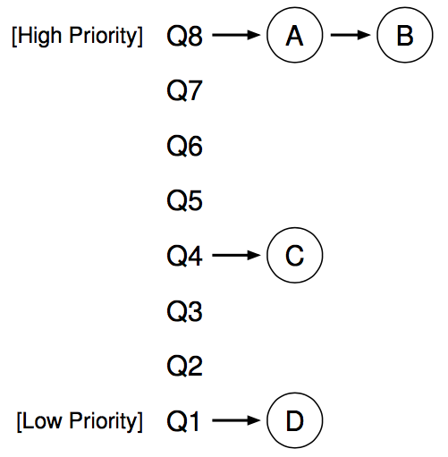
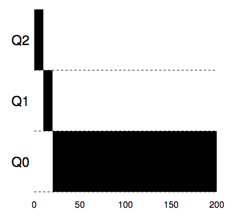
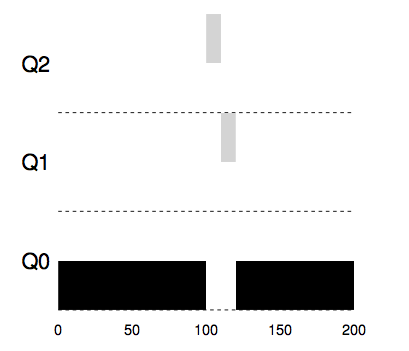
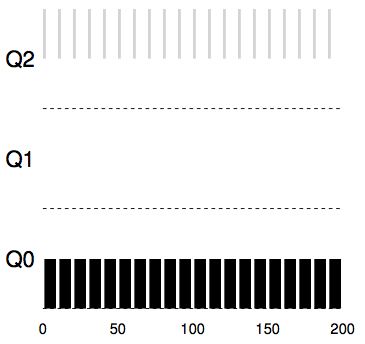
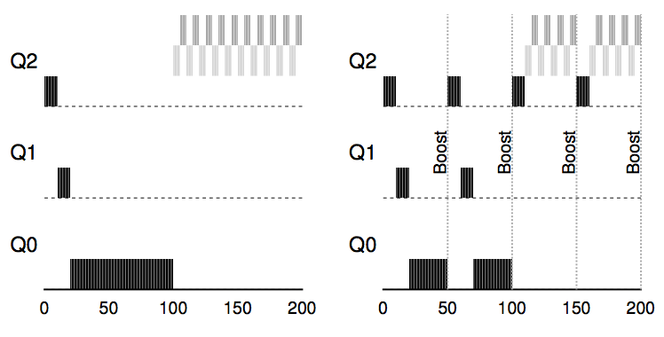

# Scheduling: Introduction
## Workload Assumptions
We will make the following assumptions about the processes, sometimes called **jobs**, that are running in the system:
1. Each job runs for the same amount of time.
2. All jobs arrive at the same time.
3. Once started, each job runs to completion.
4. All jobs only use the CPU (i.e., they perform no I/O)
5. The run-time of each job is known.

## Scheduling Metrics
Beyond making workload assumptions, we also need one more thing to enable us to compare different scheduling policies: a **scheduling metric**.

For now, however, let us also simplify our life by simply having a single metric: **turnaround time**. The turnaround time of a job is defined as the time at which the job completes minus the time at which the job arrived in the system. More formally, the turnaround time *T<sub>turnaround</sub>* is: *T<sub>turnaround</sub>* = *T<sub>completion</sub>* − *T<sub>arrival</sub>*

## First In, First Out (FIFO)
Let's do a quick example together. Imagine three jobs arrive in the system, A, B, and C, at roughly the same time (*T<sub>arrival</sub>* = 0). Because FIFO has to put some job first, let's assume that while they all arrived simultaneously, A arrived just a hair before B which arrived just a hair before C. Assume also that each job runs for 10 seconds. What will the **average turnaround time** be for these jobs?

you can see that A finished at 10, B at 20, and C at 30. Thus,the average turnaround time for the three jobs is simply 20.

let's do an example to show how jobs of different lengths can lead to trouble for FIFO scheduling. In particular, let's again assume three jobs (A, B, and C), but this time A runs for 100 seconds while B and C run for 10 each.

As you can see, Job A runs first for the full 100 seconds before B or C even get a chance to run. Thus, the average turnaround
time for the system is high: a painful 110 seconds ((100+110+120 / 3) = 110).

## Shortest Job First (SJF)
This new scheduling discipline is known as **Shortest Job First (SJF)**, and the name should be easy to remember because it describes the policy quite completely: it runs the shortest job first, then the next shortest, and so on.

Let's take our example above but with SJF as our scheduling policy. Simply by running B and C before A, SJF reduces average turnaround from 110 seconds to 50 ((10+20+120) / 3 =50).

Thus we arrive upon a good approach to scheduling with SJF, but our assumptions are still fairly unrealistic. Let's relax another. In particular, we can target assumption 2, and now assume that jobs can arrive at any time instead of all at once.

Here we can illustrate the problem again with an example. This time, assume A arrives at *t* = 0 and needs to run for 100 seconds, whereas B and C arrive at *t* = 10 and each need to run for 10 seconds.

As you can see, even though B and C arrived shortly after A, they still are forced to wait until A has completed. Average turnaround time for these three jobs is 103.33 seconds ((100+(110−10)+(120−10)) / 3). 

## Shortest Time-to-Completion First (STCF)
To address this concern, we need to relax assumption 3 (that jobs must run to completion), so let's do that.

Any time a new job enters the system, the STCF scheduler determines which of the remaining jobs (including the new job) has the least time left, and schedules that one. Thus, in our example, STCF would preempt A and run B and C to completion; only when they are finished would A's remaining time be scheduled.

The result is a much-improved average turnaround time: 50 seconds (((120−0)+(20−10)+(30−10)) / 3).

## A New Metric: Response Time
Now users would sit at a terminal and demand interactive performance from the system as well. And thus, a new metric was born: **response time**.

Response time is defined as the time from when the job arrives in a system to the first time it is scheduled. More formally: *T<sub>response</sub>* = *T<sub>firstrun</sub>>* − *T<sub>arrival</sub>*

Indeed, imagine sitting at a terminal, typing, and having to wait 10 seconds to see a response from the system just because some other job got scheduled in front of yours.

## Round Robin
The basic idea is simple: instead of running jobs to completion, RR runs a job for a **time slice** (sometimes called a **scheduling quantum**) and then switches to the next job in the run queue. It repeatedly does so until the jobs are finished. For this reason, RR is sometimes called **time-slicing**.

To understand RR in more detail, let's look at an example. Assume three jobs A, B, and C arrive at the same time in the system, and that they each wish to run for 5 seconds. An SJF scheduler runs each job to completion before running another. In contrast, RR with a time-slice of 1 second would cycle through the jobs quickly.

The average response time of RR is: (0+1+2) / 3 = 1; for SJF, average response time is: (0+5+10) / 3 = 5.

As you can see, the length of the time slice is critical for RR. The shorter it is, the better the performance of RR under the response-time metric. However, making the time slice too short is problematic: suddenly the cost of context switching will dominate overall performance.

Note that the cost of context switching does not arise solely from the OS actions of saving and restoring a few registers. When programs run, they build up a great deal of state in CPU caches, TLBs, branch predictors, and other on-chip hardware. Switching to another job causes this state to be flushed and new state relevant to the currently-running job to be brought in, which may exact a noticeable performance cost.

RR, with a reasonable time slice, is thus an excellent scheduler if response time is our only metric. But what about our old friend turnaround time? Let's look at our example above again. A, B, and C, each with running times of 5 seconds, arrive at the same time, and RR is the scheduler with a (long) 1-second time slice. We can see that A finishes at 13, B at 14, and C at 15, for an average of 14. Pretty awful!

It is not surprising, then, that RR is indeed one of the *worst* policies if turnaround time is our metric. Intuitively, this should make sense: what RR is doing is stretching out each job as long as it can, by only running each job for a short bit before moving to the next. Because turnaround time only cares about when jobs finish, RR is nearly pessimal, even worse than simple FIFO in many cases.

# Scheduling: The Multi-Level Feedback Queue
How can we design a scheduler that both minimizes response time for interactive jobs while also minimizing turnaround time without a *prior* knowledge of job length?

## MLFQ: Basic Rules
In our treatment, the MLFQ has a number of distinct **queues**, each assigned a different **priority level**. At any given time, a job that is ready to run is on a single queue. MLFQ uses priorities to decide which job should run at a given time: a job with higher priority (i.e., a job on a higher queue) is chosen to run.

Of course, more than one job may be on a given queue, and thus have the *same* priority. In this case, we will just use round-robin scheduling among those jobs.

Thus, we arrive at the first two basic rules for MLFQ:
- **Rule 1:** If Priority(A) > Priority(B), A runs (B doesn't).
- **Rule 2:** If Priority(A) = Priority(B), A & B run in RR.

The key to MLFQ scheduling therefore lies in how the scheduler sets priorities. Rather than giving a fixed priority to each job, MLFQ **varies** the priority of a job based on its **observed behavior**. If, for example, a job repeatedly relinquishes the CPU while waiting for input from the keyboard, MLFQ will keep its priority high, as this is how an interactive process might behave. In this way, MLFQ will try to learn about processes as they run, and thus use the *history* of the job to predict its *future* behavior.

If we were to put forth a picture of what the queues might look like at a given instant, we might see something like the following. In the figure, two jobs (A and B) are at the highest priority level, while job C is in the middle and Job D is at the lowest priority.



## Attempt #1: How To Change Priority
We now must decide how MLFQ is going to change the priority level of a job (and thus which queue it is on) over the lifetime of a job. Here is our first attempt at a priority-adjustment algorithm:
- **Rule 3:** When a job enters the system, it is placed at the highest priority (the topmost queue).
- **Rule 4a:** If a job uses up an entire time slice while running, its priority is *reduced* (i.e., it moves down one queue).
- **Rule 4b:** If a job gives up the CPU before the time slice is up, it stays at the *same* priority level.

**Example 1: A Single Long-Running Job**

Let's look at some examples. First, we'll look at what happens when there has been a long running job in the system.



As you can see in the example, the job enters at the highest priority (Q2). After a single time-slice of 10 ms, the scheduler reduces the job’s priority by one, and thus the job is on Q1. After running at Q1 for a time slice, the job is finally lowered to the lowest priority in the system (Q0), where it remains.

**Example 2: Along Came A Short Job**

In this example, there are two jobs: A, which is a long-running CPU-intensive job, and B, which is a short-running interactive job. Assume A has been running for some time, and then B arrives.

A (shown in black) is running along in the lowest-priority queue (as would any long-running CPU-intensive jobs); B (shown in gray) arrives at time *T* = 100, and thus is inserted into the highest queue; as its run-time is short (only 20 ms), B completes before reaching the bottom queue, in two time slices; then A resumes running (at low priority).



From this example, you can hopefully understand one of the major goals of the algorithm: because it doesn't *know* whether a job will be a short job or a long-running job, it first *assumes* it might be a short job, thus giving the job high priority. If it actually is a short job, it will run quickly and complete; if it is not a short job, it will slowly move down the queues, and thus soon prove itself to be a long-running more batch-like process.

**Example 3: What About I/O?**

Let's now look at an example with some I/O. As Rule 4b states above, if a process gives up the processor before using up its time slice, we keep it at the same priority level. The intent of this rule is simple: if an interactive job, for example, is doing a lot of I/O (say by waiting for user input from the keyboard or mouse), it will relinquish the CPU before its time slice is complete; in such case, we don't wish to penalize the job and thus simply keep it at the same level.



with an interactive job B (shown in gray) that needs the CPU only for 1 ms before performing an I/O competing for the CPU with a long-running batch job A (shown in black). The MLFQ approach keeps B at the highest priority because B keeps releasing the CPU; if B is an interactive job, MLFQ further achieves its goal of running interactive jobs quickly.

**Problems With Our Current MLFQ**

First, there is the problem of **starvation**: if there are "too many" interactive jobs in the system, they will combine to consume *all* CPU time, and thus long-running jobs will *never* receive any CPU time (they **starve**). We'd like to make some progress on these jobs even in this scenario.

Second, a smart user could rewrite their program to **game the scheduler**. Gaming the scheduler generally refers to the idea of doing something sneaky to trick the scheduler into giving you more than your fair share of the resource. The algorithm we have described is susceptible to the following attack: before the time slice is over, issue an I/O operation (to some file you don't care about) and thus relinquish the CPU; doing so allows you to remain in the same queue, and thus gain a higher percentage of CPU time. When done right (e.g., by running for 99% of a time slice before relinquishing the CPU), a job could nearly monopolize the CPU.

Finally, a program may *change its behavior* over time; what was CPU-bound may transition to a phase of interactivity. With our current approach, such a job would be out of luck and not be treated like the other interactive jobs in the system.

## Attempt #2: The Priority Boost

Let's try to change the rules and see if we can avoid the problem of starvation. What could we do in order to guarantee that CPU-bound jobs will make some progress (even if it is not much?).

The simple idea here is to periodically **boost** the priority of all the jobs in system.
- **Rule 5:** After some time period *S*, move all the jobs in the system to the topmost queue.

Our new rule solves two problems at once. First, processes are guaranteed not to starve: by sitting in the top queue, a job will share the CPU with other high-priority jobs in a round-robin fashion, and thus eventually receive service. Second, if a CPU-bound job has become interactive, the scheduler treats it properly once it has received the priority boost.

Let's see an example. In this scenario, we just show the behavior of a long-running job when competing for the CPU with two short-running interactive jobs.



On the left, there is no priority boost, and thus the long-running job gets starved once the two short jobs arrive; on the right, there is a priority boost every 50 ms (which is likely too small of a value, but used here for the example), and thus we at least guarantee that the long-running job will make some progress, getting boosted to the highest priority every 50 ms and thus getting to run periodically.

## Attempt #3: Better Accounting
We now have one more problem to solve: how to prevent gaming of our scheduler? The real culprit here, as you might have guessed, are Rules 4a and 4b, which let a job retain its priority by relinquishing the CPU before the time slice expires.

The solution here is to perform better **accounting** of CPU time at each level of the MLFQ. Instead of forgetting how much of a time slice a process used at a given level, the scheduler should keep track; once a process has used its allotment, it is demoted to the next priority queue. Whether it uses the time slice in one long burst or many small ones does not matter. We thus rewrite Rules 4a and 4b to the following single rule:
- Once a job uses up its time allotment at a given level (regardless of how many times it has given up the CPU), its priority is reduced (i.e., it moves down one queue).

Without any protection from gaming, a process can issue an I/O just before a time slice ends and thus dominate CPU time. With such protections in place, regardless of the I/O behavior of the process, it slowly moves down the queues, and thus cannot gain an unfair share of the CPU.

# Multiprocessor Scheduling
## Background: Multiprocessor Architecture
To understand the new issues surrounding multiprocessor scheduling we have to understand a new and fundamental difference between single-CPU hardware and multi-CPU hardware. This difference centers around the use of hardware **caches**, and exactly how data is shared across multiple processors.

In a system with a single CPU, there are a hierarchy of **hardware caches** that in general help the processor run programs faster. Caches are small, fast memories that (in general) hold copies of *popular* data that is found in the main memory of the system. Main memory, in contrast, holds *all* of the data, but access to this larger memory is slower. By keeping frequently accessed data in a cache, the system can make the large, slow memory appear to be a fast one.

As an example, consider a program that issues an explicit load instruction to fetch a value from memory, and a simple system with only a single CPU; the CPU has a small cache (say 64 KB) and a large main memory. The first time a program issues this load, the data resides in main memory, and thus takes a long time to fetch (perhaps in the tens of nanoseconds, or even hundreds). The processor, anticipating that the data may be reused, puts a copy of the loaded data into the CPU cache. If the program later fetches this same data item again, the CPU first checks for it in the cache; if it finds it there, the data is fetched much more quickly (say, just a few nanoseconds), and thus the program runs faster.

Now for the tricky part: what happens when you have multiple processors in a single system, with a single shared main memory?

As it turns out, caching with multiple CPUs is much more complicated. Imagine, for example, that a program running on CPU 1 reads a data item (with value *D*) at address *A*; because the data is not in the cache on CPU 1, the system fetches it from main memory, and gets the value *D*. The program then modifies the value at address *A*, just updating its cache with the new value *D'*; writing the data through all the way to main memory is slow, so the system will (usually) do that later. Then assume the OS decides to stop running the program and move it to CPU 2. The program then re-reads the value at address *A*; there is no such data CPU 2's cache, and thus the system fetches the value from main memory, and gets the old value *D* instead of the correct value *D'*.

This general problem is called the problem of **cache coherence**.

## One final issue: Cache Affinity
One final issue arises in building a multiprocessor cache scheduler, known as **cache affinity**. This notion is simple: a process, when run on a particular CPU, builds up a fair bit of state in the caches (and TLBs) of the CPU. The next time the process runs, it is often advantageous to run it on the same CPU, as it will run faster if some of its state is already present in the caches on that CPU. If, instead, one runs a process on a different CPU each time, the performance of the process will be worse, as it will have to reload the state each time it runs. Thus, a multiprocessor scheduler should consider cache affinity when making its scheduling decisions, perhaps preferring to keep a process on the same CPU if at all possible.

## Single-Queue Scheduling
With this background in place, we now discuss how to build a scheduler for a multiprocessor system. The most basic approach is to simply reuse the basic framework for single processor scheduling, by putting all jobs that need to be scheduled into a single queue; we call this **single-queue multiprocessor scheduling** or **SQMS** for short.

The second main problem with SQMS is cache affinity. For example, let us assume we have five jobs to run (*A*, *B*, *C*, *D*, *E*) and four processors. Our scheduling queue thus looks like this:
```
Queue -> A -> B -> C -> D -> E -> NULL
```
Over time, assuming each job runs for a time slice and then another job is chosen, here is a possible job schedule across CPUs:
```
         -------------------------------
CPU 0    |  A  |  E  |  D  |  C  |  B  |      ...(repeat)...
         -------------------------------
CPU 1    |  B  |  A  |  E  |  D  |  C  |      ...(repeat)...
         -------------------------------
CPU 2    |  C  |  B  |  A  |  E  |  D  |      ...(repeat)...
         -------------------------------
CPU 3    |  D  |  C  |  B  |  A  |  E  |      ...(repeat)...
         -------------------------------
```
Because each CPU simply picks the next job to run from the globally-shared queue, each job ends up bouncing around from CPU to CPU, thus doing exactly the opposite of what would make sense from the standpoint of cache affinity.

## Multi-Queue Scheduling
Because of the problems caused in single-queue schedulers, some systems opt for multiple queues, e.g., one per CPU. We call this approach **multi-queue multiprocessor scheduling** (or **MQMS**).

When a job enters the system, it is placed on exactly one scheduling queue, according to some heuristic (e.g., random, or picking one with fewer jobs than others).

For example, assume we have a system where there are just two CPUs (labeled CPU 0 and CPU 1), and some number of jobs enter the system: *A*, *B*, *C*, and *D* for example. Given that each CPU has a scheduling queue now, the OS has to decide into which queue to place each job. It might do something like this:
```
Q0 -> A -> C
Q1 -> B -> D
```
Depending on the queue scheduling policy, each CPU now has two jobs to choose from when deciding what should run. For example, with **round robin**, the system might produce a schedule that looks like this:
```
         -------------------------------------------------------------------------
CPU 0    |  A  |  A  |  C  |  C  |  A  |  A  |  C  |  C  |  A  |  A  |  C  |  C  |  ...
         -------------------------------------------------------------------------
CPU 1    |  B  |  B  |  D  |  D  |  B  |  B  |  D  |  D  |  B  |  B  |  D  |  D  |  ...
         -------------------------------------------------------------------------
```
In addition, MQMS intrinsically provides cache affinity; jobs stay on the same CPU and thus reap the advantage of reusing cached contents therein.

But, if you've been paying attention, you might see that we have a new problem, which is fundamental in the multi-queue based approach: **load imbalance**.

Even worse, let's imagine that both **A** and **C** finish, leaving just jobs **B** and **D** in the system. The scheduling queues will look like this:
```
Q0 ->
Q1 -> B -> D
```
As a result, CPU 0 will be left idle!
And hence our CPU usage timeline looks sad:
```
CPU 0 
         -------------------------------------------------------------------------
CPU 1    |  B  |  B  |  D  |  D  |  B  |  B  |  D  |  D  |  B  |  B  |  D  |  D  |  ...
         -------------------------------------------------------------------------
```
The obvious answer to this query is to move jobs around, a technique which we (once again) refer to as **migration**. By migrating a job from one CPU to another, true load balance can be achieved.

Let's look at a couple of examples to add some clarity. Once again, we have a situation where one CPU is idle and the other has some jobs.
```
Q0 ->
Q1 -> B -> D
```
In this case, the desired migration is easy to understand: the OS should simply move one of *B* or *D* to CPU 0. The result of this single job migration is evenly balanced load and everyone is happy.

how should the system decide to enact such a migration?

One basic approach is to use a technique known as work **stealing**. With a work-stealing approach, a (source) queue that is low on jobs will occasionally peek at another (target) queue, to see how full it is. If the target queue is (notably) more full than the source queue, the
source will "steal" one or more jobs from the target to help balance load.
