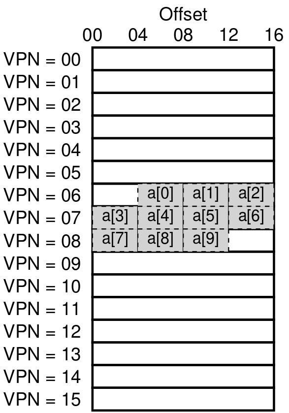

## Paging: Faster Translations (TLBs)
Using paging as the core mechanism to support virtual memory can lead to high performance overheads. By chopping the address space into small, fixed-size units (i.e., pages), paging requires a large amount of information. Because that mapping is generally stored in physical memory, paging logically requires an extra memory lookup for each virtual address generated by the program. Going to memory for translation information before every instruction fetch or explicit load or store is prohibitively slow. And thus our problem: HOW TO SPEED UP ADDRESS TRANSLATION?

And help often comes from the OS's old friend: the hardware. To speed address translation, we are going to add what is called a **translation-lookaside buffer**, or **TLB**. A TLB is part of the chip's **memory-management unit (MMU)**, and is simply a hardware **cache** of popular virtual-to-physical address translations; thus, a better name would be an **address-translation cache**. Upon each each virtual memory reference, the hardware first checks the TLB to see if the desired translation is held therein; if so, the translation is performed (quickly) *without* having to consult the page table (which has all translations). Because of their tremendous performance impact, TLBs in a real sense make virtual memory possible.

### TLB Basic Algorithm
A rough sketch of how hardware handle a virtual address translation, assuming a simple **linear page table** (i.e., the page table is an array) and a **hardware-managed TLB*.

The algorithm the hardware follows works like this: first, extract the virtual page number (VPN) from the virtual address (Line 1), and check if the TLB holds the translation for this VPN (Line 2). If it does, we have a **TLB hit**. which means the TLB holds the translation. Success! We can now extract the page frame number (PFN) from the relevant TLB entry, concatenate that onto the offset from the original virtual address, and form the desired physical address (PA), and access memory (Lines 5-7), assuming protection checks do not fail (Line 4).

If the CPU does not find the translation in the TLB (a **TLB miss**), we have some more work to do. In this example, the hardware accesses the page table to find the translation (Lines 11-12), and, assuming that the virtual memory reference generated by the process is valid and accessible (Lines 13, 15), updates the TLB with the translation (Lines 18). These set of actions are costly, primarily because of the extra memory reference needed to access the pages table (Lines 12). Finally, once the TLB is updated, the hardware retrieves the instruction; this time, the translation is found in the TLB, and the memory reference is processed quickly.

The TLB, like all caches, is built on the premise that in the common case, translations are found in the cache (i.e., are hits). If so, little overhead is added, as the TLB if found near the processing core and is designed to be fast. When a miss occurs, the high cost of paging is incurred; the page table must be accessed to find the translation, and an extra memory reference (or more, with more complex page tables) results. If this happens often, the program will likely run noticeably more slowly; memory accesses, relative to most CPU instructions, are quite costly, and TLB misses lead to more memory accesses. Thus, it is our hope to avoid TLB misses as much as we can.

### Example: Accessing An Array



To make clear the operation of a TLB, let's examine a simple virtual address trace and see how a TLB can improve its performance. In this example, let's assume we have an array of 10 4-byte integers in memory, starting at virtual address 100.

Now let's consider a simple loop that accesses each array element, something that would look like this in C:
```
int sum = 0;
for (i = 0; i < 10; i++) {
    sum += a[i];
}
```
For the sake of simplicity, we will pretend that the only memory accesses the loop generates are to the array (ignoring the variables `i` and `sum`, as well as the instructions themselves). When the first array element(`a[0]`) is accessed, the CPU will see a load to virtual address 100. The hardware extracts the VPN from this (VPN=06), and uses that to check the TLB for a valid translation. Assuming this is the first time the program accesses the array, the result will be a TLB miss.

The next access is to `a[1]`, and there is some good news here: a TLB hit! Because the second element of the array is packed next to the first, it lives on the same page; because we've already accessed this page when accessing the first element of the array, the translation is already loaded into the TLB. And hence the reason for our success. Access to `a[2]` encounters similar success (another hit), because it too lives on the same page as `a[0]` and `a[1]`.

Unfortunately, when the program accesses `a[3]`, we encounter another TLB miss. However, once again, the next entries (`a[4]` ... `a[6]`) will hit in the TLB, as they all reside on the same page in memory.