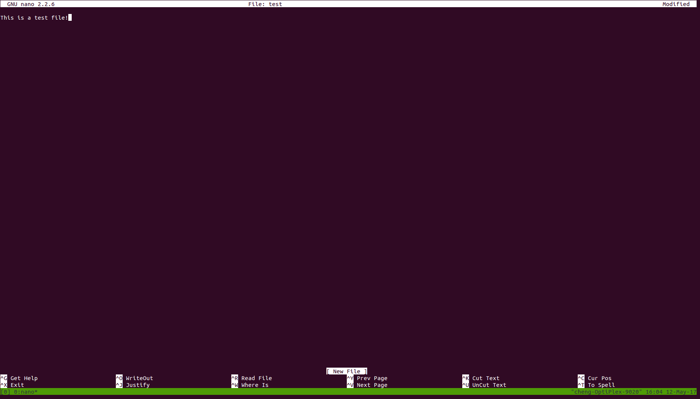
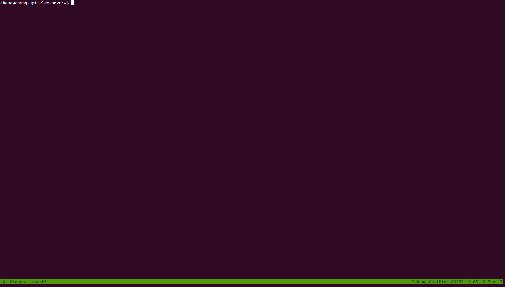
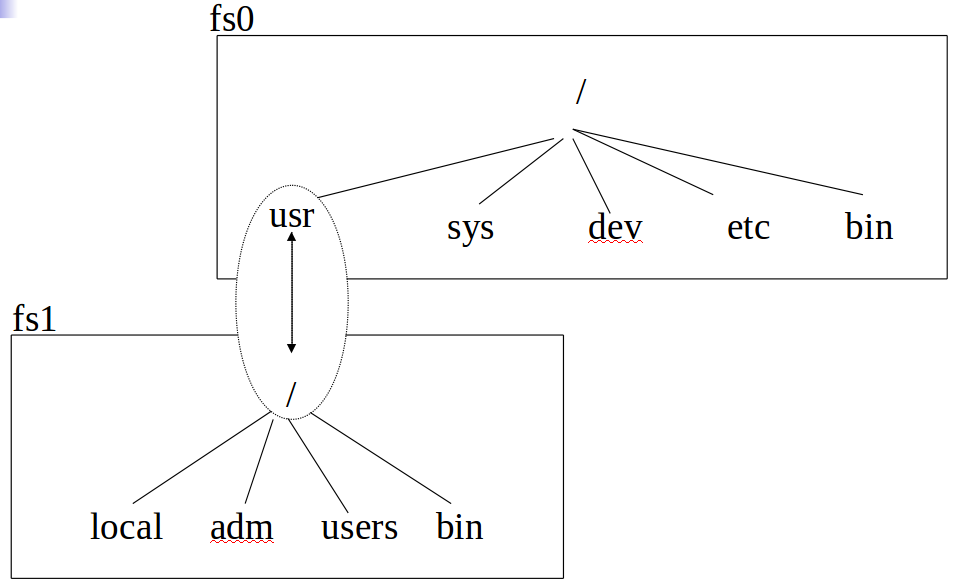

## rsync
Here is a simple example that copies `/usr/local/` (recursively, in archive mode, using the `-a` swicth) to a remote system:
```
% rsync -a /usr/local/ root@remote_host:/usr/local/
```
The `-a` switch tells rsync to operate in archive mode. This causes it to operate recursively and preserve permissions, ownership, symbolic links, device files, access times, and so on.

The only problem with this example is that it does not delete any files on the remote system.

This is where the `--delete` switch comes becomes useful. This switch tells rsync to delete any files in the destination directory that are not in the source directory.

## File Locking
Advisory locking does not prevent some process from violating the lock; it is up to the programmer to ensure that locks are appropriately acquired and released.

Mandatory locking causes the kernel to check every open, read, and write to verify that the calling process is not violating a lock on the file being accessed.

### Advisory Locking
```C
#include <sys/file.h>
int flock(int fd, int operation);
```

- fd is a file descriptor referencing to an open file
- operation is an OR of the following flags
  - LOCK_SH place a shared lock
  - LOCK_EX place an exclusive lock
  - LOCK_UN unlock instead of locking
  - LOCK_NB make a non-blocking lock request

Locks are requested on open files. Hence, to lock a file a process should have the permissions needed to open it.
Other than that, read/write/exec permissions are irrelevant.

Two alternative lock kinds are available:
- a shared lock (AKA "read lock") can be hold by several processes - LOCK_SH
- an exclusive lock (AKA "write lock") can be hold by only one process at a time, and is also incompatible with shared locks - LOCK_EX

**Blocking behavior.** If the request lock cannot be granted, the process will block. Unblocking will happen as soon as the lock can be granted, atomically with giving the grant. To avoid blocking, the flag LOCK_NB can be used. In that case, instead of blocking, flock will fail with errno set to EWOULDBLOCK.

**Unlock.** To release the currently held lock, the flag LOCK_UN can be used. Locks are also automatically released upon file close.

```C
#include <errno.h>
#include <stdio.h>
#include <string.h>
#include <sys/file.h>
#include <unistd.h>
#include "helpers.h"

#define LOCK_PATH "my−lock"

int main(int argc, char **argv) {
    int fd, lock;

    if (argc < 2 || strlen (argv[1]) < 1) {
        printf("Usage: ./flock ( x | s ) [ n ]\n");
        exit(EXIT_FAILURE);
    }
    lock = (argv[1][0] == 'x') ? LOCK_EX : LOCK_SH;
    if (argc >= 3 && strlen(argv[2]) >= 1 && argv[2][0] == 'n')
        lock |= LOCK_NB;
    if ((fd == open(LOCK_PATH, O_RDONLY)) < 0)
        err_sys("open error");
    if (flock(fd, lock) < 0) {
        if (errno == EWOULDBLOCK)
            err_sys("already locked");
        else
            err_sys("flock error (acquire)");
    }
    printf("lock acquired, sleeping...\n");
    sleep(8);
    if (flock(fd, LOCK_UN) < 0)
        err_sys("flock error (release)");

    exit(EXIT_SUCCESS);
}
```

### Mandatory Locking
Mandatory locking is enabled on a file by the combination of having the set-group-ID permission bit turned on and the group-execute permission turned off.

## lxc-snapshot
`lxc-snapshot` creates, lists, and restores container snapshots.

Snapshots are stored as snapshotted containers under the container's configuration path. For instance, if the container's configuration path is /var/lib/lxc and the container is c1, then the first snapshot will be stored as container snap0 under the path /var/lib/lxc/c1/snaps.
```
-r snapshot-name
       Restore the named snapshot, meaning a full new container is created which is a copy of the snapshot.

-n, --name=NAME
       Use container identifier NAME. 
```

## CRANE checkpoint and restore
A CRANE checkpoint operation contains three steps. First, CRANE uses CRIU to checkpoint the server’s process running within the LXC container and dumps the checkpoint to the process's current working directory. CRIU needs to modify systems files (e.g., ns_last_pid), but LXC's default isolation configuration does not permit these modifications, so we configure LXC to run in "unconfined mode". Second, CRANE stops the container, uses "diff --text" to generate a patch of current working directory and the server's installation directory against an LXC snapshot prepared before any server starts. Third, CRANE restarts the container, and restores the server process with CRIU.

## criu
### Pid restore
In order to restore PID, CRIU uses /proc/sys/kernel/ns_last_pid. It requires CONFIG_CHECKPOINT_RESTORE to be set and it's enabled in the vast majority of distros. ns_last_pid contains the last pid that was assigned by the kernel. So, when kernel needs to assign a new one, it looks into ns_last_pid, gets last_pid and assigns last_pid+1. To restore PID, criu locks ns_last_pid, writes PID-1 and calls clone().

Here is a simple program that shows how to set PID for forked child.
```C
#include <sys/stat.h>
#include <fcntl.h>
#include <stdio.h>
#include <string.h>
#include <stdlib.h>

int main(int argc, char *argv[])
{
    int fd, pid;
    char buf[32];

    if (argc != 2)
     return 1;

    printf("Opening ns_last_pid...\n");
    fd = open("/proc/sys/kernel/ns_last_pid", O_RDWR | O_CREAT, 0644);
    if (fd < 0) {
        perror("Can't open ns_last_pid");
        return 1;
    }
    printf("Done\n");

    printf("Locking ns_last_pid...\n");
    if (flock(fd, LOCK_EX)) {
        close(fd);
        printf("Can't lock ns_last_pid\n");
        return 1;
    }
    printf("Done\n");

    pid = atoi(argv[1]);
    snprintf(buf, sizeof(buf), "%d", pid - 1);

    printf("Writing pid-1 to ns_last_pid...\n");
    if (write(fd, buf, strlen(buf)) != strlen(buf)) {
        printf("Can't write to buf\n");
        return 1;
    }
    printf("Done\n");

    printf("Forking...\n");
    int new_pid;
    new_pid = fork();
    if (new_pid == 0) {
        printf("I'm child!\n");
        exit(0);
    } else if (new_pid == pid) {
        printf("I'm parent. My child got right pid!\n");
    } else {
        printf("pid does not match expected one\n");
    }
    printf("Done\n");

    printf("Cleaning up...");
    if (flock(fd, LOCK_UN)) {
        printf("Can't unlock");
    }

    close(fd);

    printf("Done\n");

    return 0;
}
```

## diff binary files
```
$ diff -ruN orig-binary.out modified-binary.out
Binary files orig-binary.out and modified-binary.out differ
$ diff -ruN --text orig-binary.out modified-binary.out &> patchfile
$ patch orig-binary.out < patchfile
$ ./orig-binary.out
```

## tmux
### Fundamentals
tmux is designed around the idea of a "client-server" model, and this means that when we start tmux (from our terminal application), we're effectively using the tmux *client*. The client will attempt to create a new *session* on the tmux *server*, and if a server doesn't exist, one will be started up in a background process to which our client can connect.

Within a session, we can do anything we could do normally within the terminal environment. The only difference is that, now, all our activity is recorded within a tmux session.

Let's consider a quick example that demonstrates why sessions are so useful. We start work in the morning by opening a new tmux session. In this session, we'll be working on our company's latest project, "X". But after lunch, we realize that although we're not quite finished with what we needed to get done, we have to jump onto an older project "A", so  we can fix some critical bug. In this scenario, we currently have quite a few tmux "windows" and "panes" open. It would be if we can keep our entire working in place, so that we can move on to this other project, and then when done with "A", we can come back and reinstate the entire "X" environment exactly as we left it.

This type of scenario occurs more often than you probably realize, and although there are ways to work around it without the use of tmux, they're not as elegant. The reason we have this power to detach and attach sessions at our leisure is because of tmux's client-server model, which means that while our computer is running, the tmux server will stay alive (thus keeping open all the different sessions we've created).

To create a new tmux session, we run the `tmux` command from our terminal application. Doing this will create and connect to a new session that is automatically named by tmux (unless you provide a name).

Notice that [0] at the very left of the status bar. This is the name of the session in brackets.

To help distinguish between different sessions you hvae running, you can give them a descriptive name. To do this, you can run the following command:
```
tmux new-session -s my_session
```
In the preceding example, we use the `-s` flag to indicate that we want to give the session we're about to create the name "`my_session`". When you start a new session, you are automatically connected to it, but you can start new sessions and not connect, by adding the `-d` flag, which indicates a "detached" state, as follows:
```
tmux new-session -s my_session -d
```

The status bar has a string that represents each window to inform us about the things that are currently running. The following steps help us to explore this a bit more:
1. Let's fire up a text editor to pretend we're doing some coding:
```
$ nano test
```
2. Now type some stuff in there to simulate working very hard on some code:


First notice how the text blob in our status bar just to the right of our session name has changed. It used to be `0:~*` and now it's `0:nano*`. Depending on the version of tmux and your chosen shell, yours might be slightly different (for example, `0:bash*`). Let's decode this string a bit.

This little string encodes a lot of information, some of which is provided in the following bullet points:
- The zero in the front represents the number of the window.
- The colon separates the window number from the name of the program running in that window.
- The symbols ~ or nano in the previous screenshots are loosely names of the running program. We say "loosely" because you'll notice that ~ is not the name of a program, but was the directory we were visiting.
- The symbol * indicates that this is the currently viewed window.

Let's create a second window so we can run a terminal command. To create a new window, run `new-window`, if you're using the command prompt.



A few things to note are as follows:
- Note there is a new window with the label 1:~*. It is given the number 1 because the last one was 0. The next will be 2, then 3,4, and so on.
- The asterisk that denoted the currently active window has been moved to 1 since it is now the active one.
- The nano application is still running in window 0.
- The asterisk on window 0 has been replaced by a hyphen (-). The - hyphen denotes the previously opened window. This is very helpful when you have a bunch of windows.

Press *`Ctrl+b`*, then *`"`*, and you will be presented with a new pane.
### Automation
1. Instruct tmux to connect to the last active session.
2. Access the first window open within that session.
3. Open the Vim text editor (and drop us into Vim's INSERT mode)/
The command we need to actually fulfill these requirements is very simple and looks like the following:
```
tmux send-keys -t 1 "vim" "C-m" "i" "programmatic content here"
```
In the preceding example, we're executing the send-keys command from outside tmux, to indicate that this could well be dropped into an automated shell script, but it's fine to execute this via the tmux command prompt. The `send-keys`command requires us to specify a target (`-t`), and all the arguments that follow the target are "keys" to be sent to that target and executed sequentially.

So, in this case, we tell it to connect to pane one, but pane one of what? How does tmux know what session to connect to? In this instance, it uses the last active session we were connected to. Next, we pass the string "vim", followed by the string "C-m", which triggers Vim to open (this is effectively another way of describing the <Enter> key).

Finally, we execute "i" (which, if that key were pressed when Vim was open, would drop us into INSERT mode), followed by "programmatic content here", which, if you're playing along at home, you’ll notice is entered into the current Vim buffer for us.

As we saw previously, we can target a pane in the latest session and control it with any command we wish to send to it. But we can also specify a *specific* session we want to target, as follows:
```
tmux send-keys -t foo:2 "vim" "C-m"
```
In the preceding example, we're telling tmux to open Vim and to specifically target (-t) the foo session and the second pane within that session (:2).

## mounting
- One file system is configured to be the "root file system" and its root directory becomes the "system root directory".
- Other file systems are attached to the root file system by mounting each new file system onto a directory in the root file system. That "mounted on" directory is also called the "mount point".



> Note: The `/proc` filesystem contains a illusionary filesystem. It does not exist on a disk. Instead, the kernel creates it in memory. It is used to provide information about the system (originally about processes, hence the name).

## Namespaces in operation
### namespaces overview
**The namespaces**

Currently, Linux implements six different types of namespaces. The purpose of each namespace is to wrap a particular global system resource in an abstraction that makes it appear to the processes within the namespace that they have their own isolated instance of the global resource. One of the overall goals of namespaces is to support the implementation of containers, a tool for lightweight virtualization (as well as other purposes) that provides a group of processes with the illusion that they are the only processes on the system.

[Mount namespaces]() isolate the set of filesystem mount points seen by a group of processes. Thus, processes in different mount namespaces can have different views of the filesystem hierarchy.

One use of mount namespaces is to create environments that are similar to chroot jails. However, by contrast with the use of the chroot() system call, mount namespaces are a more secure and flexible tool for this task.

[PID namespaces ]() isolate the process ID number space. In other words, processes in different PID namespaces can have the same PID. One of the main benefits of PID namespaces is that containers can be migrated between hosts while keeping the same process IDs for the processes inside the container. PID namespaces also allow each container to have its own `init` (PID 1), the "ancestor of all processes" that manages various system initialization tasks and reaps orphaned child processes when they terminate.

[Network namespaces]() provide isolation of the system resources associated with networking. Thus, each network namespace has its own network devices, IP addresses, IP routing tables, `/proc/net` directory, port numbers, and so on.

### the namespaces API
**Creating a child in a new namespace: clone()**

One way of creating a namespace is via the use of clone(), a system call that creates a new process. For our purposes, clone() has the following prototype:
```
int clone(int (*child_func)(void *), void *child_stack, int flags, void *arg);
```
If one of the `CLONE_NEW*` bits is specified in the call, then a new namespace of the corresponding type is created, and the new process is made a member of that namespace; multiple `CLONE_NEW*` bits can be specified in `flags`. 

### PID namespaces
The global resource isolated by PID namespaces is the process ID number space. This means that processes in different PID namespaces can have the same process ID. PID namespaces are used to implement containers that can be migrated between host systems while keeping the same process IDs for the processes inside the container.

As with processes on a traditional Linux (or UNIX) system, the process IDs within a PID namespace are unique, and are assigned sequentially starting with PID 1. Likewise, as on a traditional Linux system, PID 1—the `init` process—is special: it is the first process created within the namespace, and it performs certain management tasks within the namespace. 

**First investigations**

```C
/* A simple error-handling function: print an error message based
   on the value in 'errno' and terminate the calling process */

#define errExit(msg)    do { perror(msg); exit(EXIT_FAILURE); \
                        } while (0)

static int              /* Start function for cloned child */
childFunc(void *arg)
{
    if (sethostname(arg, strlen(arg)) == -1)
        errExit("sethostname");

    printf("childFunc(): PID  = %ld\n", (long) getpid());
    printf("childFunc(): PPID = %ld\n", (long) getppid());

    char * argv[] = {"/bin/bash", NULL};
    execv(argv[0], argv);

    errExit("execv");
}

#define STACK_SIZE (1024 * 1024)

static char child_stack[STACK_SIZE];    /* Space for child's stack */

int
main(int argc, char *argv[])
{
    pid_t child_pid;

    if (argc < 2) {
        fprintf(stderr, "Usage: %s <child-hostname>\n", argv[0]);
        exit(EXIT_FAILURE);
    }

    child_pid = clone(childFunc,
                    child_stack + STACK_SIZE,   /* Points to start of
                                                   downwardly growing stack */
                    CLONE_NEWPID | SIGCHLD, argv[1]);

    if (child_pid == -1)
        errExit("clone");

    printf("PID of child created by clone() is %ld\n", (long) child_pid);

    if (waitpid(child_pid, NULL, 0) == -1)      /* Wait for child */
        errExit("waitpid");

    exit(EXIT_SUCCESS);
}
```
Since CLONE_NEWPID is specified as part of the flags argument, the child will execute in a newly created PID namespace.

The new child process starts execution in childFunc(), which receives the last argument of the clone() call (argv[1]) as its argument.

The childFunc() function displays the process ID and parent process ID of the child created by clone() and concludes by executing the standard sleep program:
```C
printf("childFunc(): PID = %ld\n", (long) getpid());
printf("ChildFunc(): PPID = %ld\n", (long) getppid()); 
```
When we run this program, the first lines of output are as follows:
```
cheng@cheng-OptiPlex-9020:~$ sudo ./pidns bizarro
PID of child created by clone() is 7097
childFunc(): PID  = 1
childFunc(): PPID = 0
root@bizarro:~#
```
The first two lines line of output from `pidns_init_sleep` show the PID of the child process from the perspective of two different PID namespaces: the namespace of the caller of `clone()` and the namespace in which the child resides. In other words, the child process has two PIDs: 27656 in the parent namespace, and 1 in the new PID namespace created by the `clone()` call. 

The next line of output shows the parent process ID of the child, within the context of the PID namespace in which the child resides (i.e., the value returned by `getppid()`). The parent PID is 0, demonstrating a small quirk in the operation of PID namespaces. Because the parent of the child created by clone() is in a different namespace, the child cannot "see" the parent; therefore, getppid() reports the parent PID as being zero.

**/proc/PID and PID namespaces**

`ps` and `top` read their process status information from the `/proc` directory.

```
cheng@cheng-OptiPlex-9020:/u1/rootfs$ ls
bin  sys  proc ...
cheng@cheng-OptiPlex-9020:/u1/rootfs$ ls ./bin
ps pwd ...
```
chroot temporarily changes the root directory (which is normally /) to the chroot directory. As the root directory is the top of the filesystem hierarchy, applications are unable to access directories higher up than the root directory, and so are isolated from the rest of the system.
```C
static int              /* Start function for cloned child */
childFunc(void *arg)
{
    if (sethostname(arg, strlen(arg)) == -1)
        errExit("sethostname");

    printf("childFunc(): PID  = %ld\n", (long) getpid());
    printf("childFunc(): PPID = %ld\n", (long) getppid());

    if (mount("proc", "/u1/rootfs/proc", "proc", 0, NULL) == -1)
        errExit("mount procfs");

    if (mount("sysfs", "/u1/rootfs/sys", "sysfs", 0, NULL) == -1)
        errExit("mount procfs");

    ...

    chdir("/u1/rootfs");
    chroot("./");

    char * argv[] = {"/bin/bash", NULL};
    execv(argv[0], argv);

    errExit("execv");
}
```
`/u1/rootfs/proc` show the PID subdirectories for processes that reside in the child PID namespace
```
$ ls /u1/rootfs/proc
1          bus       cpuinfo    dma          filesystems  ioports   kcore       kpageflags     mdstat   mounts        partitions   self      swaps          timer_list   version            zoneinfo
acpi       cgroups   crypto     driver       fs           ipmi      key-users   latency_stats  meminfo  mtrr          sched_debug  slabinfo  sys            timer_stats  version_signature
asound     cmdline   devices    execdomains  interrupts   irq       kmsg        loadavg        misc     net           schedstat    softirqs  sysrq-trigger  tty          vmallocinfo
buddyinfo  consoles  diskstats  fb           iomem        kallsyms  kpagecount  locks          modules  pagetypeinfo  scsi         stat      sysvipc        uptime       vmstat
```
`ps` should work correctly now.
