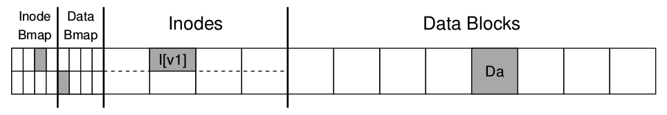
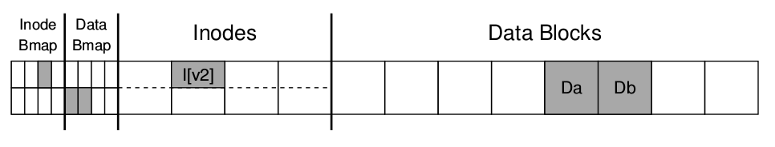
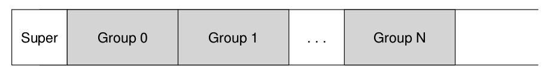
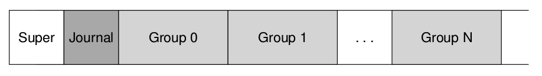
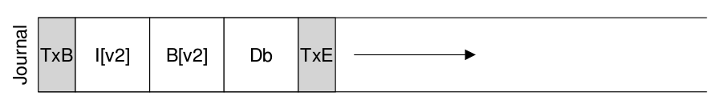
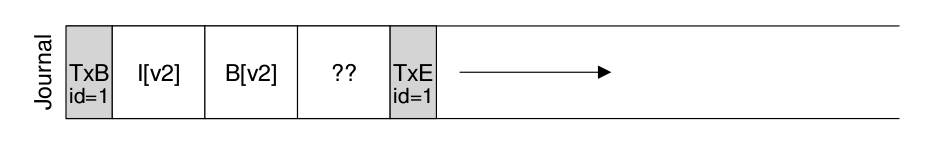
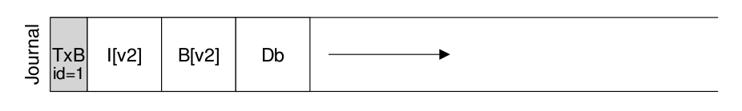
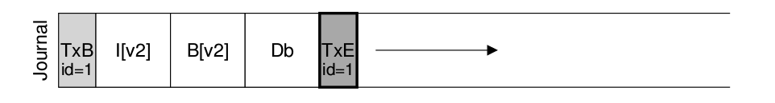

## Crash Consistency
### A detailed example
We need to use a **workload** that updates on-disk structures in some way. Assume here that the workload is simple: the append of a single data block to an existing file. The append is accomplished by opening the file, calling `lseek()` to move the file offset to the end of the file, and then issue a 4KB write to the file before closing it.

This tiny example includes an **inode bitmap** (with just 8bits, one per inode), a **data bitmap** (also 8 bits, one per data block), inodes (8 total, numbered 0 to 7, and spread across four blocks), and data blocks (8 total, numbered 0 to 7). Here is a diagram of this file system:


If you look at the structures in the picture, you can see that a single inode is allocated (inode number 2), which is marked in the inode bitamp, and a single allocated data block (data block 4), also marked in the data bitmap. The inode is denoted I[v1], as it is the first version of this inode; it will soon be updated.

Let's peek insode this simplified inode too. Inside of I[v1], we see:
```
owner       : remzi
permissions : read-write
size:       : 1
pointer     : 4
pointer     : null
pointer     : null
pointer     : null
```
In this simplified example, the `size` of the file is ` (it has one block allocated), the first pointer points to block 4 (the first block of the file, Da), and all three other pointers are set to null (indicating they are not used).

When we append to the file, we are adding a new data block to it, and must update three on-disk structures: the inode (which must point to the new block as well as have a bigger size due to the append), the new data block Db, and a new version of the data bitmap (call it B[v2]) to indicate that new data block has been allocated.

Thus, in memory of the system, we have three blocks which we must write to disk. The updated inode (inode version 2, or I[v2] for short) now looks like this:
```
owner       : remzi
permissions : read-write
size:       : 2
pointer     : 4
pointer     : 5
pointer     : null
pointer     : null
```
The updated data bitmap (B[v2]) now looks like this: 00001100. Finally, there is the data block (Db), which is just filled with whatever it is users put into files.

What we would like is for the final on-disk image of the file system to look like this:


To achieve this transition, the file system must perform three separate writes to disk, one each for the inode(I[v2]), bitmap (B[v2]), and the data block. Note that these writes usually don't happen immediately when the user issues a `write()` system call; rather, the dirty inode, bitmap, and new data will sit in main memory (int the **page cache** or **buffer cache**) for some time first; then, when the file system finally decides to write them to disk (after say 5 seconds or 30 seconds), the file system will issue the requisite write requests to the disk. Unfortunately, a crash may occur and thus interfere with these updates to the disk. In particular, if a crash happens after one or two of these writes have taken place, but not all three, the file system could be left in a funny state.

To understand the problem better, let's look at some example crash scenarios. Image only a single write succeeds; there are thus three possible outcomes, which we list here:
- **Just the data block (Db) is written to disk.** In this case, the data is on disk, but there is no inode that points to it and no bitmap that even says the block is allocated.
- **Just the updated inode (I[v2]) is written to disk.** In this case, the inode points to to the disk address (5) where Db was about to be written, but Db has not yet been written there. Thus, if we trust that pointer, we will read **garbage** data from the disk (the old contents of disk address 5).

   Furthermore, we have a new problem, which we call a **file-system inconsistency**. The on-disk bitmap is telling us that data on block 5 has not been allocated, but the inode is saying it has. This disagreement in the file system data structures is an inconsistency in the data structures of the file system; to use the file system, we must somehow resolve this problem.
- **Just the updated bitmap (B[v2]) is written to disk.** In this case, the bitmap that block 5 is allocated, but there is no inode that points to it. Thus the file system is inconsistent again; if left unresolved, this write would result in a **space leak**, as block 5 would never be used by the file system.

There are three more crash scenarios in this attemp to write three blocks to disk. In these case, two writes succeed and the last one fails:
- **The inode (I[v2]) and bitmap (B[v2]) are written to disk, but no data (Db).** In this case, the file system metadata is completely consistent: the inode has pointer to block 5, the bitmap indicates that 5 is in use, and thus everything looks OK from the perspective of the file system's metadata. But there is one problem: 5 has garbage in it again.
- **The inode (I[v2]) and the data block (Db) are written, but not the bitmap(B[v2]).** In this case, we have the inode pointing to the correct data on disk, but again have an inconsistency problem between the inode and the old version of the bitmap (B1). Thus, we once again need to solve the problem before using the file system.
- **The bitmap (B[v2]) and data block (Db) are written, but not the inode (I[v2]).** In this case, we again have an inconsistency problem between the inode and the data bitmap. However, even though the block was written and the bitmap indicates its usage, we have no idea which file it belongs to, as no inode points to the file.

### Journaling (or Write-Ahead Logging)
The basic idea is as follows. When updating the disk, before overwriting the structures in place, first write down a little note (somewhere else on the disk, in a well-known location) describing what you are about to do. Writing this note is the "write ahead" part, and we write it to a structure that we organize as a "log"; hence, write-ahead logging.

By writing the notes to disk, you are guaranteeing that if a crash takes place during the update (overwrite) of the structures you are updating, you can go back and look at the note you made and try again; thus, you will know exactly what to fix (and how to fix it) after a crash. By design, journaling adds a bit of work during updates to greatly reduce the amount of work required during recovery.

We'll now describe how **Linux ext3**, a popular journaling file system, incorporates journaling into the file system. Most of the on-disk structures are identical to **Linux ext2**, e.g., the disk is divided into block groups, and each block group has an inode and data bitmap as well as inodes and data blocks. The new key structure is the journaling itself. which occupies some small amount of space within the partition or on another device. Thus, an ext2 file system (without journaling) looks like this:


Assuming the journal is placed within the same file system image (though sometimes it is placed on a separate device, or as a file within the file system), an ext3 file system with a journal looks like this:


The real difference is just the presence of the journal, and of course, how it is used.

Data journaling is available as mode with the Linux ext3 file system, from which much of this discussion is based.

Say we have canonical update again, where we wish to write the inode (I[v2]), bitmap (B[v2]) and data block (Db) to disk again. Before writing them to their final disk locations, we are now first going to write them to the log (a.k.a journal). This is what this will look like in the log:


You can see we have written five blocks here. The transactional begin (TxB) tells us about this update, including information about pending update to the file system (e.g., the final address of the block (I[v2]), B[v2], and Db) as well as some kind of **transactional identifier (TID)**. The middle three blocks just contain the exact contents of the blocks themselves, this is known as **physical logging** as we are putting the exact physical contents of the update in the journal (an alternative idea, **logical logging**, puts a more compact logical representation of the updates in the journal, e.g., "this update wishes to append data block Db to file X", which is a little more complex but can save space in the log and perhaps improve performance). The final block (TxE) is a marker of the end of this transaction, and will also contain the TID.

Once this transaction is safely on disk, we are ready to overwrite the old structure in the file system; this process is called **checkpointing**. Thus, to **checkpoint** the file system (i.e., bring it up to date with the pending update in the journal), we issue the writes I[v2], B[v2], and Db to their disk locations as seen above; if these writes complete successfully, we have successfully checkpointed the file system and are basically done. Thus, our initial sequence of operations:
- **Journal writing:** Write the transaction, including a transaction-begin block, all pending data and metadata updates, and a transaction-end block, to the log; wait for these writes to complete.
- **Checkpoint:** Write the pending metadata and updates to their final locations in the file system.
In our example, we would write TxB, I[v2], B[v2], Db, and TxE to the journal first. When those writes complete, we would complete the updates by checkpointing I[v2], B[v2], and Db, to their final locations on disk.

Things get a little tricker when a crash occurs during the writes to the journal. Here, we are trying to write the set of blocks in the transaction (e.g., TxB, I[v2], B[v2], Db, TxE) to disk. Ideally, we'd like to issue all five block writes at once. However, this is unsafe, for the following reason: given such a big write, the disk internally may perform scheduling and complete small pieces of the big write in any order. Thus, the disk internally may (1) write TxB, I[v2], B[v2], and TxE and only later (2) write Db. Unfortunately, if the disk loses power between (1) and (2), this is what ends up on disk:


Why is this a problem? Well, the transaction looks like a valid transaction (it has a begin and and end with matching sequence numbers). Furthermore, the file system can't look at that fourth block and know it is wrong; after all, it is arbitrary data. Thus, if the file system now reboots and runs recovery, it will replay this transaction, and ignorantly copy the contents of the garbage block "??" to the location where Db is supposed to live. This is bad for arbitrary user data in a life; it is much worse if it happens to a critical piece of the file system, such as the superblock, which could render the file system unmountable.

To avoid this problem, the file system issues the transaction write in two steps. First, it writes all blocks except the TxE block to the journal, issuing these writes all at once. When these writes are complete, the journal will look something like this:


When those writes complete, the file system issues the write of the TxE block, thus leaving the journal in this final, safe state:


An important aspect of this process is the atomicity guarantee provided by the disk. It turns out that the disk guarantees that any 512-byte write will either happen or not (and never be half-written); thus, to make sure the write of TxE is atomic, one should make it a single 512-byte block. Thus, our current protocol to update the file system, with each of its three phases labeled:
- **Journal write:** Write the contents of the transaction (including TxB, metadata, and data) to the log; wait for these writes to complete.
- **Journal commit**: Write the transaction commit block (containing TxE) to the log; wait for write to complete; transaction is said to be **committed**.
- Checkpoint: Write the contents of the update (metadata and data) to their final on-disk locations.

Let’s now understand how a file system can use the contents of the journal to **recover** from a crash. A crash may happen at any time during this sequence of updates. If the crash happens before the transaction is written safely to the log, then our job is easy: the pending update is simply skipped. If the crash happens after the transaction has committed to the log, but before the checkpoint is complete, the file system can **recover** the update as follows. When the system boots, the file system recovery process will scan the log and look for transactions that have committed to the disk; these transactions are thus **replayed** (in order), with the file system again attempting to write out the blocks in the transaction to their final on-disk locations. This form of logging is one of the simplest forms there is, and is called **redo logging**.
