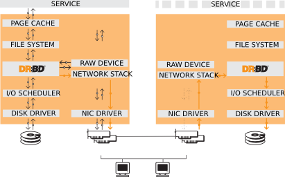

## Introduction to DRBD
### DRBD Fundamentals
The Distributed Replication Block Device (DRBD) is a software-based, shared-nothing, replication storage solution mirroring the content of block devices (hard disks, partitions, logical volumes etc.) between servers.

#### Kernel module
In single-primary mode, any resource is, at any given time, in the primary role on only one cluster member. Since it is thus guaranteed that only one cluster node manipulates the data at any moment, this mode can be used with any conventional file system (ext3, ext4, XFS etc.).

### DRBD Features
#### Dual-primary mode
In dual-primary mode, any resource is, at any given time, in the primary role on both cluster nodes. Since concurrent access to the data is thus possible, this mode requires the use of a shared cluster file system that utilizes a distributed lock manager.

With a standard filesystem (Ext3/4, XFS ...), the following situation could arise: Imagine a DRBD resource with an Ext4 filesystem on it. DRBD is in Dual-Primary mode, the Ext4 filesystem is mounted on both cluster nodes. Application A writes something down to the filesystem residing on the DRBD resource on node A, which then gets written to the physical storage device. At the very same time, application B tries to write something down to the filesystem on node B, which gets written down to exactly the same region on the storage device of node B.

DRBD replicates the changes from node A to node B and the other way around. It changes the contents of the physical storage device. However - as DRBD resides *under* the mentioned Ext4 filesystems, the filesystem on the physical disk of node A does not notice the changes coming from node B (and vice versa). This process is called a **concurrent write**. Starting from now, the actual content of the storage device differs from what the filesystem there thinks it should be.

#### Replication modes

**Protocol A.** 
Asynchronous replication protocol. Local write operations on the primary node are considered completed as soon as the local disk write has occurred, and the replication packet has been placed in the local TCP send buffer.

**Protocol C.** 
Synchronous replication protocol. Local write operations on the primary node are considered completed only after both the local and the remote disk write have been confirmed.

**Protocol D.** 
Protocol D which operates like protocol A, with the following differences:
1. The system can operate in Dual Primary mode with the following properties:
   1. Writes propagated to remote machine are "buffered" in memory (epoch buffers)

   1. When a checkpoint is issued by local machine (currently via an ioctl interface), it is queued up as a P_BARRIER packet (with a checkpoint number).

   1. On receiving this special barrier packet, the Remote machine acknowledges reception of all data buffers via P_CHECKPOINT_ACK and then falls through the usual barrier sync code (creates a new epoch and asynchronously start flushing the previous epoch buffer to disk).

   1. The wait_for_checkpoint_ack ioctl returns success to caller on receipt of P_CHECKPOINT_ACK. This constitutes a checkpoint commit.

   1. If local machine fails, remote machine discards it's current epoch (uncommitted checkpoint)

1. The system can also operate in usual primary/secondary mode, in which case, the functionality is identical to that of Protocol A, ie there are no checkpoints. Plain asynchronous replication.
