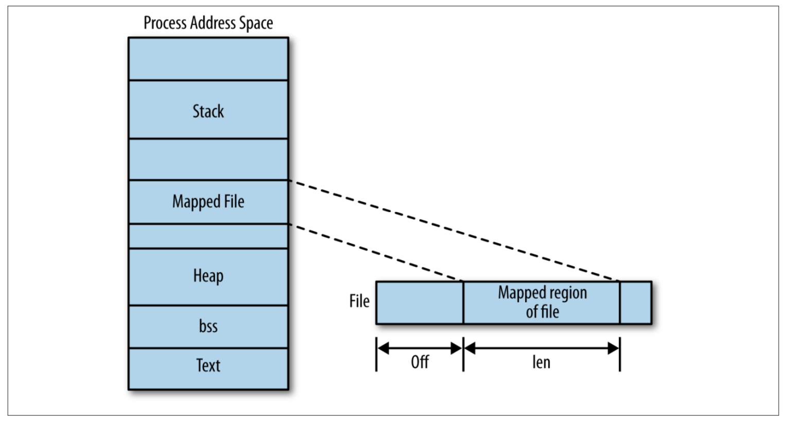

## File I/O
The kernel maintains a per-process list of open files, called the *file table*. This table is indexed via nonnegative integers known as *file descriptors*, Each entry in the list contains information about an open file, including a pointer to an in-memory copy of the file's backing inode and associated metadata, such as the file position and access modes.

By default, a child process receives a copy of its parent's file table. The list of open files and their access modes, current file positions, and so on, are the same, but a change in one process - say, the child closing a file - does not affect the other process' file table. However, it is possible for the child and parent to share the parent's file table.

File descriptors are represented by the C `int` type.

Unless the process explicitly closes them, every process by convention has at least three file descriptors open: 0, 1, and 2. File descriptor 0 is *standard in (stdin)*, file descriptor 1 is *standard out (stdout)*, and file descriptor 2 is *standard error (stderr)*. Instead of referencing these integers directly, the C library provides the preprocessor defines STDIN_FILENO, STDOUT_FILENO.

### Opening Files
**The open() system call**

A file is opened, and a file descriptor is obtained with the `open` system call:
```
int open (const char *name, int flags);
```
The `flags` argument must be one of `O_RDONLY`, `O_WRONLY`, or `O_RDWR`. Respectively, these arguments request that the file be opened only for reading, only for writing, or for both reading and writing.

The `flags` argument can be bitwise-ORed with one or more of the following values, modifying the behavior of the open request:
- `O_DIRECT`
- `O_SYNC`
- ...

### Reading via read()

Each call reads up to `len` bytes into `buf` from the current file offset of the file referenced by `fd`. The file position is advanced by the number of bytes read from `fd`.

### Writing with write()

```
ssize_t write (int fd, const void *buf, size_t count);
```
A call to `write()` writes up to `count` bytes starting at `buf` to the current file position of the file referenced by the file descriptor `fd`.

On success, the number of bytes written is returned, and the file position is updated.

**Behavior of write()**

When a call to `write()` returns, the kernel has copies the data from the supplied buffer into a kernel buffer, but there is no guarantee that the data has been written out to its intended destination. Indeed, write calls return much too fast for that to be the case.

Instead, when a suer-space application issues a `write()` system call, the Linux kernel performs a few checks, and then simply copies the data into a buffer. Later, in the background, the kernel gathers up all of the "dirty" buffers, sorts them optimally, and writes them out to disk (a process known as *writeback*). This allows write calls to occur lightning fast, returning almost immediately. It also allows the kernel to defer writes to more idle periods, and batch many writes together.

The delayed writes do not change POSIX semantics. For example, if a read is issued for a piece of just-written data that lives in a buffer and is not yet on disk, the request will be satisfied from the buffer, and not cause a read from the "stale" data on disk. This behavior actually improves performance, as the read is satisfied from an in-memory cache without having to go to disk. The read and write requests interleave as intended, and the results are as expected - that is, if the system does not crash before the data makes it to disk! Even though an application may believe that a write has occurred successfully, in this event, the data will never make it to disk.

Another issue with delayed writes is the inability to enforce *write ordering*. Although an application may take care to order its write operation requests in such a way that they hit the disk in a specific order, the kernel will reorder the write requests as it sees fit, primarily for performance. This is normally a problem only if the system crashes, as eventually all of the buffers are written back and all is well.

The kernel does attempt to minimize the risks of defferred writes. To ensure that data is written out in a timely manner, the kernel institutes a *maximum buffer age*, and writes out all dirty buffers before they mature past the given value. Users can configure this value via `/proc/sys/vm/dirty_expire_centiseconds`.

### Synchronized I/O
Buffering writes provides a *huge* performance improvement, and consequently, any operating system even halfway deserving the mark "modern" implementations delayed writes via buffers. Nonetheless, there are times when applications want to control when data hits the disk.

**fsync() and fdatasync()**

The simplest method of ensuring that data has reached the disk is via the `fsync()` system call
```
#include <unistd.h>
int fysnc (int fd);
```
A call to `sync()` ensures that all dirty data associated with the file mapped by the file descriptor `fd` is written back to disk. The call writes back both data and metadata, such as creation timestamps, and other attributes contained in the inode. It will not return until the hard drive says that the data and metadata are on the disk.

In the case of write caches on hard disks, it is not possible for `fsync()` to know whether the data is physically on the disk. The hard drive can report that the data was written, but the data may in fact reside in the drive's write cache.

Linux also provides the system call `fdatasync()`:
```
#include <unistd.h>
int fdataysnc (int fd);
```
This system call does the same thing as `fsync()`, except that it only flushes data. The call does not guarantee that metadata is synchronized to disk, and therefore potentially faster.

**The O_SYNC Flag**

The `O_SYNC` flag may be passed to `open`, indicating that all I/O on the file should be *synchronized*.

As discussed previously, calls to `write()` are not normally not synchronized. There is no relationship between the call returning and the data being committed to disk. The `O_SYNC` forces the relationship. ensuring that calls to `write()` perform synchronized I/O.

One way of looking at `O_SYNC` is that it forces an implicit `fsync()` after each `write()` operation, before the call returns. These are indeed the semantics provided, although the Linux kernel implements `O_SYNC` a bit more efficiently.

**O_DSYNC**

POSIX defines two other synchronized-I/O-related `open()` flags: `O_DSYNC` and `O_RSYNC`. On Linux, these flags are defined to be synonymous with `O_SYNC`; they provide in the same behavior.

The `O_DYSNC` flags specifies that only normal data be synchronized after each write operation, not metadata. Think of it as causing an implicit `fdatasync()` after each write request.

### Direct I/O
The Linux kernel, like any modern operating system kernel, implements a complex layer of caching, buffer, and I/O management between devices and applications. A high-performance application may wish to bypass this layer of complexity and perform its own I/O management.

Providing the `O_DIRECT` to `open()` instructs the kernel to minimize the presence of I/O management. When this flag is provided, I/O will initiate directly from user-space buffers to the device, bypassing the page cache. All I/O will be synchronous; operations will not return until completed.

> Recall that the storage may itself store the data in a write-back cache, so `fsync()` is still required for files opened with `O_DIRECT` in order to save the data to stable storage.

When providing direct I/O, the request length, buffer alignment, and file offsets must all be integer multiples of the underlying device's sector size - generally, this is 512 bytes.

### Seeking with lseek()
Normally, I/O occurs linearly through a file, and the implicit updates to the file position caused by reads and writes are all the seeking that is needed. Some applications, however, need to jump around in the file. The `lseek()` system call is provided to set the file position of a file descriptor to a given file. Other than updating the file position, it performs no other action, and initiates no I/O whatsoever:
```
off_t lseek (int fd, off_t pos, int origin);
```
The behavior of `lseek()` depends on the `origin argument`, which can be one of the following:
- `SEEK_CUR`
  - The current file position of `fd` is set to its current value plus `pos`, which can be negative, zero, or positive. A `pos` of zero returns the current file position value.
- `SEEK_SET`
  - The current file position of `fd` is set to `pos`. A `pos` of zero sets the offset to the beginning of the file.

The call returns the new file position on success.

For example, to set the file position of `fd` to 1825:
```
off_t ret;

ret = lseek(fd, (off_t)1825, SEEK_SET);
if (ret == (off_t)-1)
         /* error */
```
As `lseek()` returns the updated file position, it can be used to find the current file position via a `SEEK_CUR` to zero:
```
int pos;

ret = lseek(fd, 0, SEEK_CUR);
if (ret == (off_t)-1)
         /* error */
else
         /* 'pos' is the current position of `fd` */
```

### Positional Reads and Writes
Both receive the file position from which to read or write. Upon completion, they do not update the file position.

The read form is called `pread()`:
```c
#include <unistd.h>
ssize_t pread (int fd, void *buf, size_t count, off_t pos);
```
This call reads up to `count` bytes into `buf` from the file descriptor `fd` at file position `pos`.

The write form is called `pwrite()`:
```c
#include <unistd.h>
ssize_t pwrite (int fd, const void *buf, size_t count, off_t pos);
```
This call writes up to `count` bytes from `buf` to the file descriptor `fd` at file position `pos`.

These calls are almost identical in behavior to their non-`p` brethren, except that they completely ignore the current file position; instead of using the current position, they use the value provided by `pos`.

### Kernel Internals

**The Page Cache**

The page cache is an in-memory store of recently accessed data from an on-disk filesystem. Disk access is painfully slow, particularly relative to today's processor speeds. Storing requested data in memory allows the kernel fulfill subsequent requests for the same data from memory, avoiding repeated disk access.

The page cache is the first place that the kernel looks for filesystem data. The kernel invokes the memory subsystem to read data from the disk only when it isn't found in the cache. Thus, the first time any item of data is read, it is transferred from the disk into the page cache, and is returned to the application from the cache. If that data is then read again, it is simply returned from the cache. All operations transparently execute through the page cache, ensuring that its data is relevant and always valid.

The Linux page cache is dynamic in size. As I/O operations bring more and more data into memory, the page cache grows larger and larger, consuming any free memory. If the page cache eventually does consume all free memory and an allocation is committed that requests additional memory, the page cache is *pruned*.

**Page Writeback**

As discussed earlier in "Behavior of write()", the kernel defers writes via buffers. When a process issues a write request, the dara is copied into a buffer, and the buffer is marked *dirty*, denoting that the in-memory copy is newer than the on-disk copy. The write request then simply returns. If another write request is made to the same chunk of a file, the buffer is updated with the new data. Write requests elsewhere in the same file generate new buffers.

Eventually the dirty buffers need to be committed to disk, synchronizing the on-disk files with the data in memory. This is known as writeback. It occurs in two situations:
- When free memory shrinks below a configurable threshold, dirty buffers are written back to disk so that the now-clean buffers may be removed, freeing memory.
- When a dirty buffer ages beyond a configurable threshold, the buffer is written back to disk. This prevents data from remaining dirty indefinitely.

Writebacks are carried out by a gang of kernel threads named *pdflush* threads (presumably for *page dirty flush*, but who knows). When one of the previous two conditions is met, the pdflush threads wake up, and begin committing dirty buffers to disk until neither condition is true.

## Buffered I/O
### User-Buffered I/O
Programs that have to issue many small I/O requests to regular files often perform *user-buffered I/O*. This refers to buffering done in user-space, either manually by the application, or transparently in a library, not to buffering done by the kernel. As discussed in Chapter 2. for reasons of performance, the kernel buffers data internally by delaying writes, coalescing adjacent I/O requests, and reading ahead. Through different means, user buffering also aims to improve performance.

### Standard I/O
The standard C library provides the standard I/O library, which in turn provides a platform-independent, user-buffering solution.

The remainder of this chapter discusses user-buffered I/O as it pertains to file I/O, and is implemented in the standard C library - that is, opening, closing, reading and writing files via the standard C library. Whether an application will use standard I/O, a home-rolled user-buffering solution, or straight system calls is a decision that developers must make carefully after weighing the application's needs and behavior.

**File Pointers**

Standard I/O routines do not operate directly on file descriptors. Instead, they use their own unique identifier, known as *file descriptor*. The file pointer is represented by a pointer to the `FILE` typedef, which is defined in `<stdio.h>`.

In standard I/O parlance, an open file is called a *stream*. Streams may be opened for reading (*input stream*), writing (*output streams*), or both (*input/output streams*).

### Opening Files

Files are opened for reading or writing via `fopen()`:
```
#include <stdio.h>
FILE * fopen (const char*path, const char *mode);
```

### Writing to a stream
As with reading, the standard C library defines many functions for writing to an open stream. This section will look at the most popular approaches to writing: writing a single character, writing a string of characters, and writing binary data. Such varied writing approaches are ideally suited to buffered I/O.

**Writing a String of Characters**
The function `fputs()` is used to write an entire string to a given stream:
```
int fputs(const char *str, FILE *stream);
```
A call to `fputs()` writes all of the null-terminated string pointed at by str `str` to the stream pointed by `stream`.

### Flushing a Stream
The standard I/O library provides an interface for writing out the user buffer to the kernel, ensuring that all data written to a stream is flushed via `write()`.

On invocation, any unwritten data in the stream pointed to by `stream` is flushed to the kernel.

To understand the effect of `fflush()`, you have to understand the difference between the buffer maintained by the C library, and the kernel's own buffering. All of the calls described in this chapter work with a buffer that is maintained by the C library, which resides in user space, not kernel space. That is where the performance improvement comes in - you are staying in user space, and therefore running user code, not issuing system calls. A system call is issued only when the disk or some other medium has to be accessed.

`fflush()` merely writes the user-buffered data out to the kernel buffer. The effect is the same as if user buffering was not employed, and `write()` was used directly. It does not guarantee that the data is physically committed to any medium - for that need, use something like `fsync()`. Most likely, you will want to call `fflush()`, followed immediately by `fsync()`: that is, first ensure the user buffer is written out to the kernel, and then ensure that the kernel's buffer is written out to disk.

## Advanced File I/O
### Mapping Files into Memory
As an alternative to standard file I/O, the kernel provides an interface that allows an application to map a file into memory, meaning that there is a one-to-one correspondence between a memory address and a word in the file. The programmers can then access the file directly through memory, identically to any other chunk of memory-resident data - it is even possible to allow writes to the memory region to transparently map back to the file on the disk.

#### mmap()

A call to `mmap()` asks the kernel to map `len` bytes of the object represented by the file descriptor `fd`, starting at `offset` bytes into the file, into memory.  If `addr` is included, it indicates a preference to use that starting address in memory.
```
#include <sys/mman.h>

void *mmap (void *addr, size_t len, int prot, int flags, int fd, off_t offset)
```
The `addr` parameter offers a suggestion to the kernel of where best to map the file. It is only a hint; most users pass 0. The call returns the actual address in memory where the mapping begins.

The `prot` parameter describes the desired memory protection of the mapping. It may be a bitwise OR of one or more of the following flags:
- `PROT_READ`

  The pages may be read

- `PROT_WRITE`

  The pages may be written

The desired memory protection must not conflict with the open mode of the file. For example, if the program opens the file read-only, `prot` must not specify `PROT_WRITE`.

The `flags` argument describes the type of mapping and some elements of its behavior. It is a bitwise OR of the following values:

- `MAP_FIXED`

  Instructs `mmap()` to treat `addr` as a requirement, not a hint. If the kernel is unable to place the mapping at the given address, the call fails.

- `MAP_PRIVATE`

  States that the mapping is not shared. The file is mapped copy-on-write, and any changes made in memory by this process are not reflected in the actual file, or in the mappings of other processes.

- `MAP_SHARED`

  Shares the mapping with all other processes that map this same file. Writing into the mapping is equivalent to writing to the file. Reads from the mapping will reflect the writes of other processes.

Either `MAP_SHARED` or `MAP_PRIVATE` must be specified, but not both.

Figure below shows the effects of parameters supplied with `mmap()` on the mapping between a file and a process's address space.



**The page size**

The `mmap()` system call operates on pages. Both the `addr` and `offset` parameters must be aligned on a page-sized boundary. That is, they must be integer multiples of the page size.

Mappings are, therefore, integer multiples of pages. If the `len` parameter provided by the caller is not aligned on a page boundary—perhaps because the underlying file's size is not a multiple of the page size—the mapping is rounded up to the next full page. The bytes inside this added memory, between the last valid byte and the end of the mapping, are zero-filled. Any read from that region will return zeros. Any writes to that memory will not affect the backing file, even if it is mapped as `MAP_SHARED`. Only the original `len` bytes are ever written back to the file.

The standard POSIX method of obtaining the page size is with `sysconf()`, which can retrieve a variety of system-specific information:
```
#include <unistd.h>

long sysconf(int name);
```
A call to sysconf() returns the value of the configuration item name, or −1 if name is invalid.

POSIX defines `_SC_PAGESIZE` (and a synonym,` _SC_PAGE_SIZE`) to be the size of a page, in bytes. Therefore, obtaining the page size at runtime is simple:
```
long page_size = sysconf (_SC_PAGESIZE);
```
Linux also provides the `getpagesize()` function:
```
#include <unistd.h>
int getpagesize(void);
```
A call to `getpagesize()` will likewise return the size of a page, in bytes. Usage is even simpler than `sysconf()`:
```
int page_size = getpagesize();
```
Not all Unix systems support this function;

#### Advantages of mmap()
Manipulating files via `mmap()` has a handful of advantages over the standard `read()` and `write()` system calls. Among them are:
- Reading from and writing to a memory-mapped file avoids the extraneous copy that occurs when using the `read()` or `write()` system calls, where the data must be copied to and from a user-space buffer.
- Aside from any potential page faults, reading from and writing to a memory-mapped file does not incur any system call or context switch overhead. It is as simple as accessing memory.
- When multiple processes map the same object into memory, the data is shared among all the processes. Read-only and shared writable mappings are shared in their entirety; private writable mappings have their not-yet-COW (copy-on-write) pages shared.

#### Disadvantages of mmap()
There are a few points to keep in mind when using `mmap()`:
- Memory mappings are always an integer number of pages in size. Thus, the difference between the size of the backing file and an integer number of pages is "wasted" as slack space. For small files, a significant percentage of the mapping may be wasted. For example, with 4 KB pages, a 7-byte mapping wastes 4089 bytes.

For these reasons, the benefits of `mmap()` are most greatly realized when the mapped file is large (and thus any wasted space is a small percentage of the total mapping), or when the total size of the mapped file is evenly divisible by the page size (and thus there is no wasted space).

#### Synchronizing a File with a Mapping
POSIX provides a memory-mapped equivalent of the `fsync()` system call:
```
#include <sys/mman.h>

int msync(void *addr, size_t len, int flags);
```
A call to `msync()` flushes back to disk any changes made to a file mapped via `mmap()`, synchronizing the mapped file with the mapping. Specifically, the file or subset of a file associated with the mapping starting at memory address `addr` and continuing for `len` bytes is synchronized to disk. The `addr` argument must be page-aligned; it is generally the return value from a previous `mmap()` invocation.

Without invocation of `msync()`, there is no guarantee that a dirty mapping will be written back to disk until the file is unmapped. When writing into a memory mapping, the process directly modifies the file's pages in the kernel's page cache without kernel involvement. The kernel may not synchronize the page cache and the disk anytime soon.

## Memory Management
### The Process Address Space
Linux, like any modern operating system, virtualizes its physical resource of memory.
#### Pages and Paging
Memory is composed of bits, of which (usually) eight make a byte. Bytes compose words, which in turn compose *pages*. For the purposes of memory management, the page is the most important of these: it is the smallest addressable unit of memory that the memory management unit (MMU) can manage. Thus the virtual address space is carved up into pages. The machine architecture determines the *page size*.

Pages are either valid or invalid. A *valid* page is associated with an actual page of data, either in physical memory (RAM) or on secondary storage, such as a swap partition or file on disk. An *invalid page* is not associated with anything and represents an unused, unallocated piece of the address space. Accessing an invalid page results in a segmentation violation.

**Sharing and copy-on-write**

Multiple pages of virtual memory, even in different virtual address spaces owned by different processes, may map to a single physical page. This allows different virtual address spaces to *share* the data in physical memory. For example, at any given moment there is a good chance that many processes on the system are using the standard C library. With shared memory, each of these processes may map the library into their virtual address space, but only one copy need exist in physical memory.

The shared data may be read-only, writable, or both readable and writable. When a process writes to a shared writable page, one of two things can happen. The simplest is that the kernel allows the write to occur, in which case all processes sharing the page can see the results of the write operation. Usually, allowing multiple processes to read from or write to a shared page requires some level of coordination and synchronization among the processes, but at the kernel level the write "just works" and all processes sharing the data instantly see the modifications.

Alternatively, the MMU can intercept the write operation and raise an exception; the kernel, in response, will transparently create a new copy of the page for the writing process, and allow the write to continue against the new page. We call this approach copy-on-write (COW). Effectively, processes are allowed read access to shared data, which saves space. But when a process wants to write to a shared page, it receives a unique copy of that page on the fly, thereby allowing the kernel to act as if the process always had its own private copy. As copy-on-write occurs on a page-by-page basis, with this technique a huge file may be efficiently shared among many processes, and the individual processes will receive unique physical pages only for those pages to which they themselves write.

#### Memory Regions
Certain types of memory regions can be found in every process:
- The *text segment* contains a process's program code, string literals, constant variables, and other read-only data.
- The stack contains the process's execution stack, which grows and shrinks dynamically as the stack depth increases and decreases. The execution stack contains local variables and function return data. In a multithreaded process, there is one stack per thread.
- The data segment, or heap, contains a process's dynamic memory. This segment is writable and can grow or shrink in size. `malloc()` can satisfy memory requests from this segment.

### Allocating Dynamic Memory
Dynamic memory is allocated at runtime, not compile time, in sizes that may be unknown until the moment of allocation. As a developer, you need dynamic memory when the amount of memory that you will need, or how long you might need it, varies and is not known before the program runs. For example, you might want to store in memory the contents of a file or input read in from the keyboard. Because the size of the file is unknown, and the user may type any number of keystrokes, the size of the buffer will vary, and you may need to make it dynamically larger as you read more and more data.

The classic C interface for obtaining dynamic memory is `malloc()`:
```
#include <stdlib.h>
void * malloc(size_t size);
```
A successful call to `malloc()` allocates size bytes of memory and returns a pointer to the start of the newly allocated region. The contents of the memory are undefined; do not expect the memory to be zeroed.

#### Alignment
Data alignment refers to the way data is arranged in memory. A memory address `A` is said to be n-byte aligned when n is a power-of-2 and `A` is a multiple of n.

**Allocating aligned memory**

```
#define _GNU_SOURCE

#include <stdlib.h>
int posix_memalign(void **memptr, size_t alignment, size_t size);
```
A successful call to `posix_memalign()` allocates size `bytes` of dynamic memory, ensuring it is aligned along a memory address that is a multiple of `alignment`. The parameter `alignment` must be a power of 2 and a multiple of the size of a `void` pointer. The address of the allocated memory is placed in `memptr`, and the call returns 0.

#### Managing the Data Segment
```
#include <unistd.h>
int brk(void *end);
void * sbrk(intptr_t increment);
```
Dynamic memory allocations in the heap grew upward from the bottom of the segment; the stack grew downward toward the heap from the top of the segment. The line of demarcation separating the two was called the *break* or the *break point*.

A call to `brk()` sets the break point (the end of the data segment) to the address specified by `end`.

A call to `sbrk()` increments the end of the data segment by increment bytes, which may be a positive or negative delta. `sbrk()` returns the revised break point. Thus, an increment of 0 provides the current break point:
```
printf ("The current break point is %p\n", sbrk (0));
```
### Anonymous Memory Mappings
The classic method of implementing `malloc()` is to divide the data segment into a series of power-of-2 partitions and satisfy allocations by returning the partition that is the closest fit to the requested size. Freeing memory is as simple as marking the partition as "free." If adjacent partitions are free, they can be coalesced into a single, larger partition. If the top of the heap is entirely free, the system can use `brk()` to lower the break point, shrinking the heap and returning memory to the kernel.

This algorithm is called a *buddy memory allocation scheme*. It has the upside of speed and simplicity but the downside of introducing two types of fragmentation. *Internal fragmentation* occurs when more memory than requested is used to satisfy an allocation. This results in inefficient use of the available memory. *External fragmentation* occurs when sufficient memory is free to satisfy a request, but it is split into two or more nonadjacent chunks. This can result in inefficient use of memory (because a larger, less suitable block may be used), or failed memory allocations (if no alternative block exists).

Moreover, this scheme allows one memory allocation to "pin" another, preventing a traditional C library from returning freed memory to the kernel. Imagine that two blocks of memory, block *A* and block *B*, are allocated. Block *A* sits right on the break point, and block *B* sits right below *A*. Even if the program frees *B*, the C library cannot adjust the break point until *A* is likewise freed. In this manner, a long-living allocation can pin all other allocations in memory.

Consequently, for large allocations, *glibc* does not use the heap. Instead, *glibc* creates an *anonymous memory mapping* to satisfy the allocation request. Anonymous memory mappings are similar to the file-based mappings, except that they are not backed by any file—hence the "anonymous" moniker. Instead, an anonymous memory mapping is simply a large, zero-filled block of memory, ready for your use. Think of it as a brand new heap, solely for a single allocation. Because these mappings are located outside of the heap, they do not contribute to the data segment's fragmentation.

Juggling the pros against the cons, *glibc*'s `malloc()` uses the data segment to satisfy small allocations and anonymous memory mappings to satisfy large allocations.

Allocating memory via anonymous mappings has several benefits:
- No fragmentation concerns. When the program no longer needs an anonymous memory mapping, the mapping is unmapped, and the memory is immediately returned to the system.
- Each allocation exists in a separate memory mapping. There is no need to manage the global heap.

There are also two downsides to using anonymous memory mappings rather than the heap:
- Each memory mapping is an integer multiple of the system page size in size.
- Creating a new memory mapping incurs more overhead than satisfying allocations from the heap, which may not involve any kernel interaction whatsoever.

### Creating Anonymous Memory Mappings
Creating an anonymous memory mapping is actually easier than creating a file-backed mapping, as there is no file to open and manage. The primary difference is the presence of a special flag, signifying that the mapping is anonymous.

Let's look at an example:
```
void *p;

p = mmap(NULL, 512 * 1024, PROT_READ | PROT_WRITE, MAP_ANONYMOUS | MAP_PRIVATE, -1, 0);

if (p == MAP_FAILED)
        perror("mmap");
else
        /* 'p' points at 512 KB of anonymous memory... */
```
- The first parameter, `start`, is set to `NULL`, signifying that the anonymous mapping may begin anywhere in memory that the kernel wishes. Specifying a non-`NULL` value here is possible, so long as it is page-aligned, but limits portability. Rarely does a program care where mappings exist in memory.
- The `prot` parameter usually sets both the `PROT_READ` and `PROT_WRITE` bits, making the mapping readable and writable.
- The `flags` parameter sets the `MAP_ANONYMOUS` bit, making this mapping anonymous, and the `MAP_PRIVATE` bit, making this mapping private.
- The `fd` and `offset` parameters are ignored when `MAP_ANONYMOUS` is set.

## sysbench
### fileio
This test mode can be used to produce various kinds of file I/O workloads. At the `prepare` stage SysBench creates a specified number of files with a specified total size, then at the `run` stage, each thread performs specified I/O operations on this set of files.

The following I/O operations are supported:
- **seqwr**

  sequential write

- **seqrd**

  sequential read

- **rndrd**

  random read

- **rndwr**

  random write

- **rndrw**

  combined random read/write

Below is a list of test-specific option for the **fileio** mode:

Option | Description | Default value
------------ | ------------- | -------------
--file-num | Number of files to create | 128
--file-block-size | Block size to use in all I/O operations | 16K
--file-total-size | Total size of files | 2G
--file-test-mode | Type of workload to produce. Possible values: seqwr, seqrd, rndrd, rndwr, rndwr | required
--file-extra-flags | Additional flags to use with open(2) | 
--file-fsync-all | Do fsync() after each write operation | no
--file-fsync-end | Do fsync() at the end of the test | yes
--file-fsync-mode | Which method to use for synchronization. Possible values: fsync, fdatasync | fsync

```
$ sysbench --num-threads=16 --test=fileio --file-total-size=3G --file-test-mode=rndrw --debug=on prepare
$ sysbench --num-threads=16 --test=fileio --file-total-size=3G --file-test-mode=rndrw --debug=on run
$ sysbench --num-threads=16 --test=fileio --file-total-size=3G --file-test-mode=rndrw --debug=on cleanup
```
In the above example the first command creates 128 files with the total size of 3GB in the current directory, the second command runs the actual benchmark and displays the results upon completion, and the third one removes the files used for the test.
