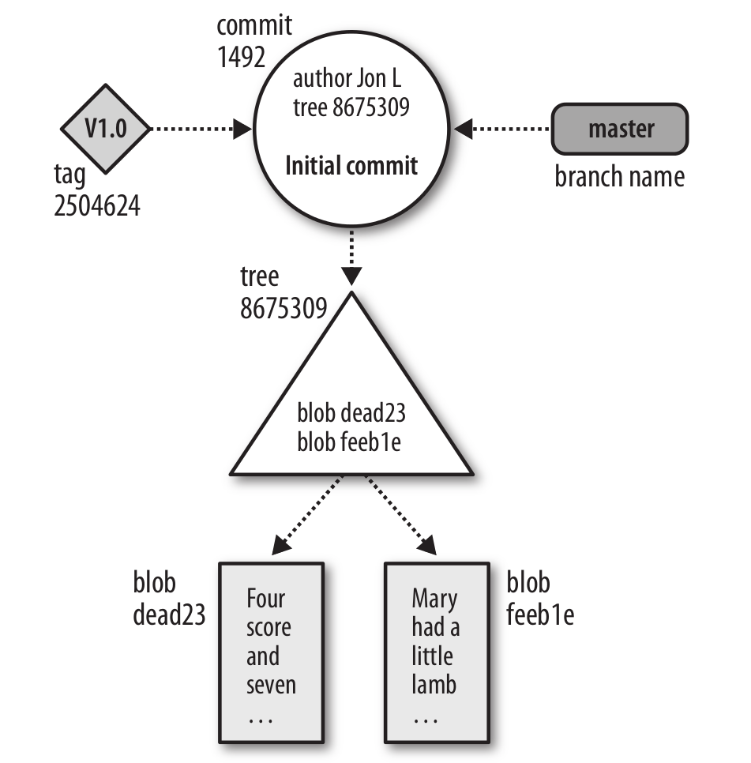

## Remote Repositories
### Publishing Repositories
#### Repositories with Controlled Access
In the following example, the repository published in */tmp/Depot/public_html.git* is accessed by a developer who has SSH access to the hosting machine:
```
desktop$ cd /tmp
desktop$ git clone ssh://example.com/tmp/Depot/public_html.git
Initialize public_html/.git
Initialized empty Git repository in /tmp/public_html/.git/
jdl@example.com's password:
remote: Counting objects: 27, done.
Receiving objects: 100% (27/27), done.objects: 3% (1/27)
Resolving deltas: 100% (7/7), done.
remote: Compressing objects: 100% (23/23), done.
remote: Total 27 (delremote: ta 7), reused 0 (delta 0)
```
When that clone is made, it records the source repository using the URL *ssh://example.com/tmp/Depot/public_html.git*.

Similarly, other commands such as `git fetch` and `git push` can now be used across the network:
```
desktop$ git push
jdl@example.com's password:
Counting objects: 5, done.
Compressing objects: 100% (3/3), done.
Writing objects: 100% (3/3), 385 bytes, done.
Total 3 (delta 1), reused 0 (delta 0)
To ssh://example.com/tmp/Depot/public_html.git
   55c15c8..451e41c master -> master
```

## Basic Git Concepts
### Basic Concepts
#### Git Object Types
- Blobs

  Each version of a file is represented as a *blob*. "Blob" is a contraction of "binary large object," a term that's commonly used in computing to refer to some variable or file that can contain any data and whose internal structure is ignored by the program. A blob is treated as opaque. A blob holds a file's data but does not contain any metadata about the file or even its name.
- Trees

  A *tree* object represents one level of directory information. It records blob identifiers, pathnames, and a bit of metadata for all the files in one directory. It can also recursively reference other (sub)tree objects and thus build a complete hierarchy of files and subdirectories.
- Commits

  A *commit* object holds metadata for each change introduced into the repository, including the author, committer, commit date, and log message. Each commit points to a tree object that captures, in one complete snapshot, the state of the repository at the time the commit was performed. The initial commit, or *root commit*, has no parent.



## Combining Projects
### The Native Solution: gitlinks and git submodule
#### gitlinks
A *gitlink* is a link from a tree object to a commit object.

Recall that each commit object points to a tree object and that each tree object points to a set of blobs and trees, which correspond (respectively) to files and subdirectories. A commit's tree object uniquely identifies the exact set of files, filenames, and permissions attached to that commit.

But we haven't yet seen a tree object pointing to a commit object. The gitlink is Git's mechanism to indicate a direct reference to another Git repository.

Let's try it out. We'll create a `myapp` repository and import the Git source code into it:
```
$ cd /tmp
$ mkdir myapp
$ cd myapp

# Start the new super-project
$ git init
Initialized empty Git repository in /tmp/myapp/.git/

$ echo hello >hello.txt

$ git add hello.txt

$ git commit -m 'first commit'
[master (root-commit)]: created c3d9856: "first commit"
 1 files changed, 1 insertions(+), 0 deletions(-)
 create mode 100644 hello.txt
```
Then we import the `git` project:
```
$ ls
hello.txt

# Copy in a repository clone
$ git clone ~/git.git git
Initialized empty Git repository in /tmp/myapp/git/.git/

$ cd git
# Establish the desired submodule version
$ git checkout v1.6.0
Note: moving to "v1.6.0" which isn't a local branch
If you want to create a new branch from this checkout, you may do so
(now or later) by using -b with the checkout command again. Example:
  git checkout -b <new_branch_name>
HEAD is now at ea02eef... GIT 1.6.0

# Back to the super-project
$ cd ..

$ ls
git/  hello.txt

$ git add git

$ git commit -m 'imported git v1.6.0'
[master]: created b0814ac: "imported git v1.6.0"
 1 files changed, 1 insertions(+), 0 deletions(-)
 create mode 160000 git
```
Because there already exists a directory called *git/.git* (created during the `git clone`), `git add git` knows to create a gitlink to it.

The commit message shows that only one file changed. The resulting tree looks like this:
```
$ git ls-tree HEAD
160000 commit ea02eef096d4bfcbb83e76cfab0fcb42dbcad35e    git
100644 blob ce013625030ba8dba906f756967f9e9ca394464a      hello.txt
```
The *git* subdirectory is of type `commit` and has mode 160000. That makes it a gitlink.

Git usually treats gitlinks as simple pointer values or references to other repositories. Most Git operations, such as `clone`, do not dereference the gitlinks and then act on the submodule repository.

In the following example, the git subproject directory remains empty after the `clone` command:
```
$ cd /tmp

$ git clone myapp app2
Initialized empty Git repository in /tmp/app2/.git/

$ cd app2

$ ls
git/  hello.txt

$ ls git

$ du git
4       git
```
#### The git submodule Command
Its job is simple: to follow gitlinks and check out the corresponding repositories for you.

First of all, you should be aware that there's no particular magic involved in checking out a submodule's files. In the *app2* directory we just cloned, you could do it yourself:
```
$ cd /tmp/app2

$ git ls-files --stage -- git
160000 ea02eef096d4bfcbb83e76cfab0fcb42dbcad35e 0    git

$ rmdir git

$ git clone ~/git.git git
Initialized empty Git repository in /tmp/app2/git/.git/

$ cd git

$ git checkout ea02eef
Note: moving to "ea02eef" which isn't a local branch
If you want to create a new branch from this checkout, you may do so
(now or later) by using -b with the checkout command again. Example:
  git checkout -b <new_branch_name>
HEAD is now at ea02eef... GIT 1.6.0
```
The commands you just ran are exactly equivalent to `git submodule update`. The only difference is that git submodule will do the tedious work, such as determining the correct commit ID to check out for you. Unfortunately, it doesn't know how to do this
without a bit of help:
```
$ git submodule update
No submodule mapping found in .gitmodules for path 'git'
```
The `git submodule` command needs to know one important bit of information before it can do anything: where can it find the repository for your submodule? It retrieves that information from a file called *.gitmodules*, which looks like this:
```
[submodule "git"]
        path = git
        url = /home/bob/git.git
```
Using the file is a two-step process. First, create the *.gitmodules* file, either by hand or with `git submodule add`.
```
$ cat >.gitmodules <<EOF
[submodule "git"]
        path = git
        url = /home/bob/git.git
EOF
```
The git submodule add command that performs the same operations is:
```
$ git submodule add /home/bob/git.git git
```
Next, run git submodule init to copy the settings from the *.gitmodules* file into your *.git/config* file:
```
$ git submodule init
Submodule 'git' (/home/bob/git.git) registered for path 'git'

$ cat .git/config
[core]
        repositoryformatversion = 0
        filemode = true
        bare = false
        logallrefupdates = true
[remote "origin"]
        url = /tmp/myapp
        fetch = +refs/heads/*:refs/remotes/origin/*
[branch "master"]
        remote = origin
        merge = refs/heads/master
[submodule "git"]
        url = /home/bob/git.git
```
The `git submodule init` command added only the last two lines.

The reason for this step is that you can reconfigure your local submodules to point at a different repository from the one in the official *.gitmodules*. If you make a clone of someone's project that uses submodules, you might want to keep your own copy of the submodules and point your local clone at that. In that case, you wouldn't want to change the module's official location in *.gitmodules*, but you would want `git submodule` to look at your preferred location. So git submodule init copies any missing submodule information from *.gitmodules* into *.git/config*, where you can safely edit it. Just find the `[submodule]` section referring to the submodule you're changing, and edit the URL.

Finally, run `git submodule update` to actually update the files:
```
$ git submodule update
Initialized empty Git repository in /tmp/app2/git/.git/
Submodule path 'git': checked out 'ea02eef096d4bfcbb83e76cfab0fcb42dbcad35e'
```
Here, `git submodule update` goes to the repository pointed to in your *.git/config*, fetches the commit ID found in `git ls-tree HEAD -- git`, and checks out that revision in the directory specified in *.git/config*.
