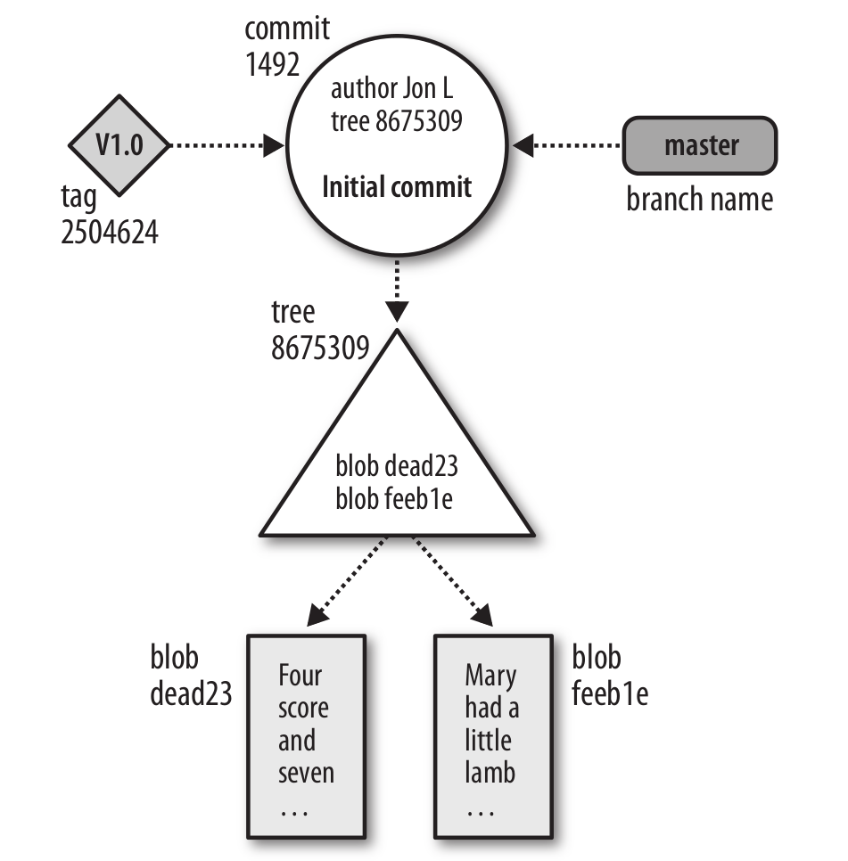
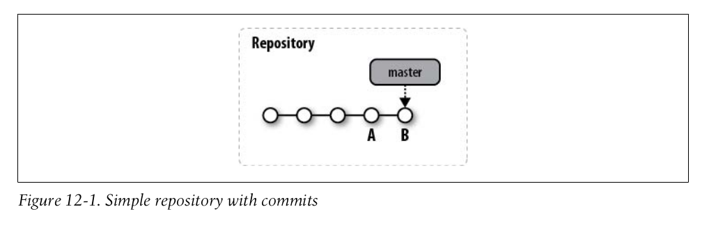
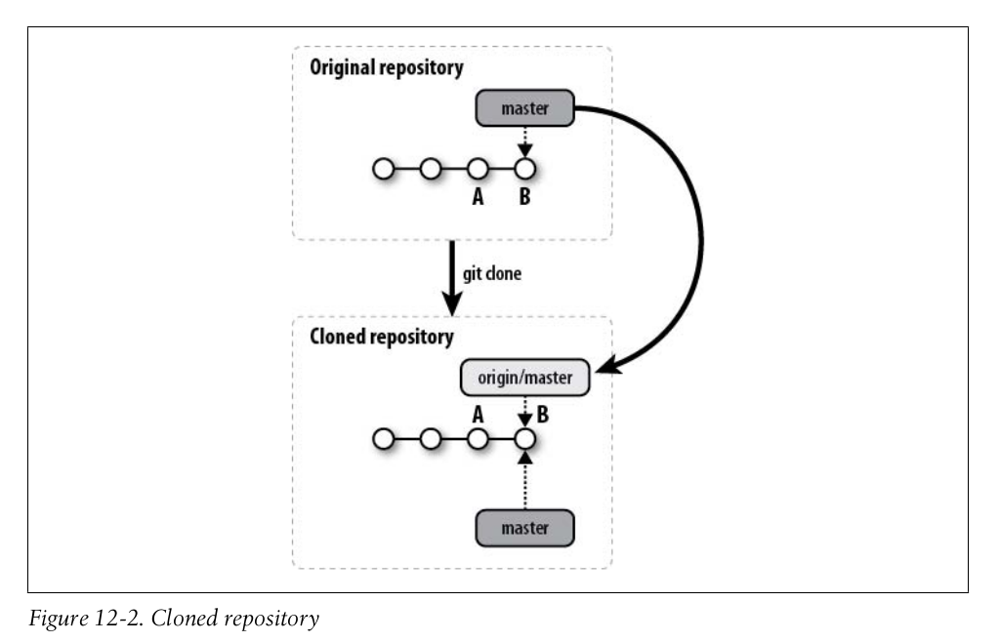
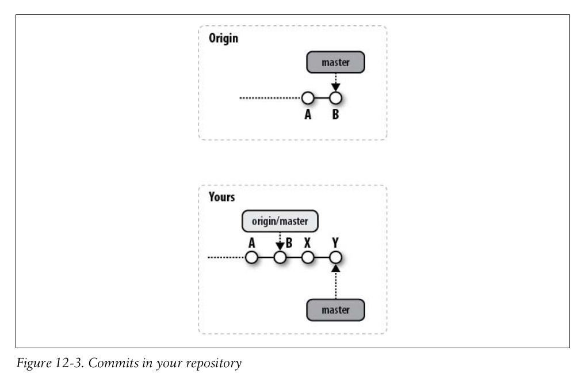
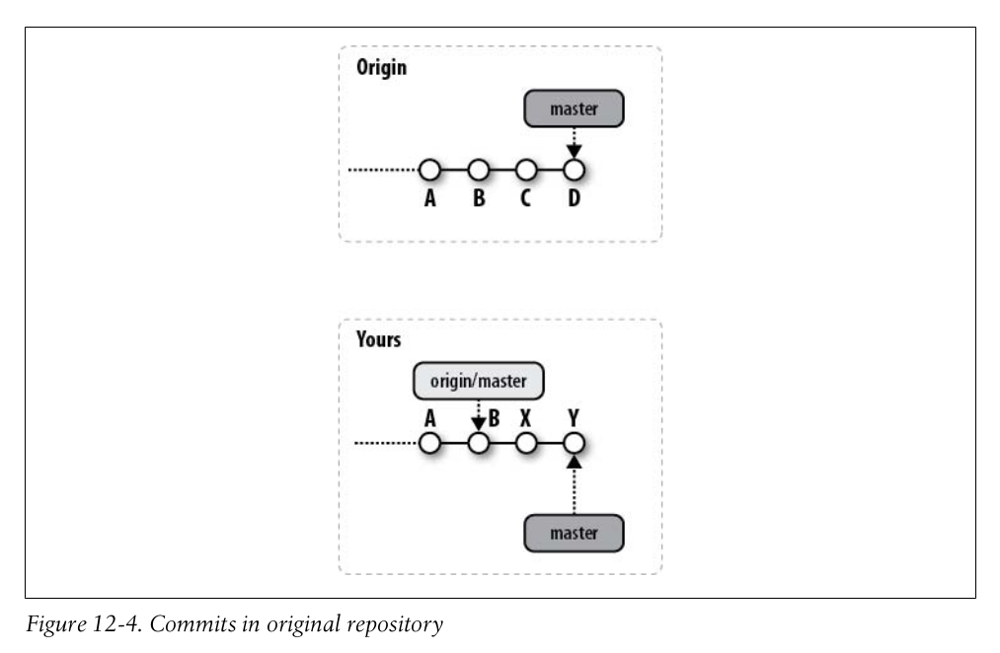
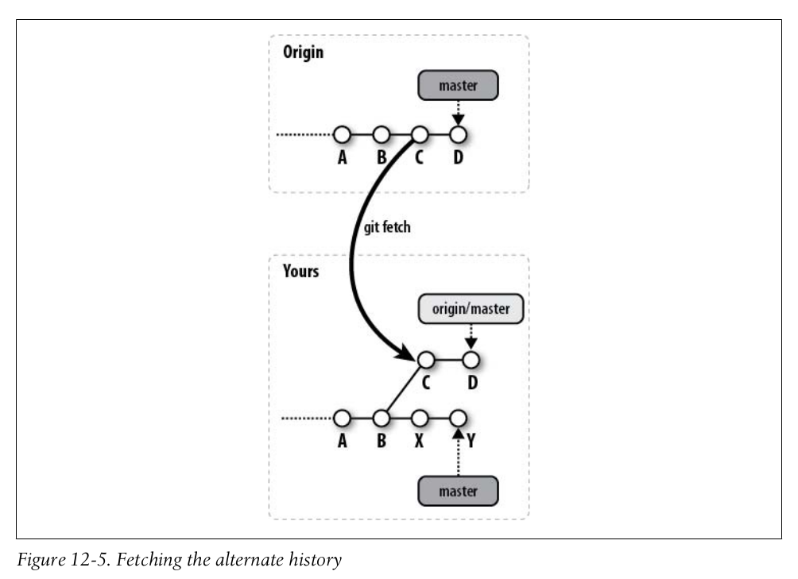
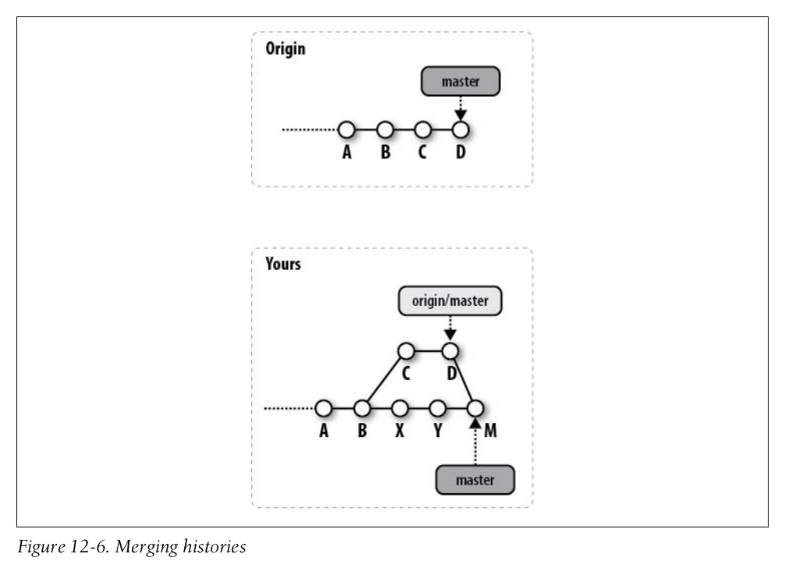
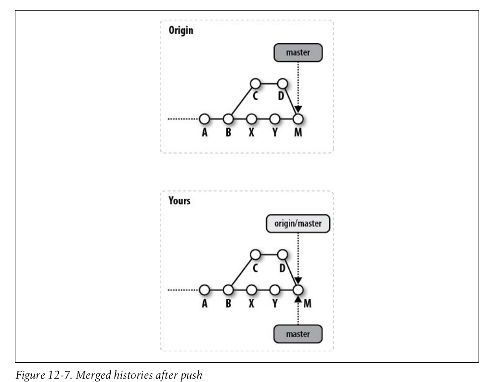

## Basic Git Concepts
### Basic Concepts
#### Git Object Types
- Blobs

  Each version of a file is represented as a *blob*. "Blob" is a contraction of "binary large object," a term that's commonly used in computing to refer to some variable or file that can contain any data and whose internal structure is ignored by the program. A blob is treated as opaque. A blob holds a file's data but does not contain any metadata about the file or even its name.
- Trees

  A *tree* object represents one level of directory information. It records blob identifiers, pathnames, and a bit of metadata for all the files in one directory. It can also recursively reference other (sub)tree objects and thus build a complete hierarchy of files and subdirectories.
- Commits

  A *commit* object holds metadata for each change introduced into the repository, including the author, committer, commit date, and log message. Each commit points to a tree object that captures, in one complete snapshot, the state of the repository at the time the commit was performed. The initial commit, or *root commit*, has no parent.



## File Management and the Index
### File Classifications in Git
Git classifies your files into three subgroups:
- *Tracked*
- *Ignored*
   An ignored file must be explicitly declared "invisible" or "ignored" in the repository, even though it may be present within your working directory.
- *Untracked*
   An untracked file is any file not found in either of the previous two categories.

Let's explore the different categories of files by creating a brand new working directory and repository and then working with some files:
```
$ cd /tmp/my_stuff
$ git init

$ git status
# On branch master
#
# Initial commit
#
nothing to commit (create/copy files and use "git add" to track)

$ echo "New data" > data

$ git status
# On branch master
#
# Initial commit
# Untracked files:
#   (use "git add <file>..." to include in what will be committed)
#
#       data
nothing added to commit but untracked files present (use "git add" to track)
```
Initially, there are no files, and the tracked, ignored, and therefore untracked sets are empty. Once you create *data*, `git status` reports a single, untracked file.

Editors and build environments often leave temporary or transit files among your source code. Such files usually shouldn't be tracked as source files in a repository. To have Git ignore a file within a directory, simply add that file's name to the special file, *.gitignore*:
```
# Manually create an example junk file
$ touch main.o

$ git status
# On branch master
# Initial commit
#
# Untracked files:
#   (use "git add <file>..." to include in what will be committed)
#       data
#       main.o

$ echo main.o > .gitignore
$ git status
# On branch master
#
# Initial commit
#
# Untracked files:
#   (use "git add <file>..." to include in what will be committed)
#
#       .gitignore
#       data
```
Thus, *main.o* is ignored, but `git status` now shows a new, untracked file called *.gitignore*. Although the *.gitignore* file has special meaning to Git, it is managed just like any other normal file within your repository. Until *.gitignore* is added, Git considers it untracked.

### Using git add
The command `git add` stages a file. In terms of Git's file classifications, if a file is
untracked, `git add` converts that file's status to tracked.

Let's continue the example from the previous section:
```
$ git status
# On branch master
#
# Initial commit
#
# Untracked files:
#   (use "git add <file>..." to include in what will be committed)
#
#       .gitignore
#       data

# Track both new files.
$ git add data .gitignore

$ git status
# On branch master
#
# Initial commit
#
# Changes to be committed
#   (use "git rm --cached <file>..." to unstage)
#
#       new fiel:.gitignore
#       new file: data
#
```
The first `git status` shows you that two files are untracked and reminds you that to make a file tracked, you simply need to use `git add`. After `git add`, both *data* and *.gitignore* are staged and tracked, ready to be added to the repository on the next commit.

## Commits
### Identifying Commits
#### refs and symrefs
Git maintains several special symrefs automatically for particular purposes. They can be used anywhere a commit is used:
- `HEAD`<br>
  `HEAD` always refers to the most recent commit on the current branch. When you change branches, `HEAD` is updated to refer to the new branch's latest commit.

## Branches
### Checking Out Branches
#### Detached HEAD Branches
Normally, it's advisable to check out only the tip of a branch by naming the branch directly. Thus, by default, `git checkout` changes to the tip of a desired branch.

However, you can check out any commit. In such an instance, Git creates a sort of anonymous branch for you called a *detached HEAD*. Git creates a detached `HEAD` when you:
- Check out a commit that is not the head of a branch.
- Check out the commit referenced by a tag. You might do this to put together a release based on tagged versions of files.

In these cases, Git tells you that you have moved to a detached `HEAD`:
```
# I have a copy of the Git sources handy!
$ cd git.git

$ git checkout v1.6.0
Note: moving to "v1.6.0" which isn't a local branch
If you want to create a new branch from this checkout, you may do so
(now or later) by using -b with the checkout command again. Example:
  git checkout -b <new_branch_name>
HEAD is now at ea02eef... GIT 1.6.0
```
If, after finding yourself on a detached `HEAD`, you later decide that you need to make new commits at that point and keep them, you must first create a new branch:
```
$ git checkout -b new_branch
```
This will give you a new, proper branch based on the commit where the detached `HEAD` was. You can then continue with normal development. Essentially, you named the branch that was previously anonymous.

To find out if you are on a detached `HEAD`, just ask:
```
$ git branch
* (no branch)
  master
```
On the other hand, if you are finished with the detached `HEAD` and want to simply abandon that state, you can convert to a named branch by simply entering `git checkout branch:`
```
$ git checkout master
Previous HEAD position was ea02eef... GIT 1.6.0
Checking out files: 100% (608/608), done.
Switched to branch "master"

$ git branch
* master
```
## Altering Commits
### Using git cherry-pick
The command `git cherry-pick commit` applies the changes introduced by the named `commit` on the current branch. It will introduce a new, distinct commit. Strictly speaking, using `git cheery-pick` doesn't *alter* the existing history within a repository; instead, it adds to the history.

As with other Git operations that introduce changes via the process of applying a diff, you may need to resolve conflicts to fully apply the changes from the given `commit`.

The command `git cherry-pick` is typically used to introduce particular commits from one branch within a repository onto a different branch. A common use is to forward- or back-port commits from a maintenance branch to a development branch.

In Figure 10-4, the `dev` branch has normal development, whereas the `rel_2.3` contains commits for the maintenance of release `2.3`.


During the course of normal development, a bug is fixed on the development line with commit `F`. If that bugs turns out to be present in the `2.3` release also, the bug fix, `F`, can be made to the `rel_2.3` branch using `git cherry-pick`:

```
$ git checkout rel_2.3

$ git cherry-pick dev~2 # commit F, above
```
After `cherry-pick`, the graph resembles Figure 10-5.


In Figure 10-5, commit `F'` is substantially similar to commit `F`, but it is a new commit and will have to be adjusted - perhaps with conflict resolutions - to account for its application to commit `Z` rather commit `E`. None of the commits following `F` are applied after `F'`; only the named commit is picked and applied.

### Rebasing Commits
A common use for `git rebase` is to keep a series of commits that you are developing
up-to-date with respect to another branch, usually a `master` branch or a tracking branch
from another repository.

In Figure 10-12, two branches have been developed. Originally, the `topic` branch
started on the `master` branch when it was at commit `B`. In the meantime, it has pro-
gressed to commit `E`.

You can keep your commit series up-to-date with respect to the `master` branch by writing the commits so that they are based on commit `E` rather than `B`. Because the `topic` branch needs to be the current branch, you can use either:
```
$ git checkout topic
$ git rebase master
```
or
```
$ git rebase master topic
```
After the rebase operation is complete, the new commit graph resembles Figure 10-13.

The rebase operation relocates commits one at a time from each respective original commit location to a new commit base. As a result, each commit that is moved might have conflicts to resolve.

> To see the beginning of the merge conflict in your file, search the file for the conflict marker `<<<<<<<`. When you open the file in your text editor, you'll see the changes from the HEAD or base branch after the line `<<<<<<< HEAD`. Next, you'll see `=======`, which divides your changes from the changes in the other branch, followed by `>>>>>>> BRANCH-NAME`. In this example, one person wrote "open an issue" in the base or HEAD branch and another person wrote "ask your question in IRC" in the compare branch or `branch-a`.
>
> ```
> If you have questions, please
> <<<<<<< HEAD
> open an issue
> =======
> ask your question in IRC.
> >>>>>>> branch-a
> ```

## Remote Repositories
### Repository Concepts
#### Repository Clones
In "Making a Copy of Your Repository" on page 27 of Chapter 3, we showed how `git clone` can be used to create a copy of your *public_html* repository:
```
$ git clone public_html my_website
```
Here, *public_html* is considered the original, "remote" repository. The new, resulting clone is *my_website*.

Similarly, `git clone` can be used to clone a copy of a repository from network sites:
```
# All on one line...
$ git clone git://git.kernel.org/pub/scm/linux/kernel/git/torvalds/linux-2.6.git
```
By default, each new clone maintains a link back to its parent repository via a remote called *origin*.

The name "origin" isn't special in any way. If you don't want to use it, simply specify an alternate with the `--origin name` option during the clone operation.

In this case, the remote repository's branches are available in the clone on branch names prefixed with `/origin`, such as `origin/master`, `origin/dev`, or `/origin/maint`.

#### Remotes
The repository you're currently working in is called the *local* or *current* repository, and the repository with which you exchange files is called the *remote repository*. But the latter term is a bit of misnomer, because the repository may or may not be on a physically remote or event different machine; it could conceivably be just another repository on a local filesystem.

### Example Using Remote Repositories
#### Make Your Own Origin Remote
Right now, you have two repositories that are virtually identical, except the initial repository has a working directory and the bare clone does not.

Moreover, because the *~/public_html* repository in your home directory was created using `git init` and *not* via a `clone`, it lacks an `origin`. In fact, it has no remote configured at all.

It is easy enough to add one, though. And it's needed if the goal is to perform more development in your initial repository and then push that development to the newly established, authoritative repository in the depot. In a sense, you must manually convert your initial repository into a derived one.

A developer who clones from the depot will have an `origin` remote created automatically. In fact, if you were to turn around now and clone off the depot, you would see it set up for you automatically, too.

The command for manipulating remotes is `git remote`. This operation introduces a few new settings in the *.git/config* file:
```
$ cd ~/public_html

$ cat .git/config
[core]
        repositoryformatversion = 0
        filemode = true
        bare = false
        logallrefupdates = true

$ git remote add origin /tmp/Depot/public_html

$ cat .git/config
[core]
        repositoryformatversion = 0
        filemode = true
        bare = false
        logallrefupdates = true
[remote "origin"]
        url = /tmp/Depot/public_html
        fetch = +refs/heads/*:refs/remotes/origin/*
```
Here, `git remote` added a new `remote` section called `origin` to our configuration. The name `origin` isn't magical or special. You could have used any other name, but the remote that points back to the basis repository is named `origin` by convention.

The remote establishes a link from your current repository to the remote repository found, in this case, at */tmp/Depot/public_html.git*, as recorded in the `url` value. Now, within this repository, the name `origin` can be used as a shorthand reference for the remote repository found in the depot.

### Remote Repository Development Cycle in Pictures
Integrating your local development with changes from an upstream repository is at the very core of the distributed development cycle in Git. Let's take a moment to visualize what happens to both your local repository and an upstream origin repository during clone and pull operations.

Let's start with the simple repository shown in Figure 12-1 as the basis for discussion.



As with all of our commit graphs, the sequence of commit flows from left to right and the `master` label points to the `HEAD` of the branch. The two most recent commits are labeled `A` and `B`.

#### Cloning a Repository
A `git clone` command results in two separate repositories, as shown in Figure 12-2.



This picture illustrates some important results of the clone operation:
- All the commits from the original repository are copied to your clone; you could now easily retrieve earlier stages of the project from your own repository.
- The branch name `master` from the original repository is introduced into your clone on a new *remote-tracking* branch named `origin/master`.
- Within the new clone repository, the new `origin/master` branch is initialized to point to the `master HEAD` commit, which is `B` in the figure.
- A new local-tracking branch called `master` is created in your clone.
- The new `master` branch is initialized to point to `origin/HEAD`, the original repository's active branch `HEAD`. That happens to be `origin/master`, so is also point to be the exact same commit, `B`.

After cloning, Git selects the new `master` branch as the current branch and checks it out for you. Thus, unless you change branches, any changes you make after a `clone` will affect your `master`.

In all of these diagrams, development branches in both the original repository and the derived clone repository are distinguished by a dark shaded background, and remote-tracking branches by a lighter shaded background. It is important to understand that both the local-tracking and remote-tracking branches are private and local to their respective repositories.

#### Alternate Histories
Once you have cloned and obtained your development repository, two distinct paths of development may result. First, you may do development in your repository and make new commits on your `master` branch, as shown in Figure 12-3. In this picture, your development extends the `master` branch with two new commits, `X` and `Y`, which are based on `B`.



In the meantime, any other developer who has access to the original repository might have done further development and pushed her changes into that repository. Those changes are represented in Figure 12-4 by the addition of commits `C` and `D`.



In this situation, we say that the histories of the repositories have *diverged* or *forked* at commit `B`. In much the same way that local branching within one repository causes alternate histories to diverge at a commit, a repository and its clone can diverge into alternate histories as a result of separate actions by possibly different people. It is important to realize that this is perfectly fine and that neither history is more correct than the other.

In fact, the whole point of the merge operation is that these different histories may be brought back together and resolved again. Let's see how Git implements that!

#### Non-Fast-Forward Pushes
If you are developing in a repository model in which you have the ability to `git push` your changes into the `origin` repository, then you might attempt to push your changes at any time. This could create problems if some other developer has already previously pushed commits.

This hazard is particularly common when you are using a shared repository development model in which all developers can push their own commits and updates into a common repository at any time.

Let's look again at Figure 12-3, in which you have made new commits, `X` and `Y`, based on `B`.

If you wanted to push your `X` and `Y` commits upstream at this point, you could do so easily. Git would transfer your commits to the `origin` repository and add them on to the history at `B`. Git would then perform a special type of merge operation called a *fast-forward* on the `master` branch, putting in your edits and updating the ref to point to `Y`.

On the other hand, suppose another developer had already pushed some commits to the origin repository and the picture was more like Figure 12-4 when you attempted to push *your* history up to the `origin` repository. In effect, you are attempting to cause your history to be sent to the shared repository when there is already a different history there. The `origin` history does not simply fast-forward from `B`. This situation is called the *non-fast-forward push problem*.

When you attempt your push, Git rejects it and tells you about the conflict with a message like this:
```
$ git push
To /tmp/Depot/public_html
 ! [rejected]        master -> master (non-fast forward)
error: failed to push some refs to 'tmp/Depot/public_html'
```
So what are you really trying to do? Do you want to overwrite the other developer's work, or do you want to incorporate both sets of histories?

More often, you are not trying to wipe out the existing `origin history but just want your own changes to be added. In this case, you must perform a merge of the two histories in your repository before pushing.

More often, you are not trying to wipe out the existing origin history but just want
your own changes to be added. In this case, you must perform a merge of the two

#### Fetching the Alternate History
For Git to perform a merge between two alternate histories, both must be present within one repository on two different branches. Branches that are purely local development branches are a special (degenerate) case of their already being in the same repository.

However, if the alternate histories are in different repositories because of cloning, then the remote branch must be brought into your repository via a fetch operation. You can carry out the operation through a direct `git fetch` command or as part of a `git pull` command; it doesn't matter which. In either case, the fetch brings the remote's commits, here `C` and `D`, into your repository. The results are shown in Figure 12-5.



In no way does the introduction of the alternate history with commits `C` and `D` change the history represented by `X` and `Y`; the two alternate histories both now exist simultaneously in your repository and form a more complex graph. Your history is represented by your `master` branch, and the remote history is represented by the `origin/master` remote-tracking branch.

#### Merge Histories
Now that both histories are present in one repository, all that is needed to unify them is a merge of the `origin/master` branch into the `master` branch.

The merge operation can be initiated either with a direct `git merge origin/master` command or as the second step in a `git pull` request.

Figure 12-6 shows the commit graph in your repository after the merge has successfully assimilated the two histories from commit `D` and `Y` into a new commit, `M`. The ref for `origin/master` remains pointing at `D` because it hasn't changes, but `master` is updated to the merge commit, `M`, to indicate that the merge was into the `master` branch; this is where the new commit was made.



#### Pushing a Merged History
If you've performed all the steps shown, your repository has been updated to contain the latest changes from both the `origin` repository and your repository. But the converse is not true: the `origin` repository still doesn't have your changes.

If your object is only to incorporate the latest updates from `origin` into your repository, then you are finished when your merge is resolved. On the other hand, a simple `git push` can return the unified and merged history from your `master` branch back to the `origin` repository. Figure 12-7 shows the results after you `git push`.



Finally, observe that the `origin` repository has been updated with your development even if it has undergone other changes that had to be merged first. Both of your repository and the `origin` repository have been fully updated and are again synchronized.

## Repository Management
### Publishing Repositories
#### Repositories with Controlled Access
In the following example, the same repository published in */tmp/Depot/public_html.git* earlier in this chapter is accessed by a developer who has SSH access to the hosting machine:
```
desktop$ cd /tmp
desktop$ git clone ssh://example.com/tmp/Depot/public_html.git
Initialize public_html/.git
Initialized empty Git repository in /tmp/public_html/.git/
jdl@example.com's password:
remote: Counting objects: 27, done.
Receiving objects: 100% (27/27), done.objects: 3% (1/27)
Resolving deltas: 100% (7/7), done.
remote: Compressing objects: 100% (23/23), done.
remote: Total 27 (delremote: ta 7), reused 0 (delta 0)
```
When that clone is made, it records the source repository using the URL: `ssh://example.com/tmp/Depot/public_html.git`.

Similarly, other commands such as `git fetch` and `git push` can now be used across the network:
```
desktop$ git push
jdl@example.com's password:
Counting objects: 5, done.
Compressing objects: 100% (3/3), done.
Writing objects: 100% (3/3), 385 bytes, done.
Total 3 (delta 1), reused 0 (delta 0)
To ssh://example.com/tmp/Depot/public_html.git
   55c15c8..451e41c master -> master
```

## Combining Projects
### The Native Solution: gitlinks and git submodule
#### gitlinks
A *gitlink* is a link from a *tree object* to a *commit object*.

Recall that each commit object points to a tree object and that each tree object points to a set of blobs and trees, which correspond (respectively) to files and subdirectories. A commit's tree object uniquely identifies the exact set of files, filenames, and permissions attached to that commit.

But we haven't yet seen a tree object pointing to a commit object. The gitlink is Git's mechanism to indicate a direct reference to another Git repository.

Let's try it out. We'll create a `myapp` repository and import the Git source code into it:
```
$ cd /tmp
$ mkdir myapp
$ cd myapp

# Start the new super-project
$ git init
Initialized empty Git repository in /tmp/myapp/.git/

$ echo hello >hello.txt

$ git add hello.txt

$ git commit -m 'first commit'
[master (root-commit)]: created c3d9856: "first commit"
 1 files changed, 1 insertions(+), 0 deletions(-)
 create mode 100644 hello.txt
```
Then we import the `git` project:
```
$ ls
hello.txt

# Copy in a repository clone
$ git clone ~/git.git git
Initialized empty Git repository in /tmp/myapp/git/.git/

$ cd git
# Establish the desired submodule version
$ git checkout v1.6.0
Note: moving to "v1.6.0" which isn't a local branch
If you want to create a new branch from this checkout, you may do so
(now or later) by using -b with the checkout command again. Example:
  git checkout -b <new_branch_name>
HEAD is now at ea02eef... GIT 1.6.0

# Back to the super-project
$ cd ..

$ ls
git/  hello.txt

$ git add git

$ git commit -m 'imported git v1.6.0'
[master]: created b0814ac: "imported git v1.6.0"
 1 files changed, 1 insertions(+), 0 deletions(-)
 create mode 160000 git
```
Because there already exists a directory called *git/.git* (created during the `git clone`), `git add git` knows to create a gitlink to it.

This time, the commit message shows that only *one* file changed. The resulting tree looks like this:
```
$ git ls-tree HEAD
160000 commit ea02eef096d4bfcbb83e76cfab0fcb42dbcad35e    git
100644 blob ce013625030ba8dba906f756967f9e9ca394464a      hello.txt
```
The *git* subdirectory is of type `commit` and has mode 160000. That makes it a gitlink.

Git usually treats gitlinks as simple pointer values or references to other repositories. Most Git operations, such as `clone`, do not dereference the gitlinks and then act on the submodule repository.

In the following example, the *git* subproject directory remains empty after the `clone` command:
```
$ cd /tmp

$ git clone myapp app2
Initialized empty Git repository in /tmp/app2/.git/

$ cd app2

$ ls
git/  hello.txt

$ ls git

$ du git
4       git
```
#### The git submodule Command
Its job is simple: to follow gitlinks and check out the corresponding repositories for you.

First of all, you should be aware that there's no particular magic involved in checking out a submodule's files. In the *app2* directory we just cloned, you could do it yourself:
```
$ cd /tmp/app2

$ git ls-files --stage -- git
160000 ea02eef096d4bfcbb83e76cfab0fcb42dbcad35e 0    git

$ rmdir git

$ git clone ~/git.git git
Initialized empty Git repository in /tmp/app2/git/.git/

$ cd git

$ git checkout ea02eef
Note: moving to "ea02eef" which isn't a local branch
If you want to create a new branch from this checkout, you may do so
(now or later) by using -b with the checkout command again. Example:
  git checkout -b <new_branch_name>
HEAD is now at ea02eef... GIT 1.6.0
```
The commands you just ran are exactly equivalent to `git submodule update`. The only difference is that `git submodule` will do the tedious work, such as determining the correct commit ID to check out for you. Unfortunately, it doesn't know how to do this
without a bit of help:
```
$ git submodule update
No submodule mapping found in .gitmodules for path 'git'
```
The `git submodule` command needs to know one important bit of information before it can do anything: where can it find the repository for your submodule? It retrieves that information from a file called *.gitmodules*, which looks like this:
```
[submodule "git"]
        path = git
        url = /home/bob/git.git
```
Using the file is a two-step process. First, create the *.gitmodules* file, either by hand or with `git submodule add`.
```
$ cat >.gitmodules <<EOF
[submodule "git"]
        path = git
        url = /home/bob/git.git
EOF
```
The `git submodule add` command that performs the same operations is:
```
$ git submodule add /home/bob/git.git git
```
Next, run `git submodule init` to copy the settings from the *.gitmodules* file into your *.git/config* file:
```
$ git submodule init
Submodule 'git' (/home/bob/git.git) registered for path 'git'

$ cat .git/config
[core]
        repositoryformatversion = 0
        filemode = true
        bare = false
        logallrefupdates = true
[remote "origin"]
        url = /tmp/myapp
        fetch = +refs/heads/*:refs/remotes/origin/*
[branch "master"]
        remote = origin
        merge = refs/heads/master
[submodule "git"]
        url = /home/bob/git.git
```
The `git submodule init` command added only the last two lines.

The reason for this step is that you can reconfigure your local submodules to point at a different repository from the one in the official *.gitmodules*. If you make a clone of someone's project that uses submodules, you might want to keep your own copy of the submodules and point your local clone at that. In that case, you wouldn't want to change the module's official location in *.gitmodules*, but you would want `git submodule` to look at your preferred location. So `git submodule init` copies any missing submodule information from *.gitmodules* into *.git/config*, where you can safely edit it. Just find the `[submodule]` section referring to the submodule you're changing, and edit the URL.

Finally, run `git submodule update` to actually update the files:
```
$ git submodule update
Initialized empty Git repository in /tmp/app2/git/.git/
Submodule path 'git': checked out 'ea02eef096d4bfcbb83e76cfab0fcb42dbcad35e'
```
Here, `git submodule update` goes to the repository pointed to in your *.git/config*, fetches the commit ID found in `git ls-tree HEAD -- git`, and checks out that revision in the directory specified in *.git/config*.
