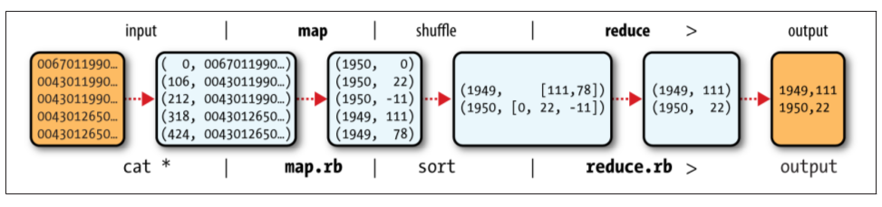
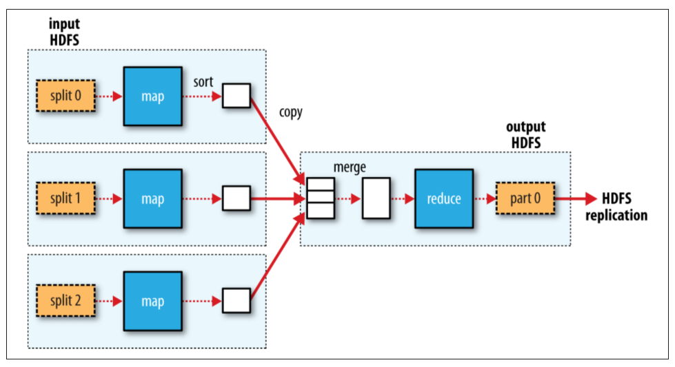
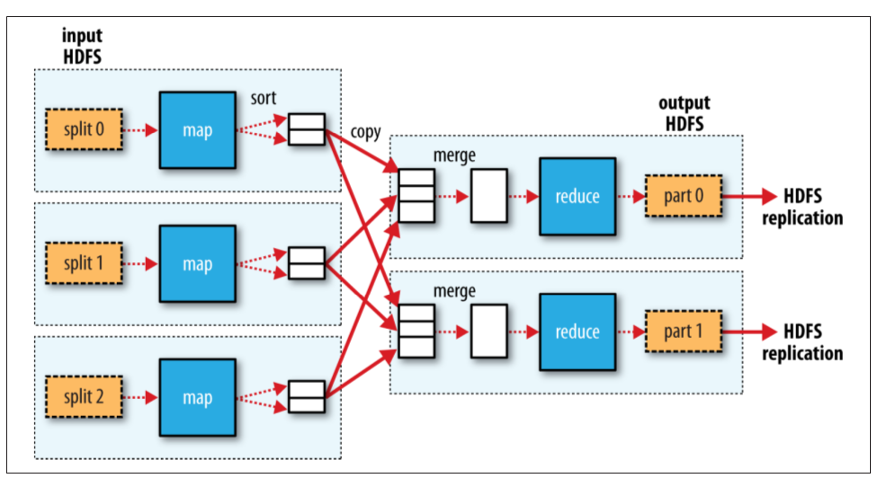
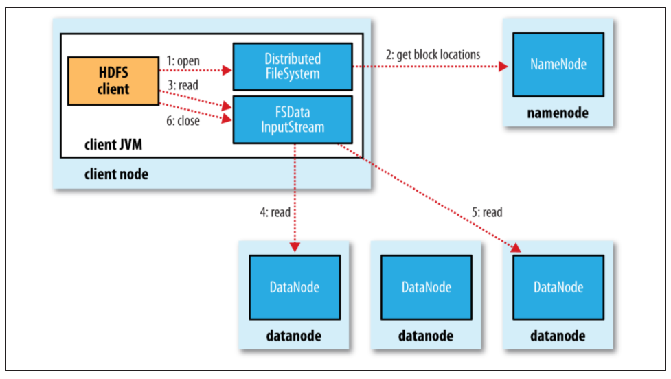
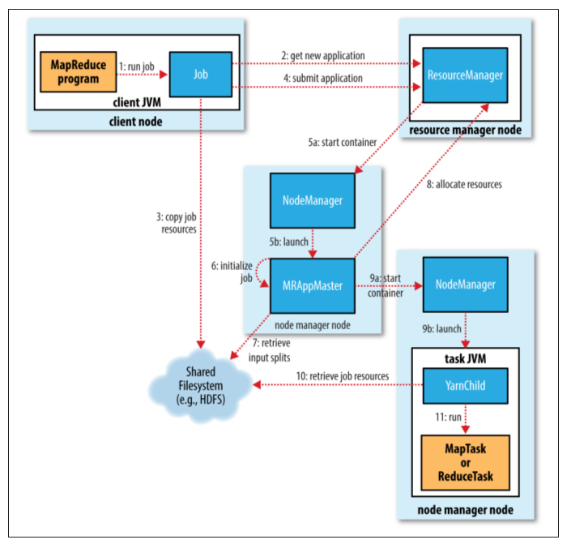
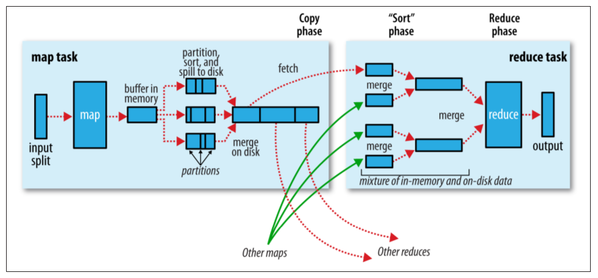

## Hadoop: The Definitive Guide
### MapReduce
#### Analyzing the Data with Hadoop
MapReduce works by breaking the processing into two phases: the map phase and the reduce phase. Each phase has key-value pairs as input and output, the types of which my be chosen by the programmer. The programmer also specifies two functions: the map function and the reduce function.

To visualize the way the map works, consider the following sample lines of input data (some unused columns have been dropped to fit the page, indicated by ellipses):
```
0067011990999991950051507004...9999999N9+00001+99999999999...
0043011990999991950051512004...9999999N9+00221+99999999999...
0043011990999991950051518004...9999999N9-00111+99999999999...
0043012650999991949032412004...0500001N9+01111+99999999999...
0043012650999991949032418004...0500001N9+00781+99999999999...
```
These lines are presented to the map function as the key-value pairs:
```
(0, 0067011990999991950051507004...9999999N9+00001+99999999999...)
(106, 0043011990999991950051512004...9999999N9+00221+99999999999...)
(212, 0043011990999991950051518004...9999999N9-00111+99999999999...)
(318, 0043012650999991949032412004...0500001N9+01111+99999999999...)
(424, 0043012650999991949032418004...0500001N9+00781+99999999999...)
```
The keys are the line offsets within the file, which we ignore in our map function. The map function merely extracts the year and the air temperature and emits them as its output (the temperature values have been interpreted as integers):
```
(1950, 0)
(1950, 22)
(1950, −11)
(1949, 111)
(1949, 78)
```
The output from the map function is processed by the MapReduce framework before being sent to the reduce function. This processing sorts and groups the key-value pairs by key. So, continuing the example, our reduce function sees the following input:
```
(1949, [111, 78])
(1950, [0, 22, −11])
```
Each year appears with a list of all its air temperature readings. All the reduce function has to do now is iterate through the list and pick up the maximum reading:
```
(1949, 111)
(1950, 22)
```
This is the final output: the maximum global temperature recorded in each year.



#### Scaling out
##### Data Flow
First, some terminology. A MapReduce *job* is a unit of work that the client wants to be performed: it consists of the input data, the MapReduce program, and configuration information. Hadoop runs the job by dividing it into *tasks*, of which there are two types: *map tasks* and *reduce tasks*. The tasks are scheduled using YARN and run on nodes in the cluster. If a task fails, it will be automatically rescheduled to run on a different node.

Hadoop divides the input to a MapReduce job into fixed-size pieces called *input splits*, or just *splits*. Hadoop creates one map task for each split, which runs the user-defined map function for each *record* in the split.

Hadoop does its best to run the map task on a node where the input data resides in HDFS, because it doesn't use valuable cluster bandwidth. This is called the *data locality optimization*.

Map tasks write their output to the local disk, not to HDFS. Why is this? Map output is intermediate output: it's processed by reduce tasks to produce the final output, and once the job is complete, the map output can be thrown away. So, storing it in HDFS with replication would be overkill. If the node running the map task fails before the map output has been consumed by the reduce task, then Hadoop will automatically rerun the map task on another node to re-create the map output.

Reduce tasks don't have the advantage of data locality; the input to a single reduce task is normally the output from all mappers. In the present example, we have a single reduce task that is fed by all of the map tasks. Therefore, the sorted map outputs have to be transferred across the network to the node where the reduce task is running, where they are merged and then passed to the user-defined reduce function.

The whole data flow with a single reduce task is illustrated. The dotted boxes indicate nodes, the dotted arrows show data transfers on a node, and the solid arrows show data transfers between nodes.



When there are multiple reducers, the map tasks *partition* their output, each creating one partition for each reduce task. There can be many keys (and their associated values) in each partition, but the records for any given key are all in a single partition.

The data flow for the general case of multiple reduce tasks is illustrated.


### The Hadoop Distributed Filesystem
#### HDFS Concepts
##### Blocks
HDFS, too, has the concept of a block, but it is a much larger unit - 128 MB by default. Like in a filesystem for a single disk, files in HDFS are broken into block-sized chunks, which are stored as independent units.

Having a block abstraction for a distributed filesystem brings several benefits. The first benefit is the most obvious: a file can be larger then any disk in the network. There's nothing that requires the blocks from a file to be stored on the same disk, so they can take advantage of any of the disks in the cluster. In fact, it would be possible, if unusual, to store a single file on an HDFS cluster whose blocks filled all the disks in the cluster.

Furthermore, blocks fit well with replication for providing fault tolerance and availability. To insure against corrupted blocks and disk and machine failure, each block is replicated to a small number of physically separate machines (typically three). If a block becomes unavailable, a copy can be read from another location in a way that is trans‐ parent to the client. A block that is no longer available due to corruption or machine failure can be replicated from its alternative locations to other live machines to bring the replication factor back to the normal level.

##### Namenodes and Datanodes
An HDFS cluster has two types of nodes operating in a master-worker pattern: a **namenode** (the master) and a number of **datanodes** (workers). The namenode manages the filesystem namespace. It maintains the filesystem tree and the metadata for all the files and directories in the tree. The namenode also knows the datanodes on which all the blocks for a given file are located.

Datanodes are the workhorses of the filesystem. They store and retrieve blocks when they are told to, and they report back to the namenode periodically with lists of blocks that they are storing.

#### The Java Interface
##### Reading Data Using the FileSystem API
A file in a Hadoop filesystem is represented by a Hadoop `Path` object. You can think of a `Path` as a Hadoop filesystem URI, such as `hdfs://localhost/user/tom/quangle.txt`.

`FileSystem` is a general filesystem API, so the first step is to retrieve an instance for the filesystem we want to use - HDFS, in this case.

With a `FileSystem` instance in hand, we invoke an `open()` method to get the input stream for a file.

*Example. Displaying files from a Hadoop filesystem on standard output by using the FileSystem directly*
```
public class FileSystemCat {

	public static void main(String[] args) throws Exception {
		String uri = args[0];
		Configuration conf = new Configuration();
		FileSystem fs = FileSystem.get(URI.create(uri), conf);
		InputStream in = null;
		try {
			in = fs.open(new Path(uri));
			IOUtils.copyBytes(in, System.out, 4096, false);
		} finally {
			IOUtils.closeStream(in);
		}
	}
}
```
The program runs as follows:
```
% hadoop FileSystemCat hdfs://localhost/user/tom/quangle.txt
On the top of the Crumpetty Tree
The Quangle Wangle sat,
But his face you could not see,
On account of his Beaver Hat.
```
#### Data Flow
##### Anatomy of a File Read


The client opens the file it wishes to read by calling `open()` on the `FileSystem` object, which for HDFS is an instance of `DistributedFileSystem` (step 1). `DistributedFileSystem` calls the namenode, using remote procedure calls (RPCs), to determine the locations of the first few blocks in the file (step 2). For each block, the namenode returns the addresses of the datanodes that have a copy of that block. Furthermore, the datanodes are sorted according to their proximity to the client.

The `DistributedFileSystem` returns an `FSDataInputStream` (an input stream that supports file seeks) to the client for it to read data from. `FSDataInputStream` in turn wraps a `DFSInputStream`, which manages the datanode and namenode I/O.

The client then calls `read()` on the stream (step 3). `DFSInputStream`, which has stored the datanode addresses for the first few blocks in the file, then connects to the first (closest) datanode for the first block in the file. Data is streamed from the datanode back to the client, which calls `read()` repeatedly on the stream (step 4). When the end of the block is reached, `DFSInputStream` will close the connection to the datanode, then find the best datanode for the next block (step 5). This happens transparently to the client, which from its point of view is just reading a continuous stream.

Blocks are read in order, with the `DFSInputStream` opening new connections to datanodes as the client reads through the stream. It will also call the namenode to retrieve the datanode locations for the next batch of blocks as needed. When the client has finished reading, it calls `close()` on the `FSDataInputStream` (step 6).

> In Java, `Stream` class reads a byte at a time. `DataStream` class knows how to read basic data types, including primitive types and strings.

### How MapReduce Works?
#### Anatomy of a MapReduce Job Run

##### Job Submission
The job submission process implemented by `JobSubmitter` does the following:
- Asks the resource manager for a new application ID, used for the MapReduce job ID (step 2).
- Checks the output specification of the job. For example, if the output directory has not been specified or it already exists, the job is not submitted and an error is thrown to the MapReduce program.
- Computes the input splits for the job. If the splits cannot be computed (becausethe input paths don't exist, for example), the job is not submitted and an error is thrown to the MapReduce program.
- Copies the resources needed to run the job, including the job JAR file, the configuration file, and the computed input splits, to the shared filesystem in a directory named after the job ID (step 3).
- Submits the job by calling `submitApplication()` on the resource manager (step 4).
##### Job Initialization
When the resource manager receives a call to its `submitApplication()` method, it hands off the request to the YARN scheduler. The scheduler allocates a container, and the resource manager then launches the application master's process there, under the node manager's management (steps 5a and 5b).

The application master initializes the job by creating a number of bookkeeping objects to keep track of the job's progress, as it will receive progress and completion reports from the tasks (step 6). Next, it retrieves the input splits computed in the client from the shared filesystem (step 7). It then creates a map task object for each split, as well as a number of reduce task objects. Tasks are given IDs at this point.
##### Task Assignment
The application master requests containers for all the map and reduce tasks in the job from the resource manager (step 8). Requests for map tasks are made first and with a higher priority than those for reduce tasks, since all the map tasks must complete before the sort phase of the reduce can start. Requests for reduce tasks are not made until 5% of map tasks have completed.
##### Task Execution
Once a task has been assigned resources for a container on a particular node by the resource manager's scheduler, the application master starts the container by contacting the node manager (steps 9a and 9b). The task is executed by a Java application whose main class is `YarnChild`. Before it can run the task, it localizes the resources that the task needs, including the job configuration and JAR file, and any files from the distributed cache. Finally, it runs the map or reduce task (step 11).
#### Failures
##### Task Failure
When the application master is notified of a task attempt that has failed, it will reschedule execution of the task. The application master will try to avoid rescheduling the task on a node manager where it has previously failed. Furthermore, if a task fails four times, it will not be retried again.
##### Node Manager Failure
If a node manager fails by crashing or running very slowly, it will stop sending heartbeats to the resource manager (or send them very infrequently). The resource manager will notice a node manager that has stopped sending heartbeats if it hasn't received one for 10 minutes and remove it from its pool of nodes to schedule containers on.

The application master arranges for map tasks that were run and completed successfully on the failed node manager to be rerun if they belong to incomplete jobs, since their intermediate output residing on the failed node manager's local filesystem may not be accessible to the reduce task.
#### Shuffle and Sort
##### The Map Side
When the map function starts producing output, it is not simply written to disk. The process is more involved, and takes advantage of buffering writes in memory and doing some presorting for efficiency reasons.



Before it writes to disk, the thread first divides the data into partitions corresponding to the reducers that they will ultimately be sent to. Within each partition, the background thread performs an in-memory sort by key.
##### The Reduce Side
Let's turn now to the reduce part of the process. The map output file is sitting on the local disk of the machine that ran the map task, but now it is needed by the machine that is about to run the reduce task for the partition. Moreover, the reduce task needs the map output for its particular partition from several map tasks across the cluster. The map tasks may finish at different times, so the reduce task starts copying their outputs as soon as each completes. This is known as the copy phase of the reduce task. The reduce task has a small number of copier threads so that it can fetch map outputs in parallel.
> How do reducers know which machines to fetch map output from?<br>
> As map tasks complete successfully, they notify their application master using the heartbeat mechanism. Therefore, for a given job, the application master knows the mapping between map outputs and hosts. A thread in the reducer periodically asks the master for map output hosts until it has retrieved them all.

##### Problem Definition: Split Airline Data by Month
Suppose that we need to split the airline dataset into separate files, one for each month, and we want to analyze data for specific months only. For example, we might want to analyze the delay patterns for days of the week in the month of January (a typical bad weather season) and then compare the same analysis for the month of June (a vacation season).

**SplitByMonthMapper Class**<br>
The Mapper output key is a `IntWritable` instance representing the month of the flight record. It takes values from 1 through 12.

**SortByMonthAndDayOfWeekReducer Class**<br>
It iterates through the values for each month (which is the key) and sends them to the output file.

**MonthPartitioner Class**<br>
Since we use twelve reducers by design each reducer index is simply (`month -1`) where month takes values from 1 through 12. This is the key component that ensures that each month goes to a separate Reducer in the proper order. That is, records for January go to Reducer 0, records for February go to Reducer 1, and so on until records for December go to Reducer 11.

#### Task Execution
##### Speculative Execution
The MapReduce model is to break jobs into tasks and run the tasks in parallel to make the overall job execution time smaller than it would be if the tasks ran sequentially. This makes the job execution time sensitive to slow-running tasks, as it takes only one slow task to make the whole job take significantly longer than it would have done otherwise. When a job consists of hundreds or thousands of tasks, the possibility of a few straggling tasks is very real.

Tasks may be slow for various reasons, including hardware degradation or software misconfiguration, but the causes may be hard to detect because the tasks still complete successfully, albeit after a longer time than expected. Hadoop doesn't try to diagnose and fix slow-running tasks; instead, it tries to detect when a task is running slower than expected and launches another equivalent task as a backup. This is termed speculative execution of tasks.

It's important to understand that speculative execution does not work by launching two duplicate tasks at about the same time so they can race each other. This would be wasteful of cluster resources. Rather, the scheduler tracks the progress of all tasks of the same type (map and reduce) in a job, and only launches speculative duplicates for the small proportion that are running significantly slower than the average. When a task completes successfully, any duplicate tasks that are running are killed since they are no longer needed. So, if the original task completes before the speculative task, the speculative task is killed; on the other hand, if the speculative task finishes first, the original is killed.

### Administering Hadoop
#### HDFS
##### Persistent Data Structures
When a filesystem client performs a write operation (such as creating or moving a file), the transaction is first recorded in the edit log. The namenode also has an in-memory representation of the filesystem metadata, which it updates after the edit log has been modified. The in-memory metadata is used to serve read requests.

Each *fsimage* file is a complete persistent checkpoint of the filesystem metadata. (The suffix indicates the last transaction in the image.) However, it is not updated for every filesystem write operation, because writing out the *fsimage* file, which can grow to be gigabytes in size, would be very slow. This does not compromise resilience because if the namenode fails, then the latest state of its metadata can be reconstructed by loading the latest *fsimage* from disk into memory, and then applying each of the transactions from the relevant point onward in the edit log. In fact, this is precisely what the namenode does when it starts up.

As described, the edit log would grow without bound. Though this state of affairs would have no impact on the system while the namenode is running, if the namenode were restarted, it would take a long time to apply each of the transactions in its (very long) edit log. During this time, the filesystem would be offline, which is generally undesirable.

The solution is to run the secondary namenode, whose purpose is to produce checkpoints of the primary's in-memory filesystem metadata. The checkpointing process proceeds as follows:

1. The secondary asks the primary to roll its in-progress *edits* file, so new edits go to a new file. The primary also updates the *seen_txid* file in all its storage directories.
2. The secondary retrieves the latest *fsimage* and *edits* files from the primary (using HTTP GET).
3. The secondary loads *fsimage* into memory, applies each transaction from *edits*, then creates a new merged *fsimage* file.
4. The secondary sends the new *fsimage* back to the primary (using HTTP PUT), and the primary saves it as a temporary *.ckpt* file.
5. The primary renames the temporary *fsimage* file to make it available.

At the end of the process, the primary has an up-to-date *fsimage* file and a short in-progress *edits* file (it is not necessarily empty, as it may have received some edits while the checkpoint was being taken).

This procedure makes it clear why the secondary has similar memory requirements to the primary (since it loads the *fsimage* into memory), which is the reason that the secondary needs a dedicated machine on large clusters.
