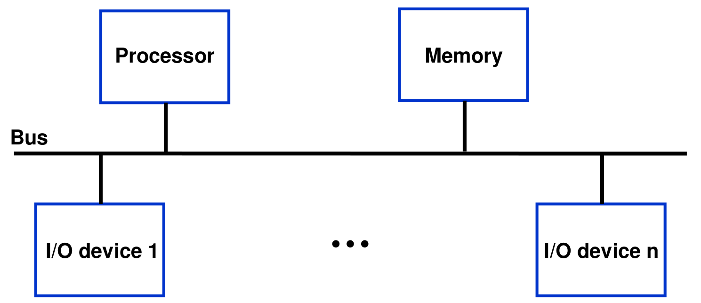

### Accessing I/O Devices
- Single-bus structure
  - The bus enables all the devices connected to it to exchange information
  - Typically, the bus consists of three sets of lines used to carry address, data, and control signals
  - Each I/O device is assigned a unique set of addresses



### I/O Interface for an Input Device
- The address decoder, the data and status registers, and the control circuitry required to coordinate I/O transfers constitute the device's *interface circuit*


### Program-Controlled I/O
- Consider a simple example of I/O operations involving a keyboard and a display device in s computer system. The four registers shown below are used in the data transfer operations
  - The two flags KIRQ and DIRQ in STATUS register are used in conjunction with interrupts

  ```
         -----------------------------------------
  DATAIN |                                       |
         -----------------------------------------

         -----------------------------------------
  DATAOUT|                                       |
         -----------------------------------------

         -----------------------------------------
  STATUS |    |    |    |    |DIRQ|KIRQ|SOUT|SIN |
         -----------------------------------------

         -----------------------------------------
  CONTROL|    |    |    |    |DEN |KEN |    |    |
         -----------------------------------------
  ```
- A program that reads one line from the keyboard, stores it in memory buffer, and echoes it back to the display
  ```
          Move       #LINE, R0        Initialize memory pointer
  WAITK   TestBit    #0,STATUS        Test SIN
          Branch=0   WAITK            Wait for character to be entered
          Move       DATAIN,R1        Read character
  WAITD   TestBit    #1,STATUS        Test SOUT
          Branch=0   WAITD            Wait for display to become ready
          Move       R1,DATAOUT       Send character to display
          Move       R1,(R0)+         Store character and advance pointer
          Compare    #$0D,R1          Check if Carriage Return
          Branch!=0  WAITK            If not, get another character
          Move       #$0A,DATAOUT     Otherwise, send Line Feed
          Call       PROCESS          Call a subroutine to process the input line
  ```

- The example described above illustrates program-controlled I/O, in which the processor repeatedly checks a status flag to achieve the required synchronization between the processor and an input output device. We say that the processor *polls* the devices
- There are two other commonly used mechanisms for implementing I/O operations: **interrupts** and **direct memory access**
  - Interrupts: synchronization is achieved by having the I/O device send a special signal over the bus whenever it is ready for a data transfer operation

### Interrupts
- To avoid the processor being not performing any useful computation, a hardware signal called an *interrupt* to the processor can do it. At least one of the bus control lines, called an *interrupt-request* line, is usually dedicated for this purpose

### Handling Multiple Devices
- Handling multiple devices gives rise to a number of questions:
  - How can the processor recognize the device requesting an interrupt?
- The information needed to determine whether a device is requesting an interrupt is available in its status register
  - When a device raises an interrupt request, it sets to 1 one of the bits in its status register, which we will call the IRQ bit

### Standard I/O Interfaces
- The processor bus is the bus defined by the signals on the processor chip itself. Devices that require a very high speed connection to the processor, such as the main memory, may be connected directly this bus
- The motherboard usually provides another bus that can support more devices
- The two buses are interconnected by a circuit, which we called a bridge, that translates the signals and protocols of one bus into those of the other
