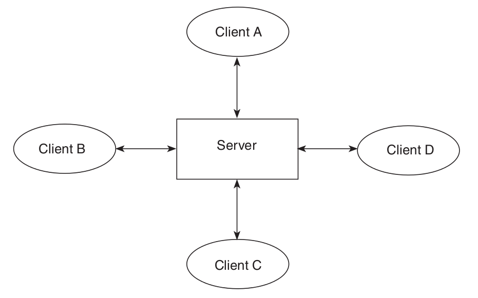
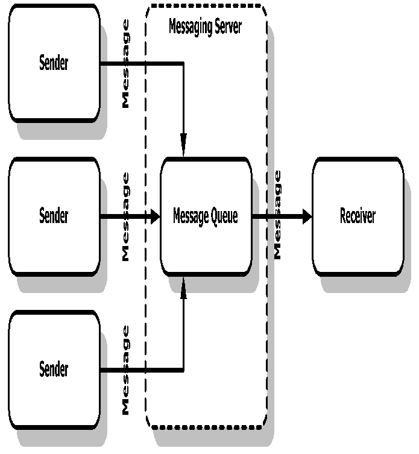
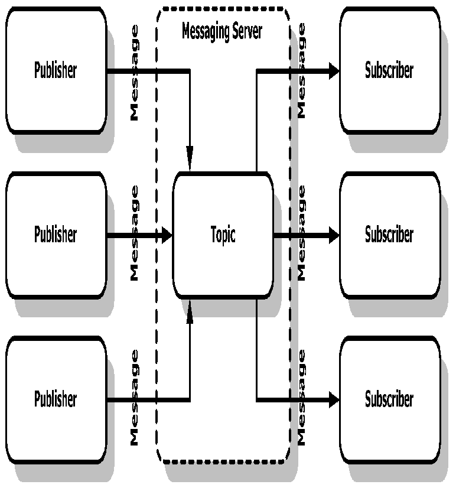

## Tutor 5: JMS
### What Is a Messaging System or Service?
A messaging system has three major features:
- A messaging system is loosely coupled. This is the most important feature of a messaging system and might be an advantage compared to other systems such as RMI. An application or program, called a *sender* or *publisher*, sends a message to a destination, not directly to another client. Another application or program, called a *receiver* or *subscriber*, receives the message from a destination. Senders and receivers do not have to be aware of each other.
- A messaging system isolates clients from each other. Neither sender nor receiver needs to know about each other. They only need to know the message format and destination.

In the messaging service (or system), there is a server, and clients connect to this server to communicate with each other.



The server provides some essential services such as message persistence, load balancing, and security.

### Basic JMS API Concepts
#### Messaging Domains
##### Point-to-Point Messaging Domain
A point-to-point (PTP) product or application is built around the concept message queues, senders, and receivers. Each message is addressed to a specific queue, and receiving clients extract messages from the queue(s) established to hold their messages. Queues retain all messages sent to them until the messages are consumed or expire.

PTP messaging has the following characteristics:



- Each message has only one consumer.
- A sender and a receiver of a message have no timing dependencies. The receiver can fetch the message whether or not it was running when the client sent the message.

Use PTP messaging when every message you need must be processed successfully by one consumer.

##### Publish/Subscribe Messaging Domain
In a publish/subscribe (pub/sub) product or application, clients need address messages to a topic. The system takes care of distributing the messages arriving from a topic's multiple publishers to its multiple subscribers. Topics retain messages only long enough to distribute them to their current subscribers.



Use pub/sub messaging when each message can be processed by zero, one, or many consumers.

### The JMS API programming Model
The basic building blocks of a JMS application consist of 
- Administered objects: connection factory and destinations
- Connections
- Sessions
- Message producers
- Message consumers
- Messages

### Administered Objects
##### Connection Factories
A ConnectionFactory creates customized Connections, with some predefined initial parameters, like host, port or even login. It is usually stored in an enterprise directory like LDAP, and retrieved using JNDI.
```
Context jndiContext = new InitialContext();
ConnectionFactory connectionFactory = (ConnectionFactory)jndiContext.lookup("jms/TestConnectionFactory");
```

##### Destinations
A *destination* is the object a client uses to specify the target of messages it produces and the source of messages it consumes. A Destination can also be stored in JDNI.
```
Queue queue = (Queue)jndiContext.lookup("jms/TestQueue");
Topic topic = (Topic)jndiContext.lookup("jms/TestTopic");
```

### Connections
A connection encapsulates a virtual connection with a JMS provider. A connection could represent an open TCP/IP socket between a client and a provider service daemon. You use a connection to create one or more sessions.
```
Connection connection = connectionFactory.createConnection();
connection.start();
```

### Sessions
A *session* is a single-threaded context for producing and consuming messages. You use sessions to create message producers, message consumers, and messages.

The Session provides several capabilities: temporaryQueues, transactions, serial order of messages, synchronous/asynchronous reception. For example, the second argument below means that the session automatically acknowledges messages when they have been received successfully.
```
Session session = connection.createSession(false, Session.AUTO_ACKNOWLEDGE);
```

### Message Producers
A *message producer* is an object created by a session and is used for sending messages to a destination
```
MessageProducer queueSender = session.createProducer(queue);
```
Once you have created a message producer, you can use it to send messages. (You have to create the messages first)
```
queueSender.send(message);
```

### Message Consumers
A *message consumer* is an object created by a session and is used for receiving messages sent to a destination. A message consumer allows a JMS client to register interest in a destination with a JMS provider. The JMS provider manages the deliv- ery of messages from a destination to the registered consumers of the destination.
```
MessageConsumer queueReader = session.createConsumer(queue);
```
Once you have created a message consumer, it becomes active, and you can use it to receive messages. With a traditional `receive` command a Consumer is blocked on reception from the JMS Server.

```
Message jmsMessage = queueReader.receive();
```
A *message listener* is an object that acts as an asynchronous event handler for messages. This object implements the `MessageListener` interface, which contains one method, `onMessage`. In the `onMessage` method, you define the actions to be taken when a message arrives.

```
public class ChatClient implements MessageListener {
    
    private MessageConsumer topicReceiver;
    
    private String name;
    
    private void init() throws JMSException {
        //...
        topicReceiver = session.createConsumer(name);
        topicReceiver.setMessageListener(this);
    }
}
```

### Messages
A JMS message has three parts:
- A header
- Properties (optional)
- A body (optional)

#### Message Headers
A JMS message header contains a number of predefined fields that contain values that both clients and providers use to identify and to route messages. For example, every message has a unique identifier, represented in the header field `JMSMessageID`. The value of another header field, `JMSDestination`, represents the queue or topic to which the message is sent.

#### Message Properties
You can create and set properties for messages if you need values in addition to those provided by the header fields.
```
jmsMessage.setStringProperty("privateMessageTo", chatMessage.to);
jmsMessage.setStringProperty("privateMessageFrom", chatMessage.from);
}
```

#### Message Selectors
If your messaging application needs to filter the messages it receives, you can use a JMS API message selector, which allows a message consumer to specify the messages it is interested in. Message selectors assign the work of filtering messages to the JMS provider rather than to the application.

A message selector is a `String` that contains an expression. The `createConsumer` method has a form that allows you to specify a message selector as an argument when you create a consumer.
```
// Selector is like the where clause of a SQL query
String selector = "(privateMessageFrom IS NULL AND privateMessageTo IS NULL) OR "+
                   "privateMessageTo = '"+name+"' OR privateMessageFrom = '"+name+"'";
        
session.createConsumer(topic, selector);
```

The message consumer then receives only messages whose headers and properties match the selector. A message selector cannot select messages on the basis of the content of the message body.