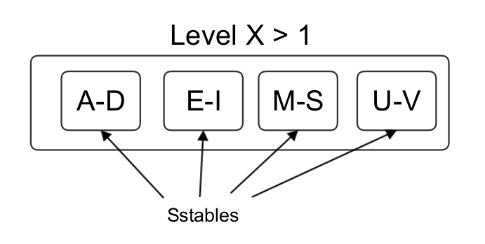
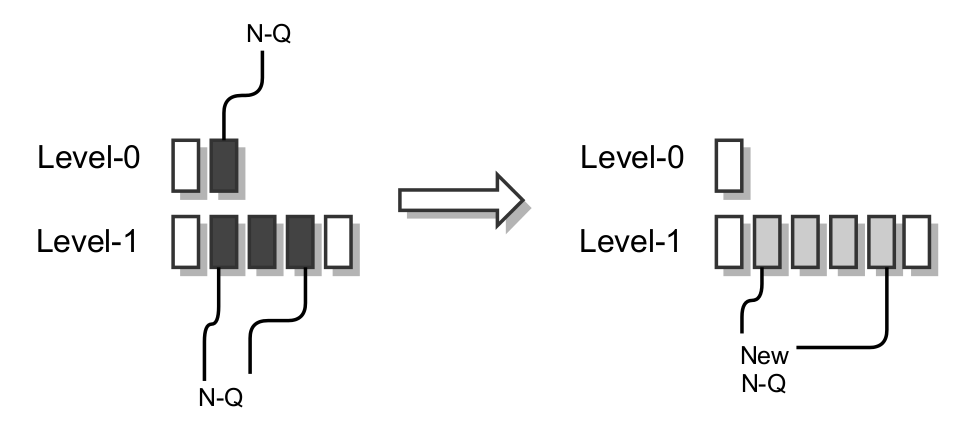
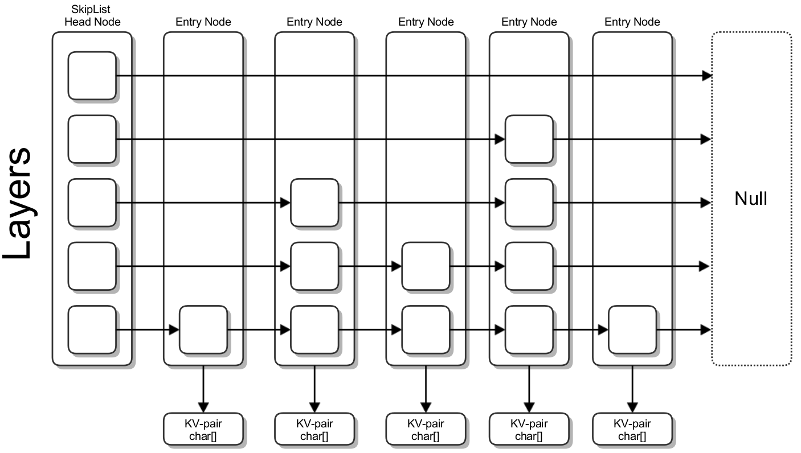

## Architecture Overview
### Memtables and Sstables
LevelDB uses two kinds of structures to store data internally. These are called "memtables" and "sorted string tables" (sstables) respectively.

**Memtable**

As the name suggests, a memtable is a completely in-memory data structure. It is used to hold a set of entries in sorted order by the entries' keys. Entries can either be key-value pairs, or a deletion marker for the key. While holding this data, the memtable can be queried to return entries by key, asked to provide an iterator over all entries it contains, and have new entries inserted into it. Since the memtable is an in-memory data structure, these operations can all be expected to be fast as no disk I/O is involved. A given memtable is generally kept small, at maximum a few megabytes in size. Once it reaches a certain size it is frozen (no more entries are inserted), replaced, and its contents eventually moved to disk.

**Sstable**

An sstable - or "sorted string table" - is a custom file format which stores a sequence of entries sorted by key.

The sstable is structured so that it is possible to tell approximately where in the file a given entry must be located, if it exists. This is done by first storing all entries in sorted order - hence the name "sorted string table" - and then including an index at the end of the file. This is not a complete index of all entries, but rather the location of all *"blocks"* in the file -each of which contain a number of entries - and the first and last (equivalently, smallest and largest) entry stored by each block. By having this index available, the position of the block where a given entry *must* be located (if it exists in the file) can be calculated, and then the block retrieved with a single disk-seek. This makes the sstables very efficient for lookups.

### Levels and Compactions
The sstable files used to hold disk-resident data in LevelDB are organized into a sequence of levels. The levels number from level-0 to maximum level, by default 7. Except for the level-0, all sstables in a given level have distinct non-overlapping key ranges.

As opposed to the large-numbered levels, level-0 does not necessarily contain sstables with overlapping key-ranges. This is done so that once a memtable fills up and is frozen, is can immediately be converted to an sstable and written to level-0. Had level-0 required non-overlapping key-ranges, additional work would have to be performed to merge the memtable's content. As a consequence of this, a key-lookup in level-0 need to look at *all* files in the level - meaning the read-performance decreases as the number of files increase. To counteract this, when the number of files in the level-0 reaches a threshold value LevelDB *merges* some some of the files in level-0 together with overlapping files in the next level - level-1 - to produce a new sequence of level-1 files. This process lowers the number of level-0 files while still maintaining the non-overlapping key-range invariant of level-1. LevelDB refers to this merge as a *compaction*.

For levels other than level-0 (except the final level), files are compacted to the next level once the combined size of all files in the level reaches a maximum.

### Write Path
Both `Put` and `Delete` operations are handled by LevelDB by adding *new* entries to the database. This section will look at what LevelDB does when such a write (addition of a list of entries) is requested by a client.

All entries are initially added to a memtable - of which there is only once active at a given time (the *current* memtable). For durability reasons, all writes are also logged to disk so that the contents can be recovered should the system crash (which would cause the loss of the memtable as it is located in volatile memory). Once this is done, the write is considered finished and control returns to the client requesting the write.

As writes are done by inserting them in the memtable, the memtable eventually reaches a configurable maximum size threshold. This triggers a *compaction* to convert it to a level-0 sstable, illustrated by the arrow pointing from the memstable to the levels structure. (Before this is done, a new memtable is set up to serve future write requests.) The memtable scheduled for compaction is referred to as an "immutable" memtable, and is kept available for read operations until its contents are finalized to disk. Once a memtable, and consequently the data it contains, has been added to disk as part of a level, the immutable memtable can have its memory freed. The log file associated with the memtable can then also be discarded.

### Read Path
When a `Get` operation is requested, LevelDB has to look at both the memtable and on-disk sstable-contents to try to find the entry for the requested key. This can be done in order: first by checking the memtable, then possibly the immutable memtable (if it exists), before finally going to disk where it checks each level in turn.

When going in this order, the search can stop the moment an entry with the searched -for key is found. This is because any entries with the same key found in any of the subsequent location will necessarily be *older* than the found entry.

### Table and Block Caching
As sstables are immutable, it is easy for LevelDB to cache their contents in memory without having deal with a complex buffer management scheme. The focus can be purely speeding up reads by caching as much as of the database's working-set in memory at all times. To this end, LevelDB includes both a stable- and block-cache:
- The table-cache is used to keep the sstables' index-blocks in-memory so that candidate blocks in these tables can be located directly.
- The block cache is used to hold full sstable blocks to avoid reading them from disk on subsequent accesses.

## Implementation Highlights
### Memtable
**Implementation**

Finally, the implementation contains a *skip-list* of `const char *` entries. This is the central data structure used by the memtable to store the added key-value pairs.

**Skip-list**

A skip-list is a probabilistic data structure, storing an ordered sequence of elements. It is designed to allow search-, insert-, and delete-operations in O(log N) average time.

In terms of structure, it can be considered a type of ordered linked list - but where a hierarchy of subsequence links - each *skipping* over fewer elements - are sorted instead of just one. This allows for uninteresting elements to be jumped over quickly when looking for a node.

During lookup, by considering the hierarchy of links from highest to lowest and knowing that the nodes in the skip-list are ordered, any pointer to a node less than the searched-for node can be immediately followed. For example, if the last node in the figure is the target node, the first non-null link in the start node (head) is in the second highest layer. The node it points to will then be found to be *less* than the target node, so the link can be be immediately followed, skipping over nodes 1-3. Starting the process over from the linked-to node, the link in the bottom layer is eventually followed resulting in the target node being found.