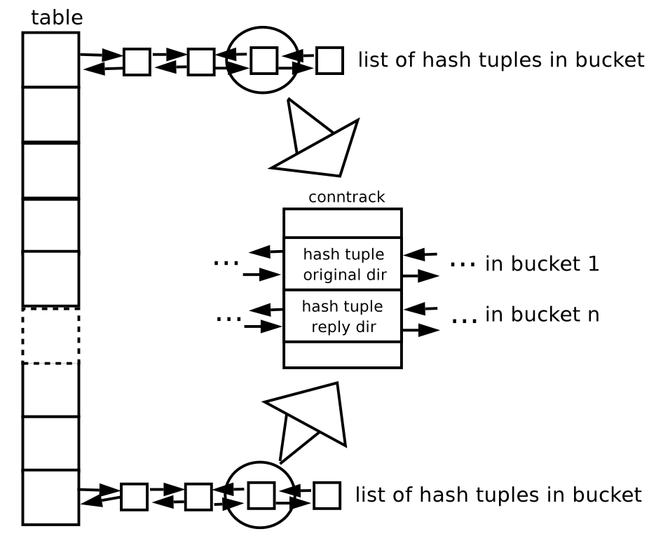

## Introduction
### What is netfilter?
netfilter is a framework for packet mangling, outside the normal Berkeley socket interface. It has four parts. Firstly, each protocol defines "hooks" (IPv4 defines 5) which are well defined points in a packet's traversal of that protocol stack. At each of these points, the protocol will call the netfilter framework with the packet and the hook number.

Secondly, parts of the kernel can register to listen to the different hooks for each protocol. So when a packet is passed to the netfilter framework, it checks to see if anyone has registered for that protocol and hook; if so, they each get chance to possibly examine (and possibly alter) the packet in order, then discard the packet (NF_DROP), allow it to pass (NF_ACCEPT), tell the netfilter to forget about the packet (NF_STOLEN), or ask netfilter to queue the packet for userspace (NF_QUEUE).

## Netfilter Architecture
Netfilter is merely a series of hooks in various points in a protocol stack (at this stage, IPv4, IPv6 and DECnet). The (idealized) IPv4 traversal diagram looks like this:
```
A Packet Traversing the Netfilter System:

   --->[1]--->[ROUTE]--->[3]--->[4]--->
                 |            ^
                 |            |
                 |         [ROUTE]
                 v            |
                [2]          [5]
                 |            ^
                 |            |
                 v            |
```
On the left is where packets come in: having passed the simple sanity checks (i.e., not truncated, IP checksum OK, not a promiscuous receive), they are passed to the netfilter framework's NF_IP_PRE_ROUTING [1] hook.

Next, they enter the routing code, which decides whether the packet is destined for another interface, or a local process.
If it's destined for the box itself, the netfilter framework is called again for the NF_IP_LOCAL_IN [2] hook, before being passed to the process (if any).

If it's destined to another interface instead, the netfilter framework is called for the NF_IP_FORWARD [3] hook.

### Netfilter Base
Now we have an example of netfilter for IPv4, you can see when each hook is activated. This is the essence of netfilter.

Kernel modules can register to listen at any of these hooks. A module that registers a function must specify the priority of the function within the hook; then when that netfilter hook is called from the core networking code, each module is registered at that point is called in the order of priorities, and is free to manipulate the packet. The module can then tell the netfilter to do one of five things:

1. NF_ACCEPT: continue traversal as normal.

2. NF_DROP: drop the packet; don't continue traversal.

3. NF_STOLEN: I've taken over the packet; don't continue traversal.

4. NF_QUEUE: queue the packet (usually for userspace handling).

5. NF_REPEAT: call this hook again.

Upon this foundation, we can build fairly complex packet manipulations, as shown in the next two sections.

### Packet Selection: IP Tables
A packet selection system called IP Tables has been built over the netfilter framework. This packet selection method is used for packet filtering (the 'filter' table), Network Address Translation (the 'nat' table) and general pre-route packet mangling (the 'mangle' table).

#### Packet Filtering
This table, 'filter', should never alter packets: only filter them. It hooks into netfilter at the NF_IP_LOCAL_IN, NF_IP_FORWARD and NF_IP_LOCAL_OUT points. This means that for any given packet, there is one (and only one) possible place to filter it.

#### NAT
This is the realm of the 'nat' table, which is def packets from two netfilter hooks: for non-local packets, the NF_IP_PRE_ROUTING and NF_IP_POST_ROUTING hooks are perfect for destination and source alterations respectively.

## Information for Programmers
### Understanding ip_tables
The kernel starts with three lists of rules in the `filter' table; these lists are called **firewall chains** or just **chains**. The three chains are called **INPUT**, **OUTPUT** and **FORWARD**.

For ASCII-art fans, the chains are arranged like so:
```
                          _____
Incoming                 /     \         Outgoing
       -->[Routing ]--->|FORWARD|------->
          [Decision]     \_____/        ^
               |                        |
               v                       ____
              ___                     /    \
             /   \                  |OUTPUT|
            |INPUT|                  \____/
             \___/                      ^
               |                        |
                ----> Local Process ----
```
The three circles represent the three chains mentioned above. When a packet reaches a circle in the diagram, that chain is examined to decide the fate of the packet. If the chain says to DROP the packet, it is killed there, but if the chain says to ACCEPT the packet, it continues traversing the diagram.

A chain is a checklist of **rules**. Each rule says `if the packet header looks like this, then here's what to do with the packet'. If the rule doesn't match the packet, then the next rule in the chain is consulted. Finally, if there are no more rules to consult, then the kernel looks at the chain **policy** to decide what to do.

1. When a packet comes in (say, through the Ethernet card) the kernel first looks at the destination of the packet: this is called `routing'.
2. If it's destined for this box, the packet passes downwards in the diagram, to the INPUT chain. If it passes this, any processes waiting for that packet will receive it.
3. Otherwise, if the kernel does not have forwarding enabled, or it doesn't know how to forward the packet, the packet is dropped. If forwarding is enabled, and the packet is destined for another network interface (if you have another one), then the packet goes rightwards on our diagram to the FORWARD chain. If it is ACCEPTed, it will be sent out.
4. Finally, a program running on the box can send network packets. These packets pass through the OUTPUT chain immediately: if it says ACCEPT, then the packet continues out to whatever interface it is destined for.

#### ip_tables From Userspace
There are several different things you can do with `iptables`. You start with three built-in chains `INPUT`, `OUTPUT` and `FORWARD` which you can't delete. Let's look at the operations to manage whole chains:

1. Create a new chain (-N).
2. List the rules in a chain (-L).

There are several ways to manipulate rules inside a chain:

1. Append a new rule to a chain (-A).
2. Insert a new rule at some position in a chain (-I).
3. Replace a rule at some position in a chain (-R).
4. Delete a rule at some position in a chain, or the first that matches (-D)

##### What You'll See When Your Computer Starts Up
Before any iptables commands have been run, there will be no rules in any of the built-in chains (`INPUT`, `FORWARD` and `OUTPUT`), all the chains will have a policy of ACCEPT. You can alter the default policy of the FORWARD chain by providing the `forward=0` option to the iptable_filter module.

##### Operations on a Single Rule
This is the bread-and-butter of packet filtering; manipulating rules. Most commonly, you will probably use the append (-A) and delete (-D) commands. The others (-I for insert and -R for replace) are simple extensions of these concepts.

Each rule specifies a set of conditions the packet must meet, and what to do if it meets them (a `target`). For example, you might want to drop all ICMP packets coming from the IP address 127.0.0.1. So in this case our conditions are that the protocol must be ICMP and that the source address must be 127.0.0.1. Our target is `DROP`.

127.0.0.1 is the `loopback` interface, which you will have even if you have no real network connection. You can use the `ping` program to generate such packets (it simply sends an ICMP type 8 (echo request) which all cooperative hosts should obligingly respond to with an ICMP type 0 (echo reply) packet). This makes it useful for testing.
```
    # ping -c 1 127.0.0.1
    PING 127.0.0.1 (127.0.0.1): 56 data bytes
    64 bytes from 127.0.0.1: icmp_seq=0 ttl=64 time=0.2 ms

    --- 127.0.0.1 ping statistics ---
    1 packets transmitted, 1 packets received, 0% packet loss
    round-trip min/avg/max = 0.2/0.2/0.2 ms
    # iptables -A INPUT -s 127.0.0.1 -p icmp -j DROP
    # ping -c 1 127.0.0.1
    PING 127.0.0.1 (127.0.0.1): 56 data bytes

    --- 127.0.0.1 ping statistics ---
    1 packets transmitted, 0 packets received, 100% packet loss
    #
```
You can see here that the first ping succeeds (the `-c 1` tells ping to only send a single packet).

Then we append (-A) to the `INPUT` chain, a rule specifying that for packets from 127.0.0.1 (`-s 127.0.0.1`) with protocol ICMP (`-p icmp`) we should jump to DROP (`-j DROP`).

Then we test our rule, using the second ping. There will be a pause before the program gives up waiting for a response that will never come.

##### Target Specifications

**User-defined chains**

Time for more ASCII art. Consider two (silly) chains: `INPUT` (the built-in chain) and `test` (a user-defined chain).
```
             `INPUT'                         `test'
            ----------------------------    ----------------------------
            | Rule1: -p ICMP -j DROP   |    | Rule1: -s 192.168.1.1    |
            |--------------------------|    |--------------------------|
            | Rule2: -p TCP -j test    |    | Rule2: -d 192.168.1.1    |
            |--------------------------|    ----------------------------
            | Rule3: -p UDP -j DROP    |
            ----------------------------
```
Consider a TCP packet coming from 192.168.1.1, going to 1.2.3.4. It enters the `INPUT` chain, and gets tested against Rule1 - no match. Rule2 matches, and its target is `test`, so the next rule examined is the start of test. Rule1 in test matches, but doesn't specify a target, so the next rule is examined, Rule2. This doesn't match, so we have reached the end of the chain. We return to the `INPUT` chain, where we had just examined Rule2, so we now examine Rule3, which doesn't match either.

So the packet path is:
```
                                    v    __________________________
             `INPUT'                |   /    `test'                v
            ------------------------|--/    -----------------------|----
            | Rule1                 | /|    | Rule1                |   |
            |-----------------------|/-|    |----------------------|---|
            | Rule2                 /  |    | Rule2                |   |
            |--------------------------|    -----------------------v----
            | Rule3                 /--+___________________________/
            ------------------------|---
                                    v
```
User-defined chains can jump to other user-defined chains.

##### Operations on an Entire Chain
**Setting Policy**

We glossed over what happens when a packet hits the end of a built-in chain when we discussed how a packet walks through chains earlier. In this case, the policy of the chain determines the fate of the packet.

## Understanding NAT
### Connection Tracking
Connection tracking hooks into high-priority NF_IP_LOCAL_OUT and NF_IP_PRE_ROUTING hooks, in order to see packets before they enter the system.

## Extending Connection Tracking/NAT
Internally, connection tracking converts a packet to a "tuple", representing the interesting parts of the packet, before searching for bindings or rules which match it. This tuple has a manipulatable part, and a non-manipulatable part; called "src" and "dst", as this is the view for the first packet in the Source NAT world (it'd be a reply packet in the Destination NAT world). The tuple for every packet in the same packet stream in that direction is the same.

For example, a TCP packet's tuple contains the manipulatable part: source IP and source port, the non-manipulatable part: destination IP and the destination port. The manipulatable and non-manipulatable parts do not need to be the same type though; for example, an ICMP packet's tuple contains the manipulatable port: source IP and the ICMP id, and the non-manipulatable part: the destination IP and the ICMP type and code.

Every tuple has an inverse, which is the tuple of the reply packets in the stream. For example, the inverse of an ICMP ping packet, icmp id 12345, from 192.168.1.1 to 1.2.3.4, is a ping-reply packet, icmp id 12345, from 1.2.3.4 to 192.168.1.1.

These tuples, represented by the 'struct ip_conntrack_tuple', are widely used. In fact, together with the hook the packet came in on (which has an effect on the type of manipulation expected), and the device involved, that is the complete information on the packet.

Most tuples are contained within a 'struct ip_conntrack_tuple_hash', which adds a doubly linked list entry, and a point to the connection that the tuple belongs to.

A connection is represented by the 'struct ip_conntrack': it has two 'struct ip_conntrack_tuple_hash' fields: one referring to the direction of the original packet (tuplehash[IP_CT_DIR_ORIGINAL]), and one referring to packets in the reply direction (tuplehash[IP_CT_DIR_REPLY]).

Anyway, the first thing the NAT code does is to see if the connection tracking code managed to extract a tuple and find an existing connection, by looking at the skbuff's nfct field; this tells us if it's an attempt on a new connection, or if not, which direction it is in; in the latter case, then the manipulations determined previously for that connection are done.

### The big picture
This article focuses mainly in the layer-3 independent connection tracking system implementation `nf_conntrack`, based on the IPv4 dependent `ip_conn_track`.

### Implementation Issues
#### Basic Structure
The connection tracking system is an optional modular loadable subsystem, although it is always required by the NAT subsystem. It is implemented with a hash table to perform efficient lookups.



Each bucket has a double-linked list of hash tuples. There are two hash tuples for every connection: one for the original direction (i.e., packets coming from the point that started the connection) and one for the reply direction (i.e., reply packets going to the point that started the connection).

A tuple represents the relevant information of a connection, IP source and IP destination, as well as layer-4 protocol information. Such tuples are embedded in a hash tuple.

The two hash tuples are embedded in the structure `nf_conn`, from this point onward referred to as *conntrack*, which is the structure that stores the state of a given connection. Therefore, a conntrack is the container of two hash tuples, and every hash tuple is the container of a tuple. This results in three layers of embedded structures.

A hash function is used to calculate the position where the hash tuple that represents the connection is supposed to be.
##### The conntrack creation and lookup process
The callback `nf_conntrack_in` is registered in the *PREROUTING* hook. Some sanity checks are done at this stage to ensure that the packet is correct.

Afterward, checks take place during the conntrack lookup process. The system tries to lookup a conntrack that matches with the packet received. If no conntrack is found, it will be created.

If the packet belongs to a new connection, the conntrack just created will have the flag `confirmed` unset. The flag `confirmed` is set if such a conntrack is already in the hash table. This means that at this point no new conntracks are inserted. Such an insertion will happen once the packet leaves the framework successfully (i.e., when it arrives at the last hook without being dropped).
