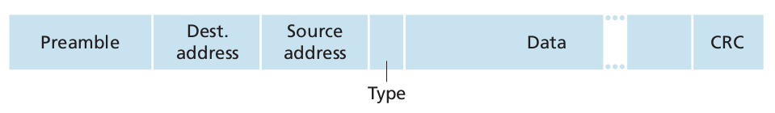

## Computer Networks and the Internet
### What Is the Internet?
#### A Nuts-and-Bolts Description


End systems are connected together by a network of **communication links** and **packet switches**. There are many types of communication links, which are made up of different types of physical media, including coaxial cable, copper wire, optical fiber, and radio spectrum. Different links can transit data at different rates, with the *transmission rate* of a link measured in bits/second. When one end system has data to send to another end system, the sending end system segments the data and adds header bytes to each segment. The resulting packages of information, known as **packets** in the jargon of computer networks, are then sent through the network to the destination end system, where they are reassembled into the original data.

A packet switch takes a packet arriving on one of its incoming communication links and forwards that packet on one of its outgoing communication links. Packet switches come in many shapes and flavors, but the two most predominant types in today's Internet are **routers** and **link-layer switches**. The sequence of communication links and packet switches traversed by a packet from the sending end system to the receiving end system is known as a **route** or **path** through the network.

End systems access the Internet through **Internet Service Providers (ISPs)**, including residential ISPs such as local cable or telephone companies; corporate ISPs; university ISPs; and ISPs that provide WiFi access in airports, hotels, coffee shops, and other public places. Each ISP is in itself a network of packet switches and communication links.

## Application Layer
### Principles of Network Applications
#### Processes Communicating
**The Interface Between the Process and the Computer Network**

As noted above, most applications consist of pairs of communicating processes, with the two processes in each pair sending messages to each other. Any message sent from one process to another must go through the underlying network. A process sends messages into, and receives messages from, the network through a software interface called a **socket**. Let's consider an analogy to help us understand processes and sockets. A process is analogous to a house and its socket is analogous to its door. When a process wants to send a message to another process on another door, it shoves the message out its door (socket). This sending process assumes that there is a transportation infrastructure on the other side of its door that will transport the message to the door of the destination process. Once the message arrives at the destination host, the message passes through the receiving process's door (socket), and the receiving process then acts on the message.

### The Web and HTTP
#### Overview of HTTP
The **HyperText Transfer Protocol (HTTP)**, the Web's application-layer protocol, is at the heart of the Web. HTTP is implemented in two programs: a client program and a server program. The client program and server program, executing on different end systems, talk to each other by exchanging HTTP messages. HTTP defines the structure of these messages and how the client and server exchange the messages. Before explaining HTTP in detail, we should review some Web terminology.

A **Web page** (also called a document) consists of objects. An **object** is simply a file - such as an HTML file, a JPEG image, a Java applet, or a video clip - that is addressable by a single URL. Most Web pages consist of a **base HTML file** and several referenced objects. For example, if a Web page contains HTML text and five JPEG images, then the Web page has six objects: the base HTML file plus the five images. The base HTML file references the other objects in the page with the objects' URLs. Each URL has two components: the hostname of the server that houses the object and the object's path name. For example, the URL
```
http://www.someSchool.edu/someDepartment/picture.gif
```
has `www.someSchool.edu` for a hostname and `/someDepartment/picture.gif` for a path name. Because **Web browsers** (such as Internet Explorer and Firefox) implement the client side of HTTP, in the context of the Web, we will use the words *browser* and *client* interchangeably. **Web servers**, which implement the server side of HTTP, house Web objects, each addressable by a URL. Popular Web servers include Apache.

When a user requests a Web page (for example, clicks on a hyperlink), the browser sends HTTP request messages for the objects in the page to the server. The server receives the requests and responds with HTTP response messages that contain the objects.

HTTP uses TCP as its underlying transport protocol (rather than running on top of UDP). The HTTP client first initiates a TCP connection with the server. Once the connection is established, the browser and the server processes access TCP through their socket interfaces.

#### Non-Persistent and Persistent Connections
**HTTP with Non-Persistent Connections**

Let's walk through the steps of transferring a Web page from server to client for the case of non-persistent connections. Let's suppose the page consists of a base HTML file and 10 JPEG images, and that all 11 of these objects reside on the same server. Further suppose the URL for the base HTML file is
```
http://www.someSchool.edu/someDepartment/home.index
```
Here is what happens:
1. The HTTP client process initiates a TCP connection to the server `www.someSchool.edu` on port number 80, which is the default port number for HTTP. Associated with the TCP connection, there will be a socket at the client and a socket at the server.
2. The HTTP client sends an HTTP request message to the server via its socket. The request message includes the path name `/someDepartment/home.index`.
3. The HTTP server process receives the request message via its socket, retrieves the object `/someDepartment/home.index` from its storage (RAM or disk), encapsulates the object in an HTTP response message, and sends the response message to the client via its socket.
4. The HTTP server process tells TCP to close the TCP connection. (But TCP doesn't actually terminate the connection until it knows for sure that the client has received the response message intact.)
5. The HTTP client receives the response message. The TCP connection terminates. The message indicates that the encapsulated object is an HTML file. The client extracts the file from the response message, examines the HTML file, and finds references to the 10 JPEG objects.
6. The first four steps are then repeated for each of the referenced JPEG objects.

As the browser receives the Web page, it displays the page to the user.

The steps above illustrate the use of non-persistent connections, where each TCP connection is closed after the server sends the object—the connection does not persist for other objects.

#### HTTP Message Format
**HTTP Request Message**

Below we provide a typical HTTP request message:
```
GET /somedir/page.html HTTP/1.1
Host: www.someschool.edu
Connection: close
User-agent: Mozilla/5.0
Accept-language: fr
```
First of all, we see that the message is written in ordinary ASCII text, so that your ordinary computer-literate human being can read it. The first line of an HTTP request message is called the **request line**; the subsequent lines are called the **header lines**. The request line has three fields: the method field, the URL field, and the HTTP version field. The method field can take on several different values, including `GET`, `POST`, `HEAD`, `PUT`, and `DELETE`. The great majority of HTTP request messages use the `GET` method. The `GET` method is used when the browser requests an object, with the requested object identified in the URL field. In this example, the browser is requesting the object `/somedir/page.html`.

Now let's look at the header lines in the example. The header line `Host: www.someschool.edu` specifies the host on which the object resides. By including the `Connection: close` header line, the browser is telling the server that it doesn't want to bother with persistent connections; it wants the server to close the connection after sending the requested object. The `User-agent:` header line specifies the user agent, that is, the browser type that is making the request to the server. Here the user agent is Mozilla/5.0, a Firefox browser.

let's now look at the general format of a request message. We see that the general format closely follows our earlier example. You may have noticed, however, that after the header lines there is an "entity body."" The entity body is empty with the `GET` method, but is used with the `POST` method. An HTTP client often uses the `POST` method when the user fills out a form - for example, when a user provides search words to a search engine. With a POST message, the user is still requesting a Web page from the server, but the specific contents of the Web page depend on what the user entered into the form fields. If the value of the method field is `POST`, then the entity body contains what the user entered into the form fields.


The `HEAD` method is similar to the `GET` method. When a server receives a request with the `HEAD` method, it responds with an HTTP message but it leaves out the requested object. Application developers often use the HEAD method for debugging. The `PUT` method is often used in conjunction with Web publishing tools. It allows a user to upload an object to a specific path (directory) on a specific Web server. The `PUT` method is also used by applications that need to upload objects to Web servers. The `DELETE` method allows a user, or an application, to delete an
object on a Web server.

**HTTP Response Message**

Below we provide a typical HTTP response message.
```
HTTP/1.1 200 OK
Connection: close
Date: Tue, 09 Aug 2011 15:44:04 GMT
Server: Apache/2.2.3 (CentOS)
Last-Modified: Tue, 09 Aug 2011 15:11:03 GMT
Content-Length: 6821
Content-Type: text/html

(data data data data data ...)
```
It has three sections: an initial **status line**, six **header lines**, and then the **entity body**. The entity body is the meat of the message - it contains the requested object itself (represented by `data data data data data ...`). The status line has three fields: the protocol version field, a status code, and a corresponding status message. In this example, the status line indicates that the server is using HTTP/1.1 and that everything is OK (that is, the server has found, and is sending, the requested object).

Now let's look at the header lines. The server uses the `Connection: close` header line to tell the client that it is going to close the TCP connection after sending the message. The `Server:` header line indicates that the message was generated by an Apache Web server. The `Content-Length:` header line indicates the number of bytes in the object being sent. The `Content-Type:` header line indicates that the object in the entity body is HTML text.

Let's say a few additional words about status codes and their phrases. The status code and associated phrase indicate the result of the request. Some common status codes and associated phrases include:
- `200 OK:` Request succeeded and the information is returned in the response.
- `400 Bad Request:` This is a generic error code indicating that the request could not be understood by the server.
- `404 Not Found:` The requested document does not exist on this server.

#### User-Server Interaction: Cookies
uppose Susan, who always accesses the Web using Internet Explorer from her home PC, contacts Amazon.com for the first time. When the request comes into the Amazon Web server, the server creates a unique identification number and creates an entry in its back-end database that is indexed by the identification number. The Amazon Web server then responds to Susan's browser, including in the HTTP response a `Set-cookie:` header, which contains the identification number. For example, the header line might be:
```
Set-cookie: 1678
```
When Susan's browser receives the HTTP response message, it sees the `Set-cookie:` header. The browser then appends a line to the special cookie file that it manages. This line includes the hostname of the server and the identification number in the `Set-cookie:` header. As Susan continues to browse the Amazon site, each time she requests a Web page, her browser consults her cookie file, extracts her identification number for this site, and puts a cookie header line that includes the identification number in the HTTP request. Specifically, each of her HTTP requests to the Amazon server includes the header line:
```
Cookie: 1678
```
In this manner, the Amazon server is able to track Susan's activity at the Amazon site. Although the Amazon Web site does not necessarily know Susan's name, it knows exactly which pages user 1678 visited, in which order, and at what times! Amazon uses cookies to provide its shopping cart service - Amazon can maintain a list of all of Susan's intended purchases, so that she can pay for them collectively at the end of the session.

### File Transfer: FTP
In a typical FTP session, the user is sitting in front of one host (the local host) and wants to transfer files to or from a remote host. In order for the user to access the remote account, the user must provide a user identification and a password. After providing this authorized information, the user can transfer files from the local file system to the remote file system and vice versa. The user interacts with FTP through an FTP user agent. The user first provides the hostname of the remote host, causing the FTP client process in the local host to establish a TCP connection with the FTP server process in the remote host. The user then provides the user identification and password, which are sent over the TCP connection as part of the FTP commands. Once the server has authorized the user, the user copies one or more files stored in the local file system into the remote file system (or vice versa).

HTTP and FTP are both file transfer protocols and have many common characteristics; for example, they both run on top of TCP. However, the two application-layer protocols have some important differences. The most striking difference is that FTP uses two parallel TCP connections to transfer a file, a **control connection** and a **data connection**. The control connection is used for sending control information between two hosts - information such as user identification, password, commands change remote directory, and commands to "put" and "get" files. The data connection is used to actually send a file.

When a user starts an FTP session with a remote host, the client side of FTP (user) initiates a control TCP connection with the server side (remote host) on server port number 21. The client side of FTP sends the user identification and password over this control connection. The client side of FTP also sends, over the control connection, commands to change the remote directory. When the server side receives a command for a file transfer over the control connection, the server side initiates a TCP data connection to the client side. FTP sends exactly one file over the data connection and then closes the data connection. Thus, with FTP, the control connection remains open throughout the duration of the user session, but a new data connection is created for each file transferred within a session.

### DNS - The Internet's Directory Service
Just as humans can be identified in many ways, so too can Internet hosts. One identifier for a host is its **hostname**. Hostnames—such as `cnn.com`, `www.yahoo.com`, `gaia.cs.umass.edu`, and `cis.poly.edu` - are mnemonic and are therefore appreciated by humans. Furthermore, because hostnames can consist of variable-length alphanumeric characters, they would be difficult to process by routers. For these reasons, hosts are also identified by so-called **IP addresses**.

An IP address consists of four bytes and has a rigid hierarchical structure. An IP address looks like `121.7.106.83`, where each period separates one of the bytes expressed in decimal notation from 0 to 255. An IP address is hierarchical because as we scan the address from left to right, we obtain more and more specific information about where the host is located in the Internet (that is, within which network, in the network of networks).

#### Services Provided by DNS
We have just seen that there are two ways to identify a host- by a hostname and by an IP address. People prefer the more mnemonic hostname identifier, while routers prefer fixed-length, hierarchically structured IP addresses. In order to reconcile these preferences, we need a directory service that translates hostnames to IP addresses. This is the main task of the Internet's **domain name system (DNS)**. The DNS is (1) a distributed database implemented in hierarchy of **DNS servers**, and (2) an application-layer protocol that allows hosts to query the distributed database.

DNS is commonly employed by other application-layer protocols - including HTTP, SMTP, and FTP - to translate user-supplied hostnames to UP addresses. As an example, consider what happens when a browser (that is, an HTTP client), running on some user's host, requests the URL `www.someschool.edu/index.html`. In order for the user's host to be able to send an HTTP request message to the Web server `www.someschool.edu`, the user's host must first obtain the IP address of `www.someschool.edu`. This is done as follows:
1. The same user machine runs the client side of the DNS application.
2. The browser extracts the hostname, `www.someschool.edu`, from the URL and passes the hostname to the client side of the DNS application.
3. The DNS client sends a query containing the hostname to a DNS server.
4. The DNS client eventually receives a reply which includes the IP address for the hostname.
5. Once the browser receives the IP address from DNS, it can initiate a TCP connection to the HTTP server process located at port 80 at that IP address.

We see from this example that DNS adds an additional delay - something substantial - to the Internet applications that use it. Fortunately, the desired IP address is often cached in a "nearby" DNS server, which helps to reduce DNS network traffic as well as the average DNS delay.

#### Overview of How DNS Works
We now present a high-level overview of how DNS works. Our discussion will focus on the hostname-to-IP address translation service.

Suppose that some applications (such as a Web browser or a mail reader) running in a suer's host needs to translate a hostname to an IP address. The application will invoke the client side of DNS, specifying the hostname that needs to be translated. (On many UNIX-based machines, `gethostbyname()` is the function call that an application calls in order to perform the translation.) DNS in the user's host then takes over, sending a query message in the network. All DNS query and reply messages are sent within UDP datagram to port 53. After a delay, ranging from milliseconds to seconds, DNS in the user's host receives a DNS reply message that provides the desired mapping. This mapping is then passed to the invoking application. Thus, from the perspective of the invoking application in the user's host, DNS is a black box providing a simple, straightforward translation service. But in fact, the black box that implements the service is complex, consisting of a large number of DNS servers distributed among the globe, as well as an application-layer protocol that specifies how the DNS servers and querying hosts communicate.

the DNS uses a large number of servers, organized in a hierarchical fashion and distributed around the world. No single DNS server has all of the mappings for all of the hosts in the Internet. Instead, the mappings are distributed across the DNS servers. To a first approximation, there are three classes of DNS servers - root DNS servers, top-level domain (TLD) DNS servers, and authoritative DNS servers - organized in a hierarchy.


To understand how these three classes of servers interact, suppose a DNS client wants to determine the IP address for the hostname `www.amazon.com`. To a first approximation, the following events will take place. The client first contacts one of the root servers, which returns IP addresses for TLD servers for the top-level domain `com`. The client then contacts one of these TLD servers, which returns the IP address of an authoritative server for `amazon.com`. Finally, the client contacts one of the authoritative servers for `amazon.com`, which returns the IP address for the hostname `www.amazon.com`.

The root, TLD, and authoritative DNS servers all belong to the hierarchy of DNS servers. There is another important type of DNS server called the **local DNS server**. A local DNS server does not strictly belong to the hierarchy of servers but is nevertheless central to the DNS architecture. Each ISP - such as a university, an academic department, an employee's company, or a residential ISP - has a local DNS server (also called a default name server).

Let's take a look at a simple example. Suppose the host `cis.poly.edu` desires the IP address of `gaia.cs.umass.edu`. Also suppose that Polytechnic's local DNS server is called `dns.poly.edu` and that an authoritative DNS server for `gaia.cs.umass.edu` is called `dns.umass.edu`.


the host `cis.poly.edu` first sends a DNS query message to its local DNS server, `dns.ploy.edu`. The query message contains the hostname to be translated, namely `gaia.cs.umass.edu`. The local DNS server forwards the query message to a root DNS server. The root DNS server takes note of the edu suffix and returns to the local DNS server a list of IP addresses for TLD servers responsible for responsible for `edu`. The local DNS server then resends the query message to one of these TLD servers. The TLD server takes note of the `umass.edu` suffix and responds with the IP address of the authoritative DNS server for the University of Massachusetts, namely `dns.umass.edu`. Finally, the local DNS server resends the query message directly to `dns.umass.edu`, which responds with the IP address of `gaia.cs.umass.edu`. Note that in this example, in order to obtain the mapping for one hostname, eight DNS messages were sent: four query messages and four reply messages!

**DNS Caching**

In truth, DNS extensively exploits DNS caching in order to improve the delay performance and to reduce the number of DNS messages ricocheting around the Internet. The idea behind DNS caching is very simple. In a query chain, when a DNS server receives a DNS reply (containing, for example, a mapping from a hostname to an IP address), it can cache the mapping in its local memory. For example, each time the local DNS server `dns.ploy.edu` receives a reply from some DNS server, it can cache any of the information contained in the reply. If a hostname/IP address pair is cached in a DNS and another query arrives to the DNS server for the same hostname, the DNS server can provide the desired IP address, even if it is not authoritative for the hostname. Because hosts and mappings between hostnames and IP addresses are by no means permanent, DNS servers discard cached information after a period of time (often set to two days).

As an example, suppose that a host `apricot.poly.edu` queries `dns.ploy.edu` for the IP address for the hostname `cnn.com`. Furthermore, suppose that a few hours later, another Polytechnic University host, say, `kiwi.poly.fr`, also queries `dns.ploy.edu` with the same hostname. Because of caching, the local DNS server will be immediately return the IP address of `cnn.com` to this second requesting host without having to query any other DNS servers. A local DNS server can also cache the IP addresses of TLD servers, thereby allowing the local DNS server to bypass the rott DNS servers in q query chain (this often happens).

### Socket Programming: Creating Network Applications
#### Socket Programming with TCP
Unlike UDP, TCP is a connection-oriented protocol. This means that before the client and server can start to send data to each other, they first need to handshake and establish a TCP connection. One end of the TCP connection is attached to the client socket and the other end is attached to a server socket. With the TCP connection established, when one side wants to send data to the other side, it just drops the data into the TCP connection via its socket. This is different from UDP, for which the server must attach a destination address to the packet before dropping it into the socket.

Now let's take a closer look at the interaction of client and server programs in
TCP. The client has the job of initiating contact with the server. In order for the
server to be able to react to the client’s initial contact, the server has to be ready. This implies two things. First, as in the case of UDP, the TCP server must be running as a process before the client attempts to initiate contact. Second, the server program must have a special door—more precisely, a special socket—that welcomes some initial contact from a client process running on an arbitrary host. Using our house/door analogy for a process/socket, we will sometimes refer to the client's initial contact as "knocking on the welcoming door."

With the server process running, the client process can initiate a TCP connection to the server. This is done in the client program by creating a TCP socket. When the client creates its TCP socket, it specifies the address of the welcoming socket in the server, namely, the IP address of the server host and the port number of the socket. After creating its socket, the client initiates a three-way handshake and establishes a TCP connection with the server.

During the three-way handshake, the client process knocks on the welcoming door of the server process. When the server "hears" the knocking, it creates a new door - more precisely, a *new* socket that is dedicated to that particular client.

## Transport Layer
### Introduction and Transport-Layer Services
transport-layer protocols are implemented in the end systems but not in network routers. On the sending side, the transport layer converts the application-layer messages it receives from a sending application process into a transport-layer packets, known as transport-layer **segments** in Internet terminology. This is done by (possibly) breaking the application messages into smaller chunks and adding a transport-layer header to each chunk to create the transport-layer segment. The transport layer then passes the segment to the network layer at the sending end system, where the segment is encapsulated within a network-layer packet (a datagram) and sent to the destination. It's important to note that network routers act only on the network layer fields of the datagram; that is, they do not examine the fields of the transport-layer segment encapsulated within the datagram. On the receiving side, the network layer extracts the transport-layer segment from the datagram and passes the segment up to the transport layer. The transport layer then processes the receives segment, making the data in the segment available to the receiving application.

More than one transport-layer protocol may be available to network applications. For example, the Internet has two protocols - TCP and UDP.

#### Overview of the Transport Layer in the Internet
Recall that the Internet, and more generally a TCP/IP network, makes two distinct transport-layer protocols available to the application layer. One of these protocols is **UDP** (User Datagram Protocol), which provides an unreliable, connectionless service to the invoking application. The second of these protocols is **TCP** (Transmission Control Protocol), which provides a reliable, connection-oriented service to the invoking application. When designing a network application, the application developer must specify one of these two transport protocols.

To simplify terminology, when in an Internet context, we refer to the transport-layer packet as a *segment*. We mention, however, that the Internet literature also refers to the transport-layer packet for TCP as a segment but often refers to the packet for UDP as a datagram. But this same Internet also uses the term *datagram* for the network-layer packet! For an introductory book on computer networking such as this, we believe that it is less confusing to refer to both TCP and UDP packets as segments, and reserve the term *datagram* for the network-layer packet.

Before proceeding with out brief introduction of UDP and TCP, it will be useful to say a few words about the Internet's network layer. The Internet's network layer protocol has a name - IP, for Internet Protocol. The IP service model is a **best-effort delivery service**. This means that IP makes its "best effort" to deliver segments between communicating hosts, *but it makes no guarantees*. In particular, it does not guarantee segment delivery, it does not guarantee orderly delivery of segments, and it does not guarantee the integrity of the data in segments. For these reasons, IP is said to be an **unreliable service**.

### Multiplexing and Demultiplexing
a process can have one or more **sockets**, doors through which data passes from the network to the process and through which data passes from the process to the network. Thus, the transport layer in the receiving host does not actually deliver data directly to a process, but instead to an intermediary socket. Because at any given time there can be more than one socket in the receiving host, each socket has a unique identifier.

Now let's consider how a receiving host directs an incoming transport-layer segment to the appropriate socket. Each transport-layer segment has a set of fields in the segment for this purpose. At the receiving end, the transport layer examines these
fields to identify the receiving socket and then directs the segment to that socket. This job of delivering the data in a transport-layer segment to the correct socket is called **demultiplexing**. The job of gathering data chunks at the source host from different sockets, encapsulating each data chunk with header information (that will later be used in demultiplexing) to create segments, and passing the segments to the network layer is called **multiplexing**.

we know that transport-layer multiplexing requires (1) that sockets have unique identifiers, and (2) that each segment have special fields that indicate the socket to which the segment is to be delivered. These special fields are the **source port number field** and the **destination port number field** (The UDP and TCP segments have other fields as well). Each port number is a 16-bit number, ranging from 0 to 65535.


It should now be clear how the transport layer could implement the demultiplexing service: Each socket in the host could be assigned a port number, and when a segment arrives at the host, the transport layer examines the destination port number in the segment and directs the segment to the corresponding socket. The segment's data then passes through the socket into the attached process.

### Connectionless Transport: UDP
#### UDP Segment Structure
The application data occupies the data field of the UDP segment. For example, for DNS, the data field either contains a query message or a response message. The UDP header has only four fields, each consisting of two bytes. The port numbers allow the destination host to pass the application data to the correct process running on the destination end system. The length field specifies the number of bytes in the UDP segment (header plus data).

#### UDP Checksum
The UDP checksum provides for error detection. That is, the checksum is used to determine whether bits within the UDP segment have been altered (for example, by noise in the links or while stored in router) as it moved from source to destination.


### Connection-Oriented Transport: TCP
#### The TCP Connection
The maximum amount of data that can be grabbed and placed in a segment is limited by the **maximum segment size (MSS)**. The MSS is typically set by first determining the length of the largest link-layer frames that can be sent by the local sending host (the so-called **maximum transmission unit, MTU**), and then setting the MSS to ensure that TCP segment (when encapsulated in an IP datagram) plus the TCP/IP header length (typically 40 bytes) will fit into a single link-layer frame.

#### TCP Segment Structure
The TCP segment consists of header fields and a data field. The data field contains a chunk of application data. As mentioned above, the MSS limits the maximum size of a segment's data field. When a TCP sends a large file, such as an image as part of a Web page, it typically breaks the file into chunks of size MSS (except for the last chunk, which will often be lee than the MSS).


As with UDP, the header includes **source and destination port numbers**, which are used for multiplexing/demultiplexing data from/to upper-layer applications. Also, as with UDP, the header includes a **checksum field**. A TCP segment header also contains the following fields:
- The 32-bit **sequence number field** and the 32-bit **acknowledgment number
field** are used by the TCP sender and receiver in implementing a reliable data transfer service.
- The 4-bit **header length field** specifies the length of the TCP header in 32-bit words. The TCP header can be of variable length due to the TCP options field.
- The **flag field** contains 6 bits. The ACK bit is used to indicate that the value carried in the acknowledgment field is valid; that is, the segment contains an acknowledgment for a segment that has been successfully received. The RST, SYN, and FIN bits are used for connection setup and teardown.

**Sequence Numbers and Acknowledgment Numbers**

Tow of the most important fields in the TCP segment header are the sequence number field and the acknowledgment number field. These fields are a critical part of TCP's reliable data transfer service. But before discussing how these fields are used to provide data transfer, let us first explain what exactly TCP pus in these fields.

TCP views data as an unstructured, but ordered, stream of bytes. TCP's use of sequence numbers reflects this view in that sequence numbers are over the stream of transmitted bytes and *not* over the series of transmitted segments. The **sequence number for a segment** is therefore the byte-stream number of the first byte in the segment. Let's look at an example. Suppose that a process in Host A wants to send a stream of data to a process in Host B over a TCP connection. The TCP in Host A will implicitly number each byte in the data stream. Suppose that the data stream consists of a file consisting of 500000 bytes, that the MSS is 1000 bytes, and that the first byte of the data stream is numbered 0. TCP constructs 500 segments out of the data stream. The first segment gets assigned sequence number 0, the second segment gets assigned sequence number 1000, the third segment gets assigned sequence number 2000, and so on. Each sequence number is inserted in the sequence number field in the header of the appropriate TCP segment.

Now let's consider acknowledgment numbers. Recall that TCP is full-duplex, so that Host A may be receiving data from Host B while it sends data to Host B (as part of the same connection). Each of the segments that arrive from Host B has a sequence number for the data flowing from B to A. *The acknowledgment number that Host A puts in its segment is the sequence number of the next byte Host A is expecting from Host B*. It is good to look at a few examples to understand what is going on here. Suppose that Host A has received all bytes numbered from 0 through 535 from B and suppose that it is about to send a segment to Host B. Host A is waiting for byte 536 and all the subsequent bytes in Host B's data stream. So Host A puts 536 in the acknowledgment number field of the segment it sends to B.

As another example, suppose that Host A has received one segment from Host B containing bytes 0 through 535 and another segment containing bytes 900 through 1000. For some reason Host A has not yet received bytes 536 through 899. In this example, Host A is still waiting for byte 536 (and beyond) in order to re-create B's data stream. Thus, A's next segment to B will contain 536 in the acknowledgment number field. Because TCP only acknowledges bytes up to the first missing byte in the stream, TCP is said to provide **cumulative acknowledgments**.

#### Flow Control
Recall that the hosts on each side of a TCP connection set aside a receive buffer for the connection. When the TCP connection receives bytes that are correct and in sequence, it places the data in the receive buffer. The associated application process will read data from this buffer, not necessarily at the instant the data arrives. Indeed, the receiving application may be busy with some other task and may not even attempt to read the data until long after it has arrived. If the application is relatively slow at reading the data, the sender can very easily overflow the connection's receive buffer by sending too much data too quickly.

TCP provides a **flow-control service** to its applications to eliminate the possibility of the sender overflowing the receiver's buffer. As noted earlier, a TCP sender can also be throttled due to congestion within the IP network; this form of sender control is referred to as **congestion control**. Event though the actions taken by flow and congestion control are similar (the throttling of the sender), they are obviously taken for very different reasons.

TCP provides flow control by having the *sender* maintain a variable called the **receive window**. Informally, the receive window is used to give the an idea of how much free buffer space is available at the receiver. Because TCP is full-duplex, the sender at each side of the connection maintains a distinct receive window. Let's investigate the receive window in the context of a file transfer. Suppose that Host A is sending a large file to Host B over a TCP connection. Host B allocates a receive buffer to this connection; denote its size `RcvBuffer`. From time to time, the application process in Host B reads from the buffer. Define the following variables:
- `LastByteRead:` the number of the last byte in the data stream read from the buffer by the application process in B
- `LastByteRcvd:` the number of the last byte in the data stream that has arrived from the network and has been placed in the receive buffer at B

Because TCP is not permitted to overflow the allocated buffer, we must have
```
LastByteRcvd - LastByteRead <= RcvBuffer
```
The receive window, denoted `rwnd` is set to the amount of spare room in the buffer:
```
rwnd = RcvBuffer - (LastByteRcvd - LastByteRead)
```
Because the spare room changes with time, `rwnd` is dynamic.

How does the connection use the variable `rwnd` to provide the flow-control service? Host B tells Host A how much spare room it has in the connection buffer by placing its current value of `rwnd` in the receive window field of every segment it sends to A.

Host A in turn keeps track of two variables, `LastByteSent` and `LastByteAcked`, which have obvious meanings. Note that the difference between these two variables, `LastByteSent - LastByteAcked`, is the amount of unacknowledged data that A has sent into the connection. By keeping the amount of unacknowledged data less than the value of `rwnd`, Host A is assured that it is not overflowing the receive buffer at Host B. Thus, Host A makes sure throughout the connection's life that
```
LastByteSent - LastByteAcked <= rwnd
```

### TCP Congestion Control
We saw that each side of a TCP connection consists of a receive buffer, a send buffer, and several variables (`LastByteRead`, `rwnd`, and so on). The TCP-congestion control mechanism operating at the sender keeps track of an additional variable, the **congestion window**. The congestion window, denoted `cwnd`, imposes a constraint on the rate at which a TCP sender can send traffic into the next network. Specifically, the amount of unacknowledged data at a sender may not exceed the minimum of `cwnd` and `rwnd`, that is:
```
LastByteSent - LastByteAcked <= min{cwnd, rwnd}
```
In order to focus on congestion control (as opposed to flow control), let us henceforth assume that the TCP receiver buffer is so large that the receive-window constraint can be ignored; thus, the amount of unacknowledged data at the sender is solely limited by `cwnd`.

The constraint above limits the amount of unacknowledged data at the sender and therefore indirectly limits the sender's send rate. 

Let's next consider how a TCP sender perceives that there is congestion on the path between itself and the destination. Let us define a "loss event" at a TCP sender as the occurrence of either a timeout or the receipt of three duplicate ACKs from the receiver. When there is excessive congestion, then one (or more) router buffers along the path overflows, causing a datagram (containing a TCP segment) to be dropped. The dropped datagram, in turn, results in a loss event at the sender - either a timeout or the receipt of three duplicate ACKs - which is taken by the sender to be an indication of congestion on the sender-to-receiver path.

## The Network Layer
### Introduction
a simple network with two hosts, H1 and H2, and several routers on the path between H1 and H2. Suppose that H1 is sending information to H2, and consider the role of the network layer in these hosts and in the intervening routers. The network layer in H1 takes segments from the transport layer in H1, encapsulates each segment into a datagram (that is, a network-layer packet), and then sends the datagram to its nearby router, R1. At the receiving host, H2, the network layer receives the datagram from its nearby router R2, extracts the transport-layer segments, and delivers the segments up to the transport layer at H2. The primary role of the routers is to forward datagrams from input links to output links. Note that the routers are shown with a truncated protocol stack, that is, with no upper layers above the network layer, because routers do not run application- and transport-layer protocols.

#### Forwarding and Routing
The role of the network layer is thus deceptively simple - to move packets from a sending host to a receiving host. To do so, two important network-layer functions can be identified:
- *Forwarding*. Forwarding involves the transfer of a packet from an incoming link to an outgoing link within a *single* router.
- *Routing*. Routing involves *all* of a network’s routers, whose collective interactions via routing protocols determine the paths that packets take on their trips from source to destination node.

Every router has a **forwarding table**. A router forwards a packet by examining the value of a field in the arriving packet's header, and then using this header value to index into the router's forwarding table. The value stored in the forwarding table entry for that header indicates the router's outgoing link interface to which that packet is to be forwarded.

You might now be wondering how the forwarding tables in the routers are configured. This is a crucial issue, one that exposes the important interplay between routing and forwarding. The routing algorithm determines the values that are inserted into the router's forwarding table.

#### Network Service Models
The Internet's network layer provides a single service, known as **best-effort service**. it might appear that *best-effort service* is a euphemism for *no service at all*. With best-effort service, timing between packets is not guaranteed to be preserved, packets are not guaranteed to be received in the order in which they were sent, nor is the eventual delivery of transmitted packets guaranteed.

### Virtual Circuit and Datagram Networks
#### Datagram Networks
In a **datagram network**, each time an end system wants to send a packet, it stamps the packet with the address of the destination end system and then pops the packet into the network.

As a packet is transmitted from source to destination, it passes through a series of routers. Each of these routers uses the packet's destination address forward the packet. Specifically, each router has a forwarding table that maps destination addresses to link interfaces; when a packet arrives at the router, the router uses the packet's destination address to look up the appropriate output link interface in the forwarding table. The router then intentionally forwards the packet to that output link interface.

To get some further insight into the lookup operation, let's take a look at a specific example. Suppose that all destination addresses are 32 bits. A brute-force implementation of the forwarding table would have one entry for every possible destination address. Since there are more than 4 billion possible addresses, this option is totally out of the question.

Now let's further suppose that our router has four links, numbered 0 through 3, and that packets are to be forwarded to the link interface as follows:
```
      Destination Address Range               Link Interface
 
  11001000 00010111 00010000 00000000
                 through                             0
  11001000 00010111 00010111 11111111
 
  11001000 00010111 00011000 00000000
                 through                             1
  11001000 00010111 00011000 11111111
 
  11001000 00010111 00011001 00000000
                 through                             2
  11001000 00010111 00011111 11111111
```
Clearly, for this example, it is not necessary to have 4 billion entries in the router's forwarding table. We could, for example, have the following forwarding table entries with just four entries:
```
      Prefix Match               Link Interface
 
  11001000 00010111 00010              0
  11001000 00010111 00011000           1
  11001000 00010111 00011              2
           otherwise                   3
```
With this style of forwarding table, the router matches **prefix** of the packet's destination address with the entries in the table; if there's a match, the router forwards the packet to a link associated with the match. For example, suppose the packet's destination address is 11001000 00010111 00010110 10100001; because the 21-bit prefix of this address matches the first entry in the table, the router forwards the packet to link interface 0. If a prefix doesn't match any of the first three entries, then the router forwards the packet to interface 3. Although this sounds simple enough, there's an important subtlety here. You may have noticed that it is possible for a destination address to match more than one entry. For example, the first 24 bits of the address 11001000 00010111 00011000 10101010 match the second entry in the table, and the first 21 bits of the address match the third entry in the table. When there are multiple matches, the router uses the **longest prefix matching rule**; that is, it finds the longest matching entry in the table and forwards the packet to the link interface associated with the longest prefix match.

### What's inside a Router?


Four router components can be identified:
- *Input ports*. An input port performs several key functions. It performs the physical layer function of terminating an incoming physical link at a router; this is shown in the leftmost box of the input port and the rightmost box of the output port. An input port also performs link-layer functions needed to interoperate with the link layer at the other side of the incoming link; this is represented by the middle boxes in the input and output ports. Perhaps most crucially, the lookup function is also performed at the input port' this will occur in the rightmost box of the input port. It is here that the forwarding table is consulted to determine the router output port to which an arriving packet will be forwarded via the switching fabric. Control packets (for example, packets carrying routing protocol information) are forwarded from an input port to the routing processor.
- *Switching fabric*. The switching fabric connects the router's input ports to its output ports.
- *Output ports*. An output port stores packets received from the switching fabric and transmits these packets on the outgoing link by performing the necessary link-layer and physical-layer functions.
- *Routing processor*. The routing processor executes the routing protocols, maintains routing tables and attached link state information, and computes the forwarding table for the router.

### The Internet Protocol (IP): Forwarding and Addressing in the Internet
#### Datagram Format


Recall that a network-layer packet is referred to as a *datagram*. The key fields in the IPv4 datagram are the following:
- *Header length*. Because an IPv4 datagram can contain a variable number of options (which are included in the IPv4 datagram header), these 4 bits are needed to determine where in the IP datagram the data actually begins. Most IP datagrams do not contain options, so the typical IP datagram has 20-byte header.
- *Type of service*. The type of service (TOS) bits were included in the IPv4 header to allow different types of IP datagrams (for example, datagrams particularly requiring low delay, high throughput, or reliability) to be distinguished from each other. For example, it might be useful to distinguish real-time datagrams (such as those used by an IP telephony application) from non-real-time traffic (for example, FTP). The specific level of service to be provided is a policy issue determined by the router's administrator.
- *Datagram length*. This is the total length of the IP datagram (header plus data), measured in bytes.
- *Identifier, flags, fragmentation offset*. These three fields have to do with so-called IP fragmentation.
- *Protocol*. This field is used only when an IP datagram reaches its final destination. The value of this field indicates the specific transport-layer protcol to which the data portion of this IP datagram should be passed.
- *Source and destination IP addresses*. When a source creates a datagram, it inserts its IP address into the source IP address field and inserts the address of the ultimate destination into the destination IP address field. Often the source host determines the destination address via DNS lookup.
- *Data (payload)*. In most circumstances, the data field of the IP datagram contains the transport-layer segment (TCP or UDP) to be delivered to the destination. However, the data field can carry other types of data, such as ICMP messages.

**IP Datagram Fragmentation**

The maximum amount of data that a link-layer frame can carry is called the maximum transmission unit (MTU). Because each IP datagram is encapsulated within the link-layer frame for transport from one router to th next router, the MTU of the link-layer protocol places a hard limit on the length of an IP datagram. Having a hard limit on the size of an IP datagram is not much of a problem. What is a problem is that each of the links along the route between sender and destination can use different link-layer protocols, and each of these protocols can have different MTUs.

The solution is to fragment the data in the IP datagram into two or more smaller IP datagrams, encapsulate each of these smaller IP datagrams in a separate link-layer frame; and send these frames over the outgoing link. Each of these smaller datagrams is referred to as a **fragment**.

Fragments need to be reassembled before they reach the transport layer at the destination. Indeed, both TCP and UDP are expecting to receive complete, unfragmented segments from the network layer.

When a destination host receives a series of datagrams from the same source, it needs to determine whether any of these datagrams are fragments of some original, larger datagram. If some datagrams are fragments, it must further determine when it has received the last fragment and how the fragments it has received should be pieced back together to form the original datagram. To allow the destination host to perform these reassembly tasks, the designers of IP put *identification*, *flag*, and *fragmentation offset* fields in the IP datagram header. When a datagram is created, the sending host stamps the datagram with an identification number as well as source and destination addresses. Typically, the sending host increments the identification number for each datagram it sends. When a router needs to fragment a datagram, each resulting datagram (that is, fragment) is stamped with the source address and destination address, and identification number of the original datagram. When the destination receives a series of datagrams from the same sending host, it can examine the identification numbers of the datagrams to determine which of the datagrams are actually fragments of the same larger datagram. Because IP is an unreliable service, one or more of the fragments may never arrive at the destination. For this reason, in order for the destination host to be absolutely sure it has received the last fragment of the original datagram, the last fragment has a flag bit set to 0, whereas all of the other fragments have this flag bit set to 1. Also, in order for the destination host to determine whether a fragment is missing (and also to be able to reassemble the fragments in their proper order), the offset field is used to specify where the fragment fits within the original IP datagram.

#### IPv4 Addressing
Before discussing IP addressing, however, we'll need to say a few words about how hosts and routers are connected into the network. A host typically has only a single link into the network; when IP in the host wants to send a datagram, it does so over this link. The boundary between the host and the physical link is called an **interface**. Now consider a router and its interfaces. Because a router's job is to receive a datagram on one link and forward the datagram on some other link, a router necessarily has two or more links to which it is connected. The boundary between the router and any one its links is also called an interface. A router thus has multiple interfaces, one for each of its links. Because every host and router is capable of sending and receiving IP datagrams, IP requires each host and router interface to have its own IP address. Thus, an IP address is technically associated with an interface, rather than with the host or router containing that interface.

Each IP address is 32 bits long (equivalently, 4 bytes), and there are thus a total of 2<sup>32</sup> possible IP addresses. These addresses are typically written in so-called **dotted-decimal notation**, in which each byte of the address is written in its decimal form and is separated by a period (dot) from other bytes in the address. For example, consider the IP address 193.32.216.9. The 193 is the decimal equivalent of the first 8 bits of the address; the 32 is the decimal equivalent of the second 8 bits of the address, and so on. Thus, the address 193.21.216.9 in binary notation is 11000001 00100000 11011000 00001001.

Each interface on every host and router in the global Internet must have an IP address that is globally unique (except for interfaces behind NATs). A portion of an interface's IP address will be determined by the subnet to which it is connected.


In this figure, one router (with three interfaces) is used to interconnect seven hosts. Take a close look at the IP addresses assigned to the host and router interfaces, as there are several things to notice. The three hosts in the upper-left portion, and the router interface to which they are connected, all have an IP address of the form 223.1.1.xxx. That is, they all have the same leftmost 24 bits in their IP address.

In IP terms, this network interconnecting three host interfaces and one router interface forms a **subnet**. IP addressing assigns an address to this subnet: 223.1.1.0/24, where the /24 notation, sometimes known as a **subnet mask**, indicates that the leftmost 24 bits of the 32-bit quantity define the subnet address. The subnet 223.1.1.0/24 thus consists of the three host interfaces (223.1.1.1, 223.1.1.2, and 223.1.1.3) and one router interface (223.1.1.4). Any additional hosts attached to the 223.1.1.0/24 subnet would be *required* to have an address of the form 223.1.1.xxx. There are two additional subnets as shown in figure: the 223.1.2.0/24 network and the 223.1.3.0/24 subnet.

The IP definition of a subnet is not restricted to Ethernet segments that connect multiple hosts to a router interface. The figure below shows three routers are interconnected with each other by point-ti-point links. Each router has three interfaces, one for each point-to-point link and one for the broadcast link that directly connects the router to a pair of hosts. What subnets are here? Three subnets, 223.1.1.0/24, 223.1.2.0/24, and 223.1.3.0/24 are similar to the subnets we encountered. But note that there are three additional subnets in this example as well: one subnet, 223.1.9.0/24, for the interfaces that connect routes R1 and R2.; another subnet, 223.1.8.0/24, for the interfaces that connect routers R2 and R3; and a third subnet, 223.1.7.0/24, for the interfaces that connect R3 and R1.

let's turn our attention to how addressing is handled by global Internet.

The Internet's address assignment strategy is known as **Classless Interdomain Routing (CIDR)**. CIDR generalizes the notion of subnet addressing. As with subnet addressing, the 32-bit IP address is divided into two parts and again has the dotted form *`a.b.c.d/x`*, where *`x`* indicates the number of bits in the first part of the address.

The *`x`* significant bits of an address of the form *`a.b.c.d/x`* constitute the network portion of the IP address, and are often referred to as the **prefix** of the address. An organization is typically assigned a block of contiguous addresses, that is, a range of addresses with a common prefix. In this case, the IP addresses of devices within the organization will share the common prefix. we'll see that only these *`x`* leading prefix bits are considered by routers outside the organization's network. That is, when when a router outside the organization forwards a datagram whose destination address is inside the organization, only the leading *`x`* bits of the address need to be considered. This considerably reduces the size of the forwarding table in these routes, since a *single* entry of the form *`a.b.c.d/x`* will be sufficient to forward packets to *any* destination within the organization.

**Obtaining a Block of Addresses**

In order to obtain a block of IP addresses for use within an organization's subnet, a network administrator might first contact its ISP, which would provide addresses from a larger block addresses that had been already been allocated to the ISP. For example, the ISP may itself have been allocated the address block 200.23.16.0/20. The ISP, in turn, could divide its address block into eight equal-sized contiguous address blocks and give one of these blocks out to each of up to eight organizations that are supported by this ISP, as shown below. (We have underlined the subnet part of these addresses for your convenience.)
```
ISP's block      200.23.16.0/20   11001000 00010111 00010000 00000000
                                  ----------------------

Organization 0   200.23.16.0/23   11001000 00010111 00010000 00000000
                                  -------------------------

Organization 1   200.23.18.0/23   11001000 00010111 00010010 00000000
                                  -------------------------

Organization 2   200.23.20.0/23   11001000 00010111 00010100 00000000
                                  -------------------------

...   ...

Organization 7   200.23.30.0/23   11001000 00010111 00011110 00000000
                                  -------------------------
```

**Obtaining a Host Address: the Dynamic Host Configuration Protocol**

Once an organization has obtained a block of addresses, it can assign individual IP addresses to the host and router interfaces in its organization. A system administrator will typically manually configure the IP addresses into the router. Host addresses can also be configured manually, but more often this task is now done using the **Dynamic Host Configuration Protocol (DHCP)**. DHCP allows a host to obtain (be allocated) an IP address automatically. A network administrator can configure DHCP so that a given host receives the same IP address each time it connects to the network, or a host may be assigned a **temporary IP address** that will be different each time the host connects to the network. In addition to host IP address assignment, DHCP also allows a host to learn additional information, such as its subnet mask, the address of its first-hop router (often called the default gateway), and the address of its local DNS server.

DHCP is a client-server protocol. A client is typically a newly arriving host wanting to obtain network configuration information, including IP address for itself. In the simplest case, each subnet will have a DHCP server. If no server is present on the subnet, a DHCP relay agent (typically a router) that knows the address of a DHCP server for that network is needed. Figure below shows a DHCP server attached to subnet 223.1.2/24, with the router serving as the relay agent for arriving clients attached to subnets 223.1.1/24 and 223.1.3/24.


For a newly arriving host, the DHCP protocol is a four-step process. The four steps are:
- *DHCP server discovery*. The first task of a newly arriving host is to find a DHCP server with which to interact. This is done by using a **DHCP discover message**, which a client sends within a UDP packet to port 67. The UDP packet is encapsulated in an IP datagram. But to whom should this datagram be sent? The host doesn't even know the IP address of the network to which it is attaching, much less the address of a DHCP server for this network. Given this, the DHCP client creates an IP datagram containing its DHCP discover message along with the broadcast destination address 255.255.255.255 and a "this host" source IP address of 0.0.0.0. The DHCP client passes the IP datagram to the link layer, which then broadcasts this frame to all nodes attached to the subnet.
- *DHCP server offer(s)*. A DHCP server receiving a DHCP discover message responds to the client with a **DHCP offer message** that is broadcast to all nodes on the subnet, again using the IP broadcast address of 255.255.255.255. Since several DHCP servers can be present on the subnet, the client may find itself in the enviable position of being able to choose from among several offers. Each server offer message contains the transaction ID of the received discover message, the proposed IP address for the client, the network mask, and an IP **address lease time** - the amount of time for which the IP address will be valid.
- *DHCP request*. The newly arriving client will choose from among one or more server offers and respond to its selected offer with a **DHCP request message**, echoing back the configuration parameters.
- *DHCP ACK*. The server responds to the DHCP request message with a **DHCP ACK message**, confirming the requested parameters.

Once the client receives the DHCP ACK, the interaction is complete and the client can use the DHCP-allocated IP address for the lease duration.

**Network Address Translation (NAT)**

If the subnet grew bigger, a larger block of addresses would have to be allocated. But what if the ISP had already allocated the contiguous portions of the SOHO network's current address range? Fortunately, there is a simpler approach to address allocation that has found increasingly widespread use in such scenarios: 
**network address translation (NAT)**.

The NAT-enabled router, residing in the home, has an interface that is part of the home network on the right of the figure. Addressing within the home network is exactly as we have seen above - all four interfaces in the home network have the same subnet address of 10.0.0/24. The address space 10.0.0.0/8 is one of three portions of the IP address space that is reserved for a private network or a **realm** with private addresses. A *realm with private addresses* refer to a network whose addresses only have meaning yo devices within that network. To see why this is important, consider the fact there are hundreds of thousands of home networks, many using the same address space, 10.0.0.0/24. Devices within a given home network can send packets to each other using 10.0.0.0/24 addressing. However, packets forward *beyond* the home network into the larger global Internet clearly cannot use these addresses (as either a source or a destination address) because there are hundreds of thousands of networks using this block of addresses. That is, the 10.0.0.0/24 addresses can only have meaning within the given home network. But if private addresses only have meaning within a given network, how is addressing handled when packets are sent to or received from the global Internet, where addresses are necessarily unique? The answer lies in understanding NAT.

The NAT-enabled router does not *look* like a router to the outside world. Instead the NAT router behaves to the outside world as a *single* device with a *single* IP address. all traffic leaving the home router for the larger Internet has a source IP address of 138.76.29.7, and all traffic entering the home router must have a destination address of 138.76.29.7. In essence, the NAT-enabled router is hiding the details of the home network from the outside world. (As an aside, you might wonder where the home network computers get their addresses and where the router gets its single IP address. Often, the answer is the same - DHCP! The router gets its address from the ISP's DHCP server, and the router runs a DHCP server to provide addresses to computers within the NAT-DHCP-router-controlled home network's address space.)

If all datagrams arriving at the NAT router from the WAN have the same destination IP address, then how does the router know the internal host to which it should forward a given datagram? The trick is to use a **NAT translation table** at the NAT router, and to include port numbers as well as IP addresses in the table entries.

Suppose a user sitting in a home network behind host 10.0.0.1 requests a Web page on some Web server (port 80) with IP address 128.119.40.186. The host 10.0.0.1 assigns the (arbitrary) source port number 3345 and sends the datagram into the LAN. The NAT router receives the datagram, generates a new source port number 5001 for the datagram, replaces the source IP address with its WAN-side IP address 138.76.29.7, and replaces the original source port number 3345 with the new source port number 5001. When generating a new source port number, the NAT router can select any source port number that is not currently in the NAT translation table. (Note that because a port number field is 16 bits long, the NAT protocol can support over 60,000 simultaneous connections with a single WAN-side IP address for the router!) NAT in the router also adds an entry to its NAT translation table. The Web server, blissfully unaware that the arriving datagram containing the HTTP request has been manipulated by the NAT router, responds with a datagram whose destination address is the IP address of the NAT router, and whose destination port number is 5001. When this datagram arrives at the NAT router, the router indexes the NAT translation table using the destination IP address and destination port number to obtain the appropriate IP address (10.0.0.1) and destination port number (3345) for the browser in the home network. The router then rewrites the datagram's destination address and destination port number, and forwards the datagram into the home network.

#### Internet Control Message Protocol (ICMP)
ICMP is used by hosts and routers to communicate network-layer information to each other. The most typical use of ICMP is for error reporting. For example, when running a Telnet, FTP, or HTTP session, you may have encountered an error message such as "Destination network unreachable". This message had its origins in ICMP. At some point, an IP router was unable to find a path to the host specified in your Telnet, FTP, or HTTP application. That router created and sent a type-3 ICMP message to your host indicating the error.

CMP is often considered part of IP but architecturally it lies just above IP, as ICMP messages are carried inside IP datagrams. That is, ICMP messages are carried as IP payload, just as TCP or UDP segments are carried as IP payload. Similarly, when a host receives an IP datagram with ICMP specified as the upper-layer protocol, it demultiplexes the datagram's contents to ICMP, just as it would demultiplex a datagram's content to TCP or UDP.

Note that ICMP messages are used not only for signaling error conditions.

The well-known ping program sends an ICMP type 8 code 0 message to the specified host. The destination host, seeing the echo request, sends back a type 0 code 0 ICMP echo reply.

ICMP Type | Code | Description
------------ | ------------- | -------------
0 | 0 | echo reply (to ping)
3 | 0 | destination network unreachable
3 | 1 | destination host unreachable
8 | 0 | echo request

#### IPv6
A prime motivation for this effort was the realization that the 32-bit IP address space was beginning to be used up, with new subnets and IP nodes being attached to the Internet (and being allocated unique IP addresses) at a breathtaking rate. To respond to this need for a large IP address space, a new IP protocol, IPv6, was developed.

**IPv6 Datagram Format**


The most important changes introduced in IPv6 are evident in the datagram format:
- *Flow labeling and priority*. IPv6 has an elusive definition of a **flow**. RFC 1752 and RFC 2460 state that this allows "labeling of packets belonging to particular flows for which the sender requests special handling, such as a nondefault quality of service or real-time service." For example, audio and video transmission might likely be treated as a flow. On the other hand, the more traditional applications, such as file transfer and e-mail, might not be treated as flows. It is possible that the traffic carried by a high-priority user (for example, someone paying for better service for their traffic) might also be treated as a flow. What is clear, however, is that the designers of IPv6 foresee the eventual need to be able to differentiate among the flows, even if the exact meaning of a flow has not yet been determined. The IPv6 header also has an 8-bit traffic class field. This field, like the TOS field in IPv4, can be used to give priority to certain datagrams within a flow, or it can be used to give priority to datagrams from certain applications (for example, ICMP) over datagrams from other applications (for example, network news).

The following fields are defined in IPv6:
- *Traffic class*. This 8-bit field is similar in spirit to the TOS field we saw in IPv4.
- *Flow label*. As discussed above, this 20-bit field is used to identify a flow of datagrams.
- *Hop limit*. The contents of this field are decremented by one by each router that forwards the datagram. If the hop limit count reaches zero, the datagram is discarded.

### Routing Algorithms
We learned that when a packet arrives to a router, the router indexes a forwarding table and determines the link interface to which the packet is to be directed. We also learned that routing algorithms, operating in network routers, exchange and compute the information that is used to configure these forwarding tables.

## The Link Layer: Links, Access Networks, and LANs

### Introduction to the Link Layer
We'll find it convenient in this chapter to refer to any device that runs a link-layer (i.e., layer 2) protocol as a node. Nodes include hosts, routers, switches. We will also refer to the communication channels that connect adjacent nodes along the communication path as **links**. Over a given link, a transmitting node encapsulates the datagram in a **link-layer frame** and transmits the frame into the link.

#### The Services Provided by the Link Layer
Although the basic service of any link layer is to move a datagram from one node to
an adjacent node over a single communication link, the details of the provided serv-
ice can vary from one link-layer protocol to the next. Possible services that can be
offered by a link-layer protocol include:
- *Framing*. Almost all link-layer protocols encapsulate each network-layer datagram within a link-layer frame before transmission over the link. A frame consists of a data field, in which the network-layer datagram is inserted, and a number of header fields. The structure of the frame is specified by the link-layer protocol.
- *Link access*. A medium access control (MAC) protocol specifies the rules by which a frame is transmitted onto the link.
- *Error detection and correction*. 

#### Where Is the Link Layer Implemented?


For the most part, the link layer is implemented in a **network adapter**, also sometimes known as a **network interface card (NIC)**. At the heart of the network adapter is the link-layer controller, usually a single, special-purpose chip that implements many of the link-layer services (framing, link access, error detection, and so on). Thus, much of a link-layer controller's functionality is implemented in hardware.

On the sending side, the controller takes a datagram that has been created and stored in host memory by the higher layers of the protocol stack, encapsulates the datagram in a link-layer frame (filling in the frame's various fields), and then transmits the frame into the communication link, following the link-access protocol. On the receiving side, a controller receives the entire frame, and extracts the network-layer datagram. If the link layer performs error detection, then it is the sending controller that sets the error-detection bits in the frame header and it is the receiving controller that performs error detection.

Figure above shows a network adapter attaching to a host's bus (e.g., a PCI or PCI-X bus), where it looks much like any other I/O device to the other host components. It also shows that while most of the link layer is implemented in hardware, part of the link layer is implemented in software that runs on the host's
CPU. The software components of the link layer implement higher-level link-layer functionality such as assembling link-layer addressing information and activating the controller hardware. On the receiving side, link-layer software responds to controller interrupts (e.g., due to the receipt of one or more frames), handling error conditions and passing a datagram up to the network layer. Thus, the link layer is a combination of hardware and software—the place in the protocol stack where software meets hardware.

### Switched Local Area Networks
Figure below shows a switched local network connecting three departments, two servers and a router with four switches. Because these switches operate at the link layer, they switch link-layer frames (rather than network-layer datagrams), don't recognize network-layer addresses, and don't use routing algorithms like RIP or OSPF to determine paths through the network of layer-2 switches. Instead of using IP addresses, we will soon see that they use link-layer addresses to forward link-layer frames through the network of switches.


#### Link-Layer Addressing and ARP
Hosts and routers have link-layer addresses. Now you might find this surprising, recalling that hosts and routers have network-layer addresses as well. You might be asking, why in the world do we need to have addresses at both the network and link layers?

**MAC Address**

In truth, it is not hosts and routers that have link-layer addresses but rather their adapters (that is, network interfaces) that have link-layer addresses. A host or router with multiple network interfaces will thus have multiple link-layer addresses associated with it, just as it would also have multiple IP addresses associated with it. It's important to note, however, that link-layer switches do not have link-layer addresses associated with their interfaces that connect to hosts and routers. A link-layer address is variously called a **LAN address**, a **physical address**, or a **MAC address**. For most LANs, the MAC address is 6 bytes long. As shown in figure, these 6-byte addresses are typically expressed in hexadecimal notation, with each byte of the address expressed as a pair of hexadecimal numbers.


One interesting property of MAC addresses is that no two adapters have the same address. This might seem surprising given that adapters are manufactured in many countries by many companies. How does a company manufacturing adapters in Taiwan make sure that it is using different addresses from a company manufacturing adapters in Belgium? The answer is that the IEEE manages the MAC address space. In particular, when a company wants to manufacture adapters, it purchases a chunk of the address space consisting of 2<sup>24</sup> addresses for a nominal fee. IEEE allocates the chunk of 2<sup>24</sup> addresses by fixing the first 24 bits of a MAC address and letting the company create unique combinations of the last 24 bits for each adapter.

An adapter's MAC address has a flat structure and doesn't change no matter where the adapter goes. An adapter's MAC address is analogous to a person's social security number, which also has a flat addressing structure and which doesn't change no matter where the person goes. An IP address is analogous to a person's postal address, which is hierarchical and which must be changed whenever a person moves. Just as a person may find it useful to have both a postal address and a social security number, it is useful for a host and router interfaces to have both a network-layer address and a MAC address.

When an adapter wants to send a frame to some destination adapter, the sending adapter inserts the destination adapter’s MAC address into the frame and then sends the frame into the LAN. As we will soon see, a switch occassionally broadcasts an incoming frame onto all of its interfaces. Thus, an adapter may receive a frame that isn't addressed to it. Thus, when an adapter receives a frame, it will check to see whether the destination MAC address in the frame matches its own MAC address. If there is a match, the adapter extracts the enclosed datagram and passes the datagram up the protocol stack. If there isn't a match, the adapter discards the frame, without passing the network-layer datagram up. Thus, the destination only will be interrupted when the frame is received.

However, sometimes a sending adapter does want all the other adapters on the LAN to receive and process the frame it is about to send. In this case, the sending adapter inserts a special MAC **broadcast address** into the destination address field of the frame. For LANs that use 6-byte addresses, the broadcast address is a string of 48 consecutive 1s (that is, FF-FF-FF-FF-FF-FF in hexadecimal notation).

**Address Resolution Protocol (ARP)**

Because there are both network-layer addresses (for example, Internet IP addresses) and link-layer addresses (that is, MAC addresses), there is a need to translate between them. For the Internet, this is the job of the **Address Resolution Protocol (ARP)**.

In this simple example, each host and router has a single IP address and single MAC address. As usual, IP addresses are shown in dotted-decimal notation and MAC addresses are shown in hexadecimal notation. For the purposes of this discussion, we will assume in this section that the switch broadcasts all frames; that is, whenever a switch receives a frame on one interface, it forwards the frame on all of its other interfaces.

Now suppose that the host with IP address 222.222.222.220 wants to send an IP datagram to host 222.222.222.222. In this example, both the source and destination are in the same subnet. To send a datagram, the source must give its adapter not only the IP datagram but also the MAC address for destination 222.222.222.222. The sending adapter will then construct a link-layer frame containing the destination’s MAC address and send the frame into the LAN.


The important question addressed in this section is, How does the sending host determine the MAC address for the destination host with IP address 222.222.222.222? As you might have guessed, it uses ARP. An ARP module in the sending host takes any IP address on the same LAN as input, and returns the corresponding MAC address. In the example at hand, sending host 222.222.222.220 provides its ARP module the IP address 222.222.222.222, and the ARP module returns the corresponding MAC address 49-BD-D2-C7-56-2A.

So we see that ARP resolves an IP address to a MAC address. In many ways it is analogous to DNS, which resolves host names to IP addresses. However, one important difference between the two resolvers is that DNS resolves host names for hosts anywhere in the Internet, whereas ARP resolves IP addresses only for hosts and router interfaces on the same subnet. If a node in California were to try to use ARP to resolve the IP address for a node in Mississippi, ARP would return with an error.

Now that we have explained what ARP does, let's look at how it works. Each host and router has an **ARP table** in its memory, which contains mappings of IP addresses to MAC addresses. The ARP table also contains a time-to-live (TTL) value, which indicates when each mapping will be deleted from the table. Note that a table does not necessarily contain an entry for every host and router on the subnet; some may have never been entered into the table, and others may have expired. A typical expiration time for an entry is 20 minutes from when an entry is placed in an ARP table.

IP Address | MAC Address | TTL
------------ | ------------- | -------------
222.222.222.221 | 88-B2-2F-54-1A-0F | 13:45:00
222.222.222.223 | 5C-66-AB-90-75-B1 | 13:52:00

Now suppose that host 222.222.222.220 wants to send a datagram that is IP-addressed to another host or router on that subnet. The sending host needs to obtain the MAC address of the destination given the IP address. This task is easy if the sender's ARP table has an entry for the destination node. But what if the ARP table doesn’t currently have an entry for the destination? In particular, suppose 222.222.222.220 wants to send a datagram to 222.222.222.222. In this case, the sender uses the ARP protocol to resolve the address. First, the sender constructs a special packet called an **ARP packet**. An ARP packet has several fields, including the sending and receiving IP and MAC addresses. Both ARP query and response packets have the same format. The purpose of the ARP query packet is to query all the other hosts and routers on the subnet to determine the MAC address corresponding to the IP address that is being resolved.

Returning to our example, 222.222.222.220 passes an ARP query packet to the adapter along with an indication that the adapter should send the packet to the MAC broadcast address, namely, FF-FF-FF-FF-FF-FF. The adapter encapsulates the ARP packet in a link-layer frame, uses the broadcast address for the frame's destination address, and transmits the frame into the subnet. The frame containing the ARP query is received by all the other adapters on the subnet, and (because of the broadcast address) each adapter passes the ARP packet within the frame up to its ARP module. Each of these ARP modules checks to see if its IP address matches
the destination IP address in the ARP packet. The one with a match sends back to the querying host a response ARP packet with the desired mapping. The querying host 222.222.222.220 can then update its ARP table and send its IP datagram, encapsulated in a link-layer frame whose destination MAC is that of the host or router responding to the earlier ARP query.

Students often wonder if ARP is a link-layer protocol or a network-layer protocol. As we’ve seen, an ARP packet is encapsulated within a link-layer frame and thus lies architecturally above the link layer. However, an ARP packet has fields containing link-layer addresses and thus is arguably a link-layer protocol, but it also contains network-layer addresses and thus is also arguably a network-layer protocol. In the end, ARP is probably best considered a protocol that straddles the boundary between the link and network layers.

**Sending a Datagram off the Subnet**

It should now be clear how ARP operates when a host wants to send a datagram to
another host *on the same subnet*. But now let's look at the more complicated situation when a host on a subnet wants to send a network-layer datagram to a host *off the subnet* (that is, across a router onto another subnet).

Each host has exactly one IP address and one adapter. But a router has an IP address for each of its interfaces. For each router interface there is also an ARP module (in the router) and an adapter. Because the router has two interfaces, it has two IP addresses, two ARP modules, and two adapters. Of course, each adapter in the network has its own MAC address.

Also note that Subnet 1 has the network address 111.111.111/24 and that Subnet 2 has the network address 222.222.222/24. Thus all of the interfaces connected to Subnet 1 have addresses of the form 111.111.111.xxx and all of the interfaces connected to Subnet 2 have addresses of the form 222.222.222.xxx.


Now let's examine how a host on Subnet 1 would send a datagram to a host on Subnet 2. Specifically, suppose that host 111.111.111.111 wants to send an IP datagram to a host 222.222.222.222. The sending host passes the datagram to its adapter, as usual. But the sending host must also indicate to its adapter an appropriate destination MAC address. What MAC address should the adapter use? One might be tempted to guess that the appropriate MAC address is that of the adapter for host 222.222.222.222, namely, 49-BD-D2-C7-56-2A. This guess, however, would be wrong! If the sending adapter were to use that MAC address, then none of the adapters on Subnet 1 would bother to pass the IP datagram up to its network layer, since the frame's destination address would not match the MAC address of any adapter on Subnet 1. The datagram would just die and go to datagram heaven.

we see that in order for a datagram to go from 111.111.111.111 to a host on Subnet 2, the datagram must first be sent to the router interface 111.111.111.110, which is the IP address of the first-hop router on the path to the final destination. Thus, the appropriate MAC address for the frame is the address of the adapter for router interface 111.111.111.110, namely, E6-E9-00-17-BB-4B. How does the sending host acquire the MAC address for 111.111.111.110? By using ARP, of course! Once the sending adapter has this MAC address, it creates a frame (containing the datagram addressed to 222.222.222.222) and sends the frame into Subnet 1. The router adapter on Subnet 1 sees that the link-layer frame is addressed to it, and therefore passes the frame to the network layer of the router. Hooray - the IP datagram has successfully been moved from source host to the router! But we are not finished. We still have to move the datagram from the router to the destination. The router now has to determine the correct interface on which the datagram is to be forwarded. this is done by consulting a forwarding table in the router. The forwarding table tells the router that the datagram is to be forwarded via router interface 222.222.222.220. This interface then passes the datagram to its adapter, which encapsulates the datagram in a new frame and sends the frame into Subnet 2. This time, the destination MAC address of the frame is indeed the MAC address of the ultimate destination. And how does the router obtain this destination MAC address? From ARP, of course!

#### Ethernet
Ethernet has pretty much taken over the wired LAN market.

By the late 1990s, most companies and universities had replaced their LANs with Ethernet installations using a hub-based star topology. In such an installation the hosts (and routers) are directly connected to a hub with twisted-pair copper wire. A **hub** is a physical-layer device that acts on individual bits rather than frames. When a bit, representing a zero or a one, arrives from one interface, the hub simply re-creates the bit, boosts its energy strength, and transmits the bit onto all the other interfaces. Thus, Ethernet with a hub-based star topology is also a broadcast LAN - whenever a hub receives a bit from one of its interfaces, it sends a copy out on all of its other interfaces. In particular, if a hub receives frames from two different interfaces at the same time, a collision occurs and the nodes that created the frames must retransmit.

In the early 2000s Ethernet experienced yet another major evolutionary change. Ethernet installations continued to use a star topology, but the hub at the center was replaced with a **switch**. For now, we only mention that a switch is not only "collision-less" but is also a bona-fide store-and-forward packet switch; but unlike routers, which operate up through layer 3, a switch operates only up through layer 2.

**Ethernet Frame Structure**



let's consider sending an IP datagram from one host to another host, with both hosts on the same Ethernet LAN (Although the payload of our Ethernet frame is an IP datagram, we note that an Ethernet frame can carry other network-layer packets as well.) Let the sending adapter, adapter A, have the MAC address AA-AA-AA-AA-AA-AA and the receiving adapter, adapter B, have the MAC address BB-BB-BB-BB-BB-BB. The sending adapter encapsulates the IP datagram within an Ethernet frame and passes the frame to the physical layer. The receiving adapter receives the frame from the physical layer, extracts the IP datagram, and passes the IP datagram to the network layer. In this context, let's now examine the six fields of the Ethernet frame.
- *Data field*. This field carries the IP datagram.
- *Destination address (6 bytes)*. This field contains the MAC address of the destination adapter, BB-BB-BB-BB-BB-BB.
- *Source address (6 bytes)*. This field contains the MAC address of the adapter that transmits the frame onto the LAN, in this example, AA-AA-AA-AA-AA-AA.
- *Type field (2 bytes)*. The type field permits Ethernet to multiplex network-layer protocols. To understand this, we need to keep in mind that hosts can use other network-layer protocols besides IP.
- *Cyclic redundancy check (CRC) (4 bytes)*. the purpose of the CRC field is to allow the receiving adapter, adapter B, to detect bit errors in the frame.

#### Link-Layer Switches
Up until this point, we have been purposefully vague about what a switch actually does and how it works. The role of the switch is to receive incoming link-layer frames and forward them onto outgoing links; we'll study this forwarding function in detail in this subsection. We'll see that the switch itself is **transparent** to the hosts and routers in the subnet; that is, a host/router addresses a frame to another host/router (rather than addressing the frame to the switch) and happily sends the frame into the LAN, unaware that a switch will be receiving the frame and forwarding it.

**Forwarding and Filtering**

**Filtering** is the switch function that determines whether a frame should be forwarded to some interface or should just be dropped. **Forwarding** is the switch function that determines the interfaces to which a frame should be directed, and then moves the frame to those interfaces. Switch filtering and forwarding are done with a **switch table**. The switch table contains entries for some, but not necessarily all, of the hosts and routers on a LAN. An entry in the switch table contains (1) a MAC address, (2) the switch interface that leads toward that MAC address, and (3) the time at which the entry was placed in the table.

Although this description of frame forwarding may sound similar to our discussion of datagram forwarding, we'll see shortly that there are important differences. One important difference is that switches forward packets based on MAC addresses rather than on IP addresses. We will also see that a switch table is constructed in a very different manner from a router's forwarding table.

To understand how switch filtering and forwarding work, suppose a frame with destination address DD-DD-DD-DD-DD-DD arrives at the switch on interface *`x`*. The switch indexes its table with the MAC address DD-DD-DD-DD-DD-DD. There are three possible cases:
- There is no entry in the table for DD-DD-DD-DD-DD-DD. In this case, the switch forwards copies of the frame to the output buffers preceding all interfaces except for interface *`x`*.
- There is an entry in the table, associating DD-DD-DD-DD-DD-DD with interface *`x`*. There being no need to forward the frame to any of the other interfaces, the switch performs the filtering function by discarding the frame.
- There is an entry in the table, associating DD-DD-DD-DD-DD-DD with interface *`y!=x`*. In this case, the frame needs to be forwarded to the LAN segment attached to interface *`y`*. The switch performs its forwarding function by putting the frame in an output buffer that precedes interface *`y`*.

But how does this switch table get configured in the first place?

**Self-Learning**

A switch has the wonderful property that its table is built automatically, dynamically, and autonomously- without any intervention from a network administrator or from a configuration protocol. In other words, switches are self-learning. This capability is accomplished as follows:
1. The switch table is initially empty.
2. For each incoming frame received on an interface, the switch stores in its table (1) the MAC address in the frame's source address field, (2) the interface from which the frame arrived, and (3) the current time. In this manner the switch records in its table the LAN segment on which the sender resides. If every host
in the LAN eventually sends a frame, then every host will eventually get recorded in the table.
3. The switch deletes an address in the table if no frames are received with that address as the source address after some period of time (the **aging time**).

**Properties of Link-Layer Switching**

We can identify several advantages of using switches, rather than broadcast links such as buses or hub-based star topologies:
- *Elimination of collisions*. In a LAN built from switches (and without hubs), there is no wasted bandwidth due to collisions! The switches buffer frames and never transmit more than one frame on a segment at any one time. 

**Switches Versus Routers**

routers are store-and-forward packet switches that forward packets using network-layer addresses. Although a switch is also a store-and-forward packet switch, it is fundamentally different from a router in that it forwards packets using MAC addresses. Whereas a router is a layer-3 packet switch, a switch is a layer-2 packet switch.

Even though switches and routers are fundamentally different, network administrators must often choose between them when installing an interconnection device.

## Multomedia Networking
### Network Support for Multimedia
#### Providing Multiple Classes of Service
Perhaps the simplest enhancement to the one-size-fits-all best-effort service in today's Internet is to divide traffic into classes, and provide different levels of service to these different classes of traffic. For example, an ISP might well want to provide a higher class of service to delay-sensitive Voice-over-IP or teleconferencing traffic (and charge more for this service!) than to elastic traffic such as email or HTTP. Alternatively, an ISP may simply want to provide a higher quality of service to customers willing to pay more for this improved service. A number of residential wired-access ISPs and cellular wireless-access ISPs have adopted such tiered levels of service - with platinum-service subscribers receiving better performance than gold- or silver-service subscribers.

It's important to note that such differential service is provided among aggregates of traffic, that is, among classes of traffic, not among individual connections. For example, all first-class passengers are handled the same (with no first-class passenger receiving any better treatment than any other first-class passenger), just as all VoIP packets would receive the same treatment within the network, independent of the particular end-to-end connection to which they belong.

The early Internet designers clearly had this notion of multiple classes of service in mind. Recall the type-of-service (ToS) field in the IPv4 header.

**Motivating Scenarios**

Figure below shows a simple network scenario in which two application packet flows originate on Hosts H1 and H2 on one LAN and are destined for Hosts H3 and H4 on another LAN. The routers on the two LANs are connected by a 1.5 Mbps link. Let’s assume the LAN speeds are significantly higher than 1.5 Mbps, and focus on the output queue of router R1; it is here that packet delay and packet loss will occur if the aggregate sending rate of H1 and H2 exceeds 1.5 Mbps. Let's further suppose that a 1 Mbps audio application (for example, a CD-quality audio call) shares the 1.5 Mbps link between R1 and R2 with an HTTP Web-browsing application that is downloading a Web page from H2 to H4.


In the best-effort Internet, the audio and HTTP packets are mixed in the output queue at R1 and (typically) transmitted in a first-in-first-out order. In this scenario, a burst of packets from the Web server could potentially fill up the queue, causing IP audio packets to be excessively delayed or lost due to buffer overflow at R1. How should we solve this potential problem? Given that the HTTP Web-browsing application does not have time constraints, our intuition might be to give strict priority to audio packets at R1. Under a strict priority scheduling discipline, an audio packet in the R1 output buffer would always be transmitted before any HTTP packet in the R1 output buffer. The link from R1 to R2 would look like a dedicated link of 1.5 Mbps to the audio traffic, with HTTP traffic using the R1-to-R2 link only when no audio traffic is queued. In order for R1 to distinguish between the audio and HTTP packets in its queue, each packet must be marked as belonging to one of these two classes of traffic. This was the original goal of the type-of-service (ToS) field in IPv4.

Note that although our example considers a competing multimedia and elastic flow, the same insight applies to the case that platinum, gold, and silver classes of service are implemented - a packet-marking mechanism is still needed to indicate that class of service to which a packet belongs.
