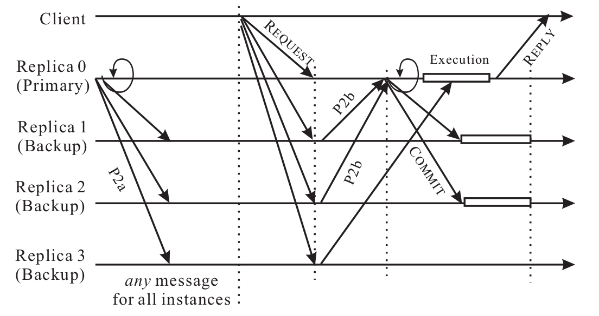
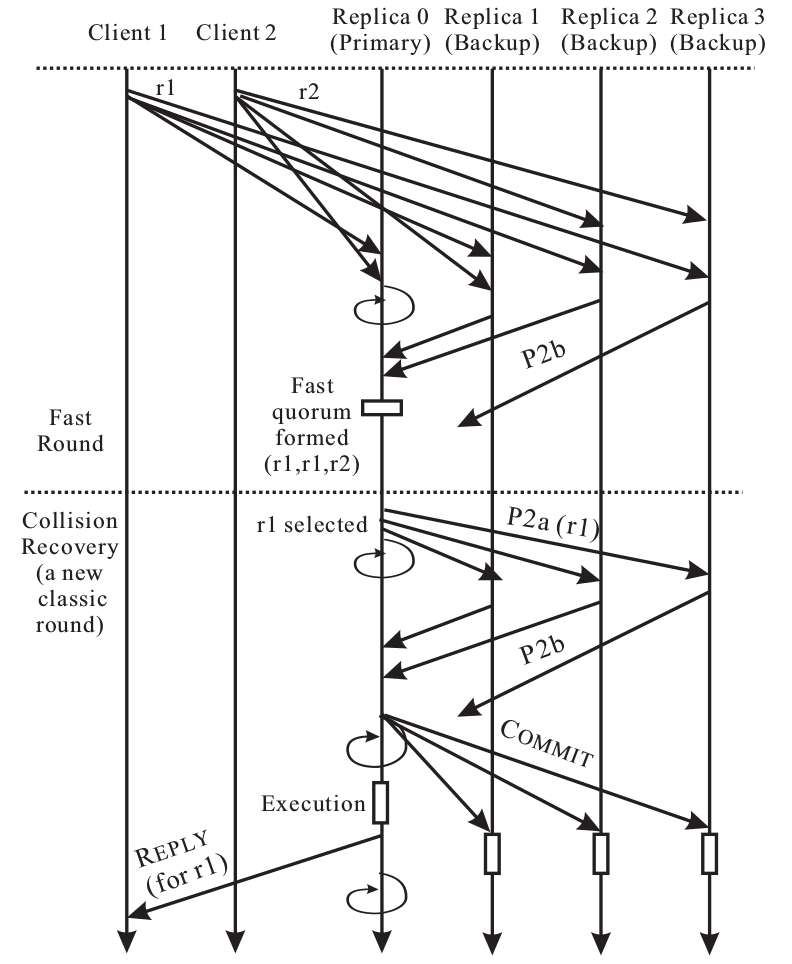

### The Basic Steps
Fast Paxos also operates in rounds (the round number corresponds to the proposal number in Classic Paxos) and each round has two phases.

Fast Paxos has a number of differences from Classic Paxos:
- In Fast Paxos, a round may be either a fast round or a classic round. A fast round may use a quorum of different size from that of a classic round. We refer to the quorum used in a fast round as fast quorum, and the quorum used in a classic round as classic quorum.
- In a classic round, the coordinator always selects the value to be voted on, similar to that of Classic Paxos.
- In a fast round, if the new value selection rule allows the coordinator to select its own value, it may send a special phase 2a message to the acceptors without any value selected. This special phase 2a message (referred to as any message) enables an acceptor to select its own value (proposed by a client) to vote on.

Assuming that there has been a unique coordinator since the server is turned on, the first time a fast round is run will always allow the coordinator to send an any message in phase 2. In a typical state-machine replicated system, this would allow the running of a single phase 2a message for all instances of Fast Paxos, which would eliminate one communication step. This is the sole advantage of Fast Paxos, hence, whenever possible, a fast round is run and a classic round is used only when a consensus cannot be reached in the fast round due to the failure of the coordinator or due to a collision.

### Collision Recovery, Quorum Requirement, and Value Selection Rule
Therefore, on detecting a collision, the coordinator should initiate recovery by starting a new, classic round. In this new classic round, it is apparent that the coordinator would receive the same, or similar information from a quorum of acceptors in the first phase of the new round. Therefore, the first phase can be omitted and the coordinator can proceed to determine a value to be voted on in the second phase.

First, it is useful to understand why the quorum requirement of *n* - *f*, where *f* = ⌋(*n* - 1) / 2⌊, does not work any more. To make a practical example, assume that *n* = 7 and *f* = 3. During round *i*, the proposer responsible for round *i* collects a quorum of exactly *n* - *f* = 4 promises from the acceptors. Some of the promises have the form `<PROMISE, i, j, 1>` (the last vote was cast in round *j* and the value was 1) and some have the form `<PROMISE, i, j, 2>` (the last vote was cast in round *j* and the value was 2). This is possible in Fast Paxos since multiple values can be proposed and voted in a fast round. The problem is that the coordinator still does not know the last vote of 3 acceptors and, unfortunately, these may be enough to form a quorum of *n* - *f* = 4 votes in round *j* either on value 1 or on value 2.

Therefore, the size of a classic quorum must be greater than *n*/2 (*i.e.*, a simple majority), and the size of a fast quorum must be greater than 3*n*/4. For example, if use the smallest e possible, *i.e.*, *e* = 1, we need a minimum of 4 acceptors. The size of a fast quorum would happen to be the same as that of a classic quorum, which is 3. Note that f = 1 too in this case. Furthermore, a classic quorum does not always have the same size of a fast quorum. Consider the case when *e* = 2. We need 8 acceptors, which means a classic quorum can consists of 5 acceptors while we would need 6 acceptors to form a fast quorum. Hence, *f* = 3 in this case.

Hence, the value selection rule is defined below:
1. If the votes contain different values, a value must be selected if the majority of acceptors in the quorum have casted a vote for that value. Otherwise, the coordinator is free to select any value.

In this example, we demonstrate a collision scenario and the corresponding collision recovery in a system with 2 concurrent clients and 4 server replicas. In this system, the number of faults tolerated is 1 for both a classic round and a fast round (*i.e.*, *f* = *e* = 1). The quorum size for both a classic round and a fast round is 3.

As shown in Figure, the two clients send simultaneously request 1 (*r*1) and request 2 (*r*2) to the replicas. We assume that the replicas (*i.e.*, the acceptors) would use a fast round trying to order a request. Replica 0 (*i.e.*, the coordinator) and replica 1 receive *r*1 ahead of *r*2, and thus vote to order *r*1 in this round. Replica 2 and replica 3 receive *r*2 ahead of *r*1, and thus vote to order *r*2 in this round.

The coordinator (*i.e.*, the primary) finds two different values (2 *r*1 and 1 *r*2) in the quorum of votes it has collected. Hence, a collision is detected. The coordinator subsequently starts a new classic round to recover from the collision. According to the value selection rule introduced earlier, the coordinator chooses *r*1 and include the value in its phase 2a message. When a quorum of replicas has voted, *r*1 is chosen and the coordinator informs the other replicas, after which, the request *r*1 is executed and the corresponding reply is returned.
