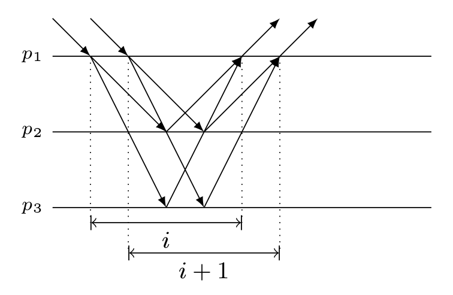

## Paxos Made Simple
### Implementing a State Machine
A simple way to implement a distributed system is as a collection of clients that issue commands to a central server. The server can be described as a deterministic state machine that performs client commands in some sequence. The state machine has a current state; it performs a step by taking as input a command and producing an output and a new state.

An implementation that uses a single central server fails if that server fails. We therefore instead use a collection of servers, each one independently implementing the state machine. Because the state machine is deterministic, all the servers will produce the same sequences of states and outputs if they all execute the same sequence of commands. A client issuing a command can then use the output generated for it by any server.

In normal operation, a single server is elected to be the leader, which acts as the distinguished proposer (the only one that tries to issue proposals) in all instances. Clients send commands to the leader, who decides where in the sequence each command should appear. If the leader decides that a certain client command should be the 135<sup>th</sup> command, it tries to have that command chosen as the value of the 135<sup>th</sup> instance of the consensus algorithm. It will usually succeed. It might fail because of failures, or because another server also believes itself to the leader and has a different idea of what the 135<sup>th</sup> command should be.

## Paxos Made Code
### The Paxos Algorithm
#### Actors
##### Learner
The task of the learner consists of listening to acceptor decisions, in order to deliver the ordered sequence of values. Once a Client request has been agreed on by the Acceptors, the Learner may take action (i.e.: execute the request and send a response to the client).

##### Acceptor
The task of the acceptor is relatively simple: it sits waiting for messages from proposers or learners and answers to them. Acceptors are collected into groups called Quorums.

##### Proposer
The proposer is responsible for pushing values submitted by the clients until those are delivered. Proposers relies on an external leader election service, which should nominate a *coordinator* (or *leader*) among them. Even a weak
failure detector is sufficient for this task. Proposers that are not the current coordinator can be idle; their only task is to be ready to take over the leadership, if the leader election service says so.

##### Leader Proposer
The leader proposer sends client values through the broadcast. For each client value submitted, it chooses the next unused instance and tries to bind the the value to it. If two processes believe they are leaders, they may stall the protocol by continuously proposing conflicting updates. However, the safety properties are still preserved in that case [Message flow: Basic Paxos, dueling proposers].

## Paxos
### Typical deployment
In most deployments of Paxos, each participating process acts in three roles; Proposer, Acceptor and Learner. This reduces the message complexity significantly, without sacrificing correctness.

### Basic Paxos
This protocol is the most basic of the Paxos family. Each instance of the Basic Paxos protocol decides on a single output value.

#### Phase 1a: *Prepare*
A Proposer (the leader) creates a proposal identified with a number N. Then, it sends a *Prepare* message containing this proposal \<*i*, N\>, where *i* is the instance number, to a Quorum of Acceptors.

#### Phase 1b: *Promise*
If the proposal's number N is higher than any previous proposal number received from any Proposer by the Acceptor, then the Acceptor must return a promise to ignore all future proposals having a number less than N. If the Acceptor accepted a proposal at some point in the past, it must include the previous proposal number and previous value in its response to the Proposer.

Otherwise, the Acceptor can ignore the received proposal.

#### Phase 2a: *Accept Request*
The second phase starts when the Proposer could manage to collect responses from the majority of Acceptors. The proposer needs to set a value to its proposal. If any Acceptors had previously accepted any proposal, then they'll have sent their values to the Proposer, who now must set the value of its proposal to the value associated with the highest proposal number reported by the Acceptors. If none of the Acceptors had accepted a proposal up to this point, then the Proposer may choose any value for its proposal.

#### Phase 2b: *Accepted*
If an Acceptor receives an Accept Request message for a proposal N, it must accept it if and only if it has not already promised to any prepare proposals having an identifier greater than N. In this case, it should register the corresponding value v and send an Accepted message to the Proposer and every Learner. Else, it can ignore the Accept Request.

Note that accepting request by an acceptor does not mean that the value contained in the proposal included in the accept request has been chosen. Only after the majority of acceptors have accepted the same accept request does the value is considered chosen.

#### Message flow: Basic Paxos
```
Client   Proposer      Acceptor     Learner
   |         |          |  |  |       |  |
   X-------->|          |  |  |       |  |  Request
   |         X--------->|->|->|       |  |  Prepare(1)
   |         |<---------X--X--X       |  |  Promise(1,{Va,Vb,Vc})
   |         X--------->|->|->|       |  |  Accept!(1,Vn)
   |         |<---------X--X--X------>|->|  Accepted(1,Vn)
   |<---------------------------------X--X  Response
   |         |          |  |  |       |  |
```
Vn = highest of (Va,Vb,Vc)

#### Algorithm for Learning a Value
Because of message loss, a value could be chosen with no learner ever finding out. The learner could ask the acceptors what proposals they have accepted, but failure of an acceptor could make it impossible to know whether or not a majority had accepted a particular proposal. In that case, learners will find out what value is chosen only when a new proposal is chosen. If a learner needs to know whether a value has been chosen, it can have a proposer issue a proposal, using the algorithm described above.

#### Proof of Correctness
Assume that two different values, *v*1 and *v*2 are chosen. According to the Paxos algorithm, the only way for a value to be chosen is for the majority of acceptors to accept the same accept request from a proposer. Hence, a set of majority of acceptors *A*1 must have accepted an accept request with a proposal [n1, *v*1], and similarly a set of majority of acceptors *A*2 must have accepted an accept request with a proposal [n2, *v*2].

If the two proposal numbers are the same, *i.e.*, *n*1 = *n*2, considering that the two sets *A*1 and *A*2 must intersect in least one acceptor, this acceptor must have accepted two different proposals with the same proposal number. This is impossible because according to the Paxos algorithm, an acceptor would ignore the prepare and accept requests with a proposal number identical to that of the prepare and/or accept requests it has accepted.

If *n*1 != *n*2, without loss generality, assume that *n*1 < *n*2. We first further assume that *n*1 and *n*2 are for consecutive rounds. A set of majority acceptors *A*1 must have accepted the accept request with a proposal number *n*1 *before* another set of majority acceptor *A*2 accepted the accept request with a proposal number *n*2 because an acceptor would ignore the prepare or accept request if it contains a proposal number smaller than the it has acknowledged in response to a prepare request. Furthermore, according to the Paxos algorithm, the value selected by a proposer for the accept request must either come from an earlier proposal with the highest proposal number or a value of its own if no earlier proposal is included in the acknowledgment messages. Because *A*1 and *A*2 must intersect in at least one acceptor, and this acceptor must have accepted the accept request for the proposal [*n*1, *v*1] *and* the accept request for the proposal [*n*2, *v*2]. This is impossible because that acceptor would have included the proposal [*n*1, *v*1] in its acknowledgment to the prepare request for the proposal with proposal number *n*2, and the proposer must have selected the value *v*1 instead of *v*2.

#### Error cases in Basic Paxos
The original Paxos algorithm also assumes that messages are not corrupted. We should clarify that messages can very well be corrupted by the network as long as the corruption can be detected. Once the corruption of a message is detected, the message is discarded by the receiving process, making this equivalent to a message loss, which can be resolved by a simple retransmission.

The simplest error case is the failure of an Acceptor when a Quorum of Acceptors remains live. In this case, the protocol requires no recovery.

#### Message flow: Basic Paxos, failure of Acceptor
(Quorum size = 2 Acceptors)
```
Client   Proposer      Acceptor     Learner
   |         |          |  |  |       |  |
   X-------->|          |  |  |       |  |  Request
   |         X--------->|->|->|       |  |  Prepare(1)
   |         |          |  |  !       |  |  !! FAIL !!
   |         |<---------X--X          |  |  Promise(1,{null,null})
   |         X--------->|->|          |  |  Accept!(1,V)
   |         |<---------X--X--------->|->|  Accepted(1,V)
   |<---------------------------------X--X  Response
   |         |          |  |          |  |

```
The next failure case is when a Proposer fails after proposing a value, but before agreement is reached. Ignoring Leader election, an example message flow is as follows:
#### Message flow: Basic Paxos, failure of Proposer
(re-election not shown, one instance, two rounds)
```
Client  Proposer        Acceptor     Learner
   |      |             |  |  |       |  |
   X----->|             |  |  |       |  |  Request
   |      X------------>|->|->|       |  |  Prepare(1)
   |      |<------------X--X--X       |  |  Promise(1,{null, null, null})
   |      |             |  |  |       |  |
   |      |             |  |  |       |  |  !! Leader fails during broadcast !!
   |      X------------>|  |  |       |  |  Accept!(1,Va)
   |      !             |  |  |       |  |
   |         |          |  |  |       |  |  !! NEW LEADER !!
   |         X--------->|->|->|       |  |  Prepare(2)
   |         |<---------X--X--X       |  |  Promise(2,{null, null, null})
   |         X--------->|->|->|       |  |  Accept!(2,V)
   |         |<---------X--X--X------>|->|  Accepted(2,V)
   |<---------------------------------X--X  Response
   |         |          |  |  |       |  |
```
The most complex case is when multiple Proposers believe themselves to be Leaders. For instance the current leader may fail and later recover, but the other Proposers have already re-elected a new leader. The recovered leader has not learned this yet and attempts to begin a round in conflict with the current leader.
#### Message flow: Basic Paxos, dueling Proposers
(one instance, four unsuccessful rounds)
```
Client   Proposer        Acceptor     Learner
   |      |             |  |  |       |  |
   X----->|             |  |  |       |  |  Request
   |      X------------>|->|->|       |  |  Prepare(1)
   |      |<------------X--X--X       |  |  Promise(1,{null,null,null})
   |      !             |  |  |       |  |  !! LEADER FAILS
   |         |          |  |  |       |  |  !! NEW LEADER (knows last number was 1)
   |         X--------->|->|->|       |  |  Prepare(2)
   |         |<---------X--X--X       |  |  Promise(2,{null,null,null})
   |      |  |          |  |  |       |  |  !! OLD LEADER recovers
   |      |  |          |  |  |       |  |  !! OLD LEADER tries 2, denied
   |      X------------>|->|->|       |  |  Prepare(2)
   |      |<------------X--X--X       |  |  Nack(2)
   |      |  |          |  |  |       |  |  !! OLD LEADER tries 3
   |      X------------>|->|->|       |  |  Prepare(3)
   |      |<------------X--X--X       |  |  Promise(3,{null,null,null})
   |      |  |          |  |  |       |  |  !! NEW LEADER proposes, denied
   |      |  X--------->|->|->|       |  |  Accept!(2,Va)
   |      |  |<---------X--X--X       |  |  Nack(3)
   |      |  |          |  |  |       |  |  !! NEW LEADER tries 4
   |      |  X--------->|->|->|       |  |  Prepare(4)
   |      |  |<---------X--X--X       |  |  Promise(4,{null,null,null})
   |      |  |          |  |  |       |  |  !! OLD LEADER proposes, denied
   |      X------------>|->|->|       |  |  Accept!(3,Vb)
   |      |<------------X--X--X       |  |  Nack(4)
   |      |  |          |  |  |       |  |  ... and so on ...
```
The solution is to ensure that there is eventually some interval during which there is exactly one proposer who doesn't fail. One way to do this is to use exponential random backoff: when a proposer decides it's not going to win a round (e.g. by receiving a nack or by waiting long enough to realize it won't be getting any more acks soon), it picks some increasingly large random delay before starting a new round; thus two or more will eventually start far enough apart in time that one will get done without interference.

### Multi-Paxos
Normally, one of the server replicas is designated as the primary at the beginning of the system deployment. Only when the primary becomes faulty, which is rare, or being suspected of being faulty by other replicas, another replica will be elected as the new primary. As long as there is a sole primary in the system, it is guaranteed that no replica would report having accepted any proposal to the primary, which would enable the primary to select any value (i.e., any request). Therefore, the first phase (i.e., the prepare phase) can be omitted during normal operation (i.e., when there is only a single primary in the system). The full Paxos algorithm is needed to elect a new primary and it is needed to run only once right after a new primary is elected. In essence, this run would execute the first phase of all instances of the Paxos as long as the current primary is operating.

### Optimizations


**Paxos Made Practical**

When we say that a cohort logs information, we mean it does a forced write to disk before proceeding.

A backup only logs a request after logging all previous operations, and only acknowledges a request once it has been logged.

**Raft**

When sending an AppendEntries RPC, the leader includes the index and term of the entry in its log that immediately precedes the new entries. If the follower does not find an entry in its log with the same index and term, then it refuses the new entries.

## Paxos Made Practical
### The setting
There are two standard models for dealing with persistence in a replicated system. One is to treat reboots just like any other form of failure. Since the system's goal is to survive as long as a majority of cohorts do not fail simultaneously, we do not need to keep any persistent state when viewing reboots as failures.

The other model is to assume that any machine may reboot at any time, and that as long as it doesn't lose its disk, this doesn't count as a failure. Given three replicas in this model, if all three are power-cycled simultaneously and one loses a disk in the process, the system can continue working as soon as the other two machines reboot. We will design our protocol to use this second model. When we say that a cohort logs information, we mean it does a forced disk write to disk before proceeding. It is easy to convert our protocol to the reboot-as-failure model by making all disk writes asynchronous.

### Normal-case operation
We use the term *view* to denote a set of active cohorts with a designated primary. The system also assigns each view a unique *view-id*. view-ids increase monotonically each time the group's view changes.

The primary cohort numbers all requests it receives in a given view with consecutive *timestamp* values, starting at 1. Timestamps specify the order in which cohorts must execute requests within a view. Since view numbers are monotonically increasing, the combination of view-id and timestamp, which we call a *viewstamp*, determines the execution order of all requests over time.

### View-change protocol
At some point, one of the cohorts may suspect that another cohort has crashed because it fails to respond to messages. Alternatively, a new cohort may wish to join the system, possibly to replace a previously failed cohort. Either scenario calls for the group's membership to change. Since the trigger for a such a change may be the primary failing, any cohort that is part of the current view may decide to try to change the group's configuration by initiating a *view change*. This is a multi-step process like Paxos that involves first proposing a new view-id, then
proposing the new view.

#### Proposing a new view-id
To initiate a view change, a cohort starts by proposing a new view-id. The cohort proposing the view-id is called the
*view manager* for the new view. (The view manager should not be confused with the primary.) The first
step is to select a view-id greater than the highest one the view manager has ever seen.

Once the view manager has selected a new view-id, it sends a *view change* RPC to all the other cohorts that are either in the current view or should join the new view. The arguments are:
```
struct view_change_arg {
  view_t oldview;
  viewid_t newvid;
};
```
Here `newvid` is the newly selected view-id, while `oldview` is the most recent successfully formed view that the view manager knows about (which it stores in `proposed_vid`).

We call cohorts that receive a view change request *underlings*, to distinguish them from the view manager that sent the RPC. When an underling receives a view change RPC, there are four possible cases to consider:
1. `oldview.vid` in the view change request is less than `view.vid` in the underling's state. Thus, at least one subsequent view has already successfully formed since the one the manager wants to change. The underling therefore rejects the view change RPC.
2. `oldview.vid` >= `view.vid`, but `newvid` in the request is less than `proposed_vid` in the underling's state. Thus, another manager has already proposed a higher new view-id.
3. ...

The underling sends one of two reply types to a view change RPC, depending on whether it rejects or accepts the view change request:
```
struct view_change_accept {
  cit_t myid;
  bool include_me;
  viewstamp_t latest;
  view_t *newview;
};
```

#### Proposing a new view
Next, the view manager selects a primary. If the primary from *V*<sub>old</sub> is also in *V*, the view manager keeps the same primary. Otherwise, it selects the cohort in *V* with the highest `accept.latest` field, breaking ties first by preferentially selecting himself, then arbitrarily. The view manager sends the proposed new view *V* to all cohorts in *V*<sub>old</sub> and *V* with a new view RPC. The arguments also include the highest `accept.latest` viewstamp reported by any cohort:
```
struct new_view_arg {
   viewstamp_t latest;
   view_t view;
};
```
If an underling has switched to a different view manager with a higher proposed `newvid`, it rejects the new view RPC. Otherwise, it compares `latest` to the viewstamp at the end of its own log, and if any operations are missing brings itself up to date by transferring the missing log entries from the proposed new primary.

## CS5412: PAXOS
### Leslie Lamport's vision
* Centers on *state machine replication* 
  * We have a set of replicas that each implement some given, deterministic, state machine and we start them in the same state
  * Now we apply the same events in the same order. The replicas remain in the identical state
* How best to implement this model?
### Two paths forwards
* One option is to build a totally ordered reliable multicast protocol, also called an "atomic broadcast" protocol in some papers
  * To send a request, you give it to the library implementation protocol
  * Eventually it does *upcalls* to event handlers in the replicated application and they apply the event
  * In this approach the application "is" the state machine and the multicast "is" the replication mechanism
* Use "state transfer" to initialize a joining process if we want to replace replicas that crash

* A second option, explored in Lamport's Paxos achieves a similar result but in a very different way

### Paxos: Step by step
* Paxos is designed to deal with systems that
  * Reach ***agreement*** on what "commands" to execute, and on the order in which to execute them in
  * Ensure ***durability***: once a command becomes executable, the system will never forget the command. In effect, the data ends up in a database that Paxos is used to update.
  * Durability usually means "persisted into non-volatile storage"
* The term command is interchangeable with "message" and the term "execute" means "take action"
* Paxos is *not* a reliable multicast protocol. It normally holds the entire state of the application and the front-end systems normally need to obtain (***learn*) state by querying Paxos.
### Terminology
* These roles are:
  * Leader (a process that runs the update protocol)
  * Acceptor (a participant), and
  * Learner (a protocol for obtaining the list of committed commands)
### Visualizing this
* The client asks the leader for help "I would like the Paxos system to accept this command." Paxos is like a "postal system". A leader passes the command in.
* The leader and acceptors group "thinks" about the letter for a while (replicating the data and picking a delivery order)
* Once the commands their ordering is "decided" it can be learned by running a learner protocol
* Usually the learners then take some action: they carry out the command

### Applying commands to the state machine
* The learner watches and waits until new commands become committed (decided)
  * As slots become decided, the learner is able to find out if a decided slot has a command, or nothing in it =.
    * Goes to the next slot if "no command"
    * Performs the command if a command is present
  * Can't skip a slot: learner takes one step at a time
* Little known but important: *after a crash, a recovering learner is shown the whole log from the start and is supposed to ignore commands that were already done.*

### Paxos with a disk
* Accordingly, the command list must be kept on a disk, as a disk log: leads to **Corfu** system
  * Now accept and commit actions involved disk writes that must be complete before next step can occur
  * Further slows the protocol down

### Paxos isn't a reliable multicast!
* Consider the following common idea:
  * Take a file, or a database... Make N replicas
  * Now put a program that runs Paxos in front of the replicated file/db
  * Learner just asks the file to do the command (a write or append), or the DB to run an update query
  * Would this be correct? Why?
    * ... no, because after a crash, Paxos will replay commands and the file or database might be updated twice if it isn't "idempotent". Many researchers don't realize this.
### Correct use of Paxos
* The learner needs to be a part of the application!
* By treating the learner as part of Paxos, we erroneously ignore the durability of actions in the application state, and this causes potential error
  * The *application* must perform every operation, at least once
  * Learner retries after crashes until application has definitely performed each action
  * To avoid duplicated actions, application should check for and ignore actions already applied to the database
* Many Paxos-based replication systems are incorrect because they fail to implement this logic!

## Paxos Made Transparent
### CRANE OVERVIEW
#### Architecture
Each checkpoint in CRANE is associated with a global index in PAXOS's consensus order, so if one replica needs recovery. CRANE ships the latest check from a backup replica, restores the process running DMT and the server program, and re-executes socket calls starting from this index.
