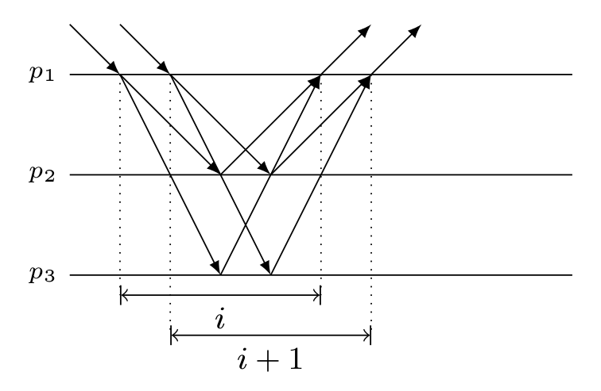
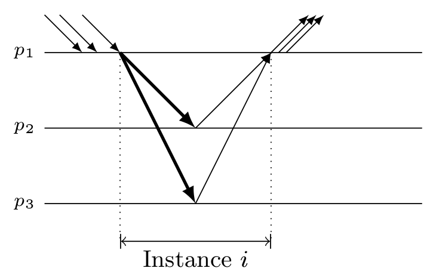

## Scaling Leader-based Agreement Protocols for State Machine Replication

### The Scalability Problem
#### Why Paxos Doesn't Scale
To understand why Paxos gets slower as you increase the number of replicas, we need to understand the message pattern of the normal case command-response loop.
The best case for this loop (the case where the client originally sends its command to the current leader and no other replica preempts the leader): the leader sends messages to all of the replicas and waits for responses from at least a majority of the replicas, including itself. Only after receiving those responses does the leader respond to the client.

It is pretty easy to see what is going on with our system that is slowing down. As we increase the number of replicas in the system, the number of messages the leader has to send per request increases. The cost of sending and receiving messages is often much higher than the cost of local computation in distributed systems.

## JPaxos: State machine replication based on the Paxos protocol
### Paxos optimizations: Batching and pipelining
#### Pipelining
Pipelining is an optimization that allows the leader to execute several instances in parallel. It is based on the observation that when a leader receives a new request, it can start a new instance at once, even if there are other that are still undecided.

Executing parallel instances improves the utilization of resources by pipelining the different instances. This optimization is especially effective in high-latency networks, as the leader might have to wait a long time to receive the Phase 2b messages.

JPaxos limits the number of instances that can be executed in parallel by a configuration parameter named *window size*. This is necessary because setting the window size to an excessive value can degrade performance. On the one hand, each instance requires additional resources from the system. If too many instances are started in parallel, they may overload the system, either by maxing out the leader's CPU or by causing network congestion, resulting in a more or less severe performance degradation. Finally, although instances can be decided out-of-order, requests must be executed in order which means that an undecided instance will delay the execution of all the requests ordered in later instances, potentially stalling the service until the gaps are filled. Although having some requests prepared ahead of time for execution may improve the performance as it allows execution to proceed quickly after the gaps are filled, a large window size may result in the system spending resources ordering requests that cannot be executed instead of deciding the instances that are next in execution order.

#### Batching
Batching is a common optimization in communication systems, which generally provides large gains in throughput and, indirectly, in response time.

Instead of proposing one request per instance, the leader packs several requests in a single instance. Once the order of a batch is established, the order of the individual requests is decided by a deterministic rule applied to the request identifiers.

The gains of batching come from spreading the fixed costs of an instance over several requests, thereby decreasing the average per-request overhead.

## S-Paxos: Offloading the Leader for High Throughput State Machine Replication
We observe that implementations of state machine replication are prevalently using variants of Paxos or other leader-based protocols. Typically these protocols are also leader-centric, in the sense that most of the work is done by the leader. Therefore the bottleneck is found at the leader and the maximum throughput is limited by the leader's resources (such as CPU and network bandwidth), although there are still available resources at other replicas.

We illustrate our observation with JPaxos, an efficient multi-threaded implementation of Paxos in Java. The maximum throughput is achieved for 1000 clients. At this point, the leader's CPU becomes the bottleneck and further increasing the number of clients results in a decrease of the throughput. The other replicas, however, are only lightly loaded. Since the bottleneck is at the leader, introducing additional replicas will not improve performance; in fact it will lead to a slight decrease in throughput since the leader will need to process additional messages.
