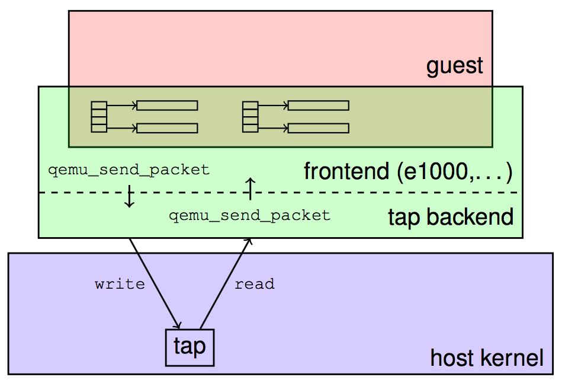
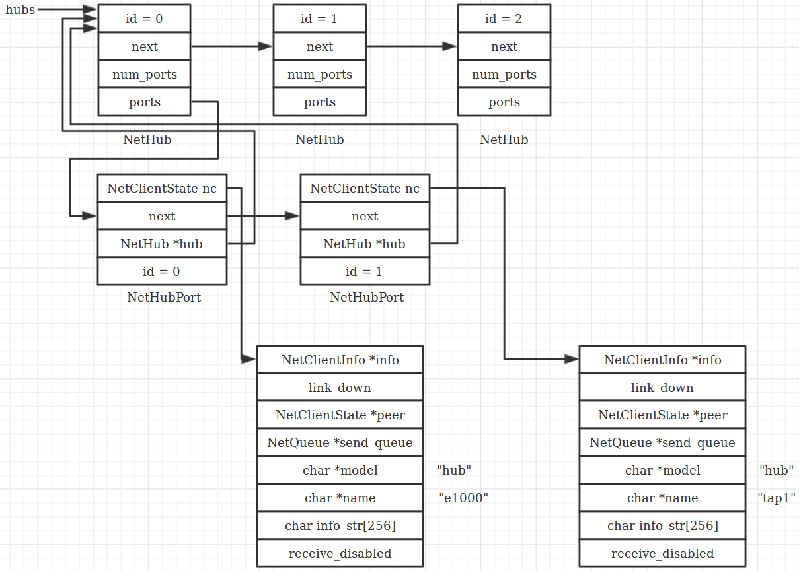

## Creating a network backend
There are a number of network backends to choose from depending on your environment. Create a network backend like this:
```
-netdev TYPE,id=NAME,...
```
The `id` option gives the name by which the virtual network device and the network backend are associated with each other.

## Network backend types
### Tap
The tap networking backend makes use of a tap networking device in the host. It offers very good performance and can be configured to create virtually any type of network topology.
```
-netdev tap,id=mynet0
```
## Creating a virtual network device
The virtual network device that you choose depends on your needs and the guest environment (i.e. the hardware that you are emulating).

On machines that have PCI bus, there are a wider range of options. The e1000 is the default network adapter in qemu.

Use the `-device` option to add a particular virtual network device to your virtual machine:
```
-device TYPE,netdev=NAME
```
The `netdev` is the name of a previously defined `-netdev`. The virtual network device will be associated with this network backend.



## Network I/O Path Analysis

Qemu is a permanent memory process, which keeps reading the corresponding file descriptor in the kernel space by calling the function `tap_send` to check whether there is any frame received by the tap virtual device.
```
tap_send() -> qemu_send_packet_async() -> qemu_send_packet_async_with_flags() -> qemu_net_queue_send() ->
qemu_net_queue_deliver() -> queue->deliver() -> qemu_deliver_packet_iov() -> nc->info->receive_iov()

static NetClientInfo net_hub_port_info = {
    .type = NET_CLIENT_OPTIONS_KIND_HUBPORT,
    .size = sizeof(NetHubPort),
    .can_receive = net_hub_port_can_receive,
    .receive = net_hub_port_receive,       
    .receive_iov = net_hub_port_receive_iov, // nc->info->receive_iov()
    .cleanup = net_hub_port_cleanup,
};

/* A hub broadcasts incoming packets to all its ports except the source port. */
static ssize_t net_hub_receive_iov(NetHub *hub, NetHubPort *source_port,
                                   const struct iovec *iov, int iovcnt)
{
    NetHubPort *port;
    ssize_t len = iov_size(iov, iovcnt);

    QLIST_FOREACH(port, &hub->ports, next) {
        if (port == source_port) {
            continue;
        }

        qemu_sendv_packet(&port->nc, iov, iovcnt);
    }
    return len;
}

qemu_sendv_packet() -> qemu_sendv_packet_async() -> qemu_net_queue_send_iov() -> qemu_net_queue_deliver_iov()
-> queue->deliver() -> qemu_deliver_packet_iov() -> nc->info->receive_iov()

static NetClientInfo net_e1000_info = {
    .type = NET_CLIENT_OPTIONS_KIND_NIC,
    .size = sizeof(NICState),
    .can_receive = e1000_can_receive,
    .receive = e1000_receive,
    .receive_iov = e1000_receive_iov,        // nc->info->receive_iov()
    .link_status_changed = e1000_set_link_status,
};

e1000_receive_iov()
{
    ...
    //Invoking DMA function
    ...
    //Fire interrupt
}
```