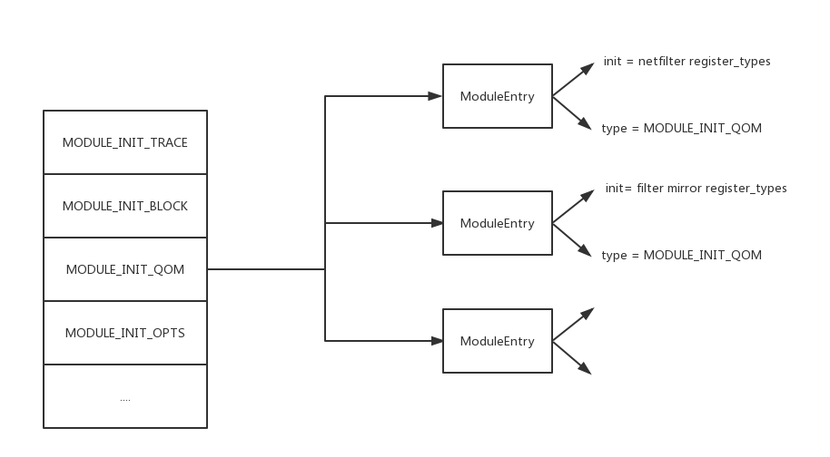
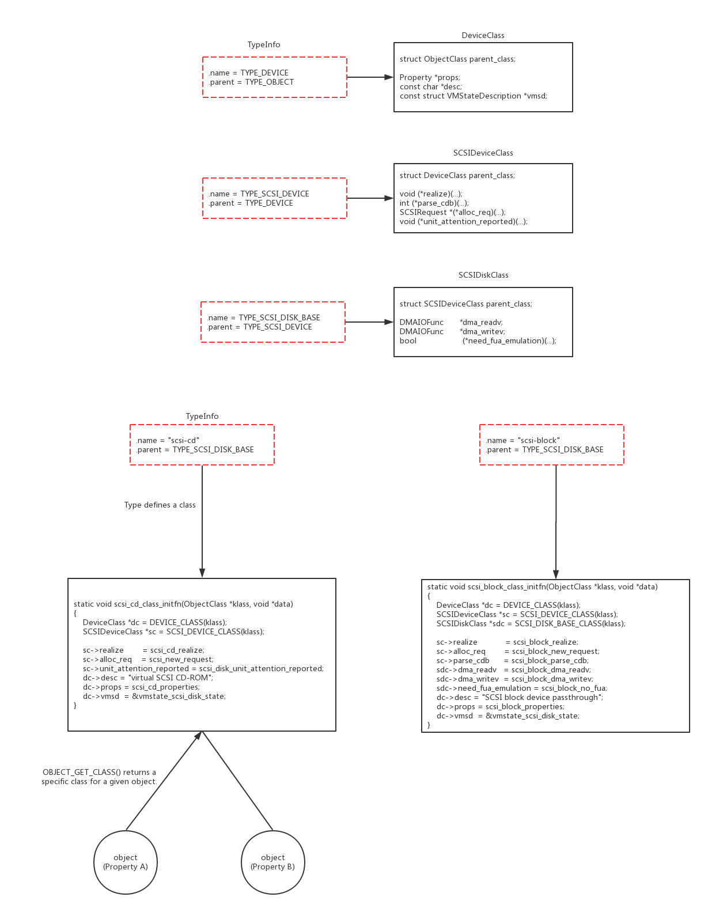

### Register Types
```
static void register_types(void)
{
    type_register_static(&filter_mirror_info);
    type_register_static(&filter_redirector_info);
}

type_init(register_types);
```

```
/* include/qemu/module.h */

#define type_init(function) module_init(function, MODULE_INIT_QOM)

#define block_init(function) module_init(function, MODULE_INIT_BLOCK)
#define opts_init(function) module_init(function, MODULE_INIT_OPTS)
#define trace_init(function) module_init(function, MODULE_INIT_TRACE)

#define module_init(function, type)                                         \
static void __attribute__((constructor)) do_qemu_init_ ## function(void)    \
{                                                                           \
    register_module_init(function, type);                                   \
}
/* 
 * Note: The constructor attribute causes the function to be
 * called automatically before execution enters main ().
 */

void register_module_init(void (*fn)(void), module_init_type type)
{
    ModuleEntry *e;
    ModuleTypeList *l;

    e = g_malloc0(sizeof(*e));
    e->init = fn;
    e->type = type;

    l = find_type(type);

    QTAILQ_INSERT_TAIL(l, e, node);
}
```


### Class Initialization



TypeInfo defines a class.

The #ObjectClass typically holds a table of function pointers for the virtual methods implemented by this type.
```
static void type_initialize(TypeImpl *ti)
{
    TypeImpl *parent;

    if (ti->class) {
        return;
    }

    ti->class_size = type_class_get_size(ti);
    ti->instance_size = type_object_get_size(ti);
    /* Any type with zero instance_size is implicitly abstract.
     * This means interface types are all abstract.
     */
    if (ti->instance_size == 0) {
        ti->abstract = true;
    }

    ti->class = g_malloc0(ti->class_size);

    parent = type_get_parent(ti);
    if (parent) {
        type_initialize(parent);
        GSList *e;
        int i;

        g_assert_cmpint(parent->class_size, <=, ti->class_size);

        /* 
         * Classes are initialized by first initializing any parent classes (if
         * necessary). After the parent class object has initialized, it will be
         * copied into the current class object.
         * The effect of this is that classes automatically inherit any virtual
         * function pointers that the parent class has already initialized.
         */
        memcpy(ti->class, parent->class, parent->class_size);

        ti->class->interfaces = NULL;
        ti->class->properties = g_hash_table_new_full(
            g_str_hash, g_str_equal, g_free, object_property_free);

        for (e = parent->class->interfaces; e; e = e->next) {
            InterfaceClass *iface = e->data;
            ObjectClass *klass = OBJECT_CLASS(iface);

            type_initialize_interface(ti, iface->interface_type, klass->type);
        }

        for (i = 0; i < ti->num_interfaces; i++) {
            TypeImpl *t = type_get_by_name(ti->interfaces[i].typename);
            for (e = ti->class->interfaces; e; e = e->next) {
                TypeImpl *target_type = OBJECT_CLASS(e->data)->type;

                if (type_is_ancestor(target_type, t)) {
                    break;
                }
            }

            if (e) {
                continue;
            }

            type_initialize_interface(ti, t, t);
        }
    } else {
        ti->class->properties = g_hash_table_new_full(
            g_str_hash, g_str_equal, g_free, object_property_free);
    }

    ti->class->type = ti;

    while (parent) {
        if (parent->class_base_init) {
            parent->class_base_init(ti->class, ti->class_data);
        }
        parent = type_get_parent(parent);
    }

    if (ti->class_init) {
        ti->class_init(ti->class, ti->class_data);
    }
}
```
### Object Cast
Using `object_new()`, a new #Object derivative will be instantiated. You can cast an #Object to a subclass (or base-class) type using `object_dynamic_cast()`.  You typically want to define macro wrappers around `OBJECT_CHECK()` and `OBJECT_CLASS_CHECK()` to make it easier to convert to a specific type.

### Object Property
```
typedef struct MirrorState {
    NetFilterState parent_obj;
    char *indev;
    char *outdev;
    CharBackend chr_in;
    CharBackend chr_out;
    SocketReadState rs;
} MirrorState;

object_property_add_str(obj, "indev", filter_redirector_get_indev, filter_redirector_set_indev, NULL);
object_property_add_str(obj, "outdev", filter_redirector_get_outdev, filter_redirector_set_outdev, NULL);

static char *filter_redirector_get_indev(Object *obj, Error **errp)
{
    MirrorState *s = FILTER_REDIRECTOR(obj);

    return g_strdup(s->indev);
}

static void
filter_redirector_set_indev(Object *obj, const char *value, Error **errp)
{
    MirrorState *s = FILTER_REDIRECTOR(obj);

    g_free(s->indev);
    s->indev = g_strdup(value);
}
```