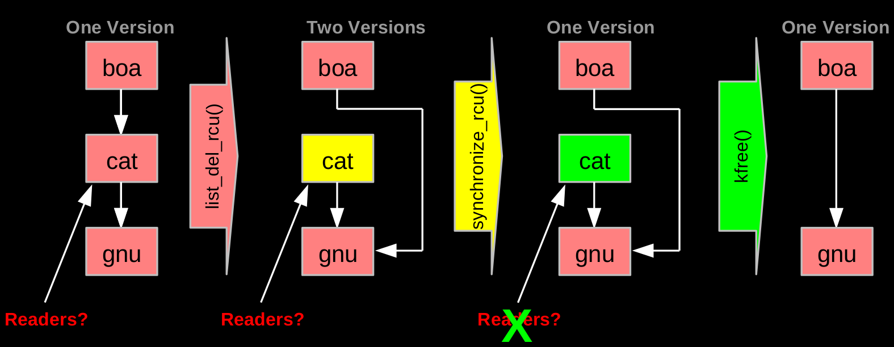

RCU supports concurrency between multiple readers and one single writer. In general, readers can read the RCU protected data without lock.

### Simple Buffer Example
Writer:
- Copy data in new buffer
- Update new buffer
- Replace buffer pointer
- Wait for readers
- Free old buffer

Readers:
- Arrived before update:
  - See old buffer
- Arrived after update
  - See new buffer

### Simple Buffer Pseudo Code
Writer:
```
// Sync with other writers
char *old = rcu_dereference(buf)
char *new = malloc( enough )
memcpy(new, old)        // copy
update_content(new)     // update
rcu_assign_pointer(buf, new)
synchronize_rcu()       // Writer waits for all readers to finish 
free(old)
```
Reader:
```
rcu_read_lock()         // Used by a reader to inform the writer that the reader
                        // is entering an RCU read-side critical section. 
char *b = rcu_dereference(buf)
read_content(b)         // read
rcu_read_unlock()
```

### RCU Removal From Linked List
- Combines waiting for readers and multiple versions:
- Writer removes the cat's element from the list (list_del_rcu())
- Writer waits for all readers to finish (synchronize_rcu())
- Writer can then free the cat's element (kfree())



Note: On all systems running Linux, loads from and stores to pointers are atomic, that is, if a store to a pointer occurs at the same time as a load from that same pointer, the load will return either the initial value or the value stored, never some bitwise mashup of the two.

### RCU: How Updaters Guarantee Existence
- RCU grace period waits for all pre-exiting readers to complete their RCU read-side critical sections

### Waiting for Pre-Existing Readers
- Non-preemptive environment (CONFIG_PREEMPT=n)
- CPU context switch means all that CPU's readers are done
- Grace period begins after synchronize_rcu() call and ends after all CPUs execute a context switch

### Memory Ordering: Mischief From Compiler and CPU
- Original Updater code:
  ```
  p = malloc(sizeof(*p));
  p->a = 1;
  p->b = 2;
  p->c = 3;
  cptr = p;
  ```

- Original reader code:
  ```
  p = cptr;
  foo(p->a, p->b, p->c);
  ```

- Mischievous updater code: nothing is forcing the CPU and compiler to execute the operations in the last 4 lines in the writing order.
  ```
  p = malloc(sizeof(*p));
  cptr = p;
  p->a = 1;
  p->b = 2;
  p->c = 3;
  ```

- Mischievous reader code: DEC Alpha CPU and value-speculation compiler may fetch the value of p's fields before fetching the value of p! The value-speculation compiler would guess the values of p and fetch the fields of p, then fetch p's real value in order to check if its guess is correct.
  ```
  retry:
  p = guess(cptr);
  foo(p->a, p->b, p->c);
  if (p != cptr)
      goto retry;
  ```

### Preventing Memory-Order Mischief
- Updater uses rcu_assign_pointer() to publish pointer:
  ```
  #define rcu_assign_pointer(p, v) \
  ({ \
          smp_wmb(); /* SMP Write Memory Barrier */ \
          (p) = (v); \
  })
  ```

- Reader uses rcu_deference() to subscribe to pointer:
  ```
  #define rcu_dereference(p) \
  ({ \
          typeof(p) _p1 = (*(volatile typeof(p)*)&(p)); \
          smp_read_barrier_depends(); \
          _p1; \
  })
  ```

### RCU API – Linux vs. QEMU
- rcu_dereference(p) -> atomic_rcu_read(&p)
- rcu_assign_pointer(p,v) -> atomic_rcu_set(&p,v) 

