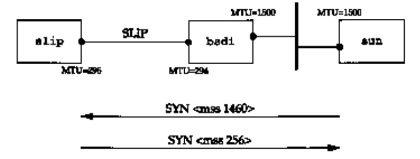
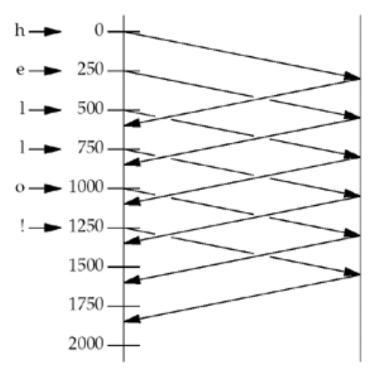
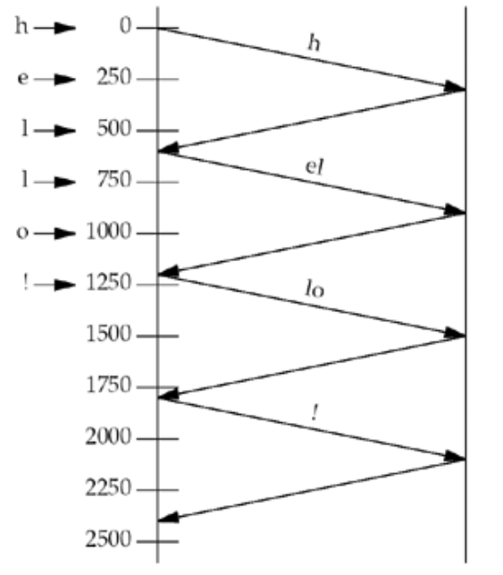

# UNIX Network Programming
## Introduction to TCP/IP
### The Transport Layer: TCP, UDP, and SCTP
#### User Datagram Protocol (UDP)
The application writes a message to a UDP socket, which is then *encapsulated* in a UDP *datagram*, which is then further encapsulated as an IP datagram, which is then sent to its destination. There is no guarantee that a UDP datagram will ever reach its final destination, that order wil be preserved across the network, or that datagrams arrive only once.

#### Transmission Control Protocol (TCP)
TCP also provides *reliability*. When TCP sends data to the other end, it requires an acknowledgment in return. When TCP sends data to the other end, it requires an acknowledgment in return. If an acknowledgment is not received, TCP automatically retransmits the data and waits a longer amount of time. After some number of retransmissions, TCP will give up, with the total amount of time spent trying to send data typically between 4 and 10 minutes.

TCP contains algorithms to estimate the *round-trip time* (RTT) between a client and server dynamically so that it knows how long to wait for an acknowledgment. For example, the RTT on a LAN can be milliseconds while across a WAN, it can be seconds. Furthermore, TCP continuously estimates the RTT of a given connection, because the RTT is affected by variations in the network traffic.

TCP also *sequences* the data by associating a sequence number with every byte that it sends.

> All bytes in a TCP connection are numbered, beginning at a randomly chosen initial sequence number.

For example, assume an application writes 2048 bytes to a TCP socket, causing TCP to send two segments, the first containing the data with sequence numbers 1-1024 and the second containing the data with sequence numbers 1025-2048. If the segments arrive out of order, the receiving TCP will reorder the two segments based on their sequence numbers before passing the data to the receiving application. If TCP receives duplicate data from its peer (say the peer thought a segment was lost and retransmitted it , when it wasn't really lost, the network was just overloaded), it can detect that the data has been duplicated (from the sequence numbers), and discard the duplicate data.

#### TCP Connection Establishment and Termination
**Three-Way Handshake**

The following scenario occurs when a TCP connection is established:
1. The server must be prepared to accept an incoming connection. This is normally done by calling `socket`, `bind`, and `listen` and is called a *passive open*.
2. The client issues an *active open* by calling `connect`. This causes the client TCP to send a "synchronize" (SYN) segment, which tells the server the client's initial sequence number for the data that the client will send on the connection. 
3. The server must acknowledge (ACK) the client's SYN and the server must also send its own SYN containing the initial sequence number for the data that the server will send on the connection. The server sends its SYN and ACK of the client's SYN in a single segment.
4. The client acknowledge the server's SYN.

**TCP Options**

Each SYN can contain TCP options. Commonly used options include the following:
- MSS option. With this option, the TCP sending the SYN announces its *maximum segment size*, the maximum amount of data that it is willing to accept in each TCP segment, on this connection. The sending TCP uses the receiver's MSS value as the maximum size of a segment that it sends.

**Watching the Packets**

Notice that the acknowledgment of the client's request is sent with the server's reply. This is called *piggybacking* and will normally happen when then the time it takes the server to process the request and generate the reply is less than 200 ms.

#### TIME_WAIT state
We can see that the end that performs the active close goes through this state. The duration that this endpoint is in this state is twice the *maximum segment lifetime* (MSL), sometimes called 2MSL.

The MSL is the maximum amount of time that any given IP datagram can live in a network.

There are two reasons for the TIME_WAIT state:
1. To allow duplicate segments to expire in the network

Assume we have a TCP connection between 12.106.32.254 port 1500 and 206.168.112.219 port 21. This connection is closed and then sometime later, we establish another connection between the same IP addresses and ports: 12.106.32.254 port 1500 and 206.168.112.219 port 21. This latter connection is called an *incarnation* of the previous connection since the IP addresses and ports are the same. TCP must prevent old duplicates from a connection from reappearing at some later time and being misinterpreted as belonging to a new incarnation of the same connection. To do this, TCP will not initiate a new incarnation of a connection that is currently in the TIME_WAIT state. Since the duration of the TIME_WAIT state is twice the MSL, this allows MSL seconds for a packet in one direction to be lost, and another MSL seconds for the reply to be lost. By enforcing this rule, we are guaranteed that when we successfully establish a TCP connection, all old duplicates from previous incarnations of the connection have expired in the network.

#### TCP Port Numbers and Concurrent Servers
Let's examine a typical sequence. First, the server is started on the host `freebsd`, which is multihomed with IP addresses 12.106.32.254 and 192.168.42.1, and the server does a passive open using its well-known port number (21, for this example). It is now waiting for a client request.

We use the notation `{*:21, *:*}` to indicate the server's socket pair. The server is waiting for a connection request on any local interface (the first asterisk) on port 21.

When we specify the local IP address as an asterisk, it is called the *wildcard* character. If the host on which the server is running is multihomed (as in this example), the server can specify that it wants only to accept incoming connections that arrive destined to one specific local interface. This is a one-or-any choice for the server. The server cannot specify a list of multiple addresses. The wildcard local address is the "any" choice. The wildcard address was specified by setting the IP address in the socket address structure to `INADDR_ANY` before calling `bind`.

#### Buffer Sizes and Limitations
- Many networks have an *MTU* which can be dictated by the hardware.

- The smallest MTU in the path between hosts is called the *path MTU*.

- When an IP datagram is to be sent out an interface, if the size of the datagram exceeds the link MTU, *fragmentation* is performed by both IPv4 and IPv6. The fragments are not normally *reassembled* until they reach the final destination.

- TCP has a *maximum segment size* (MSS) that announces to the peer TCP the maximum amount of TCP data that the peer can send per segment. The goal of the MSS is to tell the peer the actual value of the reassembly buffer size and try to avoid fragmentation. The MSS option is often set to the interface MTU minus the fixed sizes of the IP and TCP headers.

  Consider our host `slip`, which has a SLIP link with an MTU of 296 to the router `bsdi`. Figure below shows these systems and the host `sun`.

  

  We initiate a TCP connection from `sun` to `slip`.
  The important fact here is that `sun` cannot send a segment with more than 256 bytes of data, since it received an MSS option of 256. Furthermore, since `slip` knows that the outgoing interface's MTU is 296, even though `sun` announced an MSS of 1460, it will never send more than 256 bytes of data, to avoid fragmentation.

  If both hosts are connected to Ethernets, and both announce an MSS Of 536, but an intermediate network has an MTU of 296, fragmentation will occur.

## Elementary Sockets
### Sockets Introduction
#### Socket Address Structures
Each supported protocol suite defines its own socket address structure. The names of these structures begin with `sockaddr_` and end with a unique suffix for each protocol suite.

**IPv4 Socket Address Structure**

An IPv4 socket address structure is named `sockaddr_in` and is defined by including the `<netinet/in.h>` header.
```c
struct in_addr {
    in_addr_t s_addr;           /* 32-bit IPv4 address */
};                              /* network byte ordered */


struct sockaddr_in {
    uint8_t        sin_len;     /* length of structure (16) */
    sa_family_t    sin_family;  /* AF_INET */
    in_port_t      sin_port;    /* 16-bit TCP or UDP port number */
                                /* network byte ordered */
    struct in_addr sin_addr;    /* 32-bit IPv4 address */
                                /* network byte ordered */
    char           sin_zero[8]; /* unused */
};
```
There are several points we need to make about socket address structures in general using this example:
- Both the IPv4 address and the TCP or UDP port number are always stored in the structure in network byte order. We must be cognizant of this when using these members.
- The `sin_zero` member is unused, but we *always* set it to 0 when filling in one of these structures. By convention, we always set the entire structure to 0 before filling it in, not just the `sin_zero` member.

**Generic Socket Address Structure**

A socket address structure is *always* passed by reference when passed as an argument to any socket functions. But any socket function that takes one of these pointers as an argument must deal with socket address structures from *any* of the supported protocol families.

A problem arises in how to declare the type of pointer that is passed.
```c
struct sockaddr {
	uint8_t     sa_len;
	sa_family_t sa_family;   /* address family: AF_xxx value */
	char        sa_data[14]; /* protocol-specific address */
};
```
This requires that any calls to these functions must cast the pointer to the protocol-specific socket address structure to be a pointer to a generic socket address structure. For example,
```c
struct sockaddr_in serv;       /* IPv4 socket address structure */

/* fill in serv{} */

bind(sockfd, (struct sockaddr *)&serv, sizeof(serv));
```

#### Byte Ordering Functions
Consider a 16-bit integer that is made up of 2 bytes. There are two ways to store the two bytes in memory: with the low-order byte at the starting address, known as *little-endian* byte order, or with the high-order byte at the starting address, known as *big-endian* byte order.

Unfortunately, there is no standard between these two byte orderings and we encounter systems that use both formats. We refer to the byte ordering used by a given system as the *host byte order*.

The Internet protocols use big-endian byte ordering for these multibyte integers.
```c
#include <netinet/in.h>
uint16_t htons(uint16_t host16bitvalue);
uint32_t htonl(uint32_t host32bitvalue);

uint16_t ntohs(uint16_t net16bitvalue);
uint32_t ntohl(uint32_t net32bitvalue);
```
In the names of these functions, `h` stands for *host*, `n` stands for *network*, `s` stands for *short*, and `l` stands for *long*. We should think of `s` as a 16-bit value (such as TCP or UDP port number) and `l` as a 32-bit value (such as an IPv4 address).

On those systems that have the same byte ordering as the Internet protocols (big-endian), these four functions are usually defined as null macros.

#### `inet_addr` Functions
1. `inet_addr` converts an IPv4 address from a dotted-decimal string (e.g., "206.168.112.96") to its 32-bit network byte ordered binary value.

```c
#include <arpa/inet.h>
in_addr_t inet_addr(const char *strptr);
```

### Elementary TCP Sockets
#### `socket` function
To perform network I/O, the first thing a process must do is call the `socket` function, specifying the type of communication protocol desired (TCP using IPv4, UDP using IPv6, Unix domain stream protocol, etc.).
```c
#include <sys/socket.h>
int socket (int family,int type,int protocol);
```
*family* specifies the protocol family:

*family* | Description
------------ | -------------
AF_INET| IPv4 protocols
AF_INET6 | IPv6 protocols
AF_LOCAL | Unix domain protocols

The socket *type*:

*type* | Description
------------ | -------------
SOCK_STREAM | stream socket
SOCK_DGRAM | datagram socket 

The *protocol* argument to the `socket` function should be set to the specific protocol type, or 0 to select the system's default for the given combination of *family* and *type*:

*protocol* | Description
------------ | -------------
IPPROTO_TCP | TCP transport protocol
IPPROTO_UDP | UDP transport protocol

#### `bind` function
The `bind` function assigns a local protocol address to a socket.
```c
#include <sys/socket.h>
int bind (int sockfd, const struct sockaddr *myaddr, socklen_t addrlen);
```
The second argument is a pointer to a protocol-specific address, and the third argument is the size of size of this address structure.

- A process can `bind` a specific IP address to its socket. The IP address must belong to an interface on the host.

#### `listen` function
The `listen` function is called only by a TCP server and it performs two actions:
1. When a socket is created by the `socket` function, it is assumed to be an active socket, that is, a client socket that will issue a `connect`. The listen function converts an unconnected socket into a passive socket, indicating that the kernel should accept incoming connection requests directed to this socket.
2. The second argument to this function specifies the maximum number of connections the kernel should queue for this socket.

```c
#include <sys/socket.h>
int listen (int sockfd, int backlog);
```
To understand the *backlog* argument, we must realize that for a given listening socket, the kernel maintains two queues:
1. A *completed connection queue*, which contains an entry for each client with whom the TCP three-way handshake has completed.

#### `accept` function
`accept` is called by a TCP server to return the next completed connection from the front of the completed connection queue. If the completed connection queue is empty, the process is put to sleep (assuming the default of a blocking socket).

### Socket Options
#### TCP Socket Options

**`TCP_NODELAY` Socket Option**

If set, this option disables TCP's Nagle algorithm. By default, this algorithm is enabled.

The purpose of the Nagle algorithm is to reduce the number of small packets on a WAN. The algorithm states that if a given connection has outstanding data (i.e., data that our TCP has sent, and for which it is currently awaiting an acknowledgment), then no small packets will be sent on the connection in response to a user write operation until the existing data is acknowledged. TCP will always send a full-sized packet if possible; the purpose of Nagle algorithm is to prevent a connection from having multiple small packets outstanding at any time.

Consider the following example: We type the six-character string "hello!" to either an Rlogin or Telnet client, with exactly 250 ms between each character. The RTT to the server is 600 ms and the server immediately sends back the echo of each character. We assume the ACK of the client's character is sent back to the client along with the character echo and we ignore the ACKs the client sends for the server's echo.

Assuming the Nagle algorithm is disabled:



Each character is sent back in a packet by itself: the data segments from left to right, and the ACKs from right to left.



If the Nagle algorithm is enabled (the default), we have the eight packets. The first character is sent as a packet by itself, but the next two characters are not sent, since the connection has a small packet outstanding. At time 600, when the ACK of the first packet is received, along with the echo of the first character, these two characters are sent. Until this packet is ACKed at time 1200, no more small packets are sent.

### Elementary UDP Sockets
#### `recvfrom` and `sendto` Functions
These two functions are similar to the standard `read` and `write` functions, but three additional arguments are required.
```c
#include <sys/socket.h>
ssize_t recvfrom(int sockfd,void *buff,size_t nbytes,int flags,struct sockaddr *from,socklen_t *addrlen);
ssize_t sendto(int sockfd,const void *buff,size_t nbytes,int flags,const struct sockaddr *to,socklen_taddrlen);
```
The first three arguments, *sockfd*, *buff*, and *nbytes*, are identical to the first three arguments for `read` and `write`: descriptor, pointer to buffer to read into or write from, and number of bytes to read or write.

The *to* argument for `sendto` is a socket address structure containing the protocol address (e.g., IP address and port number) of where the data is to be sent. The size of this socket address structure is specified by *addrlen*. The `recvfrom` function fills in the socket address structure pointed to by *from* with the protocol address of who sent the datagram. The number of bytes stored in this socket address structure is also returned to the caller in the integer pointed to by *addrlen*.

If the *from* argument to `recvfrom` is a null pointer, then the corresponding length argument (*addrlen*) must also be a null pointer, and this indicates that we are not interested in knowing the protocol address of who sent us data.

## Advanced Sockets
### Advanced I/O Functions
#### `readv` and `writev` Functions
These two functions are similar to `read` and `write`, but `readv` and `writev` let us read into or write from one or more buffers with a single function call. These operations are called *scatter read* (since the input data is scattered into multiple application buffers) and *gather write* (since multiple buffers are gathered for a single output operation).
```c
#include <sys/uio.h>
ssize_t readv(int filedes,const struct iovec *iov,int iovcnt);
ssize_t writev(int filedes,const struct iovec *iov,int iovcnt);
```
The second argument to both functions is a pointer to an array of `iovec` structures, which is defined by including the `<sys/uio.h>` header.
```c
struct iovec {
  void *iov_base; /* starting address of buffer */
  size_t iov_len; /* size of buffer */
};
```
The `readv` and `writev` functions can be used with any descriptor, not just sockets.

#### `recvmsg` and `sendmsg` Functions
These two functions are the most general of all the I/O functions. Indeed, we could replace all calls to `read`, `readv`, `recv`, and `recvfrom` with calls to `recvmsg`. Similarly all calls to the various output functions could be replaced with calls to `sendmsg`.
```c
#include <sys/socket.h>
ssize_t recvmsg(int sockfd,struct msghdr *msg,int flags);
ssize_t sendmsg(int sockfd,struct msghdr *msg,int flags);
```
Both functions package most arguments into a `msghdr` structure.
```c
struct msghdr {
  void         *msg_name;       /* protocol address */
  socklen_t     msg_namelen;    /* size of protocol address */
  struct iovec *msg_iov;        /* scatter/gather array */
  int           msg_iovlen;     /* # elements in msg_iov */
  void         *msg_control;
  socklen_t     msg_controllen;
  int           msg_flags;
};
```
The `msg_name` and `msg_namelen` members are used when the socket is not connected (e.g., an unconnected UDP socket).

The `msg_iov` and `msg_iovlen` members specify the array of input or output buffers (the array of `iovec` structures), similar to the second and third arguments for `readv` or `writev`. The `msg_control` and `msg_controllen` members specify the location and size of the optional ancillary data.

We assume in this figure that the process is about to call `recvmsg` for a UDP socket.


Sixteen bytes are allocated for the protocol address and 20 bytes are allocated for the ancillary data. An array of three `iovec` structures is initialized: The first specifies a 100-byte buffer, the second a 60-byte buffer, and the third an 80-byte buffer.

We next assume that a 170-byte UDP datagram arrives from 192.6.38.100, port 2000, destined for our UDP socket with a destination IP address of 206.168.112.96.


The shaded fields are modified by `recvmsg`. The following items have changed:
- The buffer pointed to by `msg_name` has been filled in as an Internet socket address structure, containing the source IP address and source UDP port from the received datagram.
- The first 100 bytes of data are stored in the first buffer; the next 60 bytes are stored in the second buffer; and the final 10 bytes are stored in the third buffer. The last 70 bytes of the final buffer are not modified. The return value of the `recvmsg` function is the size of the datagram, 170.

### Unix Domain Protocols
#### Introduction
The Unix domain protocols are not an actual protocol suite, but a way of performing client/server communication on a single host using the same API that is used for clients and servers on different hosts. The Unix domain protocols are an alternative to the interprocess communication (IPC) methods, when the client and server are on the same host.

Two types of sockets are provided in the Unix domain: stream sockets (similar to TCP) and datagram sockets (similar to UDP).

The protocol addresses used to identify clients and servers in the Unix domain are pathnames within the normal filesystem. Recall that IPv4 uses a combination of 32-bit addresses and 16-bit port numbers for its protocol addresses. These pathnames are not normal Unix files: We cannot read from or write to these files except from a program that has associated the pathname with a Unix domain socket.

#### Unix Domain Socket Address Structure
```c
struct sockaddr_un {
	sa_family_t sun_family; /* AF_LOCAL*/
	char        sun_path;   /* null-terminated pathname */
}
```
The pathname stored in the `sun_path` array must be null-terminated.

The `bind` will fail if the pathname already exists in the filesystem. Therefore, we call `unlink` to delete the pathname, in case it already exists. If it does not exist, `unlink` returns an error, which we ignore.

### Multicasting
#### Multicast Addresses
**IPv4 Class D Addresses**

Class D addresses, in the range 224.0.0.0 through 239.255.255.255, are the multicast addresses in IPv4. The low-order 28 bits of a class D address form the multicast *group ID* and the 32-bit address is called the *group address*.

#### Multicast Socket Options
**`IP_ADD_MEMBERSHIP`**

Join an any-source multicast group on a specified local interface. We specify the local interface with one of its unicast addresses for IPv4.
```c
struct ip_mreq {
  struct in_addr imr_multiaddr; /* IPv4 class D multicast addr */
  struct in_addr imr_interface; /* IPv4 addr of local interface */
};
```
If the local interface is specified as the wildcard address for IPv4 (`INADDR_ANY`) or as an index of 0 for IPv6, then a single local interface is chosen by the kernel.

**`IP_MULTICAST_LOOP`**

Enable or disable local loopback of multicast datagrams. By default, loopback is enabled: A copy of each multicast datagram sent by a process on the host will also be looped back and processed as a received datagram by that host, if the host belongs to that multicast group on the outgoing interface.

We mentioned earlier that nothing special is required to send a multicast datagram. If no multicast socket option is specified before sending a multicast datagram, the interface for the outgoing datagram will be chosen by the kernel and a copy will be looped back.

To receive a multicast datagram, a process must join the multicast group and it must also `bind` a UDP socket to the port number that will be used as the destination port number for datagrams sent to the group. The two operations are distinct and both are required. Joining the group tells the host's IP layer and datalink layer to receive multicast datagrams sent to that group. Binding the port is how the application specifies to UDP that it wants to receive datagrams sent to that port.
