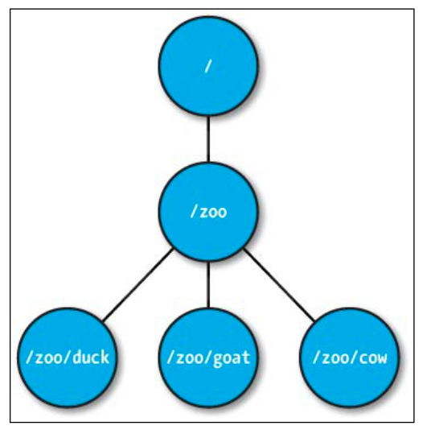

# ZooKeeper
## A Crash Course in Apache ZooKeeper
### Getting hands-on with Apache ZooKeeper
#### Download and installation
##### Installing
Once we have downloaded the ZooKeeper tarball, installing and setting up a standalone ZooKeeper node is pretty simple and straightforward. Let's extract the compressed tar archive into `/usr/share`:
```
$ tar -C /usr/share -zxf zookeeper-3.4.6.tar.gz
$ cd /usr/share/zookeeper-3.4.6/
```
The location where the ZooKeeper archive is extracted in our case, `/usr/share/zookeeper-3.4.6`, can be exported as `ZK_HOME` as follows:
```
$ export ZK_HOME=/usr/share/zookeeper-3.4.6
```
##### Configuration
Once we have extracted the tarball, the next thing is to configure ZooKeeper. The `conf` folder holds the configuration files for ZooKeeper. ZooKeeper needs a configuration file called `zoo.cfg` in the `conf` folder inside the extracted ZooKeeper folder. There is a sample configuration file that contains some of the configuration parameters for reference.

Let's create our configuration file with the following minimal parameters and save it in the `conf` directory:
```
$ cat conf/zoo.cfg
tickTime=2000
dataDir=/var/lib/zookeeper
clientPort=2181
```
The configuration parameters' meanings are explained here:
- `clientPort`: This is the port that listens for client connections, so it is where the ZooKeeper clients will initiate a connection.
##### Starting the ZooKeeper server
All ZooKeeper administration scripts to start/stop the server and invoke the ZooKeeper command shell are shipped along with the archive in the `bin` folder with the following code:
```
$ pwd
/usr/share/zookeeper-3.4.6/bin
$ ls
README.txt zkCleanup.sh zkCli.cmd zkCli.sh zkEnv.cmd zkEnv.sh zkServer.cmd zkServer.sh
```
The scripts with the `.sh` extension are for Unix platforms (GNU/Linux, Mac OS X, and so on).

To start the ZooKeeper server in a GNU/Linux system, you need to execute the `zkServer.sh` script as follows. This script gives options to start, stop, restart, and see the status of the ZooKeeper server:
```
$ ./zkServer.sh
JMX enabled by default
Using config: /usr/share/zookeeper-3.4.6/bin/../conf/zoo.cfg
Usage: ./zkServer.sh
{start|start-foreground|stop|restart|status|upgrade|print-cmd}
```
Executing `zkServer.sh` with the `start` argument will start the ZooKeeper server.
```
$ zkServer.sh start
JMX enabled by default
Using config: /usr/share/zookeeper-3.4.6/bin/../conf/zoo.cfg
Starting zookeeper ... STARTED
```
The ZooKeeper server's status can be checked with the `zkServer.sh` script as follows:
```
$ zkServer.sh status
JMX enabled by default
Using config: /usr/share/zookeeper-3.4.6/bin/../conf/zoo.cfg
Mode: standalone
```
To stop the server process, you can use the same script with the `stop` argument:
```
$ zkServer.sh stop
JMX enabled by default
Using config: /usr/share/zookeeper-3.4.6/bin/../conf/zoo.cfg
Stopping zookeeper ... STOPPED
```
Checking the status of ZooKeeper when it has stopped or is not running will show the following result:
```
$ zkServer.sh status
JMX enabled by default
Using config: /usr/share/zookeeper-3.4.6/bin/../conf/zoo.cfg
Error contacting service. It is probably not running.
```
Once our ZooKeeper instance is running, the next thing to do is to connect to it.
#### Connecting to ZooKeeper with a C-based shell
ZooKeeper is shipped with a C language-based command-line shell. However, to use this shell, we need to build the C sources in `${ZK_HOME}/src/c`. A GNU/GCC compiler is required to build the sources. To build them, just run the following three commands in the preceding directory:
```
$ ./configure
$ make
$ make install
```
By default, this installs the C client libraries under `/usr/local/lib`.

To connect to our ZooKeeper server instance with this C-based shell, execute the following command in your terminal:
```
$ cli_mt localhost:2181
Watcher SESSION_EVENT state = CONNECTED_STATE
Got a new session id: 0x148b540cc4d0004
```
We can issue the same set of commands to list the znodes, create a znode, and finally delete it:
```
ls /
time = 3 msec
/: rc = 0
zookeeper
time = 5 msec
create /HelloWorld
Creating [/HelloWorld] node
Watcher CHILD_EVENT state = CONNECTED_STATE for path /
[/HelloWorld]: rc = 0
name = /HelloWorld
ls /
time = 3 msec
/: rc = 0
zookeeper
HelloWorld
time = 3 msec
delete /HelloWorld
Watcher CHILD_EVENT state = CONNECTED_STATE for path /
ls /
time = 3 msec
/: rc = 0
zookeeper
time = 3 msec
```
The format of the C-based ZooKeeper shell output displays the amount of time spent during the command execution as well as the return code (`rc`). A return code equal to zero denotes successful execution of the command.

The C static and shared libraries that we built earlier and installed in `/usr/local/lib` are required for ZooKeeper programming for distributed applications written in the C programming language.
#### Setting up a multinode ZooKeeper cluster
In a production environment, ZooKeeper should be run on multiple servers in a replicated mode, also called a ZooKeeper ensemble. In this mode, the ZooKeeper server instance runs on multiple different machines, and all servers in the quorum have copies of the same configuration file. In a quorum, ZooKeeper instances run in a leader/follower format. One of the instances is elected the leader, and others become followers. If the leader fails, a new leader election happens, and another running instance is made the leader. However, these intricacies are fully hidden from applications using ZooKeeper and from developers.

The ZooKeeper configuration file for a multinode mode is similar to the one we used for a single instance mode, except for a few entries. An example configuration file is shown here:
```
tickTime=2000
dataDir=/var/lib/zookeeper
clientPort=2181
initLimit=5
syncLimit=2
server.1=10.22.1.1:2888:3888
server.2=10.22.1.2:2888:3888
server.3=10.22.1.3:2888:3888
```
The two configuration parameters are also explained here:
- `initLimit`: This parameter is the timeout, specified in number of ticks, for a follower to initially connect to a leader
- `syncLimit`: This is the timeout, specified in number of ticks, for a follower to sync with a leader

Both of these timeouts are specified in the unit of time called `tickTime`. Thus, in our example, the timeout for `initLimit` is 5 ticks at 2000 milliseconds a tick, or 10 seconds.

The other three entries in the preceding example in the `server.id=host:port:port` format are the list of servers that constitute the quorum.

The identifier (`.id`) is needed to be specified in a file called `myid` in the data directory of that server. It's important that the myid file should consist of a single line that contains only the text (ASCII) of that server's ID. The id must be unique within the ensemble and should have a value between 1 and 255.

Again, we have the two port numbers after each server hostname: 2888 and 3888. They are explained here:
- The first port, 2888, is mostly used for peer-to-peer communication in the quorum, such as to connect followers to leaders. A follower opens a TCP connection to the leader using this port.
- The second port, 3888, is used for leader election, in case a new leader arises in the quorum. As all communication happens over TCP, a second port is required to respond to leader election inside the quorum.

## Understanding the Inner Workings of Apache ZooKeeper
### The ZooKeeper data model
The namespace looks quite similar to a Unix filesystem. The data registers are known as **znodes** in the ZooKeeper nomenclature. You can see examples of znodes in the following image:



Here, you can see that znodes are organized hierarchically, much like a tree, as a standard filesystem. Some important points to take note of are as follows:
- The root node has one child znode called **/zoo**, which in turn has three znodes.
- Every znode in the ZooKeeper tree is identified by a path, and the path elements are separated by **/**.
- The znodes are called data registers because they can store data.

Like files in a filesystem, znodes maintain a stat structure that includes version numbers for data changes and an access control list that changes along with timestamps associated with changes.

#### Types of znodes
##### The ephemeral znode
an ephemeral znode is deleted by the ZooKeeper service when the creating client's session ends. An end to a client's session can happen because of disconnection due to a client crash or explicit termination of the connection.

##### The sequential znode
A sequential znode is assigned a sequence number by ZooKeeper as a part of its name during its creation. The value of a monotonously increasing counter is appended to the name of the znode.

To create a sequential znode using the ZooKeeper Java shell, we have to use the `-s` flag of the `create` command:
```
[zk: localhost(CONNECTED) 1] create -s /[PacktPub]
"PersistentSequentialZnode"
Created /[PacktPub]0000000001
[zk: localhost(CONNECTED) 3] create -s -e /[PacktPub]
"EphemeralSequentialZnode"
Created /[PacktPub]0000000008
```
#### Keeping an eye on znode changes - ZooKeeper Watches
Clients can register with the ZooKeeper service for any changes associated with a znode. This registration is known as setting a watch on a znode in ZooKeeper terminology. Watches allow clients to get notifications when a znode changes in any way. A watch is a one-time operation, which means that it triggers only one notification. To continue receiving notifications over time, the client must reregister the watch upon receiving each event notification.
## Programming with Apache ZooKeeper
### The C client library
#### Getting started with the C API
The ZooKeeper C API provides a way for the client to create a session with the ZooKeeper server through a handle. The handle represents a connection to the ZooKeeper service and is needed to invoke any ZooKeeper function. A handle is declared as type `zhandle_t`, and is obtained by calling the `zookeeper_init` function:

The `zookeeper_init` function returns a handle, which is a pointer to the opaque `zhandle` structure and is used to communicate with the ZooKeeper service. Also, a zookeeper session gets established after this call, which corresponds to the handle. If the function fails to create a new `zhandle` structure, it returns `NULL`, and the error is set accordingly. The session establishment is asynchronous and hence the session should not be considered established until (and unless) an event of the state `ZOO_ CONNECTED_STATE` is received by the client program. This event can be processed by implementing a watcher function.
#### Example – the znode data watcher
To illustrate the znode data watcher, we will write a client `zdata_watcher.c` using the C APIs, which will continuously listen for `ZOO_CHANGED_EVENT` events from the ZooKeeper server in a znode path called `/MyData`. Another client program, `zdata_updater.c`, will periodically update the data field in `/MyData`, which will result in the generation of events, and upon receiving these events, `zdata_watcher.c` will print the changed data into the terminal.
```c
#include <stdio.h>
#include <errno.h>
#include <string.h>
#include <stdlib.h>
#include <unistd.h>
#include <zookeeper.h>

/* ZooKeeper Znode Data Length (1MB, the max supported) */
#define ZDATALEN    1024 * 1024
static char *host_port;
static char *zoo_path = "/MyData";
static zhandle_t *zh;
static int is_connected;
static char *watcher_ctx = "ZooKeeper Data Watcher";
/**
* Watcher function for connection state change events
*/
void connection_watcher(zhandle_t *zzh, int type, int state, const char *path, void* context)
{
	if (type == ZOO_SESSION_EVENT)
	{
		if (state == ZOO_CONNECTED_STATE)
		{
			is_connected = 1;
		}
		else
		{
			is_connected = 0;
		}
	}
}
/**
* Data Watcher function for /MyData node
*/
static void data_watcher(zhandle_t *wzh, int type, int state, const char *zpath, void *watcher_ctx)
{
	char *zoo_data = malloc(ZDATALEN * sizeof(char));
	int zoo_data_len = ZDATALEN;

	if (state == ZOO_CONNECTED_STATE)
	{
		if (type == ZOO_CHANGED_EVENT)
		{
			/* Get the updated data and reset the watch */
			zoo_wget(wzh, zoo_path, data_watcher, (void *)watcher_ctx, zoo_data, &zoo_data_len, NULL);
			fprintf(stderr, "!!! Data Change Detected !!!\n");
			fprintf(stderr, "%s\n", zoo_data);
		}
	}
}

int main(int argc, char *argv[])
{
	int zdata_len;
	char *zdata_buf = NULL;

	if (argc != 2)
	{
		fprintf(stderr, "USAGE: %s host:port\n", argv[0]);
		exit(EXIT_FAILURE);
	}

	host_port = argv[1];

	zh = zookeeper_init(host_port, connection_watcher, 2000, 0, 0, 0);

	if (zh == NULL)
	{
		fprintf(stderr, "Error connecting to ZooKeeper server[%d]!\n", errno);
		exit(EXIT_FAILURE);
	}

	while (1)
	{
		if (is_connected)
		{
			zdata_buf = (char *)malloc(ZDATALEN * sizeof(char));

			if (ZNONODE == zoo_exists(zh, zoo_path, 0, NULL))
			{
				if (ZOK == zoo_create( zh, zoo_path, NULL, -1, & ZOO_OPEN_ACL_UNSAFE, 0, NULL, 0))
				{
					fprintf(stderr, "%s created!\n", zoo_path);
				}
				else
				{
					fprintf(stderr, "Error Creating %s!\n", zoo_path);
					exit(EXIT_FAILURE);
				}
			}
			if (ZOK != zoo_wget(zh, zoo_path, data_watcher, watcher_ctx, zdata_buf, &zdata_len, NULL))
			{
				fprintf(stderr, "Error setting watch at %s!\n", zoo_path);
			}

			pause();
		}
	}

	free(zdata_buf);
	return 0;
}
```
The `zdata_updater` connects to the ZooKeeper instance that is running in the `localhost` and updates the data field of the znode path `/MyData` with the current local date and time. It updates the znode path `/MyData` every 5 seconds, which makes the ZooKeeper server to trigger an event of type `ZOO_CHANGED_EVENT`. The `zdata_watcher`, which had set a watch for this znode path, receives the notification for the data change event. It then retrieves the current data, resets the watch, and prints the data in the console.
```c
#include <time.h>
#include <stdio.h>
#include <errno.h>
#include <string.h>
#include <stdlib.h>
#include <unistd.h>
#include <zookeeper.h>

/* ZooKeeper Znode Data Length (1MB, the max supported) */
#define ZDATALEN    1024 * 1024
static char *host_port;
static char *zoo_path = "/MyData";

static zhandle_t *zh;
static int is_connected;

/**
* Watcher function for connection state change events
*/
void connection_watcher(zhandle_t *zzh, int type, int state, const char *path, void* context)
{
	if (type == ZOO_SESSION_EVENT)
	{
		if (state == ZOO_CONNECTED_STATE)
		{
			is_connected = 1;
		}
		else
		{
			is_connected = 0;
		}
	}
}

int main(int argc, char *argv[])
{
	char zdata_buf[128];
	struct tm *local;
	time_t t;

	if (argc != 2)
	{
		fprintf(stderr, "USAGE: %s host:port\n", argv[0]);
		exit(EXIT_FAILURE);
	}

	host_port = argv[1];

	zh = zookeeper_init(host_port, connection_watcher, 2000, 0, 0, 0);

	if (zh == NULL)
	{
		fprintf(stderr, "Error connecting to ZooKeeper server[%d]!\n", errno);
		exit(EXIT_FAILURE);
	}

	sleep(3); /* Sleep a little for connection to complete */

	if (is_connected)
	{
		if (ZNONODE == zoo_exists(zh, zoo_path, 0, NULL))
		{
			fprintf(stderr, "%s doesn't exist! Please start zdata_watcher.\n", zoo_path);
			exit(EXIT_FAILURE);
		}

		while (1)
		{
			t = time(NULL);
			local = localtime(&t);
			memset(zdata_buf,'\0',strlen(zdata_buf));
			strcpy(zdata_buf,asctime(local));

			if (ZOK != zoo_set(zh, zoo_path, zdata_buf, strlen(zdata_buf), -1))
			{
				fprintf(stderr, "Error in write at %s!\n", zoo_path);
			}

			sleep(5);
		}
	}

	return 0;
}
```
Let's compile these two programs and see them in action:
```
$ gcc -Wall zdata_watcher.c -o zdata_watcher -I${ZK_HOME}/src/c/include -I${ZK_HOME}/src/c/generated/ -L/usr/local/lib/ -lzookeeper_mt
$ gcc -Wall zdata_updater.c -o zdata_updater -I${ZK_HOME}/src/c/include -I${ZK_HOME}/src/c/generated/ -L/usr/local/lib/ -lzookeeper_mt
```
In one terminal window, when you execute `zdata_watcher`, it creates a znode in the path `/MyData`, and starts listening for events of the type `ZOO_CHANGED_EVENT`.

Once we execute the `zdata_watcher`, it initiates a connection to the ZooKeeper server, and after the session is established, it creates a znode called `/MyData` in the root path of the ZooKeeper tree.

Now, in another terminal, when you run the `zdata_updater`, the `zdata_watcher` starts receiving the ZooKeeper events.

In these examples, we have used the synchronous APIs provided by the C APIs (e.g., `zoo_set`). However, in real applications, the asynchronous APIs are most commonly used.
## Administering Apache ZooKeeper
### ZooKeeper best practices
- ZooKeeper uses Apache log4j as its logging infrastructure. 
